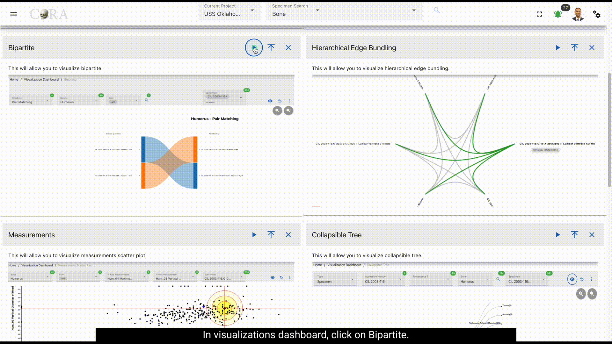
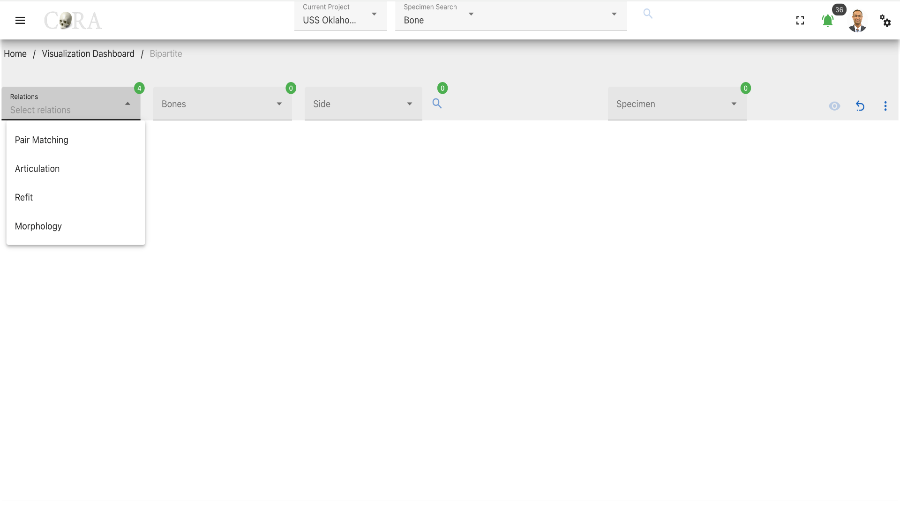
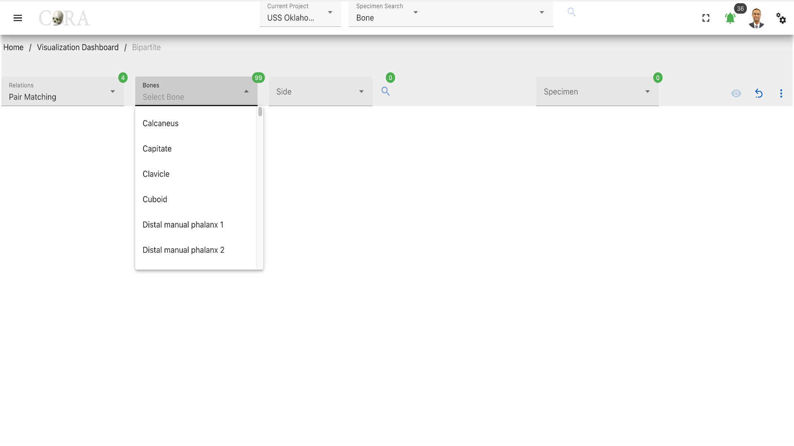
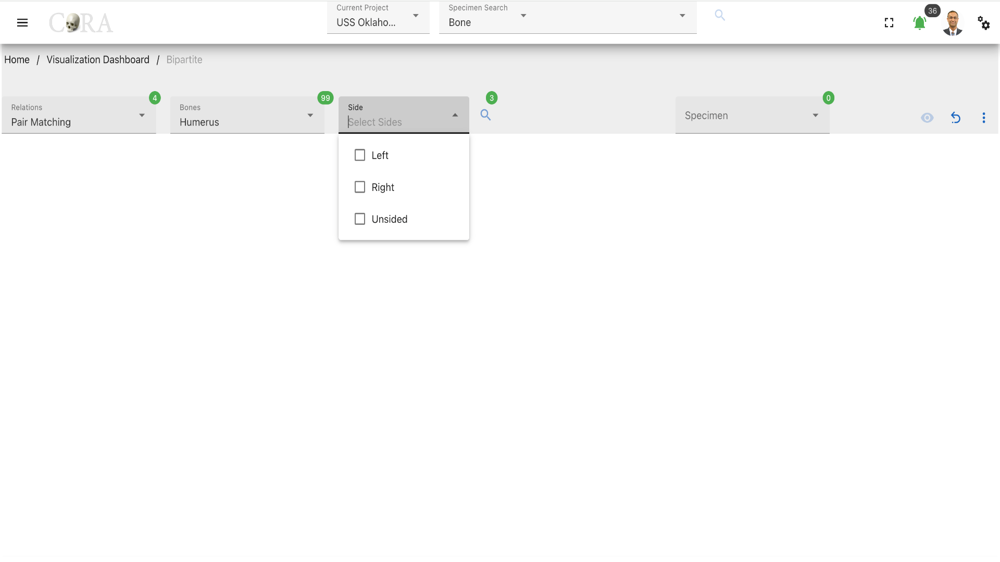
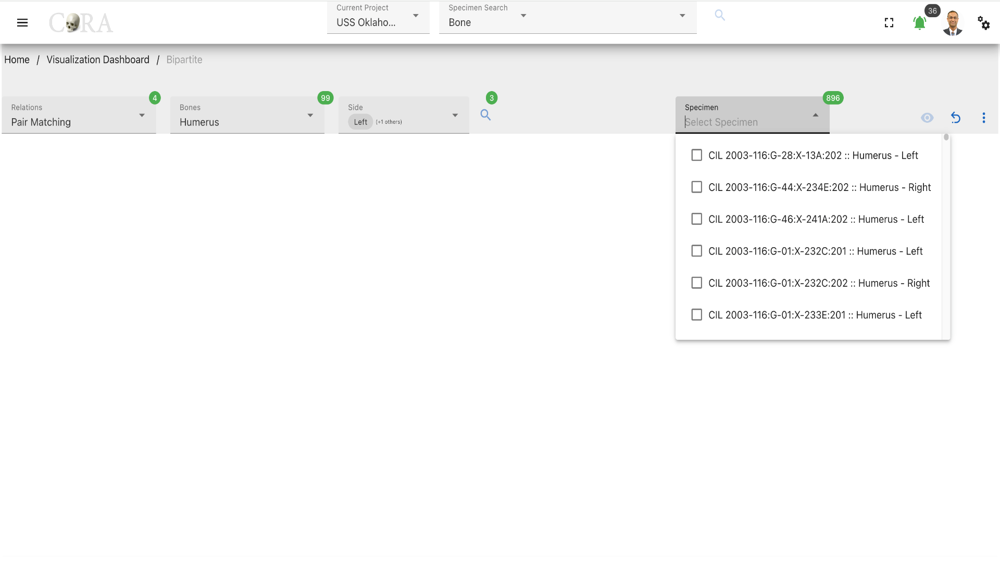
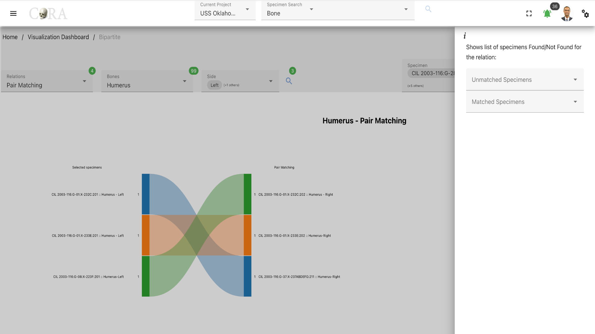

# Bipartite Graph

!!! warning

    This page is work in progress.

## Bipartite Graph

A Bipartite Graph allows you to visualize the bipartite data effectively. Here CoRA use it to demonstrate the matching specimens and its
relationships in the form of a bipartite graph.

The following table shows the required and optional fields to generate a bipartite graph.

Attributes  | Required/Optional
------------| -------------- 
Relations   | Required
Bones       | Required
Side        | Required
Specimen    | Required

### Steps to generate a Bipartite Graph.

#### Step 1: Select a relation

Select one from the four (4) association relations based on the requirement. The four (4) association relations available are:

- Pair Matching
- Articulation
- Refits
- Morphology

#### Step 2: Select a bone

Select the bone type of the specimen from the available list of the bones required for the bipartite graph generation.

#### Step 3: Select a side

Select the bone side from the available dropdown list. After selecting the side click on the 'search' icon to generate the list of specimens based on the options selected previously. The following are the list of sides available:

- Left
- Right
- Unsided

#### Step 4: Select a Specimen

Select one or more specimen based on the analytics requirement and click on the 'eye' icon to generate the visualization. Now click on any of the colors on the generation to view the relationship in the specimen selected.

### More Options/Filters

Click on the kebab menu icon to view more options  of the list of specimens Found/Not Found for the relation and interact with the visualization.
