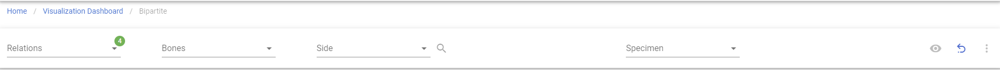
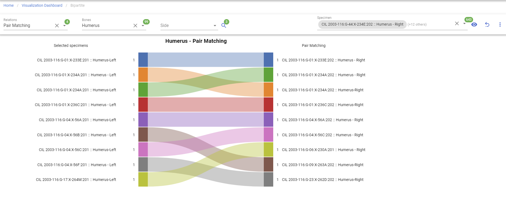

# Bipartite Graph

!!! warning

    This page is work in progress.

## Bipartite

This will allow you visualize Bipartite.

### Create Bipartite

Left Sidebar Menu -\> Data Visualization -\> Bipartite

In order to create Bipartite, click on the 'Data vistualization' on the left navigation bar.
This will take you to the Data visualization page. 
This page lists different types of project visualizations that can be used on CoRA.

#### Step 1: Select a relation

After a relation was selected, Bone & Side field will be available.
There are total 4 relations avalabile:

- Pair Matching
- Articulation
- Refits
- Morphology

#### Step 2: Select a Bone & Search Specimens

After a bone was selected, specimens search will be available. Once you click on the search icon, you can select one or mulitiple specimens to generate the visualization.

#### Step 3: Generate Bipartite

***The bolded fields are required.***

*The Italic fields can be multi-select*

- **Relations**
- **Bone**
- *Side*
- ***Specimens***

Clicking on 'Go' button under 'Bipartite', it will bring to to the main page of 'Bipartite' with the filter selection. Once 'Bone' field is selected, the other two filter fields show up. 'Bone', 'Relations' and Specimens' required field, 'Side' is optional for generating the graph. 

