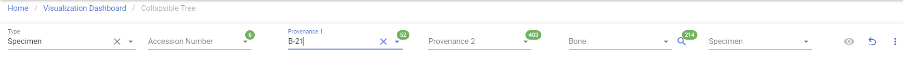
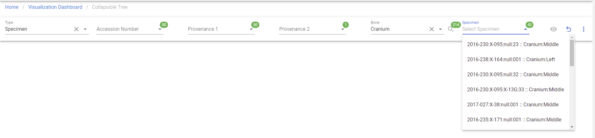
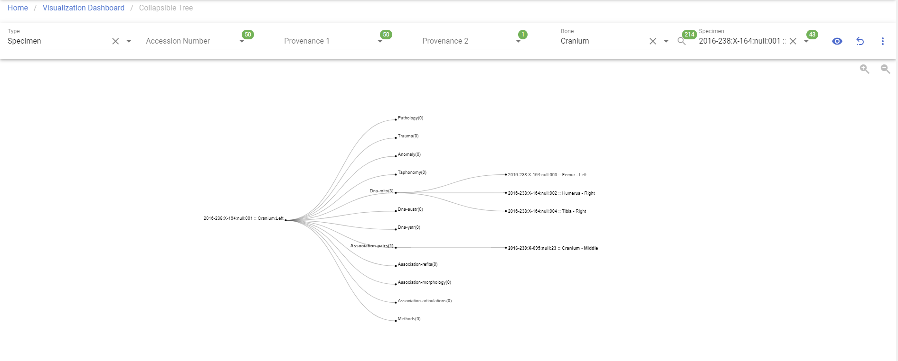

# Collapsible Tree

!!! warning

    This page is work in progress.

## Collapsible Tree

A collapsible tree can present hierarchical data effectively, here CoRA use it to demonstrate specimens and relationships.
This will allow you to visualize collapsible tree.

### Create Collapsible Tree

Left Sidebar Menu -\> Data Visualization -\> Collapsible Tree

In order to create Collapsible Tree, click on the 'Data visualization' on the left navigation bar.
This will take you to the Data visualization page. 
This page lists different types of project visualizations that can be used on CoRA.

### Generate Bone

***The bolded fields are required to generate Bone.***

***It is mandatory to choose any one of the optional field to generate Bone***

- **Type(Specimens/Individuals)**
- Individual Number
- Accession Number
- Provenance 1
- Provenance 2

Click the Search Bone button to generate Bone options.

#### Step 1: Select a Type

Once you select a Type, the rest of the fields will be show and enabled.

#### Step 2: Select Fields

It is mandatory to choose any one of the optional field to generate Bone.

#### Step 3: Select a Bone

Click the Search Bone button to generate Bone options and select a Bone.

#### Step 4: Select a specimen

Once a bone was selected, you are able to select a specimen.

#### Step 5: Generate Collapsible Tree

Once a specimen was selected, the generate button is clickable and you will able to get the visualization.

### Specimens Relationship

***There are 12 possible 12 relationships***

- pathology
- trauma 
- taphonomy
- anomaly 
- dnas-mito
- dnas-austr 
- dnas-ystr 
- methods 
- associations-pairs 
- associations-refits 
- associations-articulation 
- associations-morphology 

