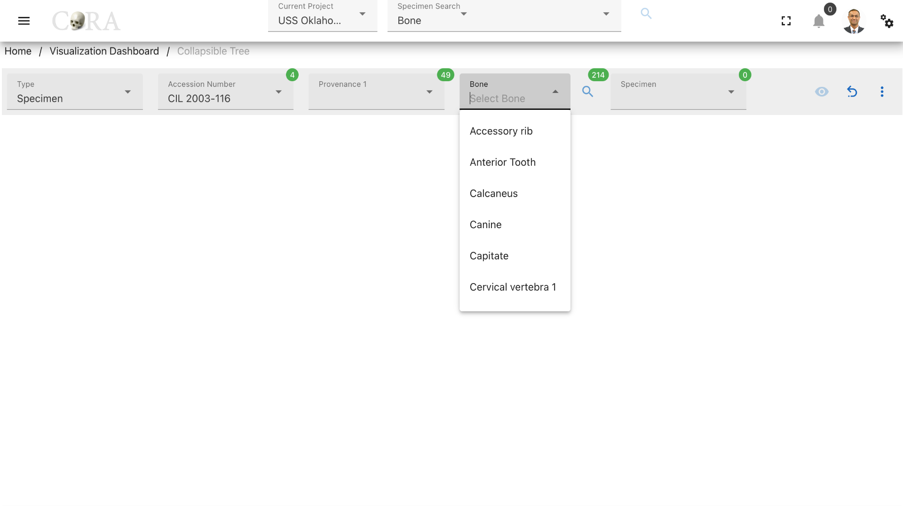

# Collapsible Tree

!!! warning

    This page is work in progress.

## Collapsible Tree

A Collapsible tree can present hierarchical data effectively. Here CoRA uses it to demonstrate specimens and its relationships in the form of a collapsible tree.

The following table shows the required and optional fields to generate a collapsible tree.

Attributes        | Required/Optional |
------------------|-------------------|
 Type             | Required          |
 Individual Number| Required          |
 Accession Number | Required          |
 Provenance 1     | Optional          |
 Bone             | Required          |
 Specimen         | Required          |

### Select a type

Select a type (specimen or individual) based on the analytics requirement. Select 'Specimen' based on a bone if a specimen is needed to be analyzed. Select 'Individual' if you want to analyze all the specimens that belong to an individual number.

### Steps to generate a collapsible tree for 'Type: Specimen'

#### Step-1: Select accession number

Select an accession number to which the required specimen belongs to.

#### Step-2: Select provenance1

Select the provenance1 to which the required specimen belongs to. Note that choosing provenance1 is optional to generate the collapsible tree.

#### Step-3: Select bone

Select the bone type of the specimen from the available list of the bones. After selecting the bone type click on the 'search' icon to generate the list of specimens based on the options selected previously.

#### Step-4: Select specimen(s)

Choose the required specimens for which the collapsible tree is needed to be generated.

#### Step-5: Generate visualization

The collapsible tree can be generated by clicking on the 'eye' icon for the selected specimen. The collapsible tree can be further expanded by clicking on a specific relationship node which gives list of all related specimens and clicking on these specimens expands the tree even more by generating the relations of it again and the tree continues to grow.

### Steps to generate a collapsible tree for 'Type: Individual'

#### Step-1: Select an individual number

Select an individual number that you want to explore.

#### Step-2: Generate the collapsible tree

Click on the 'eye' icon to generate the collapsible tree. Now click on the necessary accession numbers and provenances to generate the list of specimens in the tree and further click on them similar to the specimens type tree to view the
relations.

### More Options/Filters:

Click on the kebab menu icon to view more options like removing relations with zero specimens, remove non-required relations and Provenance 2.

Use the toggle switch to remove relations with zero specimens and simplify the graph. Relations can also be removed individually under 'Selected Relations' based on the requirement. Provenance 2 can be used to further filter the specimens.

### Available Specimen relationships

***There are 12 possible relationships to explore***

- pathology
- trauma 
- taphonomy
- anomaly 
- dnas-mito
- dnas-austr 
- dnas-ystr 
- methods 
- associations-pairs 
- associations-refits 
- associations-articulation 
- associations-morphology 

