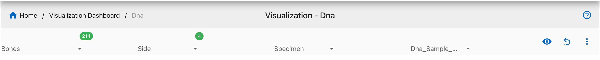
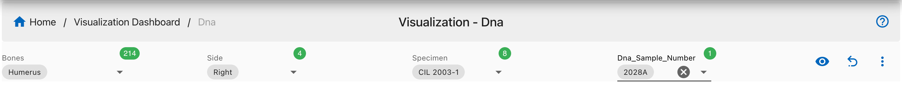
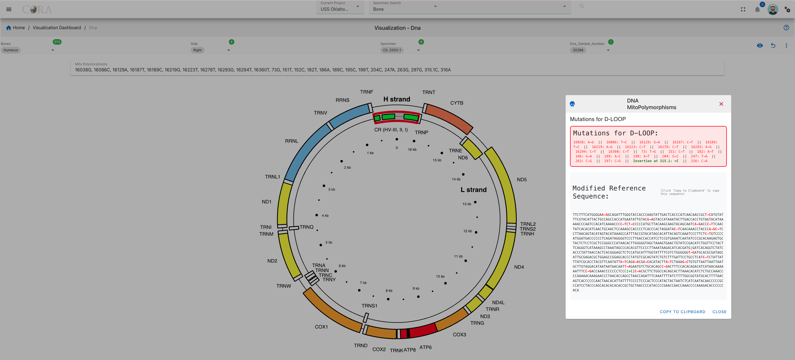
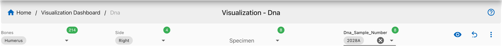
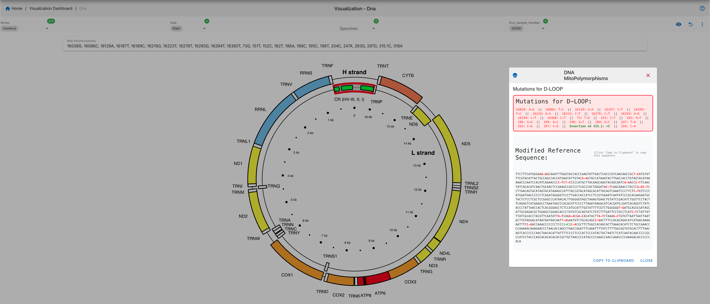
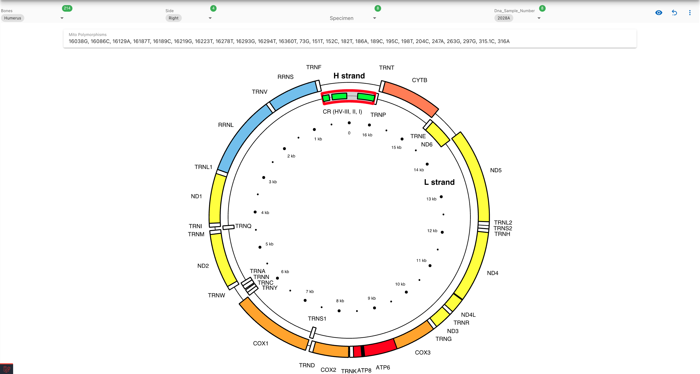

# DNA Visualization - MitoPolymorphisms

!!! note

    This page describes how to visualize mitochondrial DNA polymorphisms and the modified reference sequence using the CoRA Visualization Dashboard.

## Accessing DNA Visualization

Navigate to the DNA section via:

**Left Sidebar Menu → Visualizations  → DNA - Mitochondrial**

This section allows for the visualization of mitochondrial DNA data associated with specific specimens.

### Step 1: Select Filters

Use the filter dropdowns at the top of the page to refine your selection:

- **Bones**: e.g., Humerus
- **Side**: Left or Right
- **Specimen**
- **DNA Sample Number**

These selections drive which mutations and sequences are visualized on the chart and panel.

### Step 2: Select a Bone and a Side 

After selecting a Bone and a Side, Specimens and Dna_Sample_Number eye-button will be available. There are two ways we can create the visualizations mentioned below:
1. A - Select a Specimen then Dna_Sample_Number will be populated 

   B - now when we click on eye button which will enable us to get the visualizations and its mutations.

2. After selecting Bone and side we can directly select the Dna_Sample_Number.

We can see the visualization

### Step 3: View MitoPolymorphisms

Once a valid sample is selected, polymorphism data will be displayed in a circular mitochondrial genome viewer.  respective region mutations will be highlighted.

When we click on the highlighted region a mutation list is shown in a dialog box:

