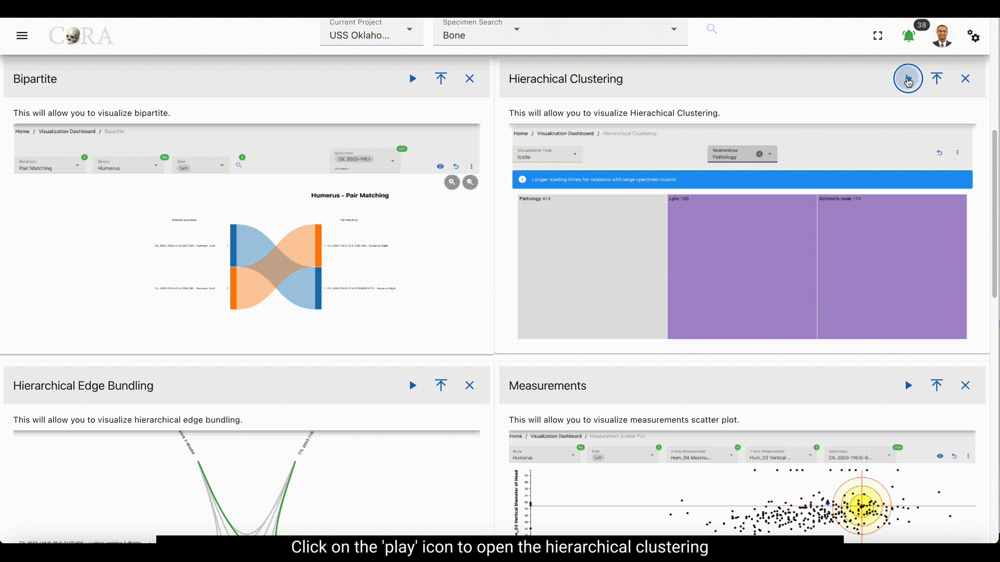
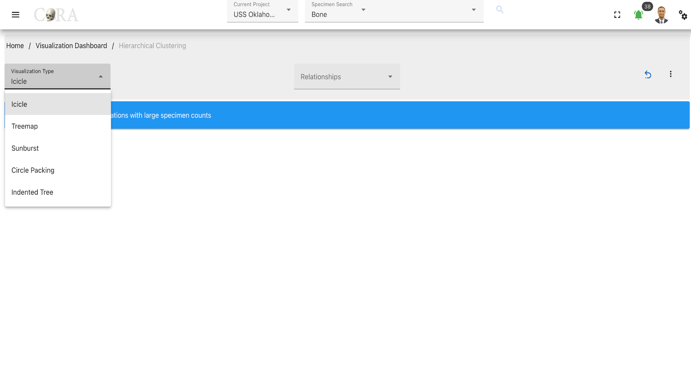
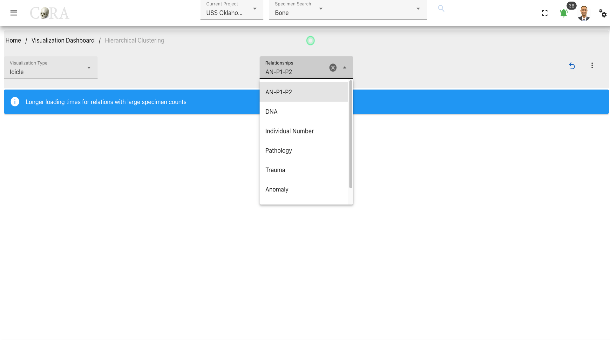
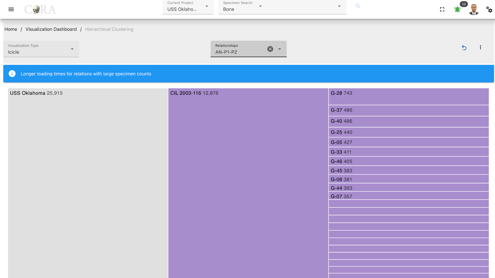
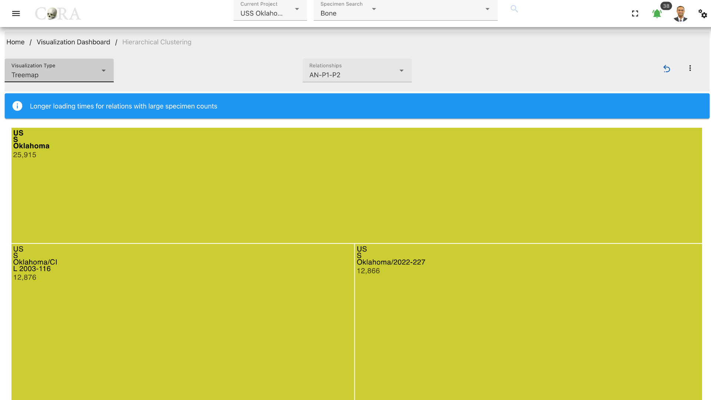
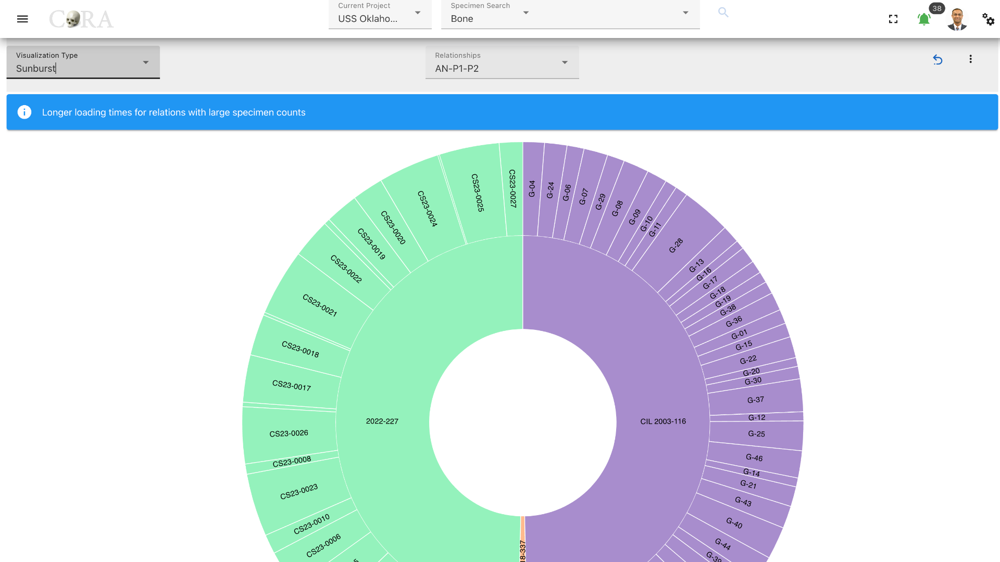
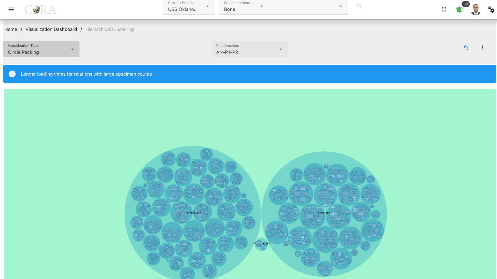
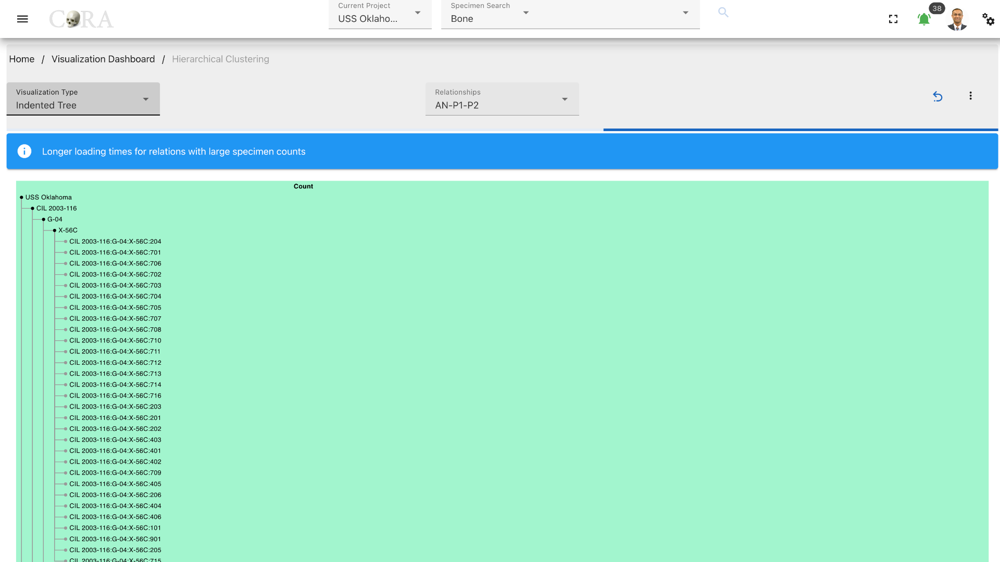
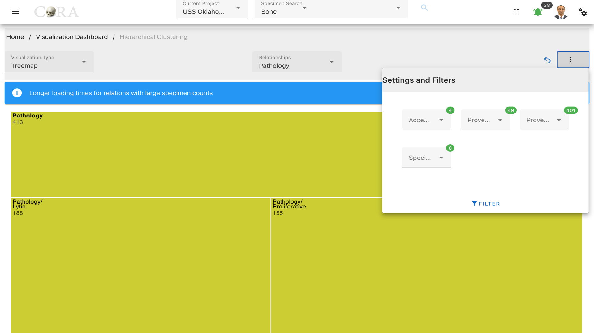

# Hierarchical Clustering

!!! warning

    This page is work in progress.

## Hierarchical Clustering

Hierarchical clustering is a data analysis method that builds a hierarchy of clusters by either successively aggregating
individual data points into clusters (agglomerate approach) or dividing a large cluster into smaller ones (divisive 
approach), based on their similarity. 

In hierarchical clustering, the data is not partitioned into a particular cluster in a single step. Instead, clusters 
are formed sequentially, with each step involving the merging of the two nearest clusters at a lower level into a 
higher-level cluster. This process continues recursively until all data points are clustered into a single group or until 
the desired cluster structure is achieved.

The following table shows the required and optional fields to generate hierarchical clustering visualization

Attributes        | Required/Optional
----------------- | -------------- 
Visualization Type| Required
Relationship      | Required

### Steps to generate Hierarchical clustering graphs

#### Step-1: Select Visualization type

Select a type of visualization for the hierarchical clustering. The available visualization types are shown in the below
table.

Visualization Types |
--------------------| 
Icicle              |
Treemap             |
Sunburst            |
Circle Packing      |
Indented Tree       |

#### Step-2: Select a relationship

Select a relationship that is to be used in the hierarchical clustering.

#### Step-4: Visualization 

After selecting the desired relationship the selected visualization is automatically generated. Each visualization type 
is interactive and can be changed until the desired output is achieved.

Different visualization types that are generated are shown below.

##### Icicle

##### Treemap

##### Sunburst

##### Circle Packing

##### Indented Tree

### More Options/ Filters:

Click on the kebab menu in the top right corner to find more options. These options include filtering the specimens by
*Accession Number*, *Provenance 1*, *Provenance 2* and a particular *specimen* can also be selected.

