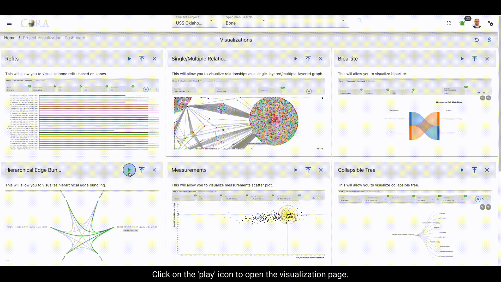

## Hierarchical Edge Bundling

Hierarchical edge bundling is a visualization technique used to display complex networks of interrelated entities in a 
clear and organized manner. In CoRA, this method is used to illustrate relationships among different specimens within 
the dataset.

Each node on the perimeter represents a unique specimen, and the edges (lines connecting the nodes) represent 
relationships or associations between these specimens. The bundling of edges helps reduce visual clutter by combining 
multiple related paths into a single flow, making it easier to trace relationships within the hierarchical structure.

The following table shows the required and optional fields required for hierarchical edge bundling based on both relation
and specimen.

Type: Relation

Attributes                | Required/Optional |
------------------------- |-------------------|
Type                      | Required          |
Relation                  | Required          |
Type of selected relation | Required          |
Specimen                  | Optional          |

Type: Specimen

Attributes   | Required/Optional |
------------ |-------------------|
Accessions   | Required          |
Provenance 1 | Required          |
Provenance 2 | Optional          |
Specimen     | Required          |
Relation     | Required          |

### Steps to generate Hierarchical Edge Bundle

#### Step-1: Select a type

Select a type (relation or specimen) based on the requirement. Select 'Relation' if the hierarchical edge bundling has to
be done based on the relations and its types associated with the specimens and select 'Specimen' if the hierarchical edge
bundling needs to be done based a particular set of specimens.

#### Step-2: Select Relation

Select a relation associated to the desired specimens required for the hierarchical edge bundling. For example: Pathology

#### Step-3: Select a Pathology

Select a pathology or group of pathologies associated with the desired set of specimens and click on 'Get Specimens' to
generate a list of specimens associated with the selected pathologies.

#### Step-4: Select specimens

Select all the required specimens individually that are to be used for the hierarchical edge bundling or directly proceed 
to the next step to use all the available specimens.

#### Step-5: Generate the Hierarchical Edge Bundle

The Hierarchical Edge Bundle can be generated by clicking on the 'eye' icon for the selected specimens. Hovering over a 
specimen highlights a particular bundle of specimens which are associated with a similar type of pathology. Click on the
'reset' icon on the top to reset the page and try a new set of relations and specimens.

