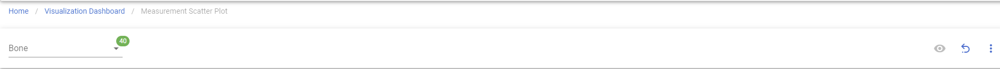
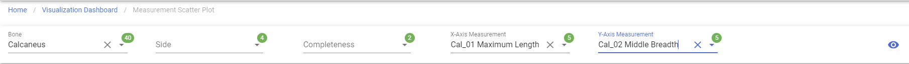
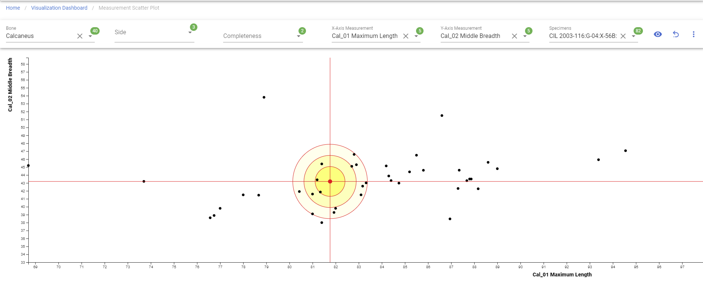
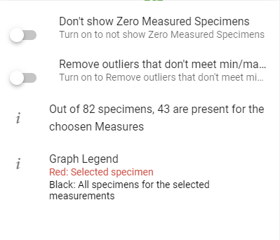

# Measurement Scatterplot

!!! warning

    This page is work in progress.

The measurements scatterplot can be used to narrow down your search space for likely pair matches. It can be used with any bones 
that allow for the capture of measurements such as Humerus, Ulna, Radius, Femur, Tibia, etc.

!!! note
    Here is a complete list of [bones measurements](../../forensics-anthro-guide/measurements.md)

The measurement scatterplot is useful for identifying or narrowing down for a given specimen which possible specimens are likely
pair matches that deserve a more closer inspection. You can navigate to the measurements scatterplot screen from 
Left Sidebar Menu -\> Data Visualization -\> Measurement Scatterplot.

## Generate Measurement Scatterplot

***The bolded fields are required.***
- **Bone**
- **X-Axis**
- **Y-Axis**
- Completeness
- Side

Clicking on 'Go' button under 'Measurements Scatter Plot', it will bring to to the main page of 'Measurements Scatter Plot' with the filter selection.Pick unique field for filters then the generate button will be working.

#### Step 1: Select a bone

Once you select a Bone, the rest of the fields will be show and enabled.

#### Step 2: Select X-Axis & Y-Axis, Other Fields

'X-Axis Measurement' and 'Y-Axis Measurement' are required field, 'Side' and 'Completeness' optional for generating the graph. You will not able to click on the generate button if 'X-Axis Measurement' and 'Y-Axis Measurement' have same field.

#### Step 3: Click the generate button

Click the generate button on the right side after fields are selected.

#### Step 4: Select a specimen

After the generation, you will able to select a specimen and get the visualization.

### Get specimen name when hovered over

You will able to get the specimen name, bone, side, X-Axis and Y-Axis when hovered over.

### More graph options

In the menu on the right side, you can see more options on how your measurement scatterplot display and graph detail information.

***The bolded fields are selectable.***
- **Don't show Zero Measured Specimens**
- **Remove outliers that don't meet min/max**
- Graph Statistics Analysis
- Graph Legend

