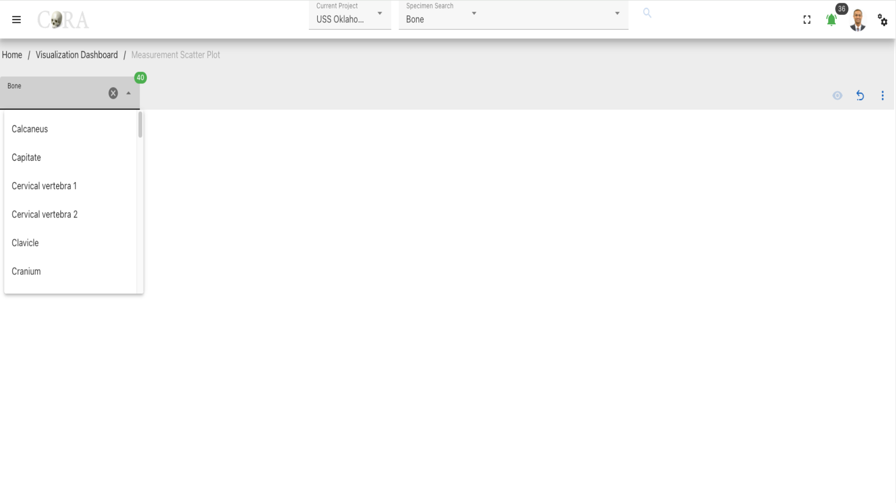
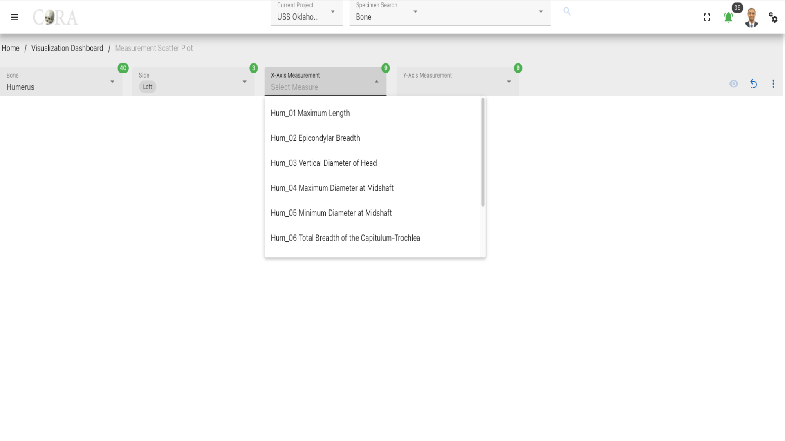
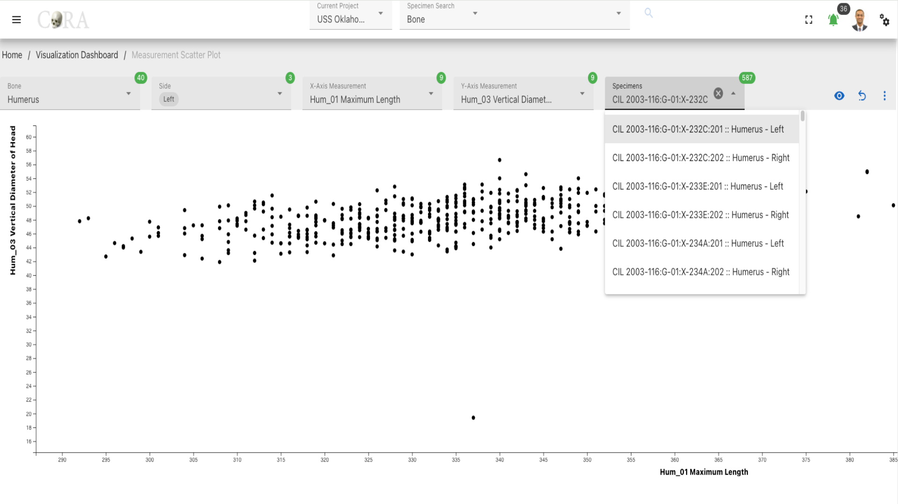

# Measurement Scatterplot

!!! warning

    This page is work in progress.

The measurements scatterplot can be used to narrow down your search space for likely pair matches. It can be used with any bones that allow for the capture of measurements such as Humerus, Ulna, Radius, Femur, Tibia, etc.

!!! note
    Here is a complete list of [bones measurements](../../forensics-anthro-guide/measurements.md)

## Measurement Scatter Plot
A measurement scatter plot is useful for identifying or narrowing down for a given specimen which possible specimens are likely pair matches that deserve a more closer inspection

The following table shows the required and optional fields to generate a measurement scatter plot.

Attributes        | Required/Optional
----------------- | -------------- 
Bone              | Required
Side              | Required
X-Axis Measurement| Required
Y-Axis Measurement| Optional
Specimen          | Required

### Steps to generate a Measurement Scatter Plot.

#### Step-1: Select bone

Select the bone type of the specimen from the available list of the bones required for the Measurement scatter plot generation and this will enable other field to show.

- Side
- X-Axis Measurement
- Y-Axis Measurement

#### Step-2: Select side

elect the Side to march the bone and the specimen from the available list of the sides.  The following are the list of Sides available:

- Left
- Right
- Unsided

#### Step-3: Select X-Axis Measurement

Select the X-Axis Measurement for the Scatter plot.

#### Step-4: Select Y-Axis Measurement

Select the Y-Axis Measurement for the Scatter plot, after selecting the Y-Axis Measurement proceed to click on the 'eye' to generate the scatter plot.

#### Step-5: Select a specimen

Select one or more Specimen based on the project requirement and click on the 'eye' icon to generate the visualization.

### More Options/Filters

Click on the kebab menu icon to view more options to adjust the scatter plot to march the project requirement. The following are available when you click on the 'kebab'.

- Completeness
- Adjust Target Area
- DNA (Optional)

***The bolded fields are selectable.***
- **Don't show Zero Measured Specimens**
- **Remove outliers that don't meet min/max**
- Graph Statistics Analysis
- Graph Legend