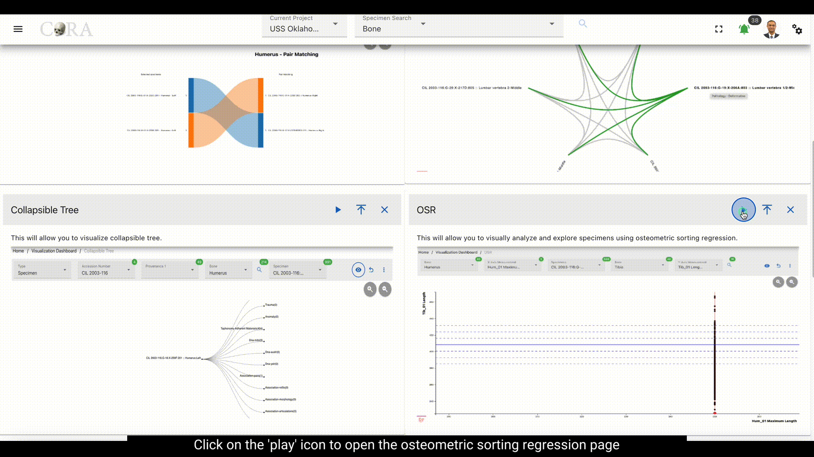
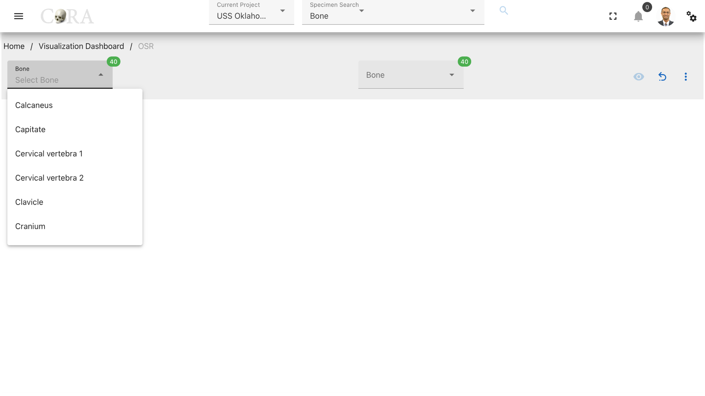
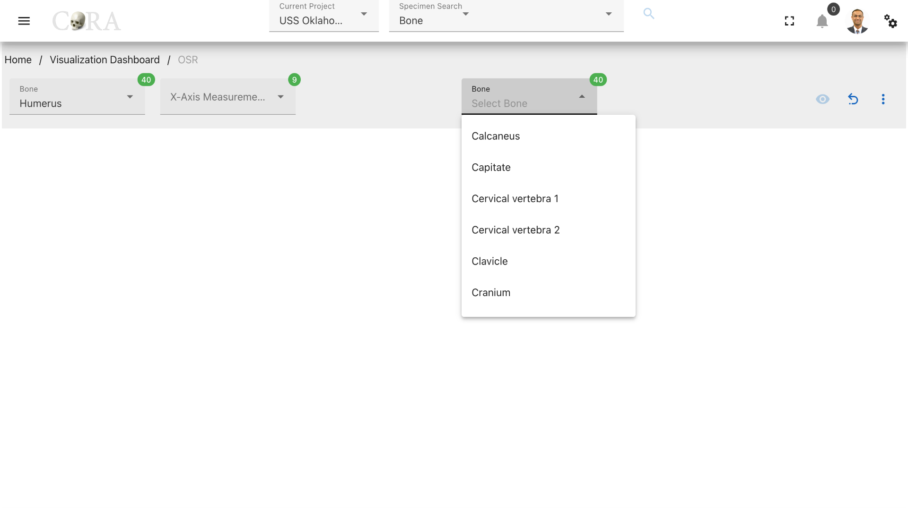
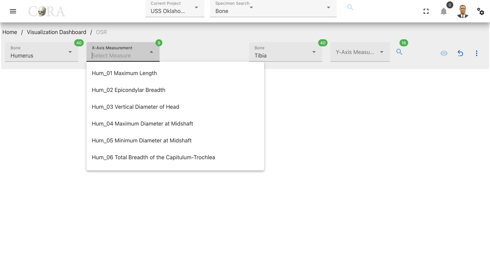
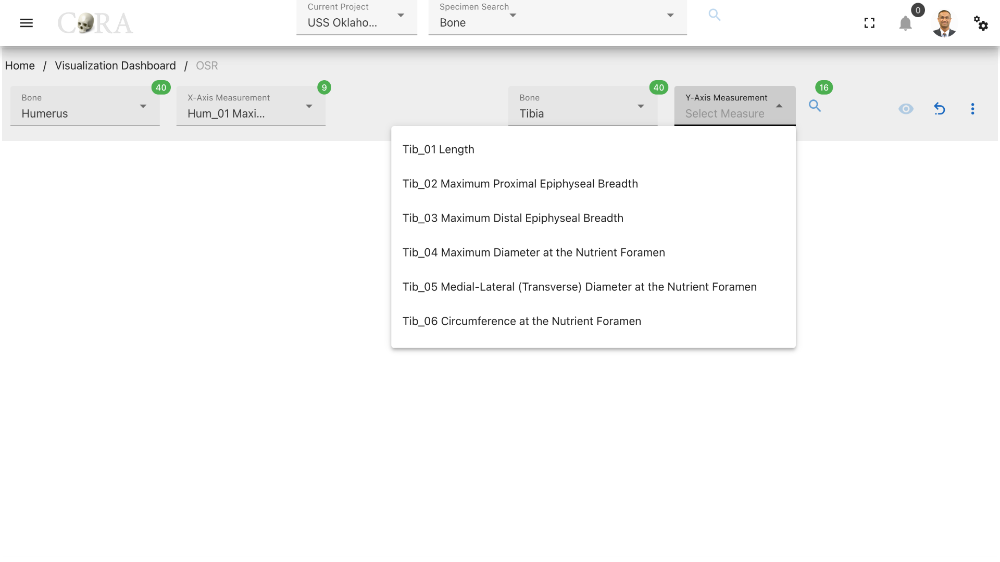
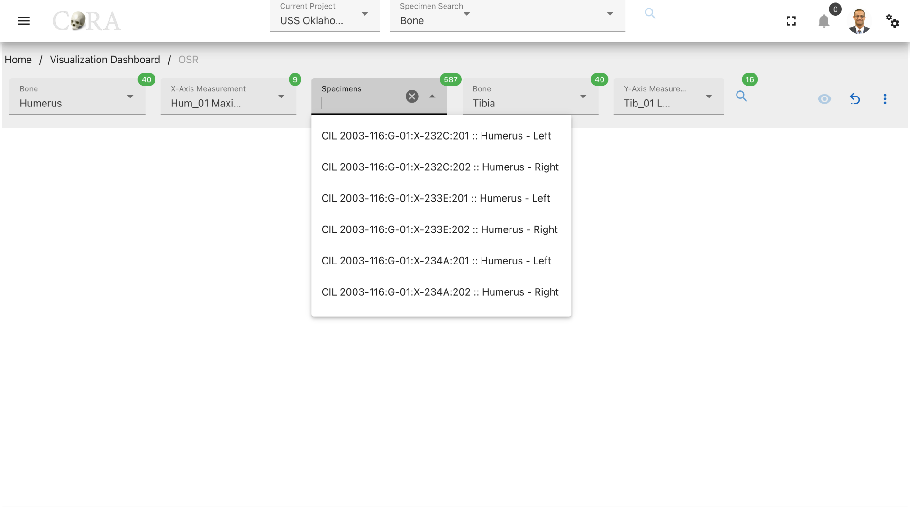
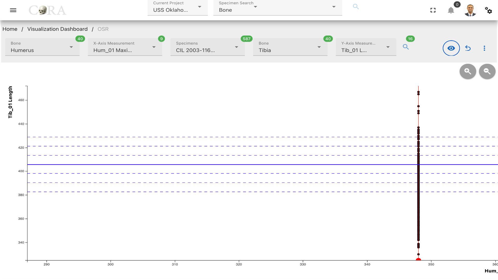
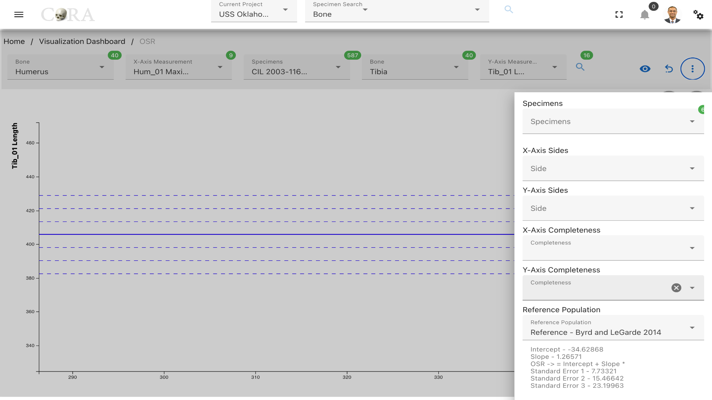

# Osteometric Sorting Regression

!!! warning

    This page is work in progress.

## Osteometric Sorting Regression

Osteometric Sorting Regression (OSR) is a statistical method used in the analysis of skeletal remains to sort and match 
bones based on their measurements.

The following table shows the required and optional fields required for osteometric sorting regression.

Attributes         | Required/Optional |
------------------ |-------------------|
Bone               | Required          |
x-axis measurement | Required          |
y-axis measurement | Required          |
Specimen           | Required          |

### Steps to use Osteometric sorting regression

#### Step-1: Select bones

Select two bones from the two available dropdowns that are to be matched based on their measurements. (For example, Humerus
and Tibia).

#### Step-2: Select x-axis and y-axis measurements

Select the x-axis measurement for the first bone and y-axis measurement for the second bone respectively. CLick on the
search icon to generate a list of specimens (first bone type) with the selected x-axis measurement.

#### Step-3: Select a specimen

Select a desired specimen to be used in the sorting in order to find its match.

#### Step-4: Generate the Oseometric Sorting Regression Graph

Click on the 'eye' icon to generate the osteometric sorting regression graph with the selected
specimen highlighted in red.

### More Options/Filters:

Click on the kebab menu to see more options. These options include
- List of specimens for the second bone type that will be highlighted in blue when selected.
- x-axis and y-axis bone sides and completeness to filter the specimens.
- Reference population (Byrd and LeGarde 2014 selected by default).
- Removing outliers that doesn't meet min/max thresholds.
- DNA options (Specimens with same/different/no DNA)
- Count of number of specimens available with the selected bone type and measurements.
