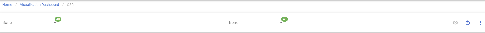
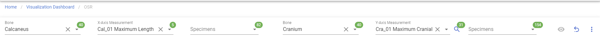
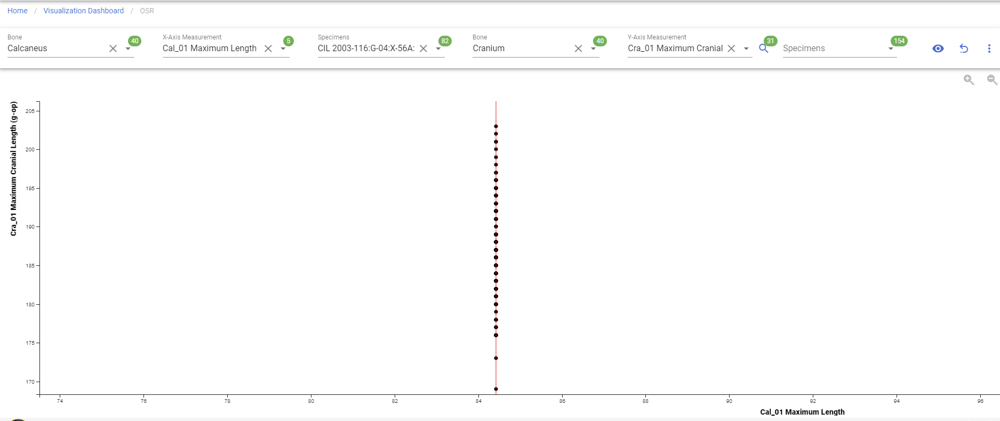

# Osteometric Sorting Regression

!!! warning

    This page is work in progress.

## OSR 

This will allow you visualize OSR (Osteometric Sorting Regression).

### Create OSR

Left Sidebar Menu -\> Data Visualization -\> OSR

In order to create OSR, click on the 'Data visualization' on the left navigation bar.
This will take you to the Data visualization page. 
This page lists different types of project visualizations that can be used on CoRA.

#### Step 1: Select Bones

Select bone fields to generate the specimens.

#### Step 2: Generate OSR

Select specimens fields and X-Axis or Y-Axis, you will able to click the generate button on the right side for the visualization.

***The bolded fields are required.***

***To generate the OSR, either X-Axis or Y-Axis is mandatory***

- **Bone**
- **Specimens**
- X-Axis
- Y-Axis

Clicking on 'Go' button under 'OSR', it will bring to to the main page of 'OSR' with the filter selection. Once 'Bone' field are selected, the search icon is available for specimens. 'Bone', 'Relations' and Specimens' required field for generating the graph.

