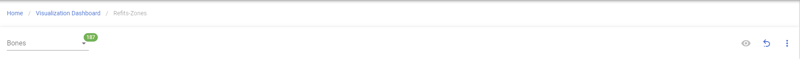
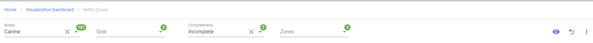
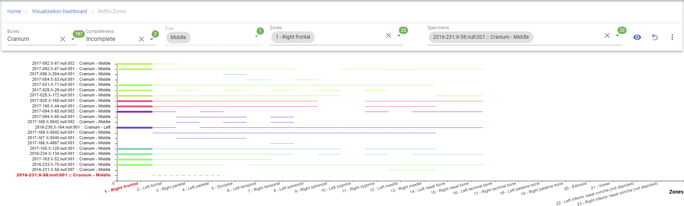
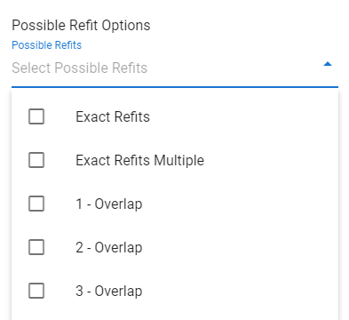

# Refits

!!! warning

    This page is work in progress.

## Refits Zones

This will allow you visualize bone refits based on zones.

### Create Refits-Zones

Left Sidebar Menu -\> Data Visualization -\> Refits

In order to create Refits-Zone, click on the 'Data vistualization' on the left navigation bar.
This will take you to the Data visualization page. 
This page lists different types of project visualizations that can be used on CoRA.

### Generate Refits-Zones

***The bolded fields are required.***

*The Italic fields can be multi-select*
- **Bone**
- *Side*
- Completeness
- *Zones*
- *Specimens*

Clicking on 'Go' button under 'Refits', it will bring to to the main page of 'Refits-Zones' with the filter selection.  Only 'Bone' required field, 'Side','Completeness','Zones' and 'Specimen' are optional for generating the graph. 

#### Step 1: Select a Bone

Once 'Bone' field is selected, the other three filter fields show up.

#### Step 2: Click the generate button

#### Step 3: Select a zone

After the generation, you will able to select a zone or multiple zones. The chosen zone will be highlighted and appear bolded line.

#### Step 4: Select a specimen

You will able to select a specimen or multiple specimens which if a chosen specimen refits the chosen zone, the chosen specimens will appear dotted line.

### Possible Refit Options

***In the menu on the right side, you can see more possible refits options on how your refits-zone display.***

***This field can be multi-select***
- Exact Refits
- Exact Refits Multiple
- 1-Overlap
- 2-Overlap
- 3-Overlap

