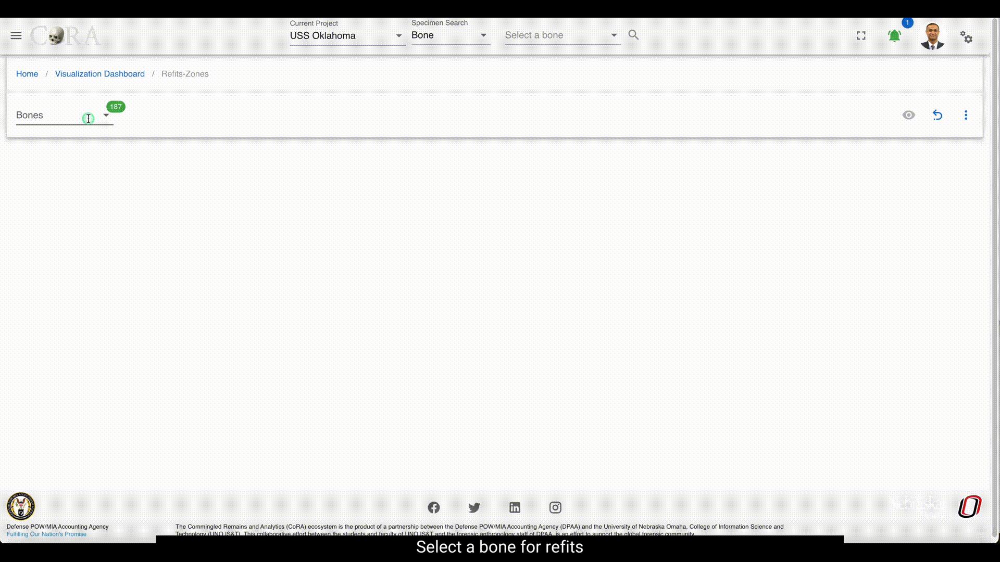
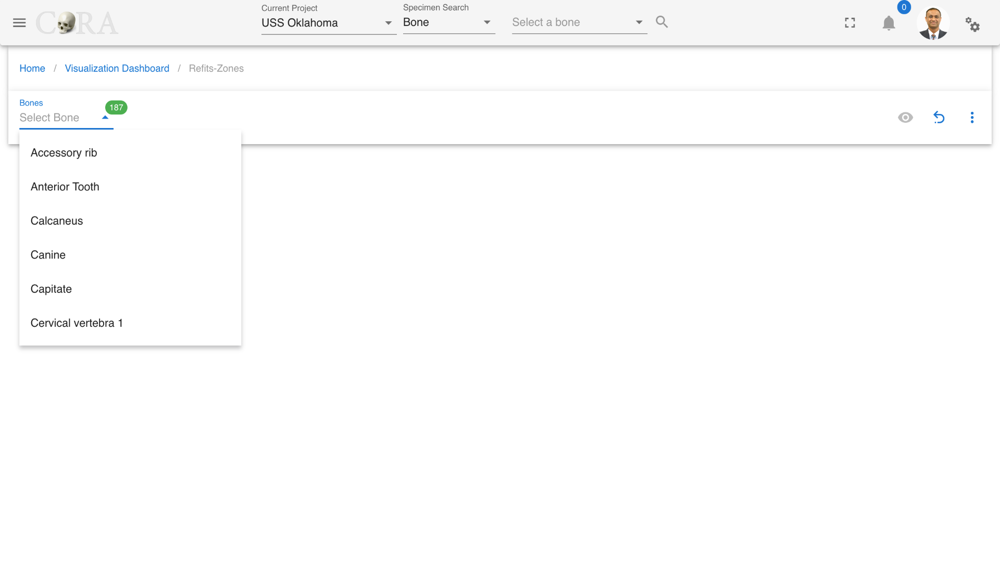
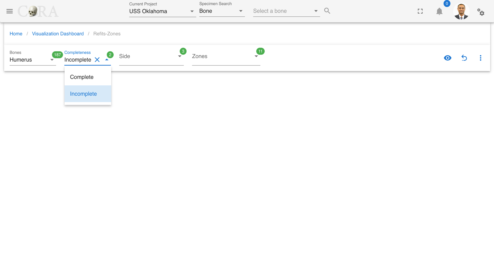
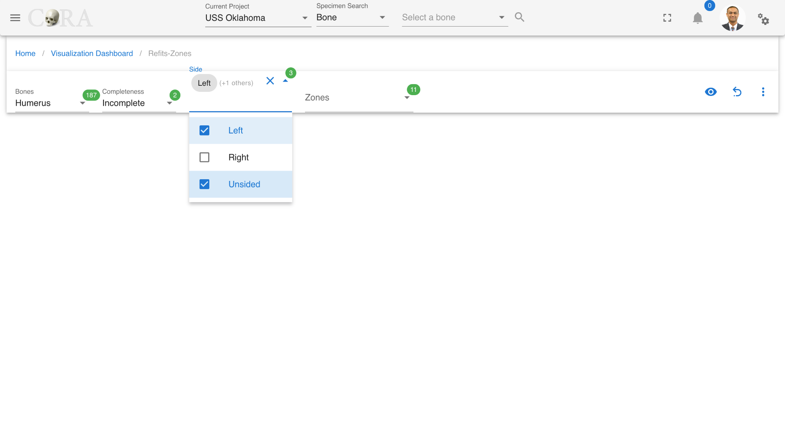
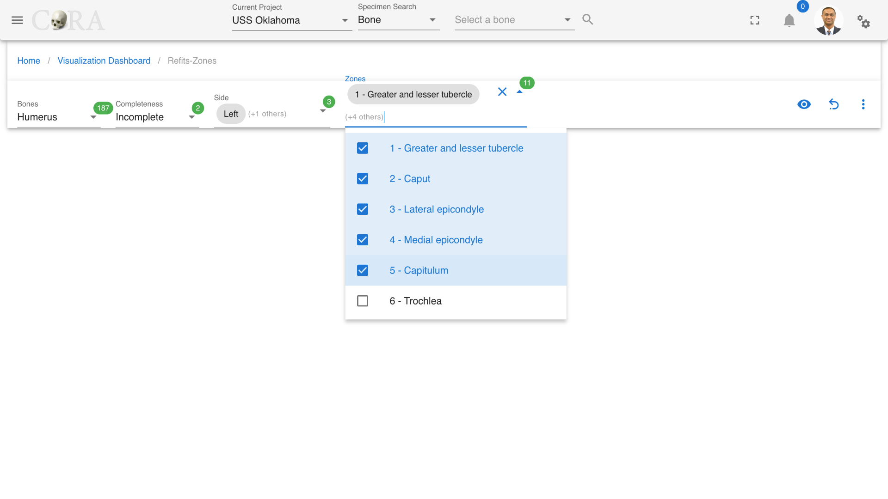
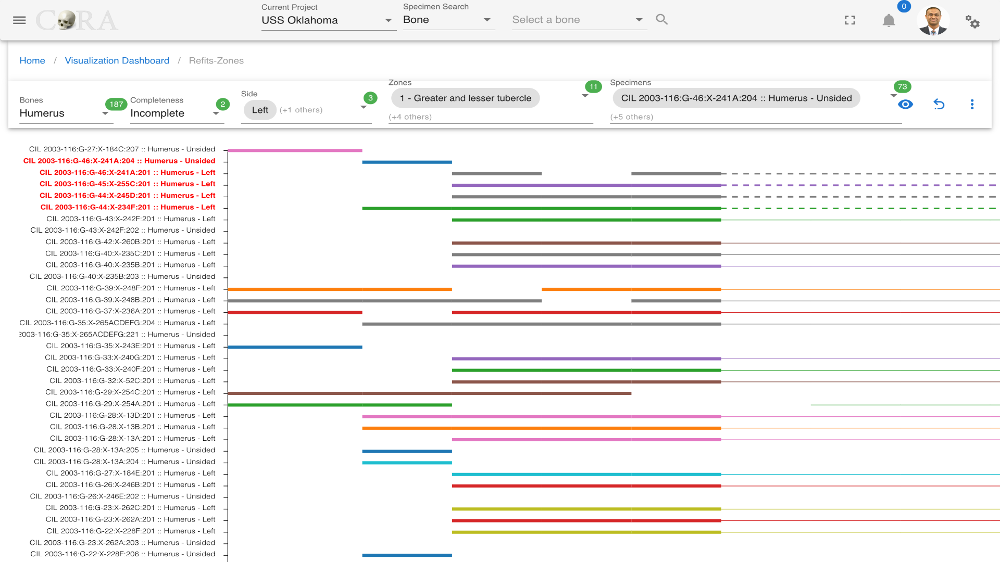
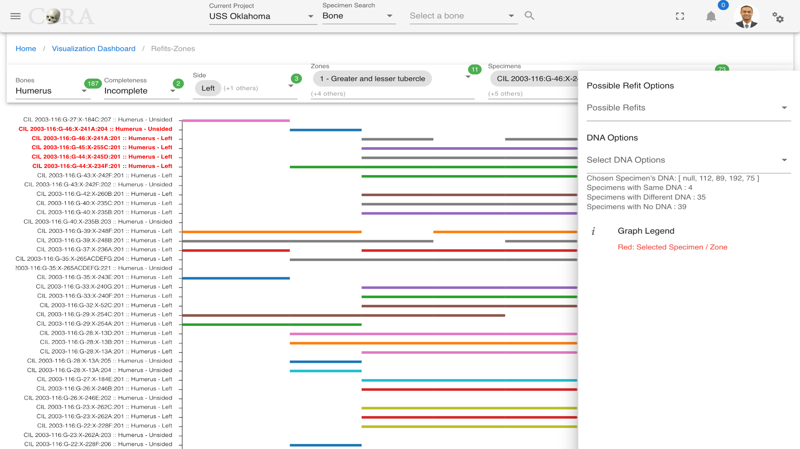
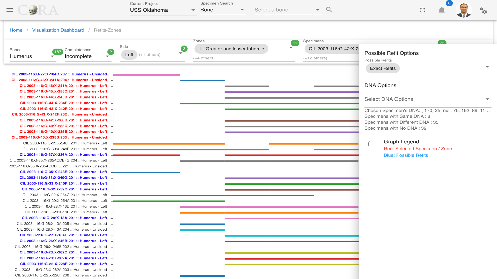

# Refits

!!! warning

    This page is work in progress.

## Refits Zone
Refits is a process used in osteological analysis where partial bones are attempted to be pieced/refit back together based on their physical fits and associations. This method is crucial for providing more complete skeletal reconstructions.

The following table shows the required and optional fields required for refits.

Attributes        | Required/Optional |
----------------- |-------------------|
Bones             | Required          |
Completeness      | Required          |
Side              | Optional          |
Zones             | Optional          |
Specimen          | Optional          |

### Steps to generate Refit-Zones Visualization

#### Step-1: Select a bone

Select a desired type of bone that requires refits.

#### Step-2: Select Completeness

Completeness of a bone is set to incomplete by default as incomplete bones are the ones that need refits.

#### Step-3: Select side of the bone

Select appropriate bone side that requires refits.

#### Step-4: Select zones

Select a single or multiple zones from the list of available zones that will be highlighted in the graph.

#### Step-5: Generate the refits visualization

Click on the 'eye' icon to generate a graph with all the relevant specimens and their refit zones. Under specimens select
specimens to highlight them in red and find a fit to them.

### More Options/Filters:

Click on the kebab menu icon to view more options. These options include 
- Possible refit options and 
- DNA Options (Specimens with same/different/no DNA)

### Possible Refit Options

***In the menu on the right side, you can see more possible refits options on how your refits-zone display.***

***This field can be multi-select***
- Exact Refits
- Exact Refits Multiple
- 1-Overlap
- 2-Overlap
- 3-Overlap

For possible refit options, for example, if we select exact refits all the possible refits will be highlighted in blue.

Use the 'reset' button to reset the graph and generate a new one.

