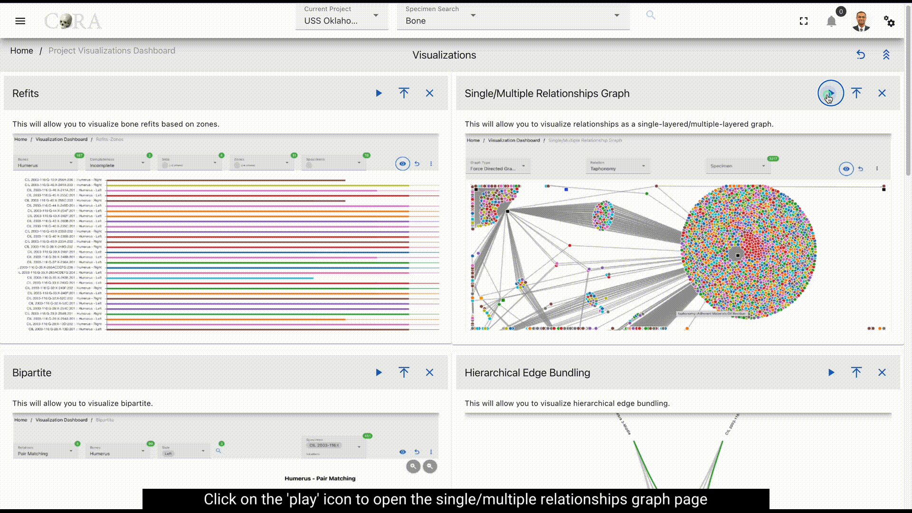
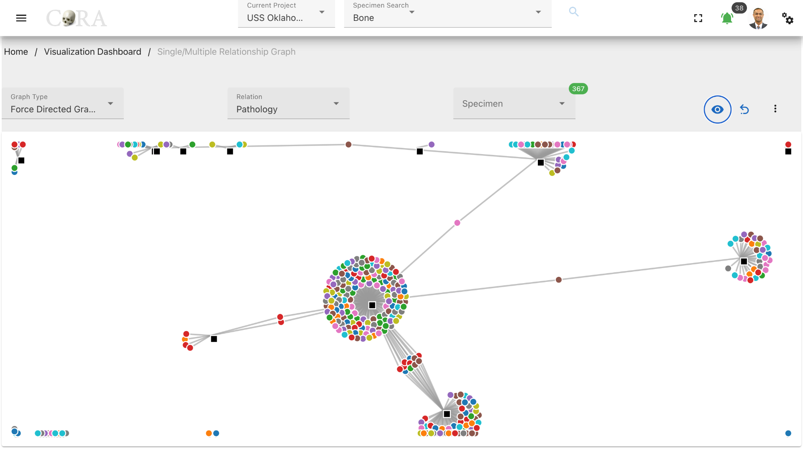
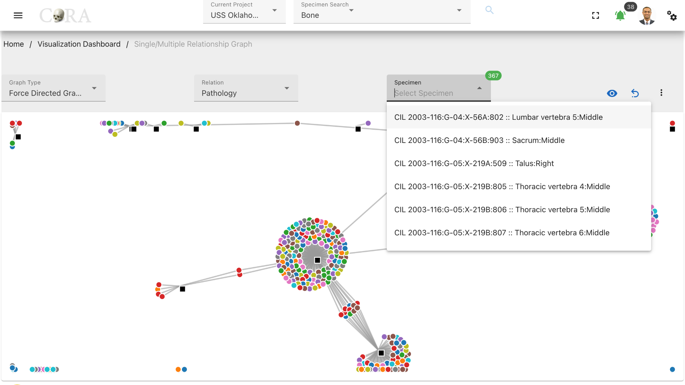
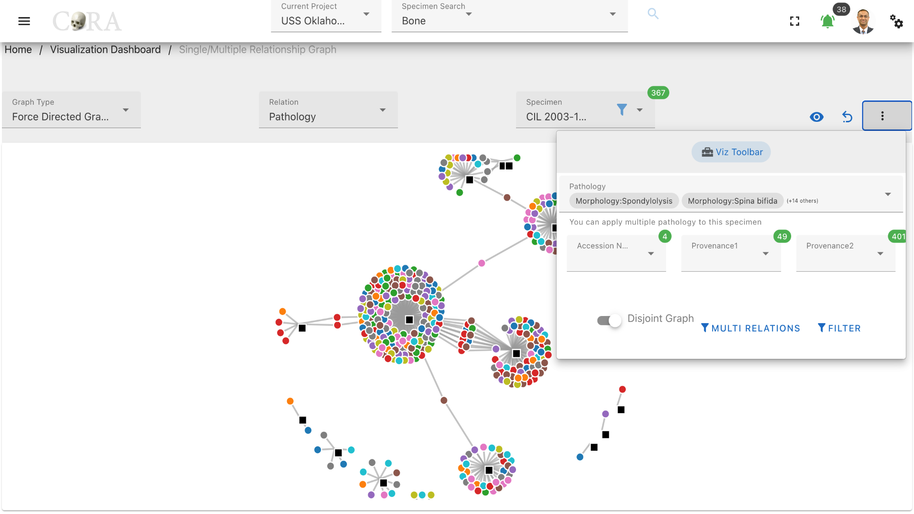

## Single/multiple Relationship Graph

The Single/Multiple Relationship Graph is a type of visualization used to illustrate complex relationships between a 
central node and multiple related nodes, which may themselves interact with one another or with additional nodes.

The following table shows the required and optional fields to generate a single multiple relationship graph.

Attributes           | Required/Optional
-----------------    | --------------
Graph Type           | Required
Relation             | Required
Specimen             | Optional

## Steps to generate a single/multiple relationship graph 

####  Step-1: Select graph type

The graph type is always defaulted to force directed graph and no change is required.

#### Step-2: Select a relation.

Select a relation from the list of available relations. For example: Pathology.

#### Step-3: Generate the graph

Click on eye icon to generate the single/multiple relationship graph.

#### Step-4: Choose a specimen

Choose a desired specimen that will be highlighted in the graph.

### More Options/Filters:

Click on the kebab menu to find more options. These options include 

- Filtering the specimens by Accession number, Provenance 1 and Provenance 2.
- Choosing subtypes in relations. (For example: Types of pathologies)
- Disjoint graph toggle