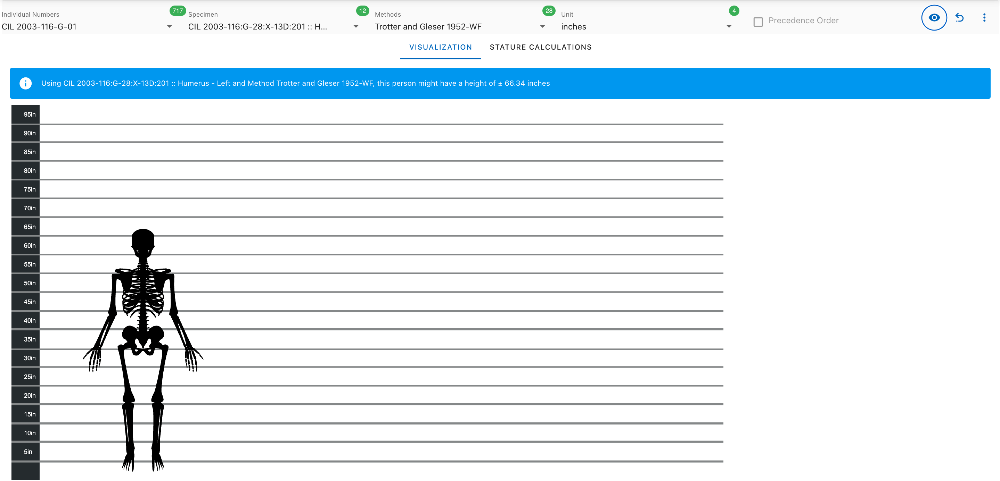
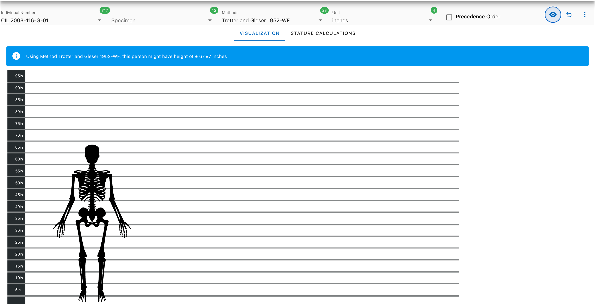
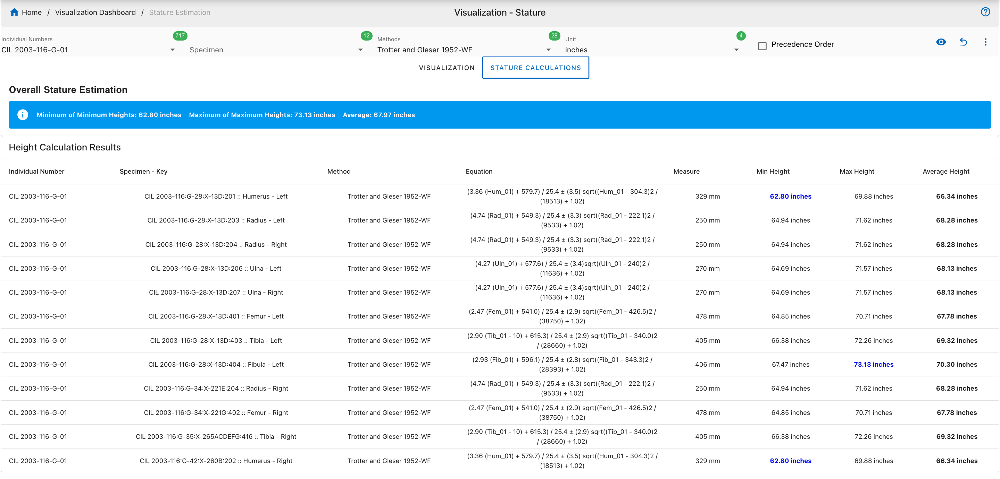
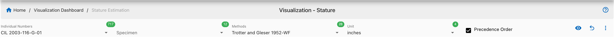
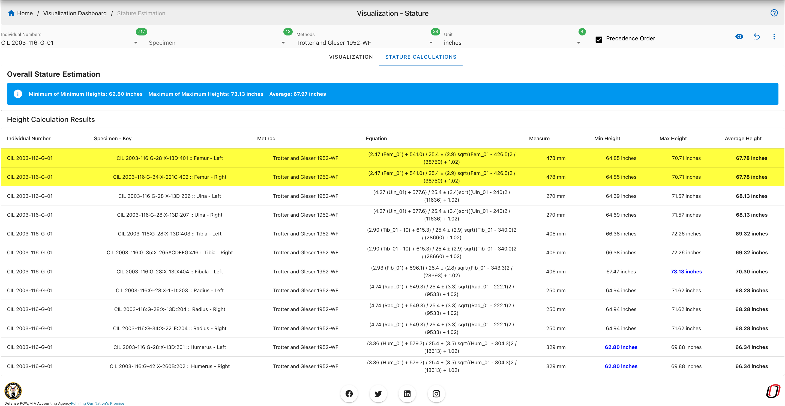

# Stature Estimation

!!! note

    This page describes how to perform and visualize stature estimation using different anthropological methods in the CoRA platform.

## Accessing Stature Estimation

From the left navigation:

**Left Sidebar Menu  → Visualizations  → stature Estimation**

This section enables users to estimate the stature of an individual using specific skeletal remains and reference methods.

## Select Parameters

Use the filter bar at the top of the page to configure your input:

- **Individual Numbers**: Select the unique ID of the individual (e.g., CIL 2003-116-G-01).
- **Specimen**: Choose a specific bone specimen associated with the individual.
- **Methods**: Select a stature estimation formula (e.g., Trotter and Gleser 1952-WF).
- **Unit**: Choose the measurement unit (inches or centimeters).
- **Precedence Order**: Toggle to apply the precedence order.

This module estimates the likely height of an individual based on bone measurements and selected forensic estimation formulas.

## Two Approaches to Stature Estimation

###  Approach 1: Single Specimen

1. **Select**:
   - **Individual Number**
   - **Specimen**
   - **Method**
   - **Unit** (inches or centimeters)

2. **Click** the **(eye icon)** to generate a visual representation of the estimated stature based on the selected single specimen.

3. The result appears in the **Visualization tab**, showing:
   - Skeleton aligned to a height chart
   - Height estimation banner (e.g., `± 67.97 inches`)

 This approach is ideal for quick, visual insights using one specific bone.

### Approach 2: Specimens in Individual

1. **Select**:
   - **Individual Number**
   - **Method**
   - (Leave specimen unselected)

2. The system automatically uses **all associated specimens** for the selected individual.

3. Results:
   A - **Visualization tab** shows the average stature estimation.
   

> Best suited for comprehensive analysis across all available skeletal data for an individual.

   B - **Stature Calculations tab** shows the formulas, calculations, maximum, minimum, average Height for all the specimens of the selected specimen.
     - Indivudal number
     - Specimen key
     - Method name
     - Equations
     - Measurement of each specimen
     - **Minimum, Maximum, and Average** height for the individual

4. Precedence Order

The **Precedence Order** checkbox allows users to **prioritize the order of specimen usage**.

- Enabling this option will:
  - Automatically arrange specimens according to the precedence hierarchy.
  - Affect both the **visualization** and **calculation** outputs.
  - Ensure consistency in methods that rely on preferred bone types.

> Use this feature when you want consistent and scientifically prioritized height estimations based on bone type.

## Interface Overview

###  Filter Panel Options

- **Individual Numbers**: e.g., `CIL 2003-116-G-01`
- **Specimen**: (Optional for aggregated view)
- **Methods**: e.g., `Trotter and Gleser 1952-WF`
- **Unit**: Inches or Centimeters
- **Precedence Order**: Toggle to apply bone prioritization.

###  Visualization Tab

Displays a visual skeleton aligned with a height chart based on selected method.

### Stature Calculations Tab

Provides a tabular view of:

- Indivudal number
     - Specimen key
     - Method name
     - Equations
     - Measurement of each specimen
     - **Minimum, Maximum, and Average** height for the individual

*This module supports detailed forensic reporting and anthropological research by leveraging scientifically validated height estimation models.*
