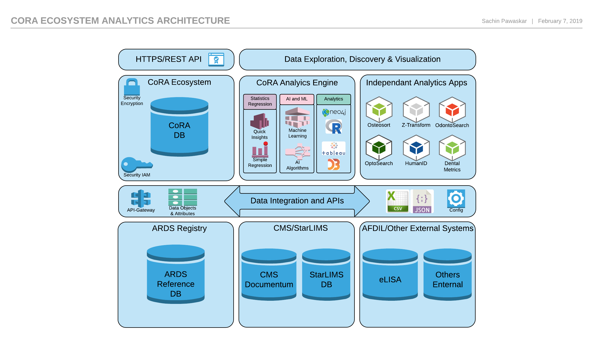

# What is CoRA Analytics?

The CoRA Analytics engine is part of the CoRA Ecosystem that can be thought of as an entension and a framework to perform analytics on forensic anthropology datasets. It is also desiged to act as a broker facilitating exchange of data from various systems such as the native CoRA projects data, CMS/StarLIMS data in the appropriate format and sending the various datasets to the appropriate analytics apps. These analytics apps can be independent self contained applications build by individual researchers and are independent of the CoRA Ecosystem developed and managed by the researcher/author. These apps must follow and comply with established architecture guidelines to work with the base CoRA Analytics engine and established data quality parameters and established APIs. 

The CoRA analytics engine will also provide some simple regression analysis for the datasets that are most commonly used in forensic anthropology. Other more advanced analytics will be provided via independent analytics application that can be developed by any reseracher and plug-in into the CoRA Ecosystem. 

The diagram below details the logical diagram for the CoRA Ecosystem Analytics Architecture.

# Analytics - Independent Applications
Following are some of the independent analytics applications that are either being developed or have already been developed that work with the CoRA Ecosystem.

## Osteometic Sorting - Jeffery Lynch
Blurb by author here

## Z-Transform - Julia Sommer
Blurb by author here

## Odontosearch - Author Name
Blurb by author here

## Optosearch - Author Name
Blurb by author here

## HumanID - Author Name
Blurb by author here

## Dental Metrics - Author Name
Blurb by author here

# Contribution Guidelines

If you are submitting documentation for the **current stable release**, submit it to the corresponding branch. For example, documentation for CoRA 1.0 would be submitted to the `1.0` branch. Documentation intended for the next release of CoRA should be submitted to the `master` branch.
