# Project Analytics Canvas

The Project Canvas is a powerful interface for managing specimen assignments to individuals in forensic anthropology cases. It provides a visual, drag-and-drop workflow for linking skeletal elements to identified individuals based on anatomical, DNA, and association data.

---

## Access and Layout

1. Open the main navigation by clicking the **Hamburger Menu** (three horizontal lines) in the top-left corner.
2. Select **Project Canvas** under the **Analytics & Visualization** menu from the navigation menu.
3. On the Project Canvas page, select your **Individual** from the Individual Lab Table using the dropdown menu.
   - The dropdown displays individual identifiers (e.g., `CIL 2003-116-I-110.1`).
   - You can search within the dropdown by typing to filter the list.

{width="800"}

The Project Canvas header contains several action buttons in the top-right corner. Each icon serves a specific function:

| Icon                           | Name                       | Description/Functionality                                            |
|--------------------------------|----------------------------|----------------------------------------------------------------------|
| :material-bone:                | **Specimens Lab Table**    | Show and Hide the Project Specimens & their associations Lab table   |
| :material-dna:                 | **DNA Lab Table**          | Show and Hide the DNA Specimens & their associations Lab table       |
| :material-human:               | **Individual Lab Table**   | Show and Hide the Project Individuals & specimens Lab table          |
| :material-information:         | **Info Tip**               | Provides contextual information/tips about the current page          |
| :material-help-circle-outline: | **Help - CoRA Docs**       | Opens the contextual help page in CoRA Docs for the current page.    |

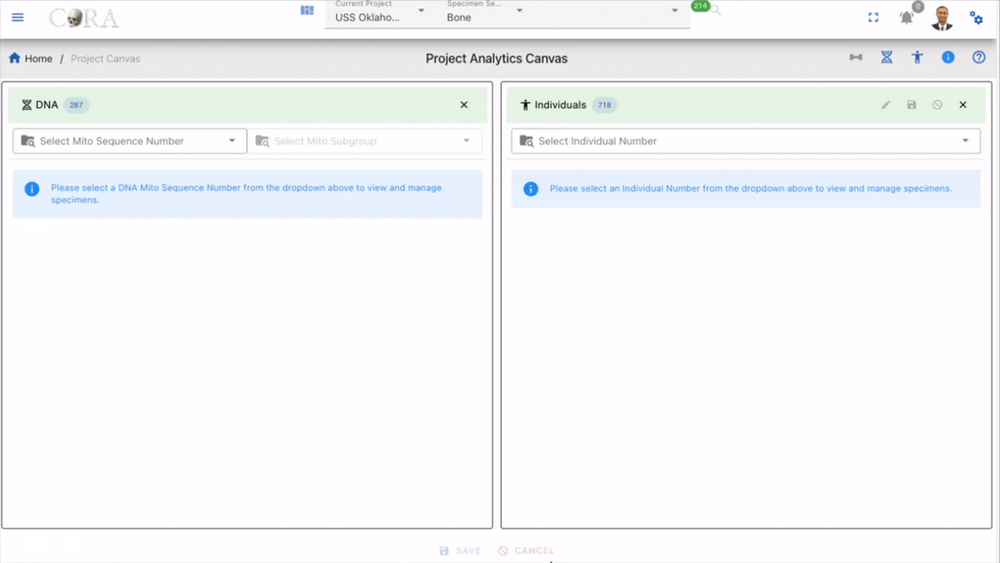{width="800"}

---

## Lab Tables

The Project Canvas consists of three main Lab tables arranged horizontally, namely the Individuals, Specimens and DNA Lab Tables. Each Lab table serves a distinct purpose and contains specific filtering, sorting, and data display capabilities.

{width="800"}

---

## Lab Table Buttons/Icons

| Icon                                          | Description                                             |
|-----------------------------------------------|---------------------------------------------------------|
| :material-plus-circle-multiple-outline:   | DeDup or Removes duplicate records from DNA Associations that already exist in DNA. |
| :material-numeric-1-box-outline:          | Displays the hop/degree association and visualizes specimen connections for the chosen hop. When the icon is clicked, a hop can be selected from a dropdown list. The system displays all records up to the selected hop. Hovering over a hop number shows the hop number and its associated specimen information. |
| :material-numeric-9: :material-numeric-3: | The first number is count of specimens on table. The second number is count of selected specimens **(highlighted with a green background)**. |
| :material-human:                          | Filters specimens unassigned to an individual. light grey (unassigned), dark grey (all specimens) |
| :material-vector-selection:               | Highlights associations between DNA and DNA Associations. When enabled, associations are clearly shown. When disabled, DNA Associations are outlined with a red dashed border to remain visible when a DNA specimen is selected. |
| :material-checkbox-marked:                | Auto select all specimens in lab table |
| :material-folder-alert:                   | DNA mito sequence number **does not match** with DNA mito sequence number on selected individual |
| :material-folder:                         | DNA mito sequence number **matches** with DNA mito sequence number on selected individual |
| :material-filter-check:                   | Toggle selected specimens only |

---

## Specimens Lab Table

The Specimens Lab table can displays all skeletal elements/specimens available in the current project. But it is recommended that you use the search filters to reduce your search space and only pull in the specimens that are required for the current task. Once you pull in specimens on to the lab table it will display the count fo the specimens for the current filters.

### Search and Filtering
- Located at the top of the lab table
- Allows searching by specimen Accession, Provenance1, Provenance2, Bone Group, Bone, Individual Number, Side and Completness
- For expansion and advanced filtering, Click the **Expand Arrow** (chevron) below the filter row to reveal additional filtering options:
- After completion,click the blue filter icon underneath the filter bars to execute.
- **Reset All (Red Icon)** button clears all filters at once.

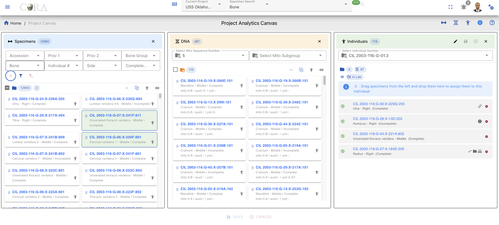{width="800"}

### Specimens Card

Each specimen in the list appears as a card containing:
- Specimen key (e.g., `CIL 2003-116:G-07:X-241B:805`)
- The key is clickable to jump to the specimen page where you can view details such as Accession Number, Bone, Side, Designator, etc.
- **Link Icon** (chain link symbol) - Located on the specimen card, click to open the Specimen Associations Lab Table

{width="800"}

### Specimen Page View

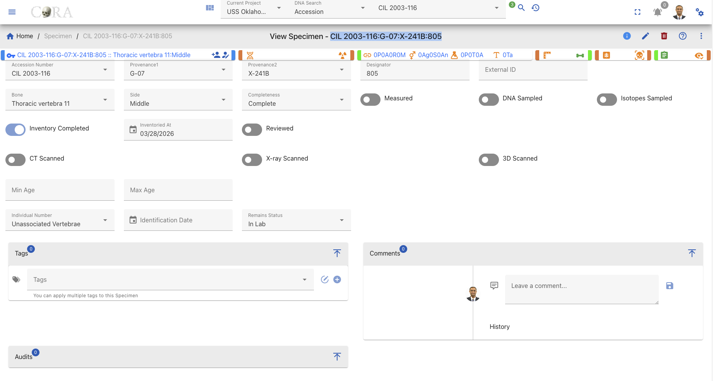{width="800"}

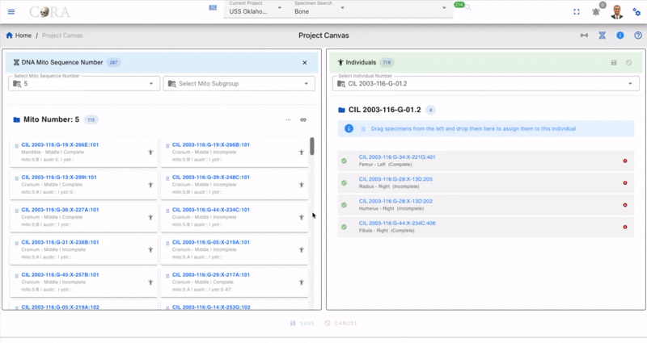

## Specimen Associations Lab Table

After clicking the **Link Icon** (chain link) on a specimen card in the Specimens Lab Table, a new **Associations** compartment/popup appears. This compartment provides detailed association information for the selected specimen.

{width="800"}

### Association Filters
The lab table includes an **Association Type** dropdown filter that allows you to view specific types of associations

| Filter Type       | Icon                       | Description                                                          |
|-------------------|----------------------------|----------------------------------------------------------------------|
| **Articulations** | :material-link-variant:    | Shows only Articulation specimen                                     |
| **Pair**          | :material-swap-horizontal: | Shows only paired specimens (e.g., left and right bones)             |
| **Refits**        | :material-puzzle:          | Shows only refitted fragments that rejoin to form a complete element |
| **Morphology**    | :material-shape:           | Shows only morphological matches (similar morphological features)    |

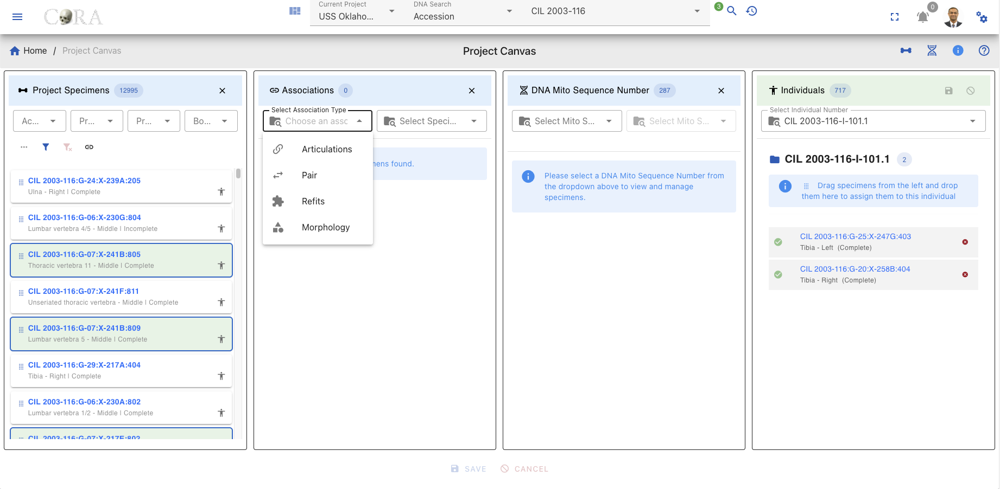{width="800"}

### Association List
Once filters are applied, the corresponding Specimen or DNA association lab table displays:

- **The key of each specimen type**
- **Underneath the specimen key** Bone Name, Location and Status
- **Right side of the specimen key** Type of Relation, Human Icon

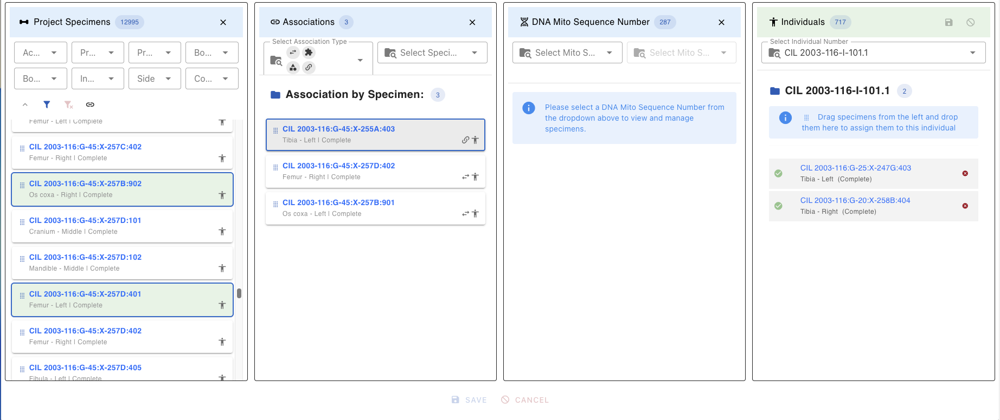{width="800"}

### Association Close
To close the Associations lab table click the **X** button in the top-right corner of the lab table

{width="800"}

{width="800"}

---

## DNA Lab Table
The DNA Lab table displays all DNA Mito Sequences available in the current project. Selecting a DNA Mito Sequence number will pull in all specimens with that mito sequence number and their associatiosn that are 1 Hop/Degree from them. Once you select a DNA Mito sequence number the lab table will display the count fo the specimens for the current sequence number.

### Mito Sequence Number
The primary filter is a **dropdown search** containing all unique mito sequence numbers in the project:
- Click the dropdown to see all available sequence numbers
- **Search within dropdown:** Select to filter the list of sequences
- The selected Mito Number appears in the header with the records filtered to that sequence.

{width="800"}

### Filters
Once a mito sequence is selected

1. The DNA Lab table automatically filters to show only specimens with matching DNA mito sequence number
2. Specimens are grouped or highlighted by their genetic relationship
3. The DNA Association Lab table updates to show existing associations for filtered specimens

{width="800"}

### DNA Lab Specimen Card
Each specimen in the DNA Lab Table appears as a card containing

- **The key of each Mito Sequence Number(e.g., `CIL 2003-116:G-07:X-241B:805`)**
- **Underneath the Mito Sequence Number key** Bone, Side, Completness, Sequence Number
- **Right side of the specimen key** Human Icon
- **Link Icon (chain link symbol) - Located on the DNA Lab Table, click to open the DNA Associations Lab Table**

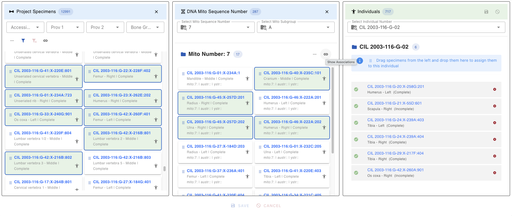{width="800"}

*(Screenshot: DNA Mito Sequence dropdown with search functionality)* specimen card click , card view

## DNA Association Lab Table

After clicking the Link Icon (chain link) on the DNA Lab table, the DNA Associations lab table will be displayed. This DNA Associations Lab table provides detailed association information for the selected specimens.

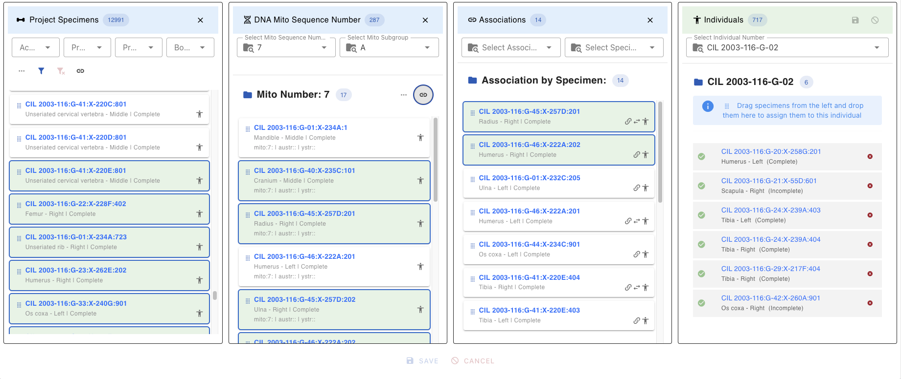{width="800"}

### Selecting Association Chain
Whenever a specimen is selected in the DNA Associations Lab table, it automatically selects the corresponding DNA specimen in both DNA Lab table and DNA Associations Lab table.

{width="800"}

When we hover over the hop number, it shows the hop number and its root parent and immediate parent information *(to be implemented)*.

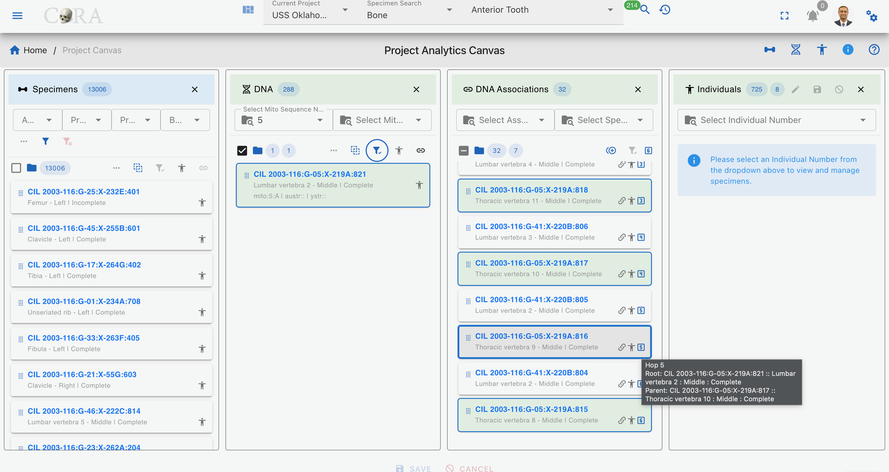{width="800"}

### Association Type Filter
The DNA Association Lab table provides a filter for the 4 main specimen association types or relationships as shown below

| Association Type  | Description                                                          |
|-------------------|----------------------------------------------------------------------|
| **Articulations** | Shows only Articulation specimen                                     |
| **Pair**          | Shows only paired specimens (e.g., left and right bones)             |
| **Refits**        | Shows only refitted fragments that rejoin to form a complete element |
| **Morphology**    | Shows only morphological matches (similar morphological features)    |

### Associations List
Once filters are applied, the lab table displays the following information

- The key of each specimen type
- Underneath the specimen key Bone Name, Location and Status
- Right side of the specimen key Type of Relation, Human Icon

{width="800"}

### Associations Close/Hide

To close the Associations lab table lick the **X** button in the top-right corner of the lab table

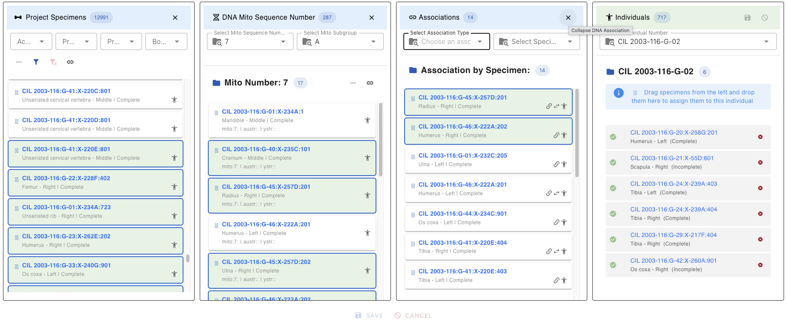{width="800"}
{width="800"}

---

## Individuals Lab Table
Displays a listing of all current individuals in the project and allows the user to select an individual to work including assignment of specimens to that individual. Once an individual number (identifier) is selected, all the pertinent information for that individual is displayed on the Individual Lab table.

### Individual Selector
The dropdown at the top allows switching between individuals:

- Search by typing in the dropdown
- Select Individual Number

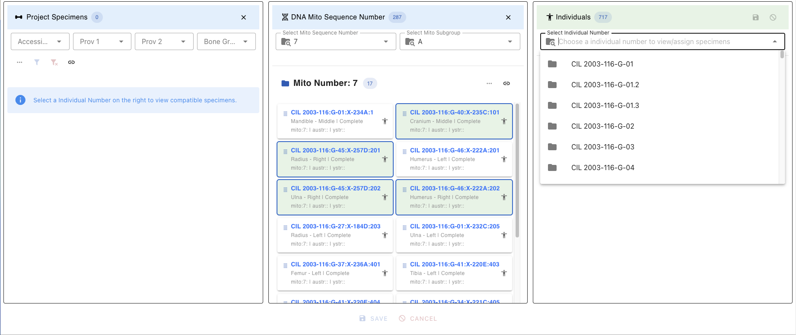{width="800"}
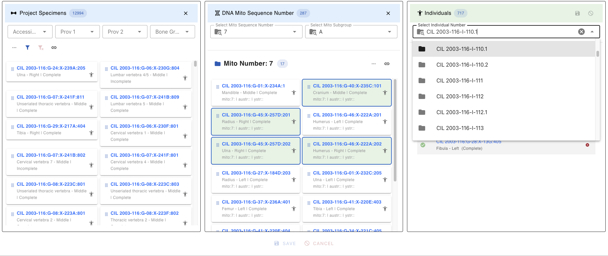{width="800"}

### Individual Table Buttons/Icons

| Icon                    | Description                                                                                         |
|-------------------------|-----------------------------------------------------------------------------------------------------|
| :material-pencil:       | Enables editing of specimens under the selected individual.      |
| :material-content-save: | Saves all edits made to the individual and associated specimens. |
| :material-cancel:       | Cancels the current editing session without saving changes.      |
| :material-close:        | Closes the individual lab table.                                 |
| :material-folder: :material-numeric-7: | Signifies the individual selected followed by the count of specimens on individual.  |
| :material-folder-lock: | Signifies the individual selected is locked for editing due to **CHR Complete** or **Released**      |
| :material-dna: :material-numeric-7:    | Signifies the individual has DNA, followed by the actual DNA mito sequence number    |
| :material-alpha-s-box-outline: :material-alpha-b:    | Signifies the individual has DNA with a subgroup such as A, B, or 1, 2.etc. |
| :material-alpha-a-box-outline: :material-numeric-7: | Signifies the individual has Nuclear DNA, followed by the actual number |
| :material-alpha-y-box-outline: :material-numeric-7: | Signifies the individual has Y-Str DNA, followed by the actual number   |
| :material-identifier: :material-folder-move-outline: | Individual identification (ID )information such as remains status & dates |
| :material-folder-move-outline: | Individual remains status (In Lab, In Analytics, CHR Complete, Released)                     |
| :material-calendar:   | Individual identification date if **before** :material-folder-move-outline: Individual remains status |
| :material-coffin:     | Individual remains release date if **after** :material-folder-move-outline: Individual remains status |
| :material-close-circle:    | The red “X” icon marks the specimen for removal from the individual.                             |
| :material-link-variant:    | Denotes articulation relationship, hovering over which displays the related articulated specimen |
| :material-swap-horizontal: | Denotes pair match relationship, hovering over which displays the related pair match specimen    |
| :material-puzzle:          | Denotes refit relationship, hovering over which displays the related refit specimen              |
| :material-shape:           | Denotes morphology relationship, hovering over which displays the related morphology specimen    |

{width="800"}

### Assigned Specimens
Displays all specimens currently assigned to the selected individual:

- Each specimen shows with a **Green Checkmark** (Complete)
- Can be removed by clicking the X from the right side of the card

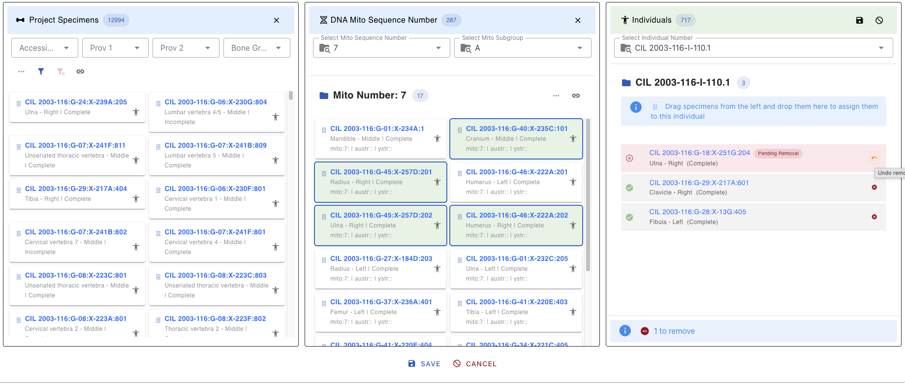{width="800"}

## Assign Specimens to Individual

The **Assign Specimen to Individual** feature allows users to associate one or more specimens with a specific individual. This functionality is essential for grouping skeletal elements under a unique individual profile based on forensic analysis. Recent enhancements have introduced several new features to improve usability and functionality.

### 1. Select Individual

- Choose the target individual from the dropdown menu on the right panel.
- The selected individual’s details will be displayed.

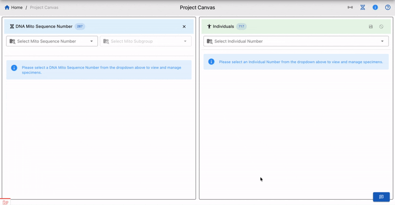{width="800"}

### 2. Apply Filters (Optional)
Use the available filters shown below to refine the list of specimens displayed. You can use multiple filters for a more refined search.

  - **Accession**
  - **Provenance 1**
  - **Provenance 2**
  - **Bone Group**
  - **Bone**
  - **Side**
  - **Completeness**
  - **Austr Sequence Number and Subgroup**
  - **Ystr Sequence Number and Subgroup**

### 3. Select DNA Mito # (Optional)

- Choose a DNA Mito Sequence Number from the dropdown menu to view and manage specimens associated with that sequence.
- Additional options include filtering by Mito Subgroup, Austr Sequence Number, and Ystr Sequence Number.

### 4. Select Association Type (Optional)

- Use the dropdown menu to select an association type (e.g., Articulations, Pair Match, Refits, Morphology).
- You can also select a specific specimen to view all associated specimens for the chosen association type.

### 5. Drag and Drop Specimens

- Select the desired specimens from the list on the left panel.
- Drag and drop the specimens into the individual’s assignment area on the right panel.
- Specimens marked for assignment or removal are visually distinguished with color-coded chips (e.g., orange for pending addition, red for pending removal).

 

### 6. Select Association Reasons

- For each specimen, select one or more reason for the association of that specimen to the individual from the dropdown menu. The table below shows all the association inclusion reasons and exclusion reasons

| Reasons                           | Icon                           | Inclusion          | Exclusion          |
|-----------------------------------|--------------------------------|--------------------|--------------------|
| **Mitochondrial DNA**             | :material-dna:                 | :material-check:   | :material-check:   |
| **Pair Match**                    | :material-swap-horizontal:     | :material-check:   | :material-check:   |
| **Articulations**                 | :material-link-variant:        | :material-check:   | :material-check:   |
| **Accession**                     | :material-map-marker-radius:   | :material-check:   | :material-check:   |
| **Anomaly**                       | :material-flash:               | :material-check:   | :material-check:   |
| **Chest Radiographic Comparison** | :material-radiology-box:       | :material-check:   | :material-check:   |
| **Development**                   | :material-human-child:         | :material-check:   | :material-check:   |
| **Isotope Analysis Report**       | :material-radioactive:         | :material-check:   | :material-check:   |
| **Morphology**                    | :material-shape:               | :material-check:   | :material-check:   |
| **Nuclear DNA**                   | :material-alpha-a-box-outline: | :material-check:   |                    |
| **Odontology**                    | :material-tooth:               | :material-check:   | :material-check:   |
| **Osteometric Sorting**           | :material-sort:                | :material-check:   | :material-check:   |
| **Pathology**                     | :material-flask-outline:       | :material-check:   | :material-check:   |
| **Provenance**                    | :material-map-marker:          | :material-check:   | :material-check:   |
| **Refits**                        | :material-puzzle:              | :material-check:   | :material-check:   |
| **Taphonomy**                     | :material-format-text:         | :material-check:   | :material-check:   |
| **Trauma**                        | :material-pistol:              | :material-check:   | :material-check:   |

### 7. Save or Cancel:

- To save the assignments, click the **Save** button.
- To cancel the entire process, click the **Cancel** button.
- You can also remove individual specimens from the assignment area by clicking the **X** icon next to them.

## Key Features 

- **Dynamic Specimen List**: The list updates based on applied filters, ensuring you only see relevant specimens.
- **DNA Mito Sequence Integration**: Manage specimens associated with specific DNA Mito Sequence Numbers.
- **Association Management**: View and manage specimens based on association types such as Articulations, Pairs, Refits, and Morphology.
- **Reason Selection**: Ensure each assignment has a documented reason for traceability.
- **Bulk Assignment**: Assign multiple specimens to an individual in one action using drag-and-drop functionality.
- **Real-Time Updates**: Changes are reflected immediately in the project database after saving.
- **Action Alerts**: Alerts at the bottom of the interface track pending assignments and removals.

## Example Workflow

1. Select an individual from the dropdown menu.
2. Filter specimens by "Accession" and "Bone Group" or apply advanced filters like Austr Sequence Number or Ystr Subgroup.
3. Select a DNA Mito Sequence Number to view related specimens.
4. Choose an association type (e.g., Articulations) and select a specimen to view associated specimens.
5. Drag and drop the filtered specimens into the individual’s assignment area.
6. Click **Save** to save assignments.
7. Select a reason for each assignment from the dropdown menu.
8. Then click **Save** again to finalize the assignments.

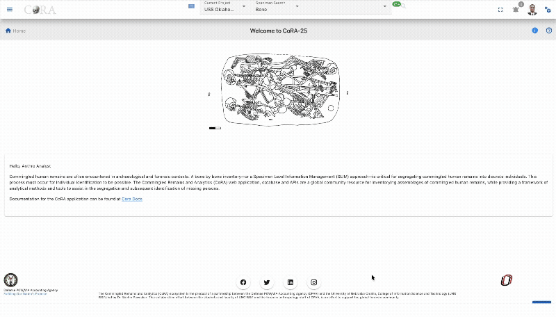{width="800"}

## Selection and Drag-and-Drop

### Selecting Multiple Specimens

**Single Selection:**

- Click on a specimen card to select it
- Selected cards are highlighted with a green background color

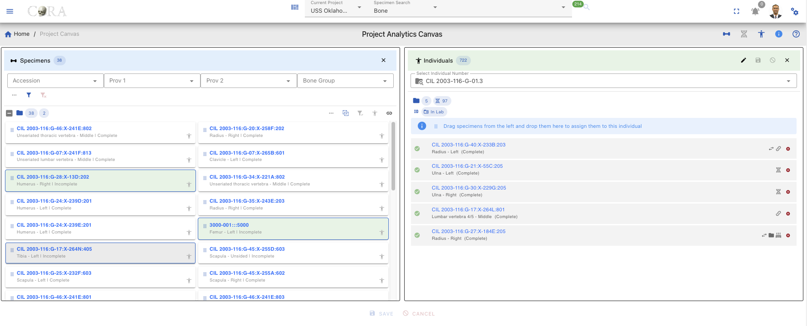{width="800"}
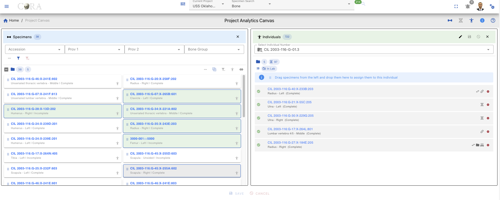{width="800"}

**Multiple Selection:**

| Method            | Action                                         |
|-------------------|------------------------------------------------|
| Ctrl/Cmd + Click  | Add/remove individual specimens from selection |
| Shift + Click     | Select range of specimens                      |
| Click + Drag      | Draw selection box around multiple specimens   |
| Ctrl/Cmd + A      | Select all visible specimens                   |

### Drag-and-Drop Assignment

**To assign specimens to an individual:**

1. **Ensure an individual is selected** in the Individual Lab table
2. **Select one or more specimens** in the Project Specimens or DNA Lab tables
3. **Click and hold** on any selected specimen
4. **Drag** toward the Individual Lab table
5. **Drop** when the Individual Lab table highlights/accepts the drop
6. Specimens appear in the Individual Lab table with **"Pending Add"** status (orange clock icon)

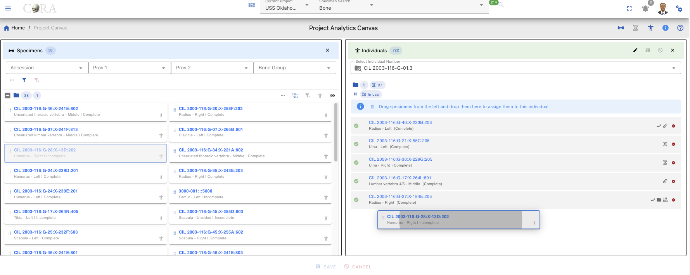{width="800"}
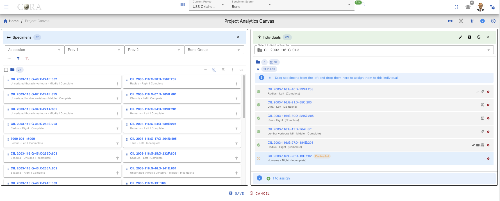{width="800"}

**During Drag:**

- Valid drop zone highlights in green color when dragging over it
- Invalid drops (e.g., no individual selected) show a rejection indicator
- Can drag multiple items at once

### Remove Pending Assignments

Before saving, you can remove pending assignments by using the steps below

1. Find the specimen in the Individual Lab table
2. Click the **X** icon on the right side of the appropriate card
3. Specimen turns in red color, and it reads as "Pending Removal"

{width="800"}

### Saving Assignments

1. **Click the Save button** in the Individual Lab table header
2. **Confirmation dialog opens** titled "Confirm Specimen Assignments"
3. **Select a reason** for each pending specimen from the dropdown:
4. The **Save button** in the dialog is disabled until all pending items have a reason assigned
5. Once all reasons are selected, click **Save** to complete the assignment

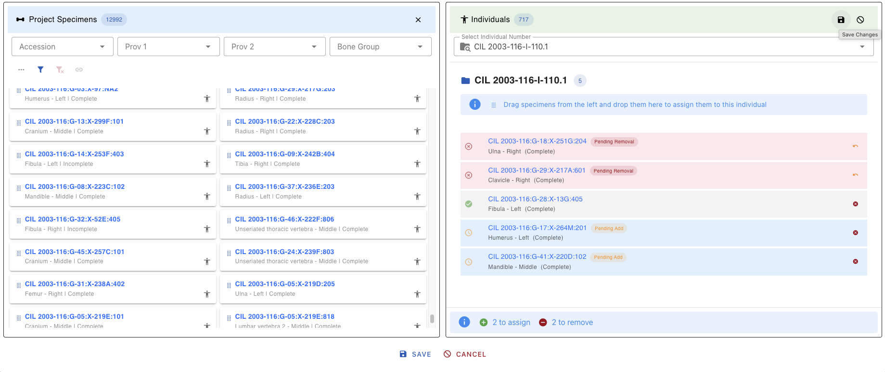{width="800"}
{width="800"}
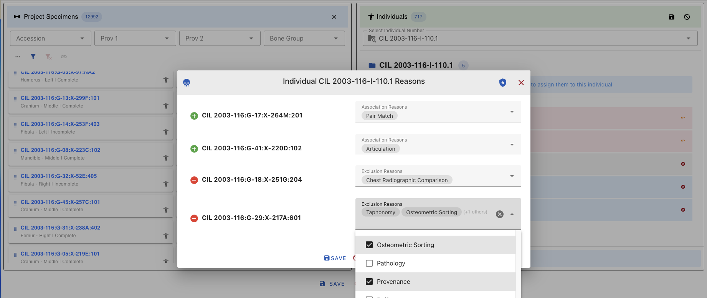{width="800"}

**After Saving:**

- Success notification appears
- Pending status changes to confirmed (human icon turns dark grey)
- Audit trail records the change with timestamp and user

{width="800"}

**To discard changes:**

- Click **Cancel** in the confirmation dialog, OR
- Refresh the page before saving

{width="800"}

---

## Quick Reference Tips

### Filter and Search

- Use filters first to narrow large datasets before selecting specimens
- Combine filters within and across Lab tables for precise targeting of specimens

### Icons and Status

- **Dark Grey Human:** Already assigned - be careful!
- **Light Grey Human:** Available for assignment
- **Link Icon:** Shows existing specimen connections

### Assignment Process

1. Select specimens → 2. Drag to Individual → 3. Add reasons → 4. Save

### Common Issues

| Issue | Solution |
|-------|----------|
| Can't drop specimen | Ensure an individual is selected |
| Save button disabled | Assign reasons to all pending items |
| Can't see associations | Use the Link Button after selecting specimens |

### Keyboard Shortcuts

| Shortcut | Action |
|----------|--------|
| Ctrl/Cmd + Click | Multi-select specimens |
| Shift + Click | Select range |
| Delete/Backspace | Remove selected from assignment |
| Ctrl/Cmd + S | Save (when in dialog) |
| Escape | Close dialog/cancel action |

---

## Troubleshooting

### Specimen Assignment Errors

**Error Message:**

> "Cannot assign these specimens. The individual already has a complete specimen with the same bone and side, so only incomplete specimens are allowed."

**Explanation:**

This error occurs when you try to assign a complete specimen to an individual who already has a complete specimen of the same bone and side. In forensic anthropology, an individual can only have one complete specimen for each unique bone/side combination. However, incomplete specimens can still be assigned to complete the individual's skeletal representation.

**Solution:**

- Select **incomplete specimens** instead of complete ones when assigning to an individual who already has a complete specimen of the same bone and side
- Remove the existing complete specimen from the individual first (requires appropriate permissions), then assign the new complete specimen
- Use the filter to search for incomplete specimens by selecting "Incomplete" in the Completeness filter

**Alternative Approaches:**

1. If you need to replace a complete specimen, first remove the existing complete specimen from the individual
2. Consider if the specimen should be marked as "incomplete" if it's actually missing parts
3. Contact your supervisor or system administrator if you believe the existing assignment is incorrect

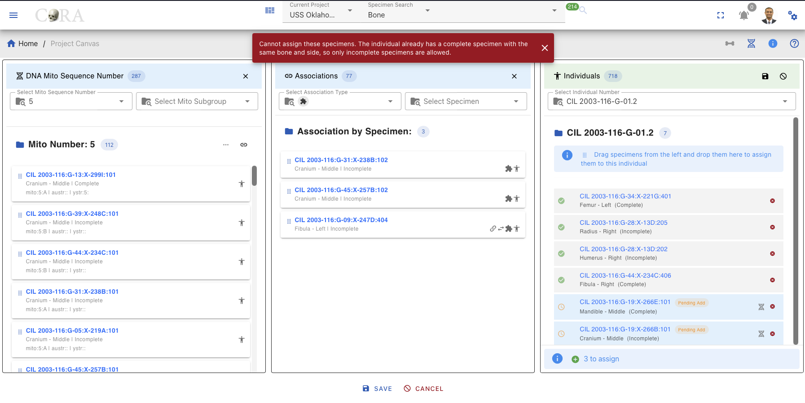{width="800"}
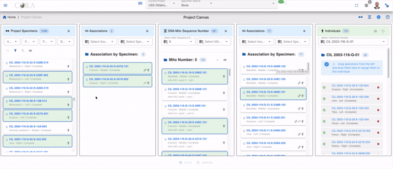{width="800"}
