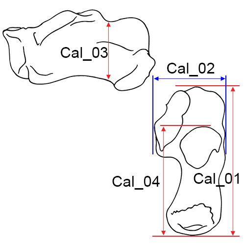

In this section we present the images for measurements used in the inventory of human remains, along with captions and desciptions of each measurement. 

Measurement definitions are derived from:
* Langley et al. (2016) *Data Collection Procedures for Forensic Skeletal Material 2.0.* University of Tennessee and Lincoln Memorial University
* Byrd & Adams (2003) Osteometric sorting of commingled human remains. *Journal of Forensic Sciences*, 48:717-724.
* Meadows and Langley (1992) Estimation of stature from metacarpal lengths. *Journal of Forensic Sciences*, 37:147-154.

Images by Elizabeth Lockett and Nandar Yukyi are derived from Langley et al. (2016).

---

# Cranium

**Cra_01 Maximum Cranial Length (g-op, GOL):**  The straight-line distance from glabella (g) to opisthocranion (op) in the midsagittal plane. 

* *Instrument:* spreading caliper
* *Comment:*  Set the skull on its base. Place one caliper point in the glabellar region in the midline and hold with fingers while the other caliper point is applied to the posterior portion of the skull in the midsagittal plane and moved up and down until the maximum length is obtained. On finding this, move the left point up and down slightly to make sure the reading is maximum (Howells 1973: 170; Martin and Knussmann 1988:168, #1; Moore-Jansen et al. 1994, #1; Langley et al. 2016:65, #1).

**Cra_02 Nasio-occipital Length (NOL):**  Maximum length in the midsagittal plane, measured from nasion (n). 

* *Instrument:* spreading caliper
* *Comment:*  With the skull in position as for Maximum Cranial Length, place the one caliper point at (n) and move the other point along the occiput in the midline for the maximum reading (Howells 1973:171; Langley et al. 2016:65, #2).

**Cra_03 Maximum Cranial Breadth (eu-eu, XCB):**  The maximum width of the skull perpendicular to the mid-sagittal plane wherever it is located with the exception of the inferior temporal line and the immediate area surround the latter (i.e. the posterior roots of the zygomatic arches and supramastoid crest). 

* *Instrument:* spreading caliper
* *Comment:*  Cra_03 is measured with the skull resting either on its base or on the occiput. The two measuring points (eurya) should lie in the same horizontal and frontal planes. Place the arms of the caliper at the same level while maintaining the hinge joint of the caliper in the mid-sagittal plane. Hold the ends of the caliper in each hand and apply to the lateral portions of the skull, making circular motions. Make sure you include areas below the squamosal suture, where the maximum is sometimes found. (Howells 1973:172; Hrdlicka 1920:14; Martin and Knussmann 1988:170, #8; Moore-Jansen et al. 1994, #2; Langley et al. 2016:65, #3). 

**Cra_04 Bizygomatic Breadth (zy-zy, ZYB):**  The maximum breadth across the zygomatic arches, wherever found, perpendicular to the mid-sagittal plane. 

* *Instrument:* sliding or spreading calipers
* *Comment:*  Place the skull on its occiput, base toward observer, and apply the blunt points of the caliper to the zygomatic arches and locate the maximum breadth perpendicular to the mid-sagittal plane. (Howells 1973:173; Moore-Jansen et al. 1994, #3; Langley et al. 2016:66, #4). 

**Cra_05 Basion-Bregma Height (ba-b, BBH):**  The distance from basion (ba) to bregma (b). 

* *Instrument:* spreading caliper
* *Comment:*  Place the skull on its occiput with the right side facing the observer. Apply the endpoint of one of the arms of the caliper at (ba) and support with fingers. Then apply the endpoint of the second arm of the caliper to (b) (Howells 1973:172; Moore-Jansen et al. 1994, #4; Langley et al. 2016:66, #5). 

**Cra_06 Cranial Base Length (ba-n, BNL):**  The distance from nasion (n) to basion (ba). 

* *Instrument:* spreading caliper
* *Comment:*  Rest the skull on the cranial vault and apply the endpoint of the one arm of caliper to (n) while applying the other to (ba). (Howells 1973:171-172, Martin and Knussmann 1988:169, #5; Moore-Jansen et al. 1994, #5; Langley et al. 2016:66, #6). 

**Cra_07 Basion-Prosthion Length (ba-pr, BPL):**  The distance from basion (ba) to prosthion (pr). 

* *Instrument:* spreading or sliding calipers
* *Comment:*  Apply the fixed point of the sliding caliper or one tip of the spreading caliper to (pr). Then bring the movable point of the sliding caliper or the other tip of the spreading caliper to (ba) (Howells 1973:174; Moore-Jansen et al. 1994, #6; Langley et al. 2016:66, #7). 

**Cra_08 Maxillo-Alveolar Breadth (ecm-ecm, MAB):**  The maximum breadth across the alveolar borders of the maxilla measured on the lateral surfaces at the location of the second maxillary molars (ecm). 

* *Instrument:* spreading caliper
* *Comment:*  The points of measurement (ecm) are not found on the alveolar processes when reactive alveolar bone is present; in these cases ecm is located on the bony segment superior to the second maxillary molars. Apply both arms of the caliper to the alveolar borders above the tooth row from an anterior position (Howells 1973:176; Martin and Knussmann 1988:182 #61; Moore-Jansen et al. 1994, #7; Langley et al. 2016:66, #8).

**Cra_09 Maxillo-Alveolar Length (pr-alv, MAL):**  The distance from prosthion (pr) to alveolon (alv). 

* *Instrument:* spreading or sliding calipers
* *Comment:*  Place the skull so the base faces up. Apply a thin wire, rubber band, or other similar implement to the posterior borders of the alveolar arch and measure the distance from (pr) to the middle of the wire/band in the mid-sagittal plane (alv). (Martin and Knussmann 1988:182 #60; Moore-Jansen et al. 1994, #8; Langley et al. 2016:66, #9).

**Cra_10 Biauricular Breadth (ra-ra, AUB):**  The least exterior breadth across the roots of the zygomatic processes (ra). 

* *Instrument:* sliding caliper
* *Comment:*  With the skull resting on the occiput, and with the base toward the observer, measure to the outside of the roots of the zygomatic processes at their deepest incurvature, generally slightly anterior to the external auditory meatus, with the sharp points of the caliper (Howells 1973:173; Martin and Knussmann 1988:170, #11b; Moore-Jansen et al. 1994, #9; Langley et al. 2016:66, #10).

**Cra_11 Nasion-Prosthion Height (n-pr, NPH):**  The distance from nasion (n) to prosthion (pr), upper facial height. 

* *Instrument:* sliding caliper
* *Comment:*  Place the fixed point of the caliper on (n) and apply the movable point to (pr). If the alveolar process exhibits slight resorption or erosion at the point of (pr), the projection of the process may be estimated when the alveolar process of the lateral incisors is still intact. When resorption or erosion is more pronounced, this measurement should not be taken (Howells 1973:174; Moore-Jansen et al. 1994, #10; Langley et al. 2016:66-67, #11).

**Cra_12 Minimum Frontal Breadth (ft-ft, WFB):**  The distance between the right and left frontotemporale (ft). 

* *Instrument:* sliding caliper
* *Comment:*  Place the skull on its base. The two endpoints of the caliper are placed on the temporal ridges at the two (ft). When taking this measurement make certain that the least distance between both temporal lines on the frontal bone
is recorded (Hrdlicka 1920: 15; Martin and Knussmann 1988:170, #9; Moore-Jansen et al. 1994, #11; Langley et al. 2016:67, #12). 

**Cra_13 Upper Facial Breadth (fmt-fmt):**  The distance between the right and left frontomalare temporale (fmt). 

* *Instrument:* sliding caliper
* *Comment:*  The measurement is taken between the two external points on the frontomalar suture (Martin and Knussmann 1988:179, #43; Moore-Jansen et al. 1994, #12; Langley et al. 2016:67, #13). 

**Cra_14 Nasal Height (n-ns, NLH):**  The average height from nasion (n) to the lowest point on the border of the nasal aperture on either side (ns). 

* *Instrument:* sliding caliper
* *Comment:*  Place the skull on its occiput, base to the right, and measure the distance from (n) to the inferior border of the nasal aperture on each side and take the average of these two measurements to the nearest whole millimeter. The lower border of the aperture is well defined in most populations. It is not always the most anterior edge, but the beginning of the actual floor of the nasal cavity. It is the hinder border, not the forward border, of any prenasal gutter or fossa. (Howells 1973:175; Moore-Jansen et al. 1994, #13; Langley et al. 2016:67, #14). 

**Cra_15 Nasal Breadth (al-al, NLB):**  The maximum breadth of the nasal aperture (al-al). 

* *Instrument:* sliding caliper
* *Comment:*  Carefully place the points of the instrument on the sharp lateral margins of the nasal aperture at its most lateral curvature; this is not an inside measurement. The measurement is perpendicular to the mid-sagittal plane and recorded to the nearest millimeter (Howells 1973: 176; Martin and Knussmann 1988:181 #54; Moore-Jansen et al. 1994, #14; Langley et al. 2016:68, #15). 

**Cra_16L and Cra_16R Orbital Breadth (d-ec, OBB):**  The distance from dacryon (d) to ectoconchion (ec), of the left (L) and right (R) orbit, respectively. 

* *Instrument:* sliding caliper
* *Comment:*  The inside jaws of the calipers are useful for this measurement. For standardization and practical reasons measure the left orbit. Measure the right orbit if the left orbit is damaged and record the side measured on the recording sheet. (Howells 1973: 175; Martin and Knussmann l988:181, #51a; Moore-Jansen et al. 1994, #15; Langley et al. 2016:68, #16). 

**Cra_17L and Cra_17R Orbital Height (OBH):**  The distance between the superior and inferior orbital margins perpendicular to orbital breadth and bisecting the orbit into equal medial and lateral halves, of the left (L) and right (R) orbit, respectively. 

* *Instrument:* sliding caliper
* *Comment:*  Orbital height is measured perpendicular to orbital breadth. Any notches or depressions on either superior or inferior borders should be avoided; if there is deep notching, move the caliper medially slightly. The inside jaws of the calipers are useful for this measurement. (Howells 1973: 175; Martin and Knussmann 1988:181, #52; Moore-Jansen et al. 1994, #16; Langley et al. 2016:68, #17). 

**Cra_18 Biorbital Breadth (ec-ec, EKB):**  The distance from left to right ectoconchion (ec) (Howells 1973:178; Moore-Jansen et al. 1994, #17; Langley et al. 2016:68, #18). 

* *Instrument:* sliding caliper

**Cra_19 Interorbital Breadth (d-d, DKB):**  The distance between right and left dacryon (d) (Howells 1973:178; Moore-Jansen et al. 1994, #18; Langley et al. 2016:69, #19). 

* *Instrument:* sliding caliper

**Cra_20 Frontal Chord (n-b, FRC):**  The distance from nasion (n) to bregma (b) taken in the mid-sagittal plane. 

* *Instrument:* sliding caliper
* *Comment:*  Place the tips of the instrument on the bone surface or at the level of the bone surface and not in a suture or other depression (Howells 1973:181; Martin and Knussmann 1988:174, #29; Moore-Jansen et al. 1994, #19; Langley et al. 2016:69, #20). 

**Cra_21 Parietal Chord (b-l, PAC):**  The distance from bregma (b) to lambda (l) taken in the mid-sagittal plane. 

* *Instrument:* sliding caliper 
* *Comment:*  Place the tips of the instrument on the bone surface or at the level of the bone surface and not in a suture or other depression (Howells 1973:182; Martin and Knussmann 1988:175, #30; Moore-Jansen et al. 1994, #20; Langley et al. 2016:69, #21). 

**Cra_22 Occipital Chord (l-o, OCC):**  The distance from lambda (l) to opisthion (o) taken in the mid-sagittal plane (Howells 1973:182; Martin and Knussmann 1988:175 #31; Moore-Jansen et al. 1994, #21; Langley et al. 2016:69, #22). 

* *Instrument:* sliding caliper

**Cra_23 Foramen Magnum Length (ba-o, FOL):**  The mid-sagittal distance from the most anterior point on the foramen magnum margin to opisthion (o). 

* *Instrument:* sliding caliper
* *Comment:*  Measure with the skull base up, using the inside jaws of the calipers (Martin and Knussmann 1988:169 #7; Moore-Jansen et al. 1994, #22; Langley et al. 2016:69, #23). 

**Cra_24 Foramen Magnum Breadth (FOB):**  The distance between the lateral margins of the foramen magnum at the point of greatest lateral curvature. 

* *Instrument:* sliding caliper
* *Comment:*  Measure with the skull base up using the inside jaws of the calipers (Martin and Knussmann 1988:171, #16; Moore-Jansen et al. 1994, #23; Langley et al. 2016:69, #24). 

**Cra_25L and Cra_25R Mastoid Height (MDH):**  The direct distance between porion (po) and mastoidale (ms) of the left (L) and right (R) sides, respectively. 

* *Instrument:* sliding caliper
* *Comment:*  Note that both right and left sides are measured. Place the fixed arm of the caliper on (po) and move the movable arm until it touches (ms). This may be most easily accomplished by holding the calipers in a coronal plane. Howells (1973:176) and Martin and Knussmann (1988:172, #19a) define this measurement similarly, though their measurement technique differs from that described here. When only one value is needed, average the right and left measurements. If the discrepancy between the sides is more than 2 mm, repeat as a check (Moore-Jansen et al. 1994, #24; Langley et al. 2016:69-70, #25).  

**Cra_26 Biasterionic Breadth (ast-ast, ASB):**  The straight-line distance from left to right asterion (ast). 

* *Instrument:* sliding caliper
* *Comment:*  With the skull resting so that the occiput is facing the observer, measure the distance using the sharp points of the calipers (Howells 1973:174; Martin and Knussmann 1988:171, #12; Langley et al. 2016:70, #26).  

**Cra_27 Bimaxillary Breadth (zma-zma, ZMB):**  The breadth across the maxillae, from the left to right zygomaxillare anterior (zma). 

* *Instrument:* sliding caliper
* *Comment:*  The endpoints of the measurement are located on the facial surface and not on the inferior aspect of the zygomaxillary suture (Howells 1973:177; Langley et al. 2016:70, #27).  

**Cra_28 Zygoorbitale Breadth (zo-zo, ZOB):**  The distance between right and left zygoorbitale (zo) (Langley et al. 2016: 70, #28). 

* *Instrument:* sliding caliper

---

# Mandible

**Mandible, anterior view.**

**Man_01 Chin Height (id-gn):**  The distance from infradentale (id) to gnathion (gn). 

* *Instrument:* sliding caliper
* *Comment:*  When the mandibular alveolar process is damaged between the central incisors, estimates of this measurement are recorded by using the intact alveolar process at the position of the lateral incisors. Any estimate or adjustment should be indicated on the recording form. In mandibles where the alveolar process exhibit pronounced erosion or resorption, this measurement is not taken (Martin and Knussmann 1988:183, #69; Moore-Jansen et al. 1994, #25; Langley et al. 2016:71, #29). 

**Mandible, lateral left view.**

**Man_02L and Man_02R Height of the Mandibular Body:**  The distance from the alveolar process to the inferior border of the mandible at the level of the mental foramen (Martin and Knussmann 1988:183, #69.1; Moore-Jansen et al. 1994, #26; Langley et al. 2016:71, #30), of the left (L) and right (R) sides, respectively. 

* *Instrument:* sliding caliper

**Man_03L and Man_03R Breadth of the Mandibular Body:**  The maximum breadth measured at the level of the mental foramen perpendicular to the long axis of the mandibular body (Martin and Knussmann 1988:183, #69.3; Moore-Jansen et al. 1994, #27; Langley et al. 2016:71, #31), of the left (L) and right (R) sides, respectively. 

* *Instrument:* sliding caliper

**Man_04 Bigonial Breadth (go-go):**  The distance between the right and left gonion (go). 

* *Instrument:* sliding caliper 
* *Comment:*  Apply the blunt points of the caliper arms to the most prominent external points at the mandibular angles (Martin and Knussmann 1988:182, #66; Moore-Jansen et al. 1994, #28; Langley et al. 2016:71, #32). 

**Man_05 Bicondylar Breadth (cdl-cdl):**  The distance between the most lateral points on the mandibular condyles (cdl). 

* *Instrument:* sliding caliper
* *Comment:*  Place the blunt point of the fixed end of the instrument against the right condyle and apply the movable end to the left condyle (Martin and Knussmann 1988:182, #65; Moore-Jansen et al. 1994, #29; Langley et al. 2016:71, #33). 

**Man_06L and Man_06R Minimum Ramus Breadth:**  The minimum breadth of the mandibular ramus measured perpendicular to the height of the ramus, of the left (L) and right (R) sides, respectively. 

* *Instrument:* sliding caliper
* *Comment:*  The measurement is taken at the waist of the ramus (the point where the distance between the anterior and posterior margins of the ramus is the smallest) (Martin and Knussmann 1988:183, #71a; Moore-Jansen et al. 1994, #30; Langley et al. 2016:72, #34). 

**Man_07L and Man_07R Maximum Ramus Breadth:**  Distance between the most anterior point on the mandibular ramus and a line connecting the most posterior point on the condyle and the angle of the jaw (Moore-Jansen et al. 1994, #31), of the left (L) and right (R) sides, respectively. 

* *Instrument:* sliding caliper

**Man_08 Maximum Ramus Height:**  The distance from gonion (go) to the highest point on the mandibular condyle. 

* *Instrument:* mandibulometer
* *Comment:*  Apply movable board of the mandibulometer to the posterior borders of the mandibular rami and the fixed board against the most anterior point of the chin (Martin and Knussmann 1988:183, #70; Moore-Jansen et al. 1994, #32; Langley et al. 2016:72, #35). 

**Man_09 Mandibular Length:**  The distance from the anterior margin of the chin to the midpoint of a straight line extending from the posterior border of the right and left mandibular angles (Martin and Knussmann 1988:182, #68; Moore-Jansen et al. 1994, #33; Langley et al. 2016:72, #36). 

* *Instrument:* mandibulometer

**Man_10 Mandibular Angle:**  The angle formed by inferior border of the corpus and the posterior border of the ramus. 

* *Instrument:* mandibulometer
* *Comment:*  In case of “rocker jaws”, the bone is held in place by pressing down on the second molars (Martin and Knussmann 1988:185, #79; Moore-Jansen et al. 1994, #34; Langley et al. 2016:72, #37). 

---

# Vertebrae

**Cer1_01 (Left) and Cer1_02 (Right) Maximum Length of the Superior Articular Facet of C1:**  Take the maximum length of the facet as it appears in any direction (Byrd and Adams 2015, #81A). 

* *Instrument:* sliding caliper

**Cer1_03 (Left) and Cer1_04 (Right) Maximum Length of the Inferior Articular Facet of C1:**  Take the maximum length of the facet as it appears in any direction (Byrd and Adams 2015, #81M). 

* *Instrument:* sliding caliper

**Cer2_01 (Left) and Cer2_02 (Right) Maximum Length of the Superior Articular Facet of C2:**  Take the maximum length of the facet as it appears in any direction (Byrd and Adams 2015, #81B). 

* *Instrument:* sliding caliper

---

# Clavicle

**Left clavicle, inferior view.**

**Cla_01 Maximum Length of the Clavicle:**  The maximum distance between the most extreme ends of the clavicle. 

* *Instrument:* osteometric board
* *Comment:*  Place the bone on the osteometric board and place the sternal end of the clavicle against the vertical end board. Press the movable upright against the acromial end and move the bone up, down and sideways until the maximum length is obtained (Martin and Knussmann 1988:197, #1; Moore-Jansen et al. 1994, #35; Langley et al. 2016:73, #38).

**Cla_02 Maximum Diameter of the Clavicle at Midshaft:**  The maximum diameter of the bone measured at midshaft. 

* *Instrument:* sliding caliper
* *Comment:*  Determine the midpoint of the diaphysis on the osteometric board and mark it with a pencil. Place the bone between the two arms of the caliper and rotate the bone until the maximum diameter is obtained (Langley et al. 2016:73, #39). 

**Cla_03 Minimum Diameter of the Clavicle at Midshaft:**  The minimum diameter of the bone measured at midshaft. 

* *Instrument:* sliding caliper
* *Comment:*  Determine the midpoint of the diaphysis on the osteometric board and mark it with a pencil. Place the bone between the two arms of the caliper and rotate the bone until the minimum diameter is obtained (Langley et al. 2016:74, #40). 

**Cla_04 Sagittal (Anterior-Posterior) Diameter at Midshaft:**  The distance from the anterior to the posterior surface at midshaft. 

* *Instrument:* sliding caliper
* *Comment:*  Determine the midpoint of the diaphysis on the osteometric board and mark it with a pencil. Then determine sagittal diameter (Martin 1957:528, #5; Moore-Jansen et al. 1994, #36).

**Cla_05 Vertical (Superior-Inferior) Diameter at Midshaft:**  The distance from the superior to the inferior surface at midshaft. 

* *Instrument:* sliding caliper
* *Comment:*  Taken perpendicular to sagittal diameter (Martin 1957:528, #1; Moore-Jansen et al. 1994, #37).

**Cla_06 Maximum Width at the Distal End:**  The maximum width of the distal end of the clavicle where the calipers are in contact with the rough attachment area, taken perpendicular to the shaft. Avoid angling the calipers (Byrd and Adams 2015, #37A). 

* *Instrument:* sliding caliper

**Cla_07 Breadth at the Inflexion Point at the Distal End:**  Anchor the caliper in the concave curve of the inflexion point at the distal end of the clavicle and place the other jaw of the caliper on the opposite side usually on or near the tubercle (Byrd and Adams 2015, #37B). 

* *Instrument:* sliding caliper

**Cla_08 Maximum Thickness at the Inflexion Point at the Distal End:**  The maximum thickness in the same vertical plane as the previous measurement (take perpendicular to breadth at the inflection point measurement) (Byrd and Adams 2015, #37C). 

* *Instrument:* sliding caliper

**Cla_09 Maximum Anterior-Posterior Width at the Proximal End:**  The maximum anterior-posterior width of the proximal end (be sure to hold in anatomical position) (Byrd and Adams 2015, #37D). 

* *Instrument:* sliding caliper

---

# Scapula

**Right scapula, posterior view.**

**Sca_01 Height of the Scapula (Anatomical Height):**  The distance from the most superior point of the cranial angle to the most interior point on the caudal angle (Martin and Knussmann 1988:197, #1; Moore-Jansen et al. 1994, #38; Langley et al. 2016:74, #41). 

* *Instrument:* sliding caliper or osteometric board

**Sca_02 Breadth of the Scapula (Anatomical Breadth):**  The distance from the midpoint on the dorsal border of the glenoid fossa to midway between the two ridges of the scapular spine on the vertebral border. 

* *Instrument:* sliding or spreading calipers
* *Comment:*  Project a line through the obtuse angle of a triangle formed by the vertebral border and the two ridges of the spine, dividing it into two equal halves. The medial measuring point is located where this line intersects the vertebral border (Hrdlicka 1920:131; Moore-Jansen et al. 1994, #39; Langley et al. 2016:74, #42). 

**Sca_03 Glenoid Cavity Breadth:**  Maximum distance from the ventral to dorsal margins (anterior/posterior) of the glenoid cavity, taken perpendicular to glenoid cavity height. In cases of severe lipping, this measurement should not be taken (Martin and Knussmann 1988:198, #13, Langley et al. 2016:74, #43). 

* *Instrument:* sliding caliper
* *Comment:*  Place one flat surface of the jaw of the calipers on the anterior side of the glenoid fossa and place the flat surface of the other jaw on the posterior side with both jaws oriented parallel to the long axis of the bone (Byrd and Adams 2015, #39B). 

**Sca_04 Glenoid Cavity Height:**  The distance from the most superiorly located point on the margin of the glenoid cavity to the most inferiorly located point on the margin, taken perpendicular to glenoid cavity breadth. Often a distinct rim is visible (look at the fossa from the side and take the measurement at the apex of the ridges). In cases of severe lipping, this measurement should not be taken (Martin and Knussmann 1988: 198, #12; Langley et al. 2016: 74, #44; Byrd and Adams 2015, #39A). 

* *Instrument:* sliding caliper

**Sca_05 Minimum Length from Scapular Notch to Axillary Border:**  This measurement is the minimum distance from the superior border (typically in the notch) to the axillary border. Anchor a jaw of the caliper in the notch and use the other jaw to find the minimum distance to a point on the axillary border (Byrd and Adams 2015, #39D). 

* *Instrument:* sliding caliper

---

# Humerus

**Right humerus, anterior view.**

**Hum_01 Maximum Length of the Humerus:**  The distance from the most superior point on the head of the humerus to the most inferior point on the trochlea. 

* *Instrument:* osteometric board
* *Comment:*  Place the humerus on the osteometric board so that its long axis parallels theinstrument. Place the head of the humerus against the vertical end board and press the movable upright against the trochlea. Move the bone up, down and sideways to determine the maximum distance (Hrdlicka 1920:126; Moore-Jansen et al. 1994, #40; Langley et al. 2016:74, #45). 

**Hum_02 Epicondylar Breadth of the Humerus:**  The distance from the most laterally protruding point on the lateral epicondyle to the corresponding projection on the medial epicondyle (Martin and Knussmann 1988:199, #4; Moore-Jansen et al. 1994, #41; Langley et al. 2016:74, #46). 

* *Instrument:* osteometric board or sliding caliper

**Hum_03 Maximum Vertical Diameter of Head:**  The distance between the most superior and inferior points on the border of the articular surface. 

* *Instrument:* sliding caliper
* *Comment:*  Do not include arthritic lipping which may be present on the perimeter of the joint surface. This diameter is not necessarily the maximum head diameter (Martin and Knussmann 1988:200, #10; Moore-Jansen et al. 1994, #42; Langley et al. 2016:74, #47). 

**Hum_04 Maximum Diameter of the Humerus at Midshaft:**  The maximum diameter of the humeral shaft at midshaft. 

* *Instrument:* sliding caliper
* *Comment:*  Determine the midpoint of the diaphysis on the osteometric board and mark with a pencil. Using sliding calipers to measure with one hand, rotate the bone with the other hand until the maximum diameter is obtained. (Martin and Knussmann 1988:199, #5; Moore-Jansen et al. 1994, #43; Langley et al. 2016:74-75, #48). 

**Hum_05 Minimum Diameter of the Humerus at Midshaft:**  The minimum diameter of the humeral shaft at midshaft. 

* *Instrument:* sliding caliper
* *Comment:*  Determine the midpoint of the diaphysis on the osteometric board and mark with a pencil. Using sliding calipers to measure with one hand, rotate the bone with the other hand until the minimum diameter is obtained. (Martin and Knussmann 1988:199, #6; Moore-Jansen et al. 1994, #44; Langley et al. 2016:75, #49). 

**Hum_06 Total Breadth of the Capitulum-Trochlea:**  The breadth of the capitulum and trochlea at the distal humerus. One end of the sliding calipers is positioned parallel to the flat, spool-shaped surface of the trochlea (medial), and the other end is moved until it comes into contact with the capitulum (lateral) (Byrd and Adams 2003, #41A). 

* *Instrument:* sliding caliper

**Hum_07 Anterior-Posterior Breadth of the Head:**  The maximum breadth of the humeral head taken in the anterior-posterior direction on the articular surface.  This measurement is taken perpendicular from the vertical diameter of the humeral head (Byrd and Adams 2003, #42A). 

* *Instrument:* sliding caliper

**Hum_08 Minimum Diameter of the Diaphysis:**  The minimum diameter of the humeral diaphysis taken in any direction perpendicular to the shaft.  This measurement should be taken on the oval part of the shaft, superior to the flattening observed around the olecranon fossa and the lateral supracondylar ridge. Often it is found near midshaft (Byrd and Adams 2003, #44B). 

* *Instrument:* sliding caliper

**Hum_09 Maximum Diameter of Diaphysis at the Deltoid Tuberosity:**  The maximum diameter of the diaphysis within the length of the deltoid tuberosity. Rotate and slide the element to find the maximum diameter (Byrd and Adams 2015, #44D). 

* *Instrument:* sliding caliper

---

# Radius

**Left radius, anterior view.**

**Rad_01 Maximum Length of the Radius:**  The distance from the most proximally positioned point on the head of the radius to the tip of the styloid process without regard to the long axis of the bone. 

* *Instrument:* osteometric board
* *Comment:*  Place the proximal end against the vertical upright of the osteometric board and press the movable upright against the distal end. Move the bone up, down and sideways to obtain the maximum length (Martin and Knussmann 1988:201, #1; Hrdlicka 1920:127; Moore-Jansen et al. 1994, #45; Langley et al. 2016:75, #50). 

**Rad_02 Maximum Diameter of the Radius at Midshaft:**  The maximum diameter of the radial shaft taken at midshaft. 

* *Instrument:* sliding caliper
* *Comment:*  Mark the midshaft of the bone with a pencil. Using sliding calipers to measure with one hand, rotate the bone with the other hand until the minimum diameter is obtained (Langley et al. 2016:75, #51).

**Rad_03 Minimum Diameter of the Radius at Midshaft:**  The minimum diameter of the radial shaft taken at midshaft. 

* *Instrument:* sliding caliper
* *Comment:*  Mark the midshaft of the bone with a pencil. Using sliding calipers to measure with one hand, rotate the bone with the other hand until the minimum diameter is obtained (Langley et al. 2016:75, #52). 

**Rad_04 Maximum Diameter of the Head:**  The maximum diameter of the radial head measured on the margin of the head that articulates with the ulna. The bone is rotated until the maximum distance is obtained (Montagu 1960:68; Langley et al. 2016:75, #53; Byrd and Adams 2003, #47D). 

* *Instrument:* sliding caliper

**Rad_05 Sagittal (Anterior-Posterior) Diameter at Midshaft:**  The distance between anterior and posterior surfaces at midshaft. 

* *Instrument:* sliding caliper
* *Comment:*  Determine the midpoint of the diaphysis on the osteometric board and mark with a pencil. Measure sagittal diameter at that point. This measurement is almost always less than the medial-lateral diameter (Moore-Jansen et al. 1994, #46).

**Rad_06 Transverse (Medial-Lateral) Diameter at Midshaft:**  The distance between medial and lateral surfaces at midshaft. 

* *Instrument:* sliding caliper
* *Comment:*  Perpendicular to anterior-posterior diameter (Moore-Jansen et al. 1994, #47).

**Rad_07 Maximum Diameter at the Radial Tuberosity:**  The maximum shaft diameter on the radial tuberosity.  Position the calipers around the tuberosity and rotate the bone until the maximum distance is obtained (Byrd and Adams 2003, #47A). 

* *Instrument:* sliding caliper

**Rad_08 Maximum Diameter of the Diaphysis Distal to the Radial Tuberosity:**  The maximum shaft diameter distal to the radial tuberosity, positioned along the interosseous crest.  The bone should be rotated to find the maximum distance (Byrd and Adams 2003, #47B). 

* *Instrument:* sliding caliper

**Rad_09 Minimum Diameter of the Diaphysis Distal to the Radial Tuberosity:**  The minimum shaft diameter anywhere distal to the radial tuberosity.  The bone may be rotated to find the minimum distance (Byrd and Adams 2003, #47C). 

* *Instrument:* sliding caliper

**Rad_10 Breadth of the Distal Epiphysis:**  The maximum distance from the ulnar notch to the lateral aspect of the styloid process.  The medial protrusions (articular borders of the ulnar notch) are placed against the vertical endboard of the osteometric board (sliding calipers may also be used) and the movable portion is applied to the lateral surface of the styloid process to find the maximum breadth (Byrd and Adams 2015, #47E). 

* *Instrument:* sliding caliper

---

# Ulna

**Right ulna, anterior view.**

**Uln_01 Maximum Length of the Ulna:**  The distance between the most proximal point on the olecranon and the most distal point on the styloid process. 

* *Instrument:* osteometric board
* *Comment:*  Place the proximal end of the ulna against the vertical end board. Press the movable upright against the distal end while moving the bone up, down and sideways to obtain the maximum length (Hrdlicka 1920:127; Martin and Knussmann 1988:204, #1; Moore-Jansen et al. 1994, #48; Langley et al. 2016:75-76, #54). 

**Uln_02 Maximum Midshaft Diameter of the Ulna:**  The maximum diameter of the diaphysis at midshaft. 

* *Instrument:* sliding caliper
* *Comment:*  Mark the midshaft of the bone with a pencil. Using sliding calipers to measure with one hand, rotate the bone with the other hand until the maximum diameter is obtained (Langley et al. 2016:76, #55). 

**Uln_03 Minimum Midshaft Diameter of the Ulna:**  The minimum diameter of the diaphysis at midshaft. 

* *Instrument:* sliding caliper
* *Comment:*  Mark the midshaft of the bone with a pencil. Using sliding calipers to measure with one hand, rotate the bone with the other hand until the minimum diameter is obtained (Langley et al. 2016:76, #56). 

**Uln_04 Dorso-Volar (Anterior-Posterior) Diameter:**  The maximum diameter of the diaphysis where the crest exhibits the greatest development in the anterior-posterior (dorso-volar) plane (Moore-Jansen et al. 1994, #49). 

* *Instrument:* sliding caliper
 
**Uln_05 Transverse (Medial-Lateral) Diameter:**  The distance between medial and lateral surfaces at the level of greatest crest development. 

* *Instrument:* sliding caliper
* *Comment:*  Taken perpendicular to anterior-posterior diameter (Moore-Jansen et al. 1994, #50).

**Uln_06 Physiological Length of the Ulna:**  The distance between the deepest point on the articular surfaceof the coronoid process on the guiding ridge and the most inferior point on the distal articular surface of the ulna. 

* *Instrument:* spreading caliper
* *Comment:*  Do not include the styloid process or the groove between the styloid process and the distal articular surface (Martin and Knussmann 1988:204, #2; Moore-Jansen et al. 1994, #51). 

**Uln_07 Minimum Circumference of the Ulna:**  The least circumference near the distal end of the bone (Martin and Knussmann 1988:204, #3; Moore-Jansen et al. 1994, #52; Langley et al. 2016:76, #58). 

* *Instrument:* tape

**Uln_08 Olecranon Breadth:**  The maximum breadth of the olecranon process, taken perpendicular to the longitudinal axis of the semilunar notch (Martin and Knussmann 1988:206, #6; Langley et al. 2016:76, #59). 

* *Instrument:* sliding caliper

**Uln_09 Minimum Diameter of the Diaphysis including Interosseous Crest:**  Locate the minimum diameter of the diaphysis along the portion of the bone that includes the interosseous crest. This measurement may not necessarily include the interosseous crest, but should be taken on that part of the shaft that exhibits the crest. This measurement is not always near the distal end of the crest (Byrd and Adams 2003, #51A). 

* *Instrument:* sliding caliper

**Uln_10 Minimum Diameter of the Diaphysis:**  This measurement will be found near the distal epiphysis of the ulna. The bone should be rotated in order to locate the minimum distance (Byrd and Adams 2003, #51B). 

* *Instrument:* sliding caliper

**Uln_11 Breadth of the Semilunar Notch:**  This is a measure of only the distal surface of the semilunar notch (the base). 

* *Instrument:* sliding caliper
* *Comment:*  In order to obtain the distance, one end of the calipers is positioned within the radial notch (approximate midpoint), roughly parallel to the shaft. The other end of the calipers is applied to the medial edge of the semilunar notch to obtain the maximum distance. Calipers can be angled (Byrd and Adams 2003, #51C).

**Uln_12 Physiological Length (2016):**  The distance between the deepest point on the articular surface of the coronoid process on the guiding ridge and the most inferior point on the distal articular surface of the ulna. 

* *Instrument:* spreading caliper
* *Comment:*  Do not include the styloid process or the groove between the styloid process and the distal articular surface (Langley et al. 2016:76, #57). *This is an update to the **Physiological Length** measurement definition in Moore-Jansen et al.'s 1994 publication (measurement #51).*

---

# Wrist and Hand

**Maximum lengths of the carpals:** This is the maximum length of the bone.  

* **Scp_01 Maximum Length of the Scaphoid (Byrd and Adams 2015, #52.5F)**
* **Lun_01 Maximum Length of the Lunate (Byrd and Adams 2015, #52.5G)**
* **Tri_01 Maximum Length of the Triquetral (Byrd and Adams 2015, #52.5H)**
* **Pis_01 Maximum Length of the Pisiform (Byrd and Adams 2015, #52.5I)**
* **Tzm_01 Maximum Length of the Trapezium (Byrd and Adams 2015, #52.5J)**
* **Tzd_01 Maximum Length of the Trapezoid (Byrd and Adams 2015, #52.5K)**
* **Cap_01 Maximum Length of the Capitate (Byrd and Adams 2015, #52.5L)**
* **Ham_01 Maximum Length of the Hamate (Byrd and Adams 2015, #52.5M)**

*Instrument:* sliding caliper

*Comment:*  Move the bone up, down, and sideways in order to obtain the maximum distance.

**Maximum Lengths of the Metacarpals:** This is the maximum length of the bone.  

* **MC1_01 Maximum Length of the 1st Metacarpal (Byrd and Adams 2015, #52.5A)**
* **MC2_01 Maximum Length of the 2nd Metacarpal (Byrd and Adams 2015, #52.5B)**
* **MC3_01 Maximum Length of the 3rd Metacarpal (Byrd and Adams 2015, #52.5C)**
* **MC4_01 Maximum Length of the 4th Metacarpal (Byrd and Adams 2015, #52.5D)**
* **MC5_01 Maximum Length of the 5th Metacarpal (Byrd and Adams 2015, #52.5E)**

*Instrument:* sliding caliper

*Comment:*  Move the bone up, down, and sideways in order to obtain the maximum distance.

**Midline Lengths of the Metacarpals:** The length from the midline of the proximal articular surface to the midline of the distal articular surface. 

* **MC1_02 Midline Length of the 1st Metacarpal (Meadows and Jantz 1992)**
* **MC2_02 Midline Length of the 2nd Metacarpal (Meadows and Jantz 1992)**
* **MC3_02 Midline Length of the 3rd Metacarpal (Meadows and Jantz 1992)**
* **MC4_02 Midline Length of the 4th Metacarpal (Meadows and Jantz 1992)**
* **MC5_02 Midline Length of the 5th Metacarpal (Meadows and Jantz 1992)**

*Instrument:* sliding caliper

---
# Sacrum

**Sacrum, anterior view.**

**Sac_01 Anterior Height of the Sacrum:**  The distance from the point on the promontory in the mid-sagittal plane to the corresponding point on the anterior border of the distal tip of the sacrum. 

* *Instrument:* sliding caliper
* *Comment:*  Place the pointed tips of the caliper on the promontory and the anterior inferior border of the fifth sacral vertebra. The measurement is taken in the mid- sagittal plane. If a sacrum exhibits more than five segments, measure to the bottom segment and indicate the number of segments on the recording form. If the coccyx is fused to the sacrum do not include in the measurement. (Martin and Knussmann 1988:195, #2; Moore-Jansen et al. 1994, #53; Langley et al. 2016:76, #60). 

**Sac_02 Anterior Breadth of the Sacrum:**  The maximum transverse breadth of the sacrum at most anterior projection of the auricular surfaces (Martin and Knussmann 1988:195, #5; Moore-Jansen et al. 1994, #54; Langley et al. 2016:76, #61). 

* *Instrument:* sliding caliper

**Sac_03 Transverse Diameter of Sacral Segment 1:**  The distance between the two most lateral points on the superior articular surface measured perpendicular to the mid-sagittal plane (Martin and Knussmann 1988:195, #19). 

* *Instrument:* sliding caliper
* *Comment:*  The measurement should be taken on the superior articular surface of S1. When lipping of the articular surface is present approximate the original articular borders. This measurement is perpendicular to the AP Diameter of S1 (Moore-Jansen et al. 1994, #55; Langley et al. 2016:77, #62).

**Sac_04 Anterior-Posterior Diameter of Sacral Segment 1:**  The distance between the anterior and posterior borders of the superior articular surface of S1, taken in the mid-sagittal plane (Martin and Knussmann 1988:195, #18). 

* *Instrument:* sliding caliper
* *Comment:*  The measurement should be taken on the superior articular surface of S1. When lipping of the articular surface is present approximate the original articular borders. This measurement is perpendicular to the Transverse Diameter of S1 (Langley et al. 2016:77, #63). 

**Sac_05 Maximum Breadth with the Osteometric Board:**  Position the sacrum on the osteometric board and find the maximum breadth of the alae (Byrd and Adams 2015, #55J). 

* *Instrument:* osteometric board

---
# Os coxa

**Right os coxa. Left above and below: lateral view; right: medial view.**

**Osc_01 Maximum Innominate Height:**  The distance from the most superior point on the iliac crest to the most inferior point on the ischial tuberosity (Martin and Knussmann 1988:213, #1). 

* *Instrument:* osteometric board or spreading caliper
* *Comment:*  When using an osteometric board, place the ischium against the vertical end board and press the movable upright against the iliac crest. Move the ilium sideways and up and down to obtain the maximum distance (Hrdlicka 1920:135; Moore-Jansen et al. 1994, #56; Langley et al. 2016:77, #64). 

**Osc_02 Maximum Iliac Breadth:**  The distance from the anterior superior iliac spine to the posterior superior iliac spine (Martin and Knussmann 1988:213, #2; Moore-Jansen et al. 1994, #57; Langley et al. 2016:77, #65). 

* *Instrument:* spreading caliper

**Osc_03 Pubis Length:**  The distance from the point in the acetabulum where the three elements of the os coxae meet to the upper end of the pubic symphysis. 

* *Instrument:* sliding caliper
* *Comment:*  The measuring point in the acetabulum may be identified in the adult by (1) an irregularity which is frequently visible, both on the acetabular and pelvic surfaces; (2) a change in thickness which may be seen by holding the bone up to a light; (3) a notch often present in the border of the articular surface in the acetabulum. In measuring the pubis, care should be taken to hold the caliper parallel to the long axis of the bone (Moore-Jansen et al. 1994, #58).

**Osc_04 Ischium Length:**  The measuring point in the acetabulum is defined under Pubis Length. The distance from the point in the acetabulum where the three elements meet to the deepest point on the ischial tuberosity. 

* *Instrument:* sliding caliper
* *Comment:*  Ischium length should be measured approximately perpendicular to pubis length (Moore-Jansen et al. 1994, #59).

**Osc_05 Minimum Iliac Breadth (WIB):**  The minimum distance measured from the area below the anterior inferior iliac spine to the most inward curvature of the greater sciatic notch (Langley et al. 2016:77, #66; Byrd and Adams 2015, #59D). 

* *Instrument:* sliding caliper

**Osc_06 Maximum Pubis Length (XPL):**  The distance between symphysion (the most superior point on the symphyseal face) to the farthest point on the acetabular rim. 

* *Instrument:* spreading caliper
* *Comment:*  The measurement is taken to the rim itself (not inside or outside the rim) (Langley et al. 2016:77, #67).

**Osc_07 Minimum Pubis Length (WPL):**  The distance between symphysion (the most superior point on the symphyseal face) to the closest point on the acetabular rim. 

* *Instrument:* spreading caliper
* *Comment:*  The measurement is taken to the rim itself (not inside or outside the rim) (Langley et al. 2016:77, #68).

**Osc_08 Ischial Length (ISL):**  The distance from the point on the acetabular rim where the iliac blade meets the acetabulum to the most medial point on the epiphysis of the ischial tuberosity. 

* *Instrument:* sliding caliper
* *Comment:*  If the borders of the epiphysis cannot be determined, do not take this measurement (Langley et al. 2016:77, #69).

**Osc_09 Minimum Ischial Length (WISL):**  The distance from the most medial point on the epiphysis of the ischial tuberosity to the closest point on the acetabular rim. 

* *Instrument:* sliding caliper
* *Comment:*  If the borders of the epiphysis cannot be determined, do not take this measurement (Langley et al. 2016:78, #70).

**Osc_10 Maximum Ischiopubic Ramus Length (XIRL):**  The distance from the most inferior point on the symphyseal face to the most distant point on the ischial tuberosity (Langley et al. 2016:78, #71). 

* *Instrument:* sliding caliper

**Osc_11 Anterior Superior Iliac Spine to Symphysion (ASISS):**  The measurement from the apex of the anterior superior iliac spine (most projecting area or point) to symphysion (Langley et al. 2016:78, #72). 

* *Instrument:* sliding caliper

**Osc_12 Maximum Posterior Superior Iliac Spine to Symphysion (PSISS):**  The maximum measurement from the posterior border of the posterior superior iliac spine to symphysion (Langley et al. 2016:78, #73). 

* *Instrument:* sliding caliper

**Osc_13 Maximum Apical Border to Symphysion (WAS):**  The minimum measurement from symphysion to the apex (anterior border) of the auricular surface (Langley et al. 2016:78, #74). 

* *Instrument:* sliding caliper

**Osc_14 Thickness of the Ilium at the Sciatic Notch:**  Position one end of the calipers along the arcuate line, adjacent to the apex of the auricular surface.  Slide the opposing end of the calipers to the posterior surface of the ilium to obtain the measurement (Byrd 2008, #59A). 

* *Instrument:* sliding caliper

**Osc_15 Maximum Breadth of the Ischium:**  Position one end of the calipers in the obturator foramen and place the other end on the ischial tuberosity. Move the calipers around to find the maximum distance (Byrd and Adams 2015, #59B). 

* *Instrument:* sliding caliper

**Osc_16 Minimum Breadth of the Pubis:**  Position the calipers along the iliopubic ramus; rotate and slide the calipers to find the minimum distance. Use the pointed edges of the calipers instead of the flat so as not to obstruct the measurement (Byrd and Adams 2015, #59C). 

* *Instrument:* sliding caliper

**Osc_17 Maximum Diameter of the Acetabulum:**  The maximum distance of the acetabulum taken at any two points along the articular border of the lunate surface (look at the acetabulum from the side and take the measurement at the peaks of the ridges). This distance is commonly found in line with the iliac crest and the ischial tuberosity (Byrd 2008, #59E). 

* *Instrument:* sliding caliper

---
# Femur

**Left femur, posterior view.**

**Fem_01 Maximum Length of the Femur:**  The distance from the most proximal point on the head of the femur to the most distal point on the medial or lateral femoral condyle (Martin and Knussmann 1988:216, #1). 

* *Instrument:* osteometric board
* *Comment:*  Place the femur parallel to the long axis of the osteometric board and resting on its posterior surface. Press the medial or lateral condyle against the vertical end board while applying the movable upright to the femoral head. Move the bone up, down, and sideways until the maximum length is obtained (Hrdlicka 1920:128; Moore-Jansen et al. 1994, #60; Langley et al. 2016:78, #75). 

**Fem_02 Bicondylar Length of the Femur:**  The distance from the most proximal point on the head of the femur to a plane drawn between the inferior surfaces of the distal condyles. 

* *Instrument:* osteometric board
* *Comment:*  Place the femur on the osteometric board so that the bone is resting on its posterior surface. Press both distal condyles against the vertical end board while applying the movable upright to the head of the femur (Hrdlicka 1920:128; Martin and Knussmann 1988:216, #2; Moore-Jansen et al. 1994, #61; Langley et al. 2016:78, #76). 

**Fem_03 Epicondylar Breadth of the Femur:** The distance between the two most projecting points on the epicondyles. 

* *Instrument:* osteometric board
* *Comment:*  Place the femur on the osteometric board so that it is resting on its posterior surface. Press one of the epicondyles against the vertical end board while applying the movable upright to the other condyle. (Martin and Knussmann 1988:218, #21; Moore-Jansen et al. 1994, #63; Langley et al. 2016:79, #77). 

**Fem_04 Maximum Diameter of the Femur Head:**  The maximum diameter of the femur head measured on the border of the articular surface. 

* *Instrument:* sliding caliper
* *Comment:*  Rotate the arms of the caliper around the femur head to find the maximum diameter. (Dwight 1905:21; Montagu 1960:70; Moore-Jansen et al. 1994, #63; Langley et al. 2016:79, #78).

**Fem_05 Medial-Lateral (Transverse) Subtrochanteric Diameter of the Femur:**  The transverse diameter of the proximal portion of the diaphysis at the point of its greatest lateral expansion. 

* *Instrument:* sliding caliper
* *Comment:*  The transverse diameter is oriented parallel to the anterior surface of the femur neck. Close attention should be paid to assessing this plane in femoral necks with a significant degree of torsion. In cases where this cannot be determined (e.g. where the lateral surfaces remain parallel) this measurement is recorded in the region 2-5 cm below the lesser trochanter (Martin and Knussman 1988:217 #9; Moore-Jansen et al. 1994, #65; Langley et al. 2016:79-80, #79). 

**Fem_06 Anterior-Posterior (Sagittal) Subtrochanteric Diameter of the Femur:**  The anterior-posterior diameter of the proximal end of the diaphysis measured perpendicular to the transverse diameter at the point of the greatest lateral expansion (See definition Fem_05 for approximate location on the femoral shaft for this measurement). This diameter is oriented perpendicular to the anterior surface of the femur neck (Martin and Knussman 1988:217, #10; Moore-Jansen et al. 1994, #64; Langley et al. 2016:80, #80). 

* *Instrument:* sliding caliper

**Fem_07 Anterior-Posterior (Sagittal) Midshaft Diameter:**  The distance between anterior and posterior surfaces measured approximately at the midpoint of the diaphysis, at the highest elevation of linea aspera. 

* *Instrument:* sliding caliper
* *Comment:*  The sagittal diameter should be measured perpendicular to the anterior bone surface (Moore-Jansen et al. 1994, #66).

**Fem_08 Medial-Lateral (Transverse) Midshaft Diameter:**  The distance between the medial and lateral surfaces at midshaft, measured perpendicular to the anterior-posterior diameter (Moore-Jansen et al. 1994, #67). 

* *Instrument:* sliding caliper

**Fem_09 Maximum Midshaft Diameter of the Femur:**  The maximum diameter of the femoral shaft taken at midshaft. 

* *Instrument:* sliding caliper
* *Comment:*  Mark the midshaft of the bone with a pencil. Using sliding calipers to measure with one hand, rotate the bone with the other hand until the maximum diameter is obtained (Langley et al. 2016:80, #81). 

**Fem_10 Minimum Midshaft Diameter of the Femur:**  The minimum diameter of the femoral shaft taken at midshaft. 

* *Instrument:* sliding caliper
* *Comment:*  Mark the midshaft of the bone with a pencil. Using sliding calipers to measure with one hand, rotate the bone with the other hand until the minimum diameter is obtained (Langley et al. 2016:80, #82).

**Fem_11 Circumference of the Femur at Midshaft:**  The circumference measured at the midshaft. 

* *Instrument:* tape
* *Comment:*  If the linea aspera is unusually hypertrophied at midshaft, this measurement should be recorded approximately 10 mm above the midshaft (Martin and Knussmann 1988:217, #8; Moore-Jansen et al. 1994, #68; Langley et al. 2016:80, #83). 

**Fem_12 Maximum Anterio-posterior Length of the Lateral Condyle:**  The distance between the most anterior and posterior points on the articular surface of the lateral condyle (Martin and Knussman 1988:219, #23). 

* *Instrument:* sliding caliper
* *Comment:*  Holding the femur with the distal end up, orient the measuring arms of the caliper with the long axis of the bone to obtain this measurement (Langley et al. 2016:80, #84). 

**Fem_13 Maximum Anterio-posterior Length of the Medial Condyle:**  The distance between the most anterior and posterior points on the articular surface of the medial condyle (Martin and Knussman 1988:219, #24). 

* *Instrument:* sliding caliper
* *Comment:*  Holding the femur with the distal end up, orient the measuring arms of the caliper with the long axis of the bone to obtain this measurement (Langley et al. 2016:80-81, #85). 

**Fem_14 Minimum Anterior-Posterior Diameter of the Diaphysis:**  The minimum anterior-posterior diameter anywhere along the diaphysis. The linea aspera and condyles should be utilized in order to orient the bone in anatomical position (use the condyles to orient) (Byrd and Adams 2003, #68A). 

* *Instrument:* sliding caliper

**Fem_15 Minimum Medial-Lateral Diameter of the Diaphysis:**  The minimum medial-lateral diameter anywhere along the diaphysis.  The linea aspera and condyles should be utilized in order to orient the bone (should be taken in a perpendicular orientation to 68A) (Byrd and Adams 2003, #68B). 

* *Instrument:* sliding caliper

**Fem_16 Minimum Superior-Inferior Neck Diameter:**  The minimum distance from the superior surface to the inferior surface on the femoral neck (Seidemann et al. 1998). Place caliper in the saddle of the neck (superior) and close inferior caliper arm, moving as necessary to find the minimum (Byrd and Adams 2015, #68D). 

* *Instrument:* sliding caliper

**Fem_17 Maximum Diameter along the Linea Aspera:**  The maximum shaft diameter at any point along the linea aspera. As the bone should be rotated to obtain the maximum distance, the measurement does not necessarily have to include the linea aspera, though it likely will (Byrd and Adams 2003, #68E). 

* *Instrument:* sliding caliper

**Fem_18 Upper Breadth of Femur (VHA):**  The distance from the apex of the head of the femur to the lateral side of the femur diaphysis, measured in line with the neck of the femur such that the line of measurement bisects the neck. Using sliding calipers, place the fixed jaw on the most prominent point on the femur head. Place the movable jaw on the lateral margin of the femur diaphysis so that the line formed between the two points splits the neck into two equal portions (Simmons et al. 1990). 

* *Instrument:* sliding caliper

**Fem_19 Lateral Condyle Height (LCH):**  On the lateral condyle of the distal femur, it is the distance from the most superior point on the condyle to the most inferior point. Holding the femur in anatomical position with the distal condyles facing the observer, place the fixed jaw of the sliding caliper on the top of the condyle and place the movable jaw on the most inferior point on the condyle. The femur should be held so that it is possible to accurately judge the location of the most inferior point (Simmons et al. 1990). 

* *Instrument:* sliding caliper

---
# Patella

**Pat_01 Maximum Length of the Patella:**  Find the maximum length (superior to inferior) of the patella (Byrd and Adams 2015, #74.5A). 

* *Instrument:* sliding caliper

**Pat_02 Maximum Breadth:**  Find the maximum breadth (medial to lateral) of the patella (Byrd and Adams 2015, #74.5B). 

* *Instrument:* sliding caliper

**Pat_03 Maximum Thickness:**  Find the maximum thickness (anterior to posterior) of the patella (Byrd and Adams 2015, #74.5C). 

* *Instrument:* sliding caliper

---
# Tibia

**Left tibia, anterior view.**

**Tib_01 Length of the Tibia:**  The distance from the superior articular surface of the lateral condyle of the tibia to the tip of the medial malleolus (Martin and Knussmann 1988:220, #1). 

* *Instrument:* osteometric board 
* *Comment:*  An osteometric board with a hole for the intercondylar eminence makes this measurement easier to take. Place the tibia on the osteometric board resting on its posterior surface with the longitudinal axis of the bone parallel to the board (Hrdlicka 1920:129). If using an osteometric board without a hole, place the tibia on the osteometric board so that it the long axis is parallel to the board. The measurement is taken from the lateral condyle to the tip of the medial malleolus (Moore-Jansen et al. 1994, #69; Langley et al. 2016:81, #86). 

**Tib_02 Maximum Proximal Epiphyseal Breadth of the Tibia:**  The maximum distance between the two most projecting point on the margins of the medial and lateral condyles of the proximal epiphysis. 

* *Instrument:* osteometric board
* *Comment:*  Place the tibia on the osteometric board resting on its posterior surface. Press the lateral condyle against the vertical end board, and place the movable upright against the medial condyle. Tibiae exhibiting marked torsion may have to be rotated to obtain the maximum breadth (Martin and Knussmann 1988:221, #3; Moore-Jansen et al. 1994, #70; Langley et al. 2016:81, #87). 

**Tib_03 Maximum Distal Epiphyseal Breadth:**  The distance between the most medial point on the medial malleolus and the lateral surface of the distal epiphysis. 

* *Instrument:* osteometric board
* *Comment:*  Place the two lateral protrusions of the distal epiphysis against the fixed side of the osteometric board and move the sliding board until it contacts the medial malleolus (Martin and Knussmann 1988:221, #6; Moore-Jansen et al. 1994, #71; Langley et al. 2016:81, #88). 

**Tib_04 Maximum Diameter at the Nutrient Foramen:**  The distance between the anterior crest and the posterior surface at the level of the nutrient foramen (Moore-Jansen et al. 1994, #72). 

* *Instrument:* sliding caliper

**Tib_05 Transverse (Medial-Lateral) Diameter at the Nutrient Foramen:**  The straight line distance from the medial margin to the interosseous crest at the level of the nutrient foramen (Moore-Jansen et al. 1994, #73). 

* *Instrument:* sliding caliper
* *Comment:*  This is taken perpendicular to Maximum Diameter at the Nutrient Foramen.

**Tib_06 Circumference at the Nutrient Foramen:**  The circumference measured at the level of the nutrient foramen (Moore-Jansen et al. 1994, #74). 

* *Instrument:* tape

**Tib_07 Maximum Midshaft Diameter of the Tibia:**  The maximum diameter of the tibial shaft taken at midshaft. 

* *Instrument:* sliding caliper
* *Comment:*  Mark the midshaft of the bone with a pencil. Using sliding calipers to measure with one hand, rotate the bone with the other hand until the maximum diameter is obtained (Langley et al. 2016:81, #89). 

**Tib_08 Minimum Midshaft Diameter of the Tibia:**  The minimum diameter of the tibial shaft taken at midshaft. 

* *Instrument:* sliding caliper
* *Comment:*  Mark the midshaft of the bone with a pencil. Using sliding calipers to measure with one hand, rotate the bone with the other hand until the minimum diameter is obtained (Martin and Knussmann 1988:573, #9a; Langley et al. 2016:81, #90). 

**Tib_09 Circumference of the Tibia at the Midshaft:**  The circumference measured at the level of the midshaft (Martin and Knussmann 1988:574, #10a; Langley et al. 2016:82, #91). 

* *Instrument:* tape

**Tib_10 Maximum Anterior-Posterior Diameter Distal to the Popliteal Line:**  This measurement should be taken at the most distal point of the popliteal line where it intersects with the margin of the diaphysis. The calipers are rotated to find the maximum distance (this is the maximum diameter of the diaphysis at this point).  Note that the correct location may be difficult to determine in very gracile individuals (Byrd and Adams 2003, #74A). 

* *Instrument:* sliding caliper

**Tib_11 Minimum Anterior-Posterior Diameter:**  Locate the minimum anterior-posterior distance at any point on the tibial shaft. Use the medial malleolus and anterior crest to orient the bone, particularly when torsion is present (Byrd and Adams 2003, #74B). 

* *Instrument:* sliding caliper

**Tib_12 Maximum Anterior-Posterior Distance of the Distal Articular Surface:**  Locate the maximum anterior-posterior distance of the distal articular surface by viewing the element from the side to find the peaks of the articular surface and measuring the distance between them. Use the medial malleolus to orient the bone (Byrd and Adams 2015, #74F). 

* *Instrument:* sliding caliper

**Tib_13 Biarticular Breadth (BB):**  Maximum breadth of the proximal articular surface of the tibia as measured from the lateral edge of the lateral condyle to the medial edge of the medial condyle.  This is not the maximum breadth of the proximal tibia, but rather the maximum breadth of the articular surface.  Holding the tibia so that the proximal articular surface is in plain view, place the fixed jaw of the digital caliper on the most lateral edge of the lateral condyle.  Extend the movable jaw to what appears to be the most medial edge of the medial condyle. Pivot the movable jaw slightly to ensure that the maximum measure is found (Holland 1992). 

* *Instrument:* sliding caliper

**Tib_14 Medial Condyle Articular Width (MCW):**  Maximum transverse width of the medial condyle as measured from lateral to medial edges.  The surface of the condyle generally is circumscribed by a slight rim, and points of the caliper should be placed on this rim.  Hold the tibia so that you can look directly down on the proximal articular surface.  Place the fixed jaw of the digital caliper on the medial edge of the condyle.  Extend the movable jaw to the lateral edge of the medial condyle.  Move the caliper anteriorly and then posteriorly, adjusting the jaws so that they always contact the opposing edges of the condyle. Find the maximum in this manner (Holland 1992). 

* *Instrument:* sliding caliper

**Tib_15 Medial Condyle Articular Length (MCL):**  Similar but perpendicular to width.  Measurement should record maximum length from the anterior edge of the medial condyle to the posterior margin.  Hold the tibia so that you can look directly down on the proximal articular surface.  Place the fixed jaw of the digital caliper on the anterior edge of the medial condyle. Extend the movable jaw to the posterior edge of the condyle.  Move the caliper medially and then laterally, adjusting the jaws so that they always contact the opposing edges of the condyle. Find the maximum in this manner (Holland 1992). 

* *Instrument:* sliding caliper

**Tib_16 Lateral Condyle Articular Length (LCL):**  Maximum length of the lateral condyle as measured in a manner similar to that for MCL (Holland 1992). 

* *Instrument:* sliding caliper

---
# Fibula

**Left fibula, anterior view.**

**Fib_01 Maximum Length of the Fibula:**  The maximum distance between the most superior point on the fibular head and the most inferior point on the lateral malleolus (Martin and Knussmann 1988:222, #1). 

* *Instrument:* osteometric board
* *Comment:*  Place the fibula on the osteometric board and place the tip of the lateral malleolus against the vertical end board. Press the movable upright against the proximal end of the bone while moving it up and down and sideways to obtain the maximum length (Moore-Jansen et al. 1994, #75; Langley et al. 2016:82, #92). 

**Fib_02 Maximum Diameter of the Fibula at Midshaft:**  The maximum diameter at the midshaft. (Martin and Knussmann 1988:222, #2). 

* *Instrument:* sliding caliper 
* *Comment:*  Find the midpoint on the osteometric board and mark with a pencil. Place the diaphysis of the fibula between the two arms of the caliper while turning the bone to obtain the maximum diameter (Moore-Jansen et al. 1994, #76; Langley et al. 2016:82, #93). 

**Fib_03 Maximum Diameter of the Diaphysis:**  This measurement should only be taken along the interosseous crest. Avoid measurements of the shaft near the epiphyses (Byrd and Adams 2015, #76A). 

* *Instrument:* sliding caliper

**Fib_04 Minimum Diameter of the Diaphysis:**  The minimum distance at any point along the diaphysis (Byrd and Adams 2015, #76B). 

* *Instrument:* sliding caliper

**Fib_05 Maximum Breadth at the Distal End:**  Place the one jaw of the caliper on the posterior portion (tubercle) and extend the other jaw to the opposite side (just above the malleolar articular surface) to find the maximum distance (Byrd and Adams 2015, #76C). 

* *Instrument:* sliding caliper

---
# Ankle and foot

**Cal_01 Maximum Length of the Calcaneus (MCAL):**  The distance between the most posteriorly projecting point on the calcaneal tuberosity and the most anterior point on the superior margin of the articular facet for the cuboid measured in the sagittal plane (Martin and Knussmann 1988:225 #1). 

* *Instrument:* sliding caliper or osteometric board 
* *Comment:* Excessive calcaneal spurs should be omitted from this measurement (Moore-Jansen et al. 1994, #77; Holland 1995, MCAL; Langley et al. 2016:82, #94). 

**Cal_02 Middle Breadth of the Calcaneus:**  The distance between the most laterally projecting point on the dorsal articular facet and the most medial point on the sustentaculum tali. 

* *Instrument:* sliding caliper
* *Comment:*  The two measuring points lie at neither the same level, nor in a plane perpendicular to the sagittal plane. Span the calcaneus from behind with the blunt arms of the caliper so that the caliper is positioned in a flat and transverse plane across the bone (Martin and Knussmann 1988:225, #2; Moore-Jansen et al. 1994, #78; Langley et al. 2016:82, #95). 

**Cal_03 Minimum Height Distal to Articular Facets:**  Find the minimum height in the pinched area of the calcaneus distal to the articular facets and proximal to the calcaneal tuber (Byrd and Adams 2015, #78A). 

* *Instrument:* sliding caliper

**Cal_04 Posterior Length of the Calcaneus (PCAL):**  Maximum length between the most anterior point of the posterior talar articular surface and the most posterior point of the calcaneus  (on the tuberosity ignoring any extensive exostoses). Hold the calcaneus in anatomical position so that you are looking down on the articular surface. Place the fixed jaw of the calipers on the posterior margin of the talar articular surface and extend the movable jaw to the posterior surface of the bone. Move the calipers slightly up and down and medially and laterally to find the maximum. Avoid any exostoses (Holland 1995; Byrd and Adams 2015, #78B). 

* *Instrument:* sliding caliper

**Tal_01 Minimum Trochlear Breadth:**  This is the minimum breadth of the trochlea (superior articular surface). Place the flat surfaces of the jaws of the sliding calipers on either side of the articular surface with the jaws (approximately) parallel to the long axis of the bones. Close the jaws to take the minimum value (Byrd 2008, #79). 

* *Instrument:* sliding caliper

**Tal_02 Maximum Length of the Talus (MTAL):**  The maximum length between the most anterior point of the head and the posterior tubercle (Holland, 1995; Byrd and Adams 2015, #79A). 

* *Instrument:* sliding caliper

**Tal_03 Maximum Articular Length:**  The maximum length between the most anterior point of the head and the posterior surface of the tibial articulation (excluding the tubercle). Position the fixed caliper arm along the posterior surface of the tibial articulation and bring the calipers closed on the most anterior point of the head (Byrd and Adams 2015, #79B). 

* *Instrument:* sliding caliper

**Maximum Lengths of the Tarsals:** This is the maximum length of the bone. 
* **Cub_01 Maximum Length of the Cuboid (Byrd and Adams 2015, #80F)**
* **Nav_01 Maximum Length of the Navicular (Byrd and Adams 2015, #80G)**
* **Cf1_01 Maximum Length of the 1st Cuneiform (Byrd and Adams 2015, #80H)**
* **Cf2_01 Maximum Length of the 2nd Cuneiform (Byrd and Adams 2015, #80I)**
* **Cf3_01 Maximum Length of the 3rd Cuneiform (Byrd and Adams 2015, #80J)**

*Instrument:* sliding caliper

*Comment:*  Move the bone up, down, and sideways in order to obtain the maximum distance, in the same manner that maximum length is obtained for the humerus, femur, etc.

**Maximum Lengths of the Metatarsals:** This is the maximum length of the bone.
* **MT1_01 Maximum Length of the 1st Metatarsal (Byrd and Adams 2015, #80A)**
* **MT2_01 Maximum Length of the 2nd Metatarsal (Byrd and Adams 2015, #80B)**
* **MT3_01 Maximum Length of the 3rd Metatarsal (Byrd and Adams 2015, #80C)**
* **MT4_01 Maximum Length of the 4th Metatarsal (Byrd and Adams 2015, #80D)**
* **MT5_01 Maximum Length of the 5th Metatarsal (Byrd and Adams 2015, #80E)**

*Instrument:* osteometric board or sliding caliper

*Comment:*  Move the bone up, down, and sideways in order to obtain the maximum distance, in the same manner that maximum length is obtained for the humerus, femur, etc.

---
# Measurement Standards Table
Links to measurement standards table, provided by OsteoCodeR.com are below.

* [Osteocoder Measurement Standards Website](https://osteocoder.com/measurements.html)
