# Zones

In this section we present the images used in the zonation method for inventory of fragmented human remains, along with captions and desciptions of each of the zones. 

???+ abstract "Zone method of skeletal specimen inventory is derived from"

    - Knusel & Outram (2004) Fragmentation: The zonation method applied to fragmented human remains from archaeological and forensic contexts. *Environmental Archaeology*, 9(1):85-98. 

!!! info "Recognition, Kudos and Thanks 🎀"

    Images by Elizabeth Lockett and Nandar Yukyi are derived from Knusel and Outram (2004) and Langley et al. (2016).

## SKULL

### Cranium

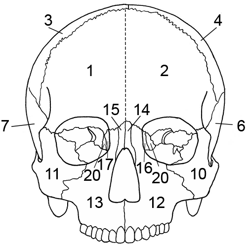

**Skull, anterior view.**

*Zones*

1\. Right frontal, split sagittally through the metopic suture  
2\. Left frontal, split sagittally through the metopic suture  
3\. Right parietal  
4\. Left parietal  
6\. Left temporal, including the root of the zygomatic process  
7\. Right temporal, including the root of the zygomatic process  
10\. Left zygomatic bone  
11\. Right zygomatic bone  
12\. Left maxilla  
13\. Right maxilla  
14\. Left nasal bone  
15\. Right nasal bone  
16\. Left lacrimal bone  
17\. Right lacrimal bone  
20\. Ethmoid  
22\. Left inferior nasal concha (not depicted)  
23\. Right inferior nasal concha (not depicted)  

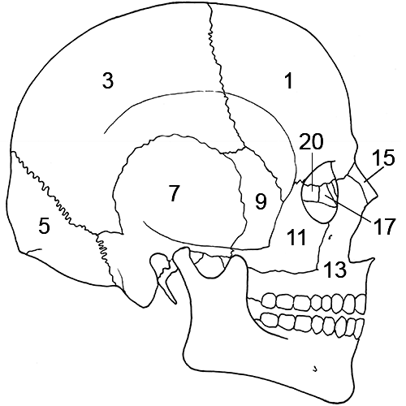

**Skull, lateral right view.**

*Zones*

1\. Right frontal, split sagittally through the metopic suture  
3\. Right parietal  
5\. Occipital  
7\. Right temporal, including the root of the zygomatic process  
9\. Right sphenoid  
11\. Right zygomatic bone  
13\. Right maxilla  
15\. Right nasal bone  
17\. Right lacrimal bone  
20\. Ethmoid  

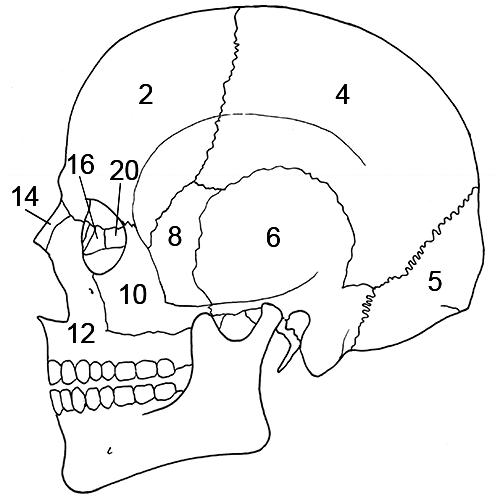

**Skull, lateral left view.**

*Zones*

2\. Left frontal, split sagittally through the metopic suture  
4\. Left parietal  
5\. Occipital  
6\. Left temporal, including the root of the zygomatic process  
8\. Left sphenoid  
10\. Left zygomatic bone  
12\. Left maxilla  
14\. Left nasal bone   
16\. Left lacrimal bone   
20\. Ethmoid   

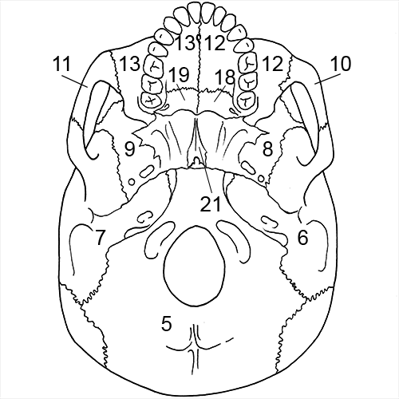

**Skull, inferior view.**

*Zones*

5\. Occipital  
6\. Left temporal, including the root of the zygomatic process  
7\. Right temporal, including the root of the zygomatic process  
8\. Left sphenoid  
9\. Right sphenoid  
10\. Left zygomatic bone  
11\. Right zygomatic bone  
12\. Palatal process of the left maxilla  
13\. Palatal process of the right maxilla  
18\. Left palatine bone  
19\. Right palatine bone  
21\. Vomer  

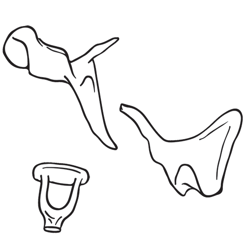

**Ear ossicles. Top to bottom: malleus, incus, and stapes.**

*Zones*

Ear ossicles

1\. Present or absent  

### Mandible

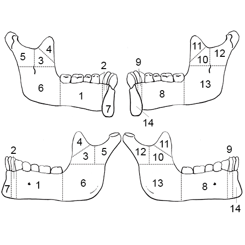

**Mandible. Top left: medial/internal view of left; 
Top right: medial/internal view of right; 
Bottom left: lateral/external view of left;
Bottom right: lateral/external view of right.**

*Zones*

1\. Portion of the left corpus, including alveoli for the premolars and molars as well as the premolars and molars themselves  
2\. Portion of the left corpus, including alveolus for the canine and the canine itself  
3\. Area of the left ascending ramus inferior to the coronoid process  
4\. Left coronoid process  
5\. Left mandibular condyle and the posterior portion of the ascending ramus  
6\. Left gonial angle, including the mandibular foramen and mylohyoid groove (internally) and the attachment of M. masseter (externally)  
7\. Anterior portion of the left corpus, including the alveoli of the incisors and the incisors themselves  
8\. Portion of the right corpus, including alveoli for the premolars and molars as well as the premolars and molars themselves  
9\. Portion of the right corpus, including alveolus for the canine and the canine itself  
10\. Area of the right ascending ramus inferior to the coronoid process  
11\. Right coronoid process  
12\. Right mandibular condyle and the posterior portion of the ascending ramus   
13\. Right gonial angle, including the mandibular foramen and mylohyoid groove (internally) and the attachment of M. masseter 
externally)  
14\. Anterior portion of the right corpus, including the alveoli of the incisors and the incisors themselves  

## POSTCRANIAL REMAINS

### Vertebrae and hyoid

#### Hyoid

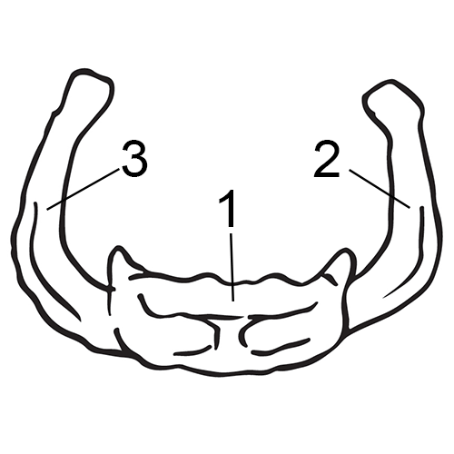

**Hyoid. Anterior view.**

*Zones*

1\. Hyoid body  
2\. Left greater horn  
3\. Right greater horn    

#### Cervical vertebrae

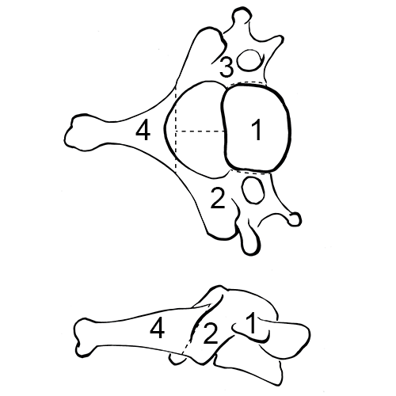

**Cervical vertebra. Above: superior view; below: lateral view.**

*Zones*

1\. Body  
2\. Right transverse process, including the pedicle, pars interarticularis, and articular facets  
3\. Left transverse process, including the pedicle, pars interarticularis, and articular facets  
4\. Spinous process  

#### Thoracic and lumbar vertebrae

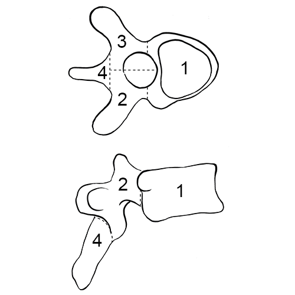

**Thoracic vertebra (also applies to lumbar vertebrae). Above: superior view, below: lateral view.**

*Zones*

1\. Body  
2\. Right transverse process, including the pedicle, pars interarticularis, and articular facets  
3\. Left transverse process, including the pedicle, pars interarticularis, and articular facets  
4\. Spinous process  

#### Sacrum

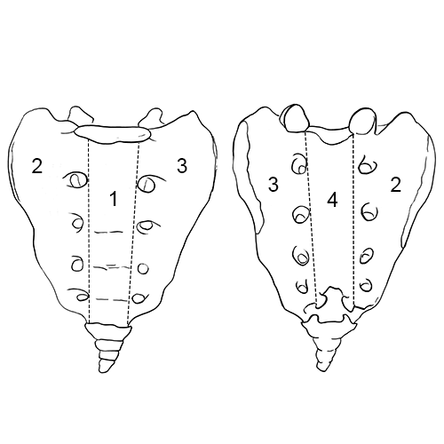

**Sacrum. Left: anterior view; right: posterior view.**

*Zones*

1\. Body  
2\. Right transverse process, including the pedicle, pars interarticularis, and articular facets  
3\. Left transverse process, including the pedicle, pars interarticularis, and articular facets  
4\. Spinous process  

### Thorax and Shoulder

#### Rib 1

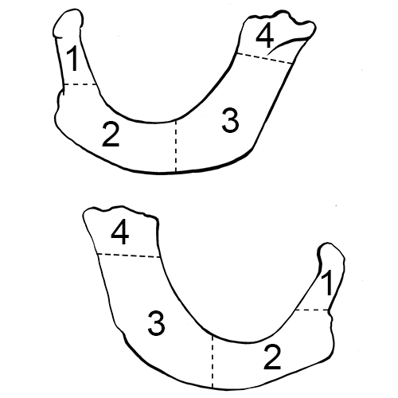

**Left rib 1. Above: inferior view; below: superior view.**

*Zones*

1\. Head  
2\. Rib angle including tubercle  
3\. Corpus  
4\. Sternal end    

#### Ribs 2-12

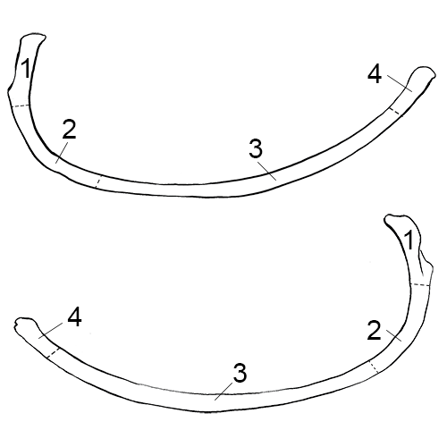

**Left rib 7. Above: inferior view; below: superior view.**

*Zones*

1\. Head and tubercle    
2\. Rib angle including the articular and non-articular costal facets in ribs 1 through 10  
3\. Corpus  
4\. Sternal end  

#### Sternum

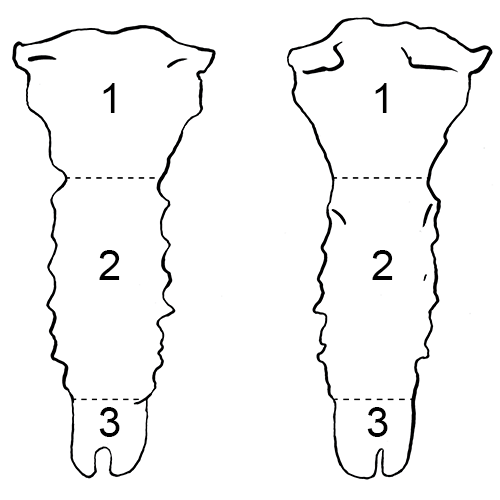

**Sternum. Left: anterior view; right: posterior view.**

*Zones*

1\. Manubrium  
2\. Corpus sterni  
3\. Xiphoid process  

#### Clavicle

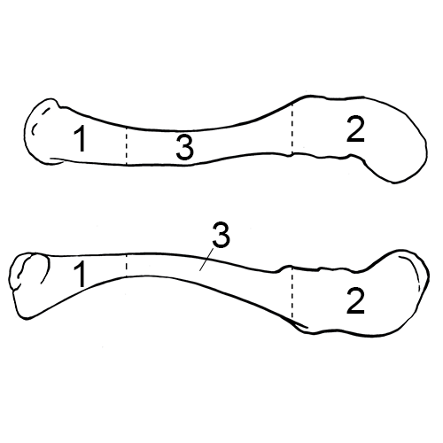

**Left clavicle. Above: superior view; below: inferior view.**

*Zones*

1\. Sternal end, including the area of the attachment for the costo-clavicular ligament  
2\. Acromial end, including the conoid tubercle and trapezoid line  
3\. Diaphysis, including the groove that marks the attachment for M. subclavius  

#### Scapula

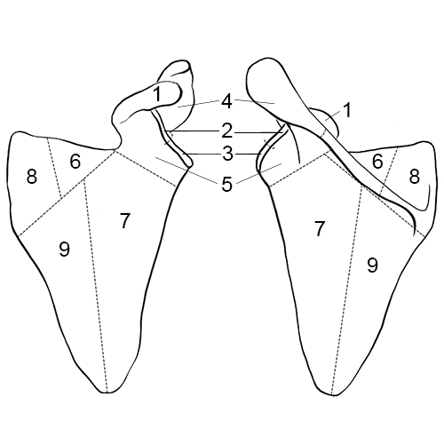

**Left scapula. Left: anterior view; right: posterior view.**

*Zones*

1\. Coracoid process  
2\. Superior half of the glenoid cavity  
3\. Inferior half of the glenoid cavity  
4\. Acromial end and axillary/lateral third of the spine  
5\. Axillary/lateral third of the squamous portion and spine, including the neck and the area inferior to the coracoid process  
6\. Middle third of the supraspinous fossa and middle third of the scapular spine  
7\. Axillary/lateral half of the squamous portion inferior to the spine, including the infraspinous fossa  
8\. Vertebral third of the squamous portion and spine, including the attachment for M. rhomboideus major and suprasprinous fossa  
9\. Vertebral half of the squamous portion inferior to the spine, including the infraspinous fossa  

### Upper limb

#### Humerus

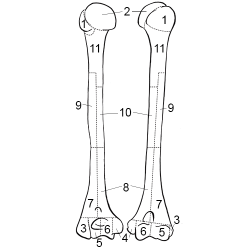

**Left humerus. Left: posterior view; right: anterior view.**

*Zones*

1\. Greater and lesser tubercles  
2\. Caput  
3\. Lateral epicondyle  
4\. Medial epicondyle  
5\. Lateral articular process (capitulum) of the condyle  
6\. Medial articular process (trochlea) of the condyle  
7\. Distal lateral half of the diaphysis, including one-half of the olecranon fossa and the radial fossa  
8\. Distal medial half of the diaphysis, including one-half of the olecranon fossa and the coronoid fossa, including the nutrient foramen  
9\. Area surrounding the deltoid tuberosity  
10\. Area opposite zone 9 making up one-half of the diaphysis longitudinally in the sagittal plane and cutting the bone transversely from medial to lateral  
11\. Proximal portion of the diaphysis, including the surgical neck  

#### Radius

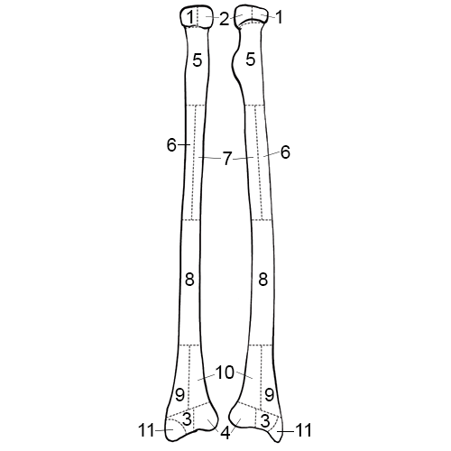

**Left radius. Left: posterior view; right: anterior view.**

*Zones*

1\. Lateral half of the radial head  
2\. Medial half of the radial head  
3\. Lateral portion of the distal articulation  
4\. Medial portion of the distal articulation  
5\. Proximal portion of the diaphysis, including the radial tuberosity  
6\. Lateral half of the diaphysis to the mid-point of the diaphysis, including the attachment for M. pronator teres  
7\. Medial half of diaphysis to the mid-point of the diaphysis, opposite zone 6, including the nutrient foramen, which is located antero-medially  
8\. Superior half of the distal third of the radius  
9\. Lateral distal third of the diaphysis  
10\. Medial distal third of the diaphysis  
11\. Styloid process of the distal end  

#### Ulna

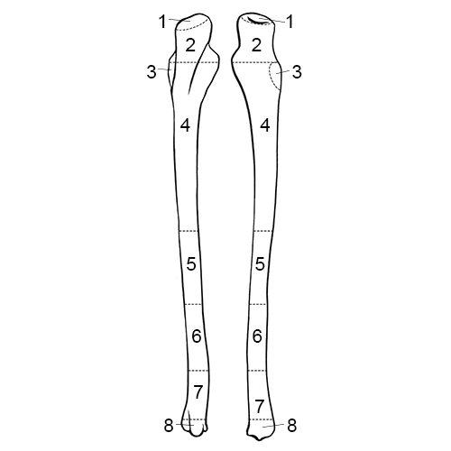

**Left ulna. Left: posterior view; right: anterior view.**

*Zones*

1\. Olecranon process  
2\. Area of the trochlear or semi-lunar notch, including the coronoid process  
3\. Radial notch  
4\. Proximal half of the diaphysis distal to zone 3, including the nutrient foramen, which is located antero-medially  
5\. Middle portion of the diaphysis  
6\. Superior one-half of the distal third of the diaphysis  
7\. Distal half of the distal third of the diaphysis, including the attachment of M. pronator quadratus  
8\. Styloid process and head, including the posterior groove for M. extensor carpi ulnaris  

### Pelvis and Lower Limb

#### Os coxa

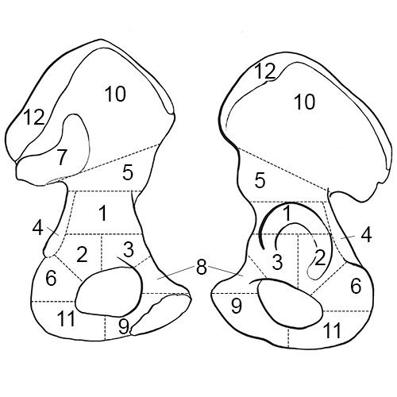

**Left os coxa. Left: medial/internal view; right: lateral/external view.**

*Zones*

1\. Superior portion of the acetabulum and adjoining areas anteriorly and posteriorly  
2\. Posterior half of the inferior portion of the acetabulum and adjoining areas  
3\. Anterior half of the inferior portion of the acetabulum and adjoining areas  
4\. Superior portion of the ischium, including the ischial spine  
5\. Inferior portion of the ilium, including the greater sciatic notch  
6\. Superior portion of the ischial tuberosity  
7\. Auricular surface of the ilium  
8\. Superior portion of the pubis possessing the pectineal line and pubic tubercle  
9\. Inferior portion of the pubis, including the pubic symphysis  
10\. Greater part of the ilium, marked in an antero-posterior diretion by a line running from just inferior to the anterior superior iliac spine to the posterior inferior iliac spine, but not including the iliac crest (superiorly)  
11\. Inferior portion of the ischial tuberosity  
12\. Iliac crest  

#### Femur

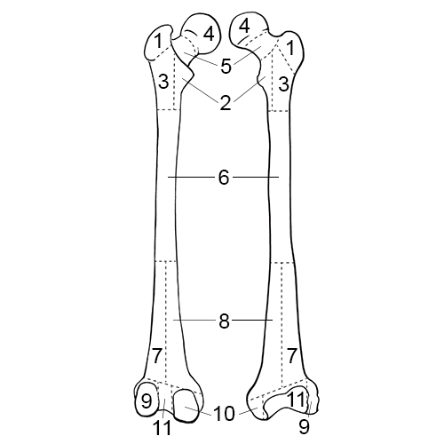

**Left femur. Left: posterior view; right: anterior view.**

*Zones*

1\. Greater trochanter  
2\. Area around the lesser trochanter and the lesser trochanter  
3\. Area of the cranial attachment of M. gluteus maximus  
4\. Caput  
5\. Neck of the element and area along the inter-trochanteric line (anteriorly) and intertrochanteric crest (posteriorly)  
6\. Middle portion of the diaphysis to the point where the linea aspera bifurcates into the supra-condylar lines, including the nutrient foramen, which is located posteriorly  
7\. Lateral half of the distal third of the diaphysis split longitudinally in the sagittal plane, including one-half of the popliteal space (posteriorly)  
8\. Medial half of the distal third of the diaphysis split longitudinally in the sagittal plane, including one-half of the popliteal space (posteriorly)  
9\. Lateral condyle and epicondyle  
10\. Medial condyle and epicondyle  
11\. Intercondylar space and distal articulation anteriorly  

#### Patella

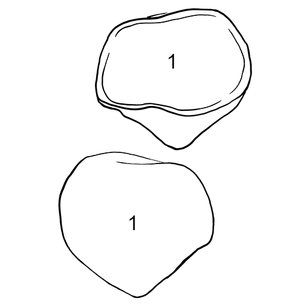

**Left patella. Above: posterior view; below: anterior view.**

#### Tibia

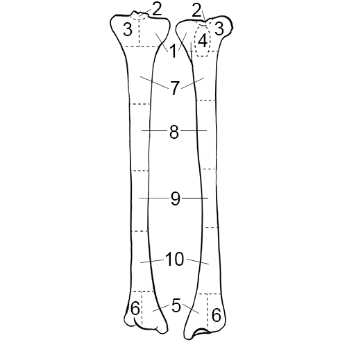

**Left tibia. Left: posterior view; right: anterior view.**

*Zones*

1\. Medial proximal condyle  
2\. Intercondylar fossa between the tibial spines, including the area of attachment of the posterior cruciate ligament  
3\. Lateral proximal condyle  
4\. Area of the tibial tuberosity  
5\. Area of the medial malleolus  
6\. Area of the lateral malleolus  
7\. Proximal quarter of the diaphysis, including the nutrient foramen, which is located posteriorly  
8\. Second quarter of the diaphysis  
9\. Third quarter of the diaphysis  
10\. Distal quarter of the diaphysis  

#### Fibula

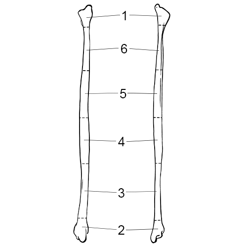

**Left fibula. Left: anterior view; right: posterior view.**

*Zones*

1\. Proximal end, essentially the juvenile epiphysis, including the styloid process  
2\. Distal end, essentially the juvenile epiphysis  
3\. Most distal quarter of the diaphysis, including the attachment for the inferior portion of the interosseous ligament (a triangular rugose region with its apex directed anteriorly)  
4\. Middle quarter of the diaphysis, including the nutrient foramen, which is located posteriorly  
5\. Second quarter of the diaphysis  
6\. Most proximal quarter of the diaphysis, distal to the juvenile epiphysis  

### Hands and Feet

#### Hand

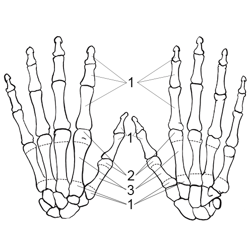

**Left hand and wrist. Left: dorsal view; right: palmar view.**

*Zones*

Carpals and phalanges

1\. Present or absent  

Metacarpals

1\. Proximal articulation  
2\. Distal articular condyle  
3\. Diaphysis  

#### Foot

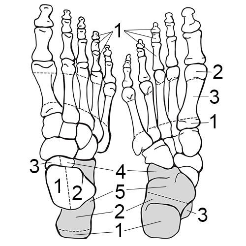

**Right foot and ankle. Left: dorsal view; right: plantar view.**

*Zones*

Calcaneus

1\. Tuber calcis  
2\. Distal portion of the body  
3\. Sustentaculum tali  
4\. Proximal articulation  
5\. Proximal portion of the body inferior to the articulations  

Talus

1\. Medial half of the trochlea  
2\. Lateral half of the trochlea  
3\. Medial half of the proximal portion, splitting the head sagittally  
4\. Lateral half of the proximal portion, splitting the head sagittally  

Remaining tarsals and phalanges

1\. Present or absent  

Metatarsals

1\. Proximal articulation  
2\. Distal artiuclar condyle  
3\. Diaphysis  
