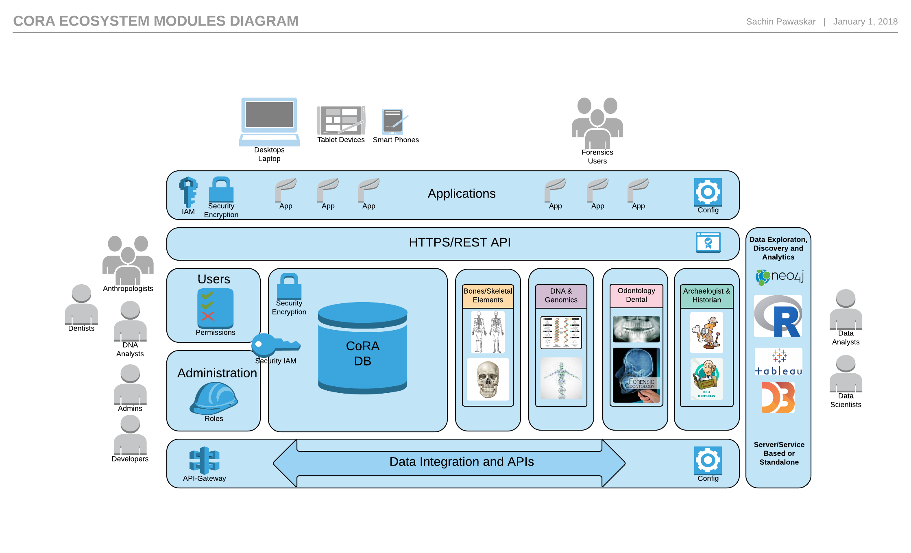

# What is CoRA?
Commingled human remains are often encountered in archaeological and forensic contexts. A bone by bone inventory is an important step in segregating commingled remains into individuals and determining the minimum number of individuals present. In order to achieve individual identification a controlled and consistent specimen-level inventory procedure must be followed. The **Commingled Remains Analytics (CoRA)** web application, database and APIs are a `community resource` for inventorying assemblages of commingled human remains, while `providing a framework of analytic methods, visualization techniques and tools` to assist in the segregation and identification process.

## CoRA Ecosystem
The CoRA Ecosystem is built on a flexible, extensible and modular architecture, allowing for new modules to be added. It provides for easy integration with the flexibility to add new applications based on the cora data and integration frameworks. Users will be able to easily access their data via the data integration API allowing for integrations with other external systems as well as use for advanced analytics modules based upon new research, tools and technologies.

## Security
The CoRA Ecosystem is built with security in mind. The CoRA application and information systems meets the minimum requirements as outlined in the [DoDI 8582.01]( https://fas.org/irp/doddir/dod/i8582_01.pdf) and [NIST SP 800-171](https://csrc.nist.gov/publications/detail/sp/800-171/rev-2/final). If you discover a security vulnerability within CoRA application, please create an issue on [GitHub](https://github.com/spawaskar-cora/cora-docs/issues) or please send an e-mail to Sachin Pawaskar at <sachinpawaskar@msn.com> or <spawaskar@unomaha.edu>. All security vulnerabilities will be promptly addressed.

In the near future, we plan to be in compliance with the Cybersecurity Maturity Model Certification (CMMC) which is a unifying standard for the implementation of cybersecurity across the Defense Industrial Base (DIB). The [CMMC framework](https://dodcio.defense.gov/CMMC/) includes a comprehensive and scalable certification element to verify the implementation of processes and practices associated with the achievement of a cybersecurity maturity level. The [CMMC 2.0 Model](https://dodcio.defense.gov/Portals/0/Documents/CMMC/ModelOverview_V2.0_FINAL2_20211202_508.pdf)  is designed to provide increased assurance to the Department that a DIB company can adequately protect sensitive unclassified information, accounting for information flow down to subcontractors in a multi-tier supply chain.

## Contribution Guidelines

If you are submitting documentation for the **current stable release**, submit it to the corresponding branch. For example, documentation for CoRA 1.0 would be submitted to the `1.0` branch, documentation for CoRA 2.0 would be submitted to the `2.0` branch and so on. Documentation intended for the next release of CoRA should be submitted to the `master` branch.
