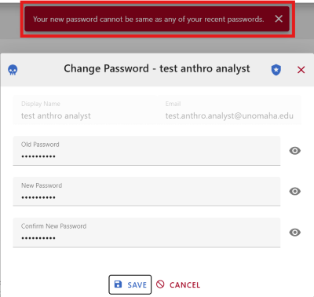

# User Authentication
This section shows how to sign in to CoRA and what to expect along the way - both when things go right and when something needs your attention. It also explains, in plain language, the security checks happening behind the scenes so users understand how access is protected.

## Why it Matters
Authentication is the first gate that protects sensitive data. CoRA follows least-privilege and defense-in-depth principles: only authorized, active users with valid credentials can sign in; risky patterns (like repeated failed attempts) are rejected; and passwords expire on a schedule to reduce exposure.

## How this Guide is Organized
How to Log In - the path from the Login button to the Home page.

What You Might See - clear explanations of error or status messages and what to do next.

Security Notes - brief, non-technical context for the checks happening during sign-in.

## How to Log In as a User

### Go to the Login Page.
Select the "LOGIN" button on the top right hand corner of the screen.

### Enter User Credentials.
Enter the credentials associated with your user.

### Check Boxes and Login
Agree to the Terms and Conditions and Data Privacy and Security Policy, then click Login.

### Successful Outcome
If the ID/password match an active account that isn’t deleted and the password hasn’t expired, the user will be signed in and redirected to the home page.

## Outcome and Causes of Unsuccessful Login Attempts

### Incorrect Credentials
If the user enters an invalid email addressor password, the following message "Attempt to read property "name" on null" will display.

### Account Inactive
If the user's account has been inactive or if deleted by an administrator, the user will receive no error but will not be redirected to the CoRA homepage.

### Password Expired
If the user's current password has expired, the user will be prompted to create a new one. Passwords will expire after 60 days, and 10 days before expiration, users will be prompted to reset their password in CoRA while logged in. 

After 60 days, the user will be able to login, but will be prompted to change their password and will be locked from any action until they do so.

The new password set by the user cannot be the same as any of the previous three passwords used by the user. If this is attempted, the password will not be accepted.

### Too Many Failed Attempts
If the user has entered invalid credentials five times, the user will be locked out for a brief period. After that period has ended, the user can attempt to login again.

