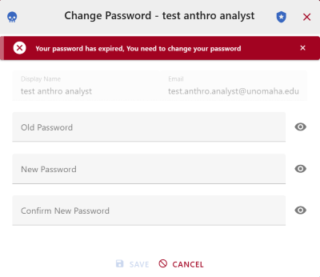

# User Authentication

This section shows you how to sign in to CoRA and what to expect along the way—whether everything works smoothly or you need to take an extra step. We'll also explain the security checks that protect your access in simple terms.

## Why Authentication Matters

Authentication is the front door that keeps sensitive data safe. CoRA follows security best practices: only authorized users with the right credentials can sign in, suspicious activity (like repeated wrong passwords) is blocked, and passwords regularly expire to keep accounts secure.

## How This Guide is Organized

**How to Log In** — the steps from clicking Login to reaching the Home page

**What You Might See** — explanations of any messages that appear and what to do about them

**Security Notes** — simple explanations of the security checks happening when you sign in

---

## How to Log In

### Step 1: Go to the Login Page
Click the **LOGIN** button in the top right corner of your screen.

### Step 2: Enter Your Credentials
Type in your email address and password.

### Step 3: Accept the Terms and Log In
Check the boxes to agree to the Terms and Conditions and Data Privacy and Security Policy. Then click **Login**.

### Step 4: Access CoRA
If your email and password are correct and your account is active, you'll be signed in and taken to the home page.

---

## First-Time Login

If this is your first time logging in, you'll need to create your own password.

### Step 1: Go to the Login Page
Click the **LOGIN** button in the top right corner.

### Step 2: Enter Your Temporary Credentials
Your administrator will provide you with a temporary email address and password. Enter those credentials.

### Step 3: Accept the Terms and Log In
Check the boxes to agree to the Terms and Conditions and Data Privacy and Security Policy. Then click **Login**.

### Step 4: Create Your New Password
You'll be prompted to change your password immediately. Enter your temporary password, then type your new password twice to confirm it.

### Step 5: Log In with Your New Password
Enter your email address and the new password you just created.

### Step 6: Access CoRA
You'll now be signed in and taken to the home page.

---

## Common Login Issues and What They Mean

### Wrong Email or Password
If you enter an incorrect email address or password, you'll see this message: **"Invalid credentials. Please try again."**

**What to do:** Double-check your email and password, then try again.

---

### Inactive Account
If your account has been inactive for more than 60 days or was disabled by an administrator, you'll see: **"Your user account has been inactive beyond 60 days. Please contact your System Administrator."**

**What to do:** Contact your system administrator to reactivate your account.

---

### Password About to Expire
Passwords expire every 60 days for security. Starting 10 days before expiration, you'll see a reminder to reset your password when you log in.

**What to do:** Follow the prompts to create a new password before the 60 days are up.

---

### Password Has Expired
If your password has expired (after 60 days), you'll still be able to log in, but you'll be required to change it before you can do anything else in CoRA.

**Important:** Your new password cannot be the same as any of your last three passwords.

**What to do:** Create a new, unique password.

---

### Too Many Failed Login Attempts
If you enter the wrong credentials five times in a row, your account will be temporarily locked for security reasons.

**What to do:** Wait a few minutes, then try logging in again. If you've forgotten your password, contact your administrator.