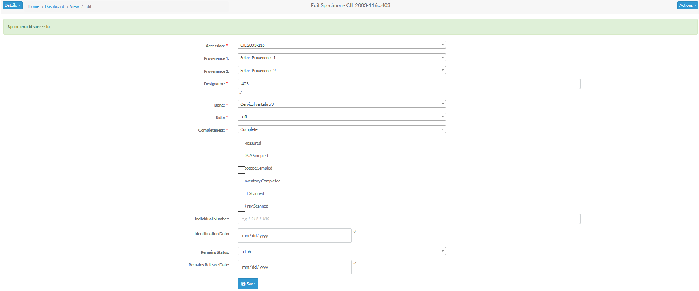

# Create Specimens

Specimens are individual human remains which can be categorized.
Many of the modules on the site are focused on specimens and their details.
This section will explore:

**Finish This**
- Creating a New Specimen
- Creating a Specimen Group

##### Specimen Navigation

On the left side bar - you can access the main options for specimens. For Report Dashboard - please see the **Reports** documentation.

##### Creating a New Specimen

To create a new specimen - click the "New" link on the Specimens left navigation bar. You will be taken to the new specimen screen.

The fields to create a new specimen are:

- **Accession**
- Provenance Number 1
- Provenance Number 2
- **Designator**
- **Bone**
- **Side**
- **Completeness**

The bolded fields are required. Below are some fields with some validation rule
 
 Element  | Validation Rule  | Required/Optional
 ------------- | -------------| -------------
 Accession  |  Can only contain letters, numbers, dash and space | Required
 Provenance 1 | Can only contain letters, numbers, dash and space  | Optional
 Provenance 2  |  Can only contain letters, numbers, dash and space | Optional
 Designator | Can only contain letters and numbers | Required
  
 Once you have filled out all the fields, click the save button, and you will be taken to the Specimen View page.

##### Specimens View

This page is view only, here all fields related to the specimens are displayed. To further edit the new specimen, click the "Actions" button, and select edit. The screen will refresh will all fields being editable. The fields available for edit are:

- **Accession**
- Provenance Number 1
- Provenance Number 2
- **Designator**
- **Bone**
- **Side**
- **Completeness**
- Status of the bone, including:
  - Measured 
  - DNA Sampled 
  - Isotope Scanned
  - Inventory Completed 
  - CT Scanned
  - X-ray Scanned 
  - 3D Scanned
- Individual Number
- Identification Date
- Remains Status
- Remains Release Date

The bolded fields are required. Some of the fields along with their validation rules are as follows:

 Element  | Validation Rule  | Required/Optional
 ------------- | -------------| -------------
 Accession  |  Can only contain letters, numbers, dash and space | Required
 Provenance 1 | Can only contain letters, numbers, dash and space  | Optional
 Provenance 2  |  Can only contain letters, numbers, dash and space | Optional
 Designator | Can only contain letters and numbers | Required
 Individual Number | Can only contain letters, numbers, dash and space | Optional

Click "Save" When you are done making changes. 

To add another new specimen, clicks "Actions" followed by "Create".

##### New Bone Group

To add a new bone group - click "New Bone Group" on the left navbar. You will be taken to the "New Bone Group Page". 
Here you can create a superclass which can contain multiple specimens.

The fields to create a new bone group are:

- **Grouping**
- **Bones**
- **Accession**
- Provenance Number 1
- Provenance Number 2
- **Starting Designator**
- **Side**
- **Completeness**
- Trauma
- Pathology
- Taphonomy

The bolded fields are required.

Once you have created a new bone group, you can edit the fields and click "Save" to update the bone group.

