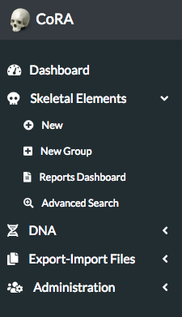
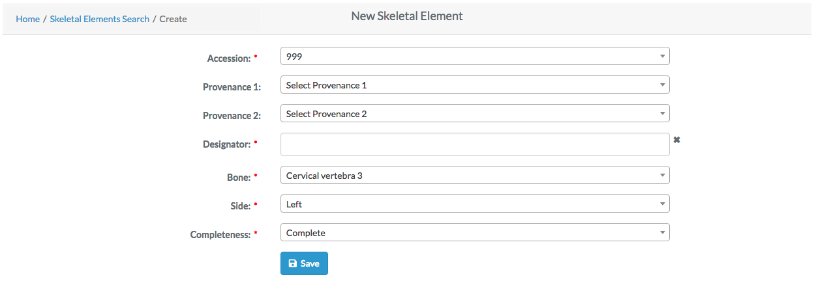
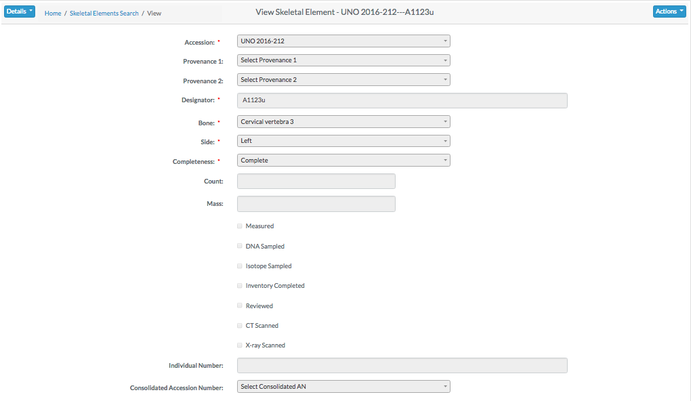
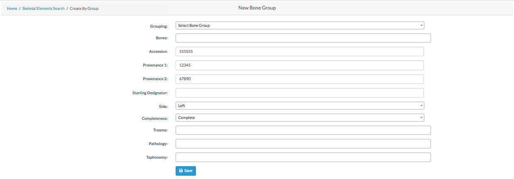

# Create Skeletal Elements

Skeletal elements are individual human remains which can be categorized.
Many of the modules on the site are focused on skeletal elements and their details.
This section will explore:

**Finish This**
- Creating a New Skeletal Element
- Creating a New Skeletal Element Group

##### Skeletal Element Navigation

On the left side bar - you can access the main options for skeletal elements. For Report Dashboard - please see the **Reports** documentation.

##### Creating a New Skeletal Element

To create a new skeletal element - click the "New" link on the Skeletal Elements left navigation bar. You will be taken to the new skeletal elements screen.

The fields to create a new skeletal element are:

- **Accession**
- Provenance Number 1
- Provenance Number 2
- **Designator**
- **Bone**
- **Side**
- **Completeness**

The bolded fields are required. The designator fields can only contain letters and numbers. Once you have filled out all the fields, click the save button, and you will be taken to the Skeletal Elements View page.

##### Skeletal Elements View

This page is view only, here all fields related to the skeletal elements are displayed. To further edit the new skeletal elements, click the "Actions" button, and select edit. The screen will refresh will all fields being editable. The fields available for edit are:

- Accession
- Provenance Number 1
- Provenance Number 2
- Designator
- Bone
- Side
- Completeness
- Count
- Mass
- Status of the bone, including:
  - Measured Status
  - DNA Sampled Status
  - CT Scanned Status
  - Xray Scanned Status
  - Clavicle Triage Status
  - Inventory Completed Status
  - Reviewed Status
- Individual Number
- Consolidated Accession Number

Click "Save" When you are done making changes. 

To add another new skeletal element, clicks "Actions" followed by "Create".

##### New Bone Group

To add a new bone group - click "New Group" on the left navbar. You will be taken to the "New Bone Group Page". 
Here you can create a superclass which can contain multiple skeletal elements.

The fields to create a new bone group are:

- **Grouping**
- **Bones**
- **Accession**
- Provenance Number 1
- Provenance Number 2
- **Starting Designator**
- Side
- Completeness
- Trauma
- Pathology
- Taphonomy

The bolded fields are required.

Once you have created a new bone group, you can edit the fields and click "Save" to update the bone group.

