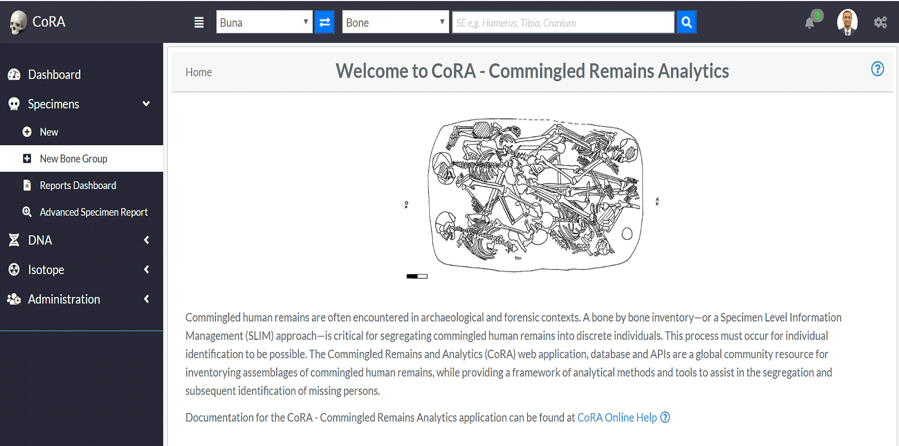

# Create Specimens

Specimens are individual human remains which can be categorized.
Many of the modules on the site are focused on specimens and their details.
This section will explore:

**Finish This**
- Creating a New Specimen
- Creating a Specimen Group

##### Specimen Navigation

On the left side bar - you can access the main options for specimens. For Report Dashboard - please see the **Reports** documentation.

##### Creating a New Specimen

To create a new specimen - click the "New" link on the Specimens left navigation bar. You will be taken to the new specimen screen.

The fields to create a new specimen are:

- **Accession**
- Provenance Number 1
- Provenance Number 2
- **Designator**
- **Bone**
- **Side**
- **Completeness**

The bolded fields are required. Below are some fields with some validation rule
 
 Attributes  |Data Type |Size | Validation Rule  | Required/Optional
 ------------- | ------------- | -------------|-------------| -------------
 Accession  |  String |32 chars | Can only contain letters, numbers, dash and space and should have min 3 chars | Required
 Provenance 1 |  String |32 chars |Can only contain letters, numbers, dash and space  | Optional
 Provenance 2  |  String |32 chars | Can only contain letters, numbers, dash and space | Optional
 Designator |  Alphanumeric |32 chars |Can only contain letters and numbers | Required
  
 Once you have filled out all the fields, click the save button, and you will be taken to the Specimen View page.

##### Specimens View

This page is view only, here all fields related to the specimens are displayed. To further edit the new specimen, click the "Actions" button, and select edit. The screen will refresh will all fields being editable. The fields available for edit are:

- **Accession**
- Provenance 1
- Provenance 2
- **Designator**
- **Bone**
- **Side**
- **Completeness**
- Status of the bone, including:
  - Measured 
  - DNA Sampled 
  - Isotope Sampled
  - Inventory Completed 
  - Reviewed
  - CT Scanned
  - X-ray Scanned 
  - 3D Scanned
- Individual Number
- Identification Date
- Remains Status
- Remains Release Date

The bolded fields are required. Some of the fields along with their validation rules are as follows:

 Attributes  | Data Type |Size |Validation Rule  | Required/Optional
 ------------- |------------- | -------------| -------------| -------------
 Accession  |  String |32 chars | Can only contain letters, numbers, dash and space | Required
 Provenance 1 |  String |32 chars |Can only contain letters, numbers, dash and space  | Optional
 Provenance 2  |  String |32 chars | Can only contain letters, numbers, dash and space | Optional
 Designator | Alphanumeric |32 chars | Can only contain  letters and numbers | Required
 Individual Number | String |32 chars | Can only contain letters, numbers, dash and space | Optional
 Side  |  NA| NA|Either Left, Right, Middle or Unsided| Required
 Completeness |  NA| NA|Either Complete or Incomplete | Required
 Measured  |  Boolean |NA|True or False | Optional
 DNA Sampled| Boolean |NA|True or False | Optional
 Isotope Sampled | Boolean |NA|True or False | Optional
 Inventory Completed |  Boolean |NA|True or False | Optional
 Reviewed|Boolean |NA|True or False |Optional
 CT Scanned | Boolean |NA|True or False | Optional
 X-ray Scanned| Boolean |NA|True or False | Optional
 3D Scanned | Boolean |NA|True or False | Optional
 Remain Status | NA|NA|Either In Lab or Released | Optional
Click "Save" When you are done making changes. 

To add another new specimen, clicks "Actions" followed by "Create".

##### New Bone Group

To add a new bone group - click "New Bone Group" on the left navbar. You will be taken to the "New Bone Group Page". 
Here you can create a superclass which can contain multiple specimens.

The fields to create a new bone group are:

- **Grouping**
- **Bones**
- **Accession**
- Provenance Number 1
- Provenance Number 2
- **Starting Designator**
- **Side**
- **Completeness**
- Trauma
- Pathology
- Taphonomy

The bolded fields are required. Below are some fields with some validation rule
 
  Attributes  | Data Type |Size |Validation Rule  | Required/Optional
  ------------- | ------------- | -------------|-------------| -------------
  Bone Group  |  String |64 chars|Can only contain letters | Required
  Bone Group Id |String |64 chars| UUID  | Required
                             
                                 

Once you have created a new bone group, you can edit the fields and click "Save" to update the bone group.

