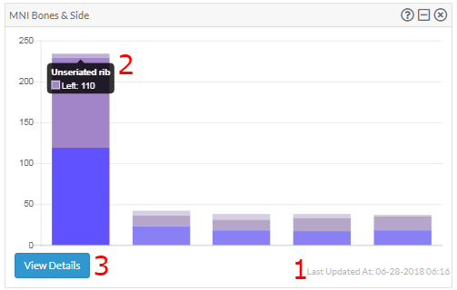
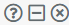
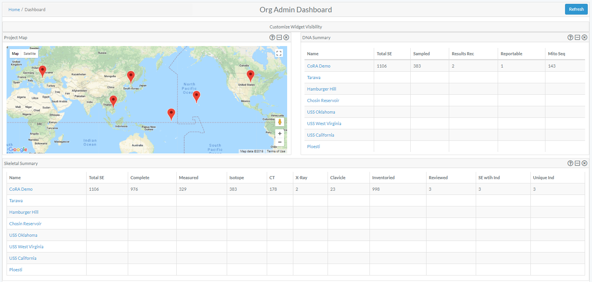
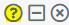

# Types Of Dashboards

There are three different dashboards available in CoRA with each view being driven by the user's profile attributes.
1.  The Org Admin Dashboard
2.  The Project Manager Dashboard
3.  The User Dashboard

##Dashboard Widgets

 Dashboards are made of many different *widgets*.  These *widgets* provide visualization for the data they represent.  *Widgets* can display such things as Pie Charts, Line Charts, Bar Charts, Maps, ect...

 ####Attributes of a Widget
 
  
  
 Widgets come with a handful of standard features/functions.  
 1.  Last Updated Timestamp
 2.  Mouse Over Detail
 3.  View Details (Drill Into The Data)
 4.  Widget Controls   
 

#Org Admin Dashboard
##Project Map

### Markers
The markers displayed on the map showcase the latitude and longitude of a particular project. 
On mouse over additional project details as well as a link 
 to the corresponding project dashboard can be found in the in popup window.

##DNA Summary
A data table provides a link to a project dashboard and shows high level DNA summary details for each project

##Skeletal Elements
A data table provides a link to a project dashboard and shows high level Skeletal Elements summary details for each project

#Project Manager Dashboard
The Project Manager Dashboard serves as a high level view of both summary and aggregated project data. 
The dashboard is comprised of *widgets*, which are individual visual representations of data.  Examples of those widgets include:
  
  * Skeletal Elements Assocciated To Individual
  * DNA Sample Information
  * Mitosequence Information
  * Inventory Process
  
Those *widgets* can be added and removed via the *widget selector*.  For more information regarding the data being represented in a *widget*, click the help icon  
 in the top right of the widget.

 
 
