# DNA Dashboard

The DNA Dashboard provides a centralized view of DNA testing progress and results across the organization.
It summarizes key performance indicators (KPIs) from mitochondrial (Mito), autosomal (AuSTR), and Y-STR analyses, allowing administrators and analysts to monitor laboratory efficiency, report generation, and sequencing outcomes.

## Navigation

From the main sidebar, click on DNA Dashboard under the DNA section.
The interface will display a set of visual KPI widgets and line chart representing summarized data for all DNA records.

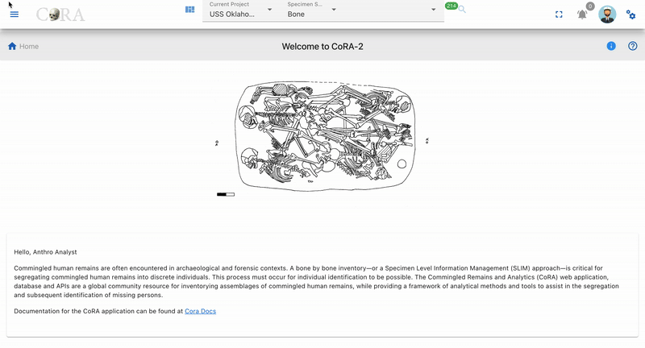{width="700"}

This dashboard integrates live data from the DNA module - including fields such as sample methods, received dates, sequencing counts, and report statuses.

## Widget Features

Each widget in the DNA Dashboard comes with standard features similar to other dashboards:

1. Last Updated Timestamp - Shows when the DNA data was last updated

{width="400"}

2. Mouse Over Detail - Hover over charts for detailed DNA statistics

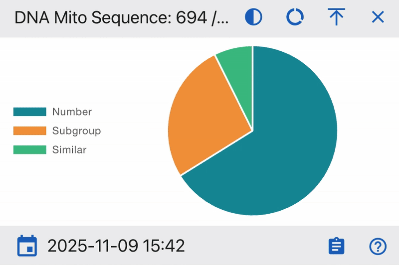{width="400"}

3. View Details (Drill Into The Data) - Click for detailed DNA sample information

{width="700"}

4. Widget Controls:

   * Collapse - Minimize the widget to save space while keeping it accessible

   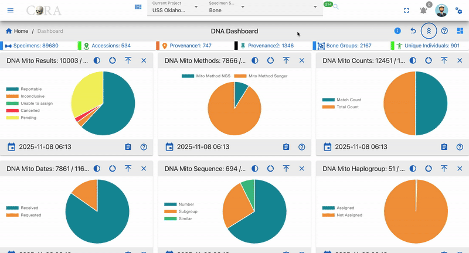{width="700"}
   &nbsp;

   * Close - Remove the widget from the dashboard view

   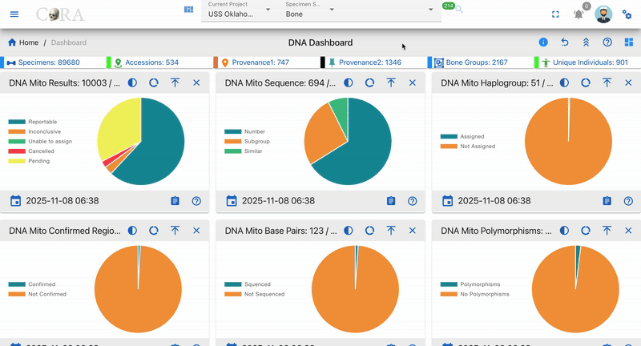{width="700"}
   &nbsp;

   * Help-Cora Docs - Access detailed documentation and usage guides

   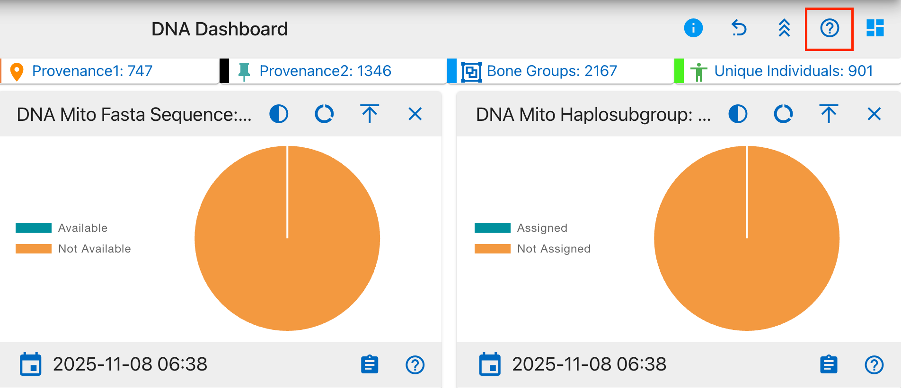{width="400"}
   
   
### Pie Chart Visualization
Most DNA metrics are displayed as pie charts showing:
* Clear color coding for different categories
* Percentage distribution
* Interactive tooltips on hover
* Detailed legends

### Chart Visualization Types
The DNA Dashboard offers three different chart styles to effectively visualize data distributions:

#### 1 Full Pie Chart
The traditional 360-degree circular chart that shows the complete proportion of all components. Best used for:
* Displaying part-to-whole relationships
* Comparing multiple categories
* Showing percentage distributions
* Visualizing complete data sets with clear segment differences

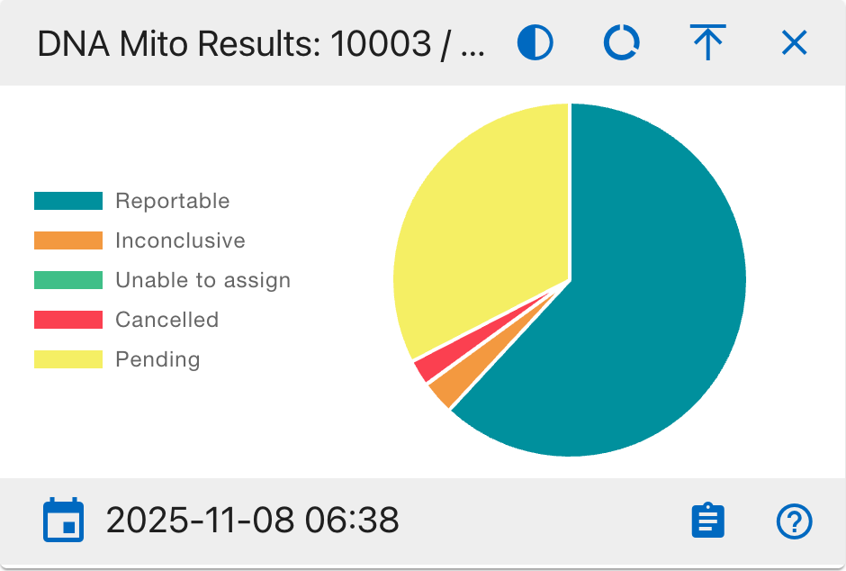{ width="400" }

#### 2 Half Pie Chart
A 180-degree semicircular visualization that offers a more compact view. Ideal for:
* Space-efficient data presentation
* Binary comparisons (e.g., Completed vs. Pending)
* Dashboard layouts where vertical space is limited
* Emphasizing simple proportional relationships

{ width="400" }

#### 3 Donut Chart
A circular chart with a hollow center that emphasizes individual segments. Particularly effective for:
* Focusing on individual segment values
* Displaying additional information in the center
* Multi-layer data presentation
* Emphasizing the relationship between parts while maintaining visual distinction

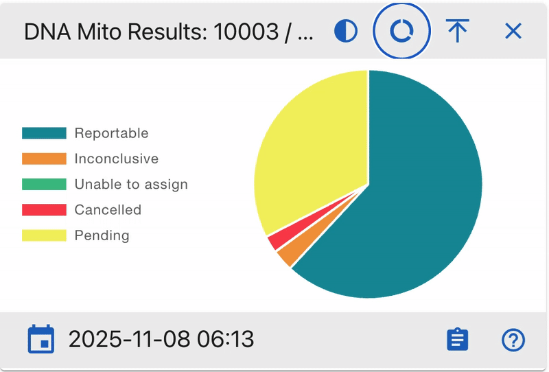{ width="400" }

Each chart type maintains interactive features such as hover tooltips, click-through capabilities, and real-time updates.

## General Notes

- Each chart segment is clickable and supports drilldown exploration.  
- Hovering over segments shows precise counts and percentages.  
- Widgets update automatically when DNA data changes or processing is completed.  
- Timestamps indicate the last data refresh.
- All widgets maintain consistent color coding across the dashboard.
- Data can be exported in multiple formats (CSV, PDF, Print).
- Filters allow focusing on specific date ranges or sample types.

## KPI Widgets

KPIs in the DNA Dashboard are interactive visual elements that provide real-time insights into critical DNA testing metrics. 

The widgets are categorized into three main DNA testing areas:

1. Mitochondrial DNA (Mito) - Maternal lineage analysis
2. Autosomal DNA (AuSTR) - Genetic inheritance patterns
3. Y-chromosome DNA (Y-STR) - Paternal lineage tracking

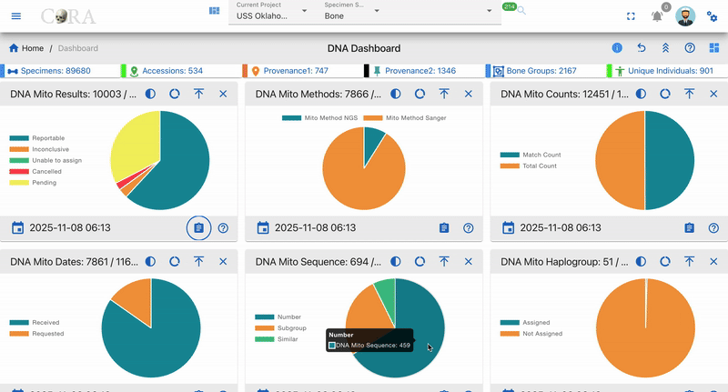{width="700"}

Below is a comprehensive description of each widget available in the DNA Dashboard, including their purpose, data interpretation guidelines, and practical applications in DNA analysis workflows.

### DNA Mito Results
A comprehensive pie chart showing the distribution of mitochondrial DNA testing results

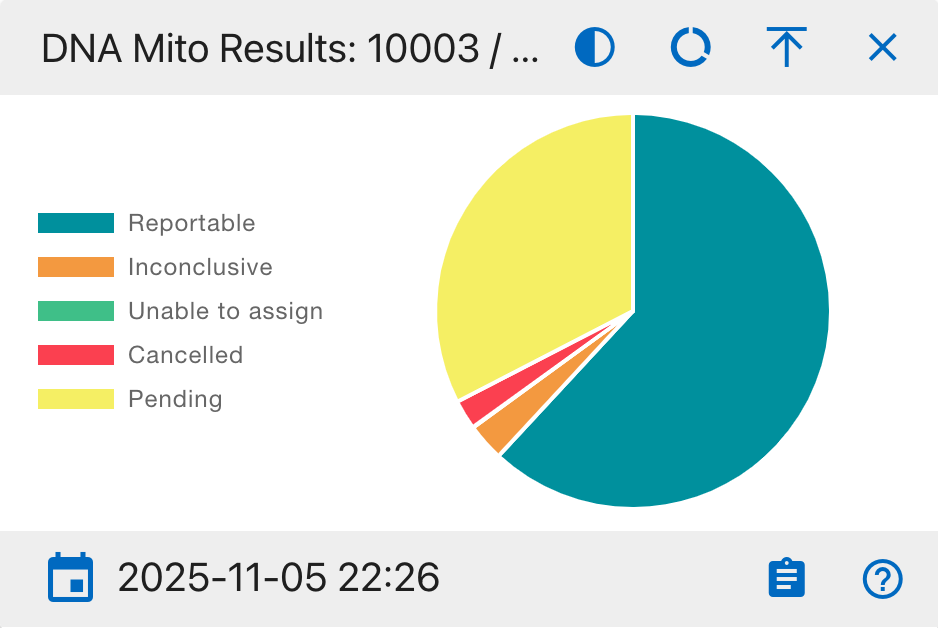{width="400"}

Pie Chart Segments:
* Reportable
* Inconclusive
* Unable to assign
* Cancelled
* Pending

This widget helps analysts track testing progress and identify potential bottlenecks in the DNA analysis workflow.

### DNA Mito Methods 
A comprehensive view of DNA sequencing methods used in the laboratory

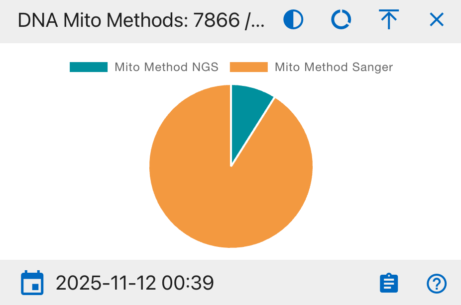{width="400"}

Pie Chart Segments:
* Mito Method NGS
* Mito Method Sanger

This widget helps track the adoption of different sequencing technologies and monitor resource allocation across methods.

### DNA Mito Counts 
A statistical overview of DNA sample matching status

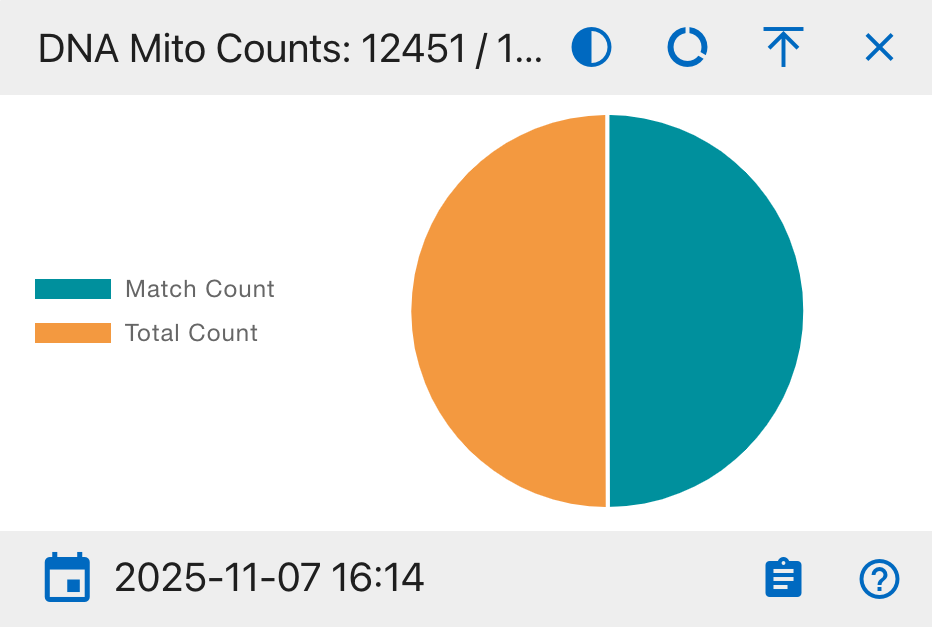{width="400"}

Pie Chart Segments:
* Match Count
* Total Count

This widget provides insights into the success rate of DNA matching processes and helps evaluate overall testing efficiency.

### DNA Mito Dates 
A timeline analysis of DNA sample processing status

{width="400"}

Pie Chart Segments:
* Received
* Requested

This widget helps monitor laboratory workflow efficiency and identify potential processing backlogs.

### DNA Mito Sequence 
A detailed breakdown of DNA sequence categorization

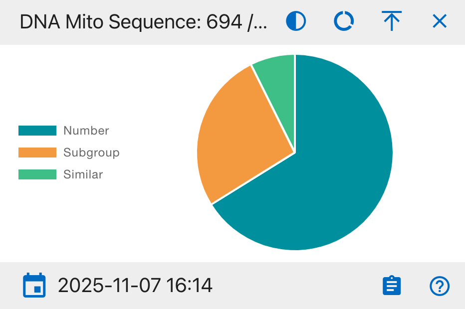{width="400"}

Pie Chart Segments:
* Number 
* Subgroup
* Similar 

This widget facilitates the identification of sequence patterns and potential familial connections in the database.

### DNA Mito Haplogroup 
A tracking system for ancestral lineage classification

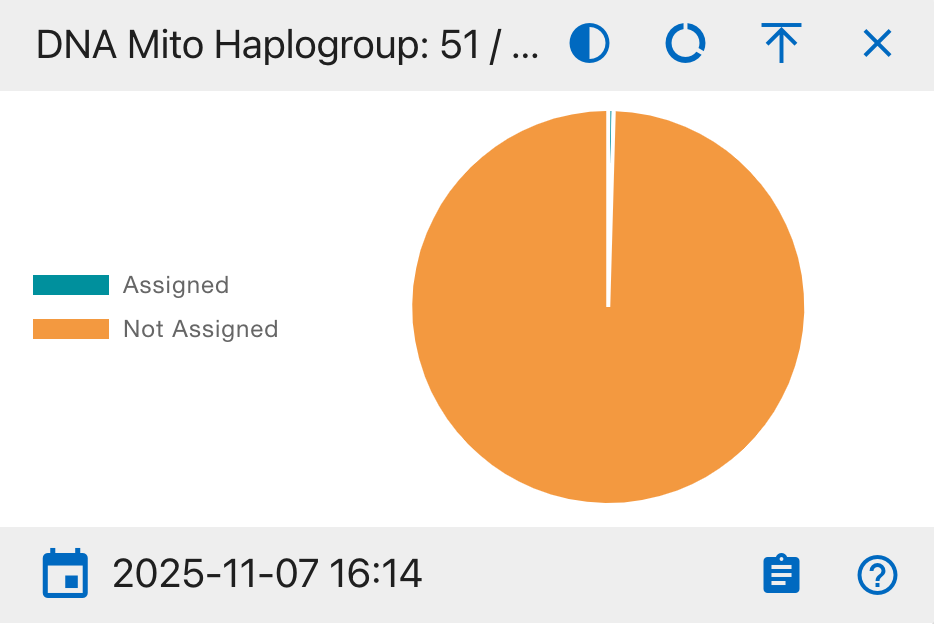{width="400"}

Pie Chart Segments:
* Assigned 
* Not Assigned 

This widget monitors the progress of maternal lineage classification and geographical origin determination.

### DNA Mito Confirmed Regions
A quality assurance overview of DNA region verification

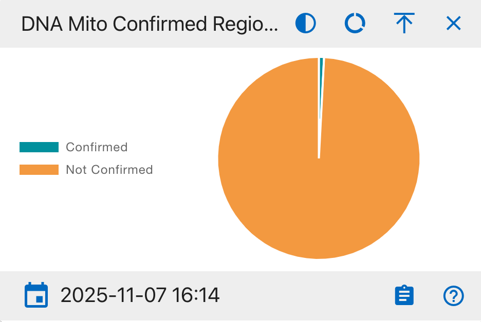{width="400"}

Pie Chart Segments:
* Confirmed
* Not Confirmed

This widget is essential for quality control processes and helps ensure the accuracy of DNA analysis results. It tracks the verification status of analyzed DNA regions.

### DNA Mito Base Pairs 
A detailed view of base pair sequencing completion

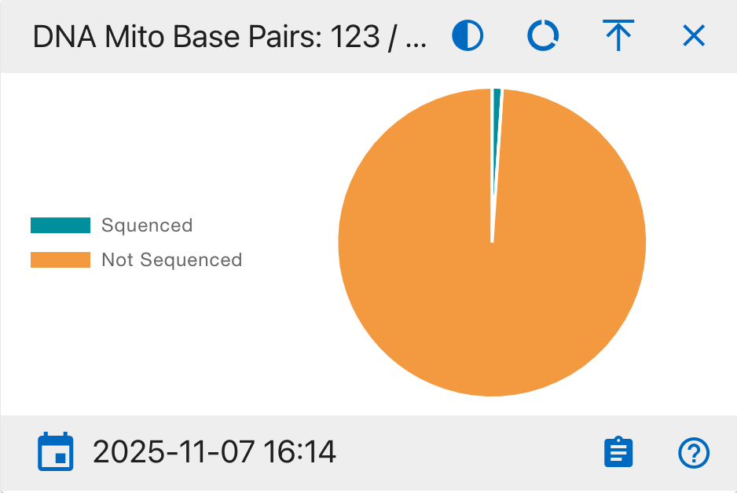{width="400"}

Pie Chart Segments:
* Sequenced
* Not Sequenced

This widget monitors the granular progress of DNA sequencing at the base pair level, crucial for ensuring complete genetic analysis coverage.

### DNA Mito Polymorphisms
An analysis of genetic variation patterns in mitochondrial DNA

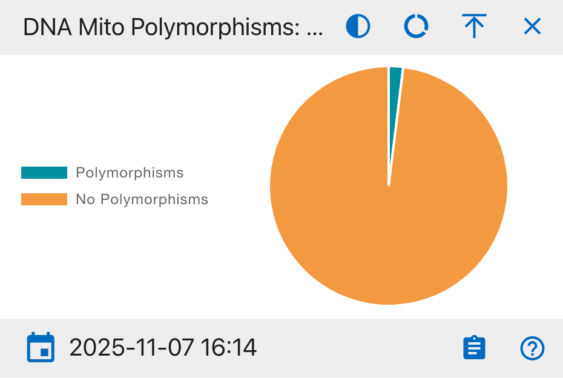{width="400"}

Pie Chart Segments:
* Polymorphisms
* No Polymorphisms

This widget helps identify genetic diversity by tracking the presence of DNA sequence variations, essential for population genetics studies and individual identification.

### DNA Mito Fasta Sequence
A tracker for standardized DNA sequence file availability

{width="400"}

Pie Chart Segments:
* Available
* Not Available

This widget monitors the availability of DNA sequences in the standardized FASTA format, which is essential for bioinformatics analysis and data sharing between systems.

### DNA Mito Haplosubgroup
A detailed breakdown of mitochondrial DNA subgroup classifications

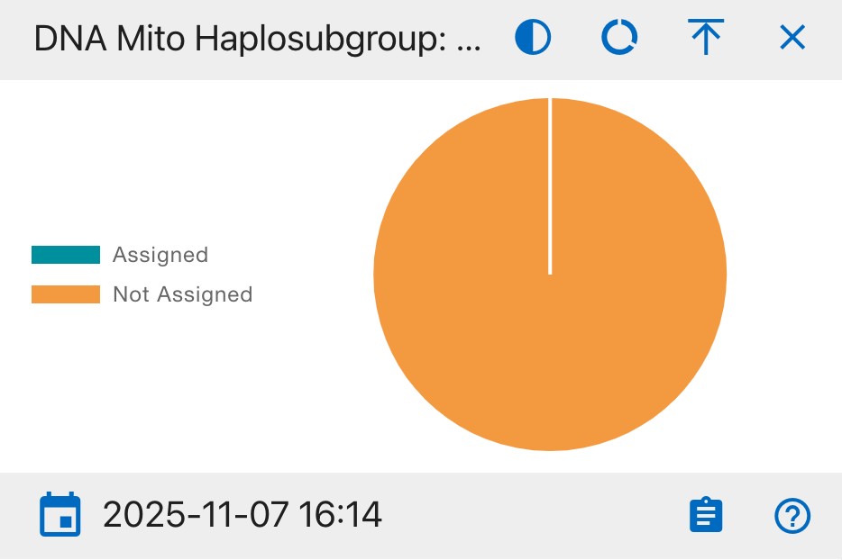{width="400"}

Pie Chart Segments:
* Assigned
* Not Assigned

This widget tracks the detailed classification of maternal lineages into specific subgroups, providing finer granularity for population genetics and ancestry studies.

### DNA Mito Loci 
A status overview of genetic marker analysis progress

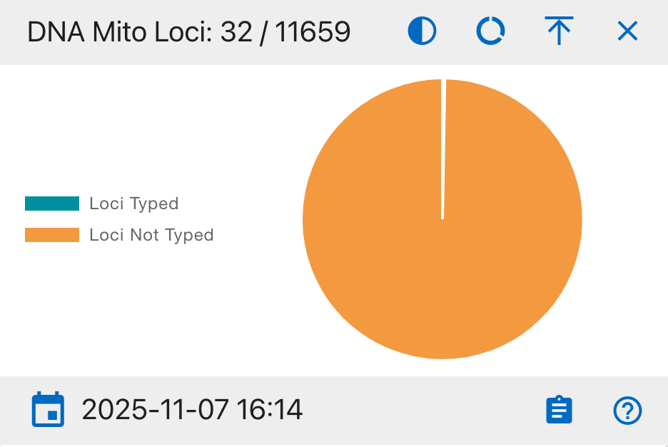{width="400"}

Pie Chart Segments:
* Loci Typed
* Loci Not Typed

This widget monitors the progress of genetic marker typing, essential for comprehensive DNA profiling and accurate genetic comparisons.

### DNA Mito MCC Dates 
A tracking system for Multi-Copy Control review status

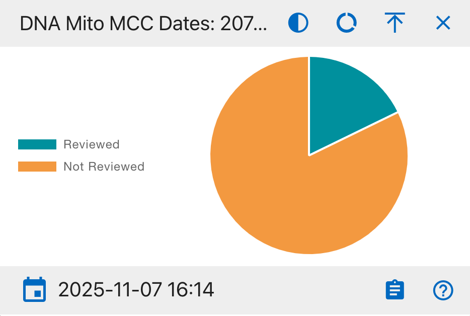{width="400"}

Pie Chart Segments:
* Reviewed
* Not Reviewed 

This widget monitors the progress of Multi-Copy Control (MCC) reviews, which are critical for quality assurance and validation of DNA analysis results.

### DNA Sample Condition 
A comprehensive tracker for physical DNA sample status

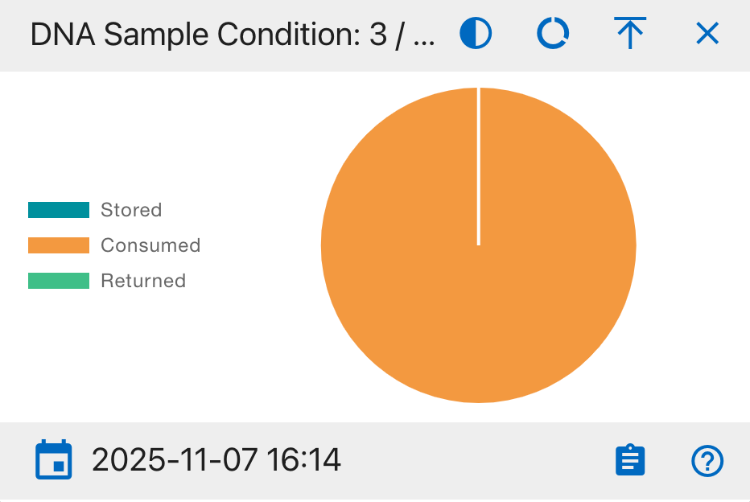{width="400"}

Pie Chart Segments:
* Stored
* Consumed
* Returned 

This widget provides crucial inventory management information, tracking the physical status and location of all DNA samples throughout their lifecycle.

### DNA Resampled 
A tracking system for DNA sample retesting status

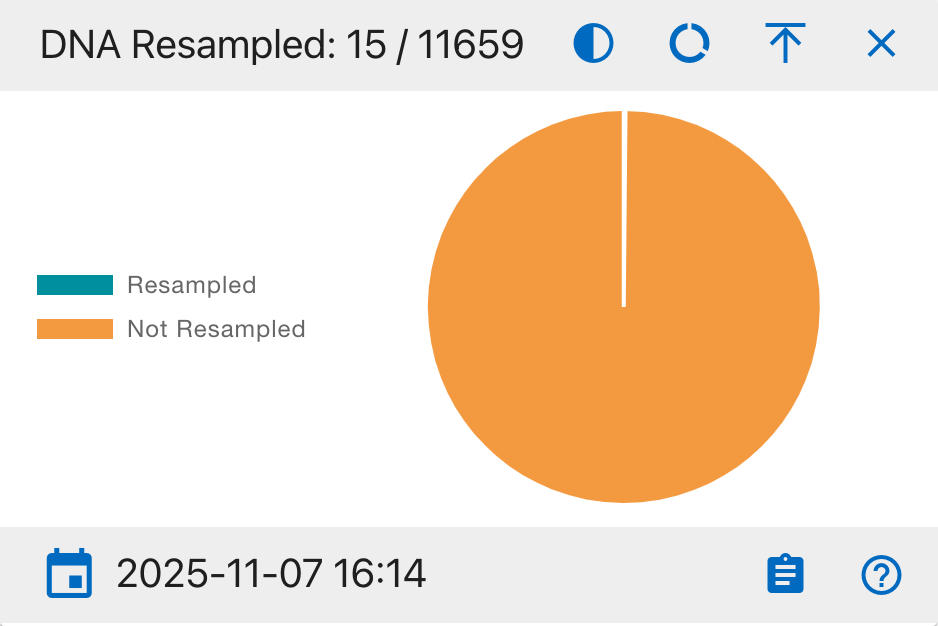{width="400"}

Pie Chart Segments:
* Resampled 
* Not Resampled 

This widget monitors the frequency of DNA resampling, helping identify quality control patterns and potential testing issues.

### DNA BTB Dates 
A timeline comparison of DNA testing requests and results

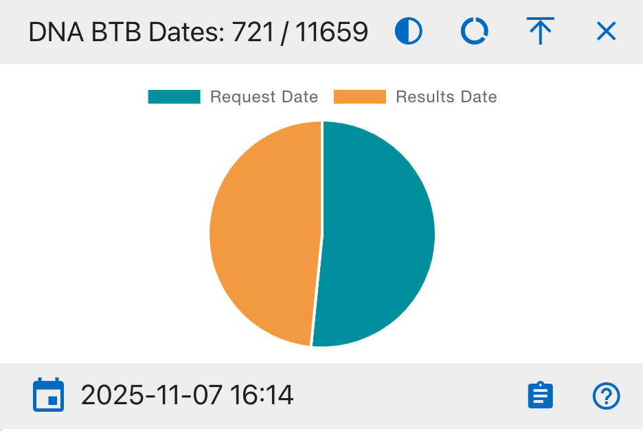{width="400"}

Pie Chart Segments:
* Request Date
* Results Date 

This widget helps track the turnaround time between DNA test requests and result availability, supporting workflow optimization.

### DNA Austr Methods
A comprehensive overview of austr DNA testing method assignments

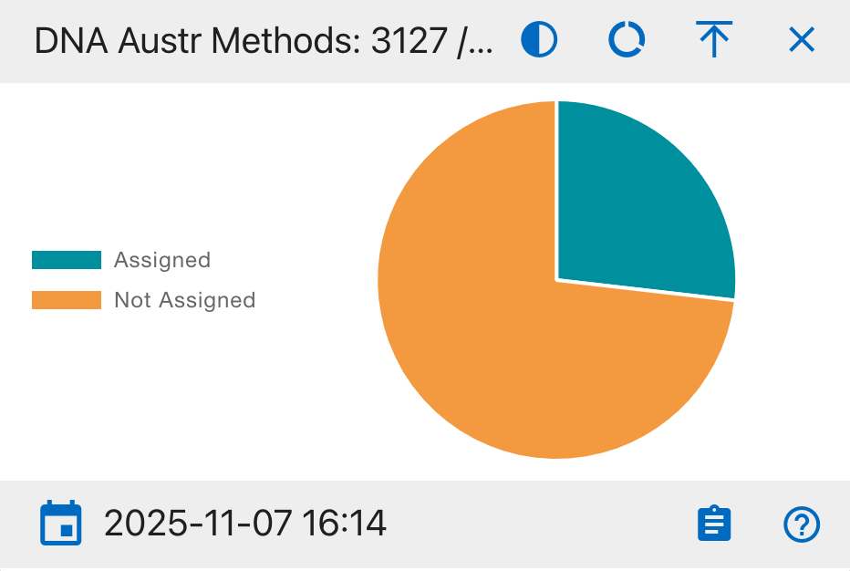{width="400"}

Pie Chart Segments:
* Assigned 
* Not Assigned 

This widget helps track the status of method assignments for austr DNA testing, ensuring proper testing protocols are followed and identifying samples that need method designation.

### DNA Austr Results 
A comprehensive overview of austr DNA testing outcomes

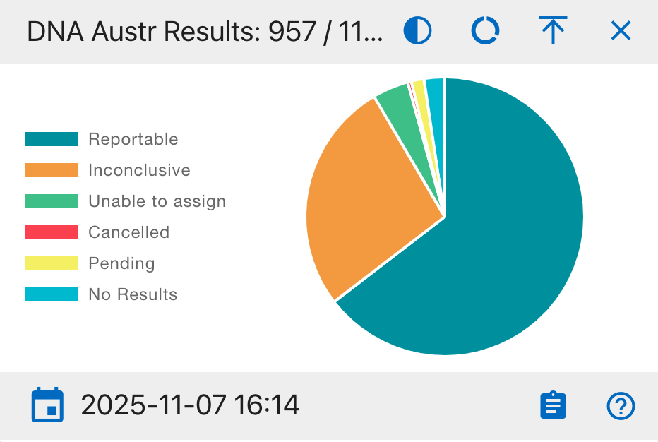{width="400"}

Pie Chart Segments:
* Reportable 
* Inconclusive 
* Unable to assign 
* Cancelled 
* Pending
* No Results 

This widget provides a complete view of austr DNA testing outcomes, helping analysts track success rates and identify potential issues in the testing process.

### DNA Austr Dates
A timeline analysis of austr DNA sample processing

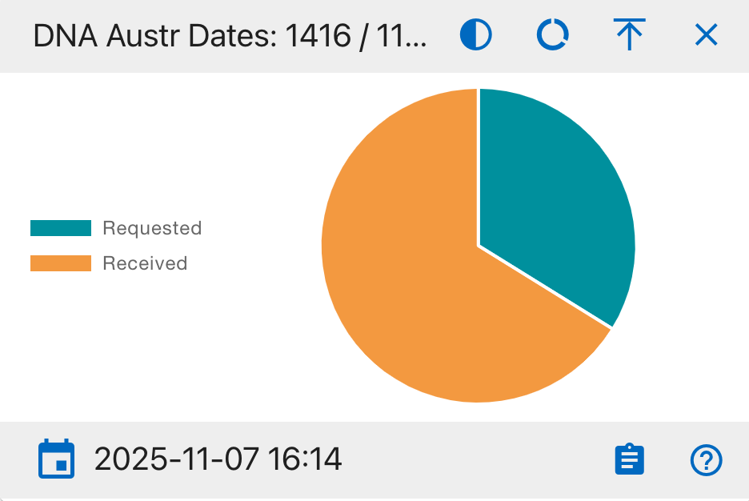{width="400"}

Pie Chart Segments:
* Requested 
* Received 

This widget monitors the flow of austr DNA samples through the laboratory system, helping identify processing bottlenecks.

### DNA Austr Sequence
A categorical analysis of austr DNA sequence data

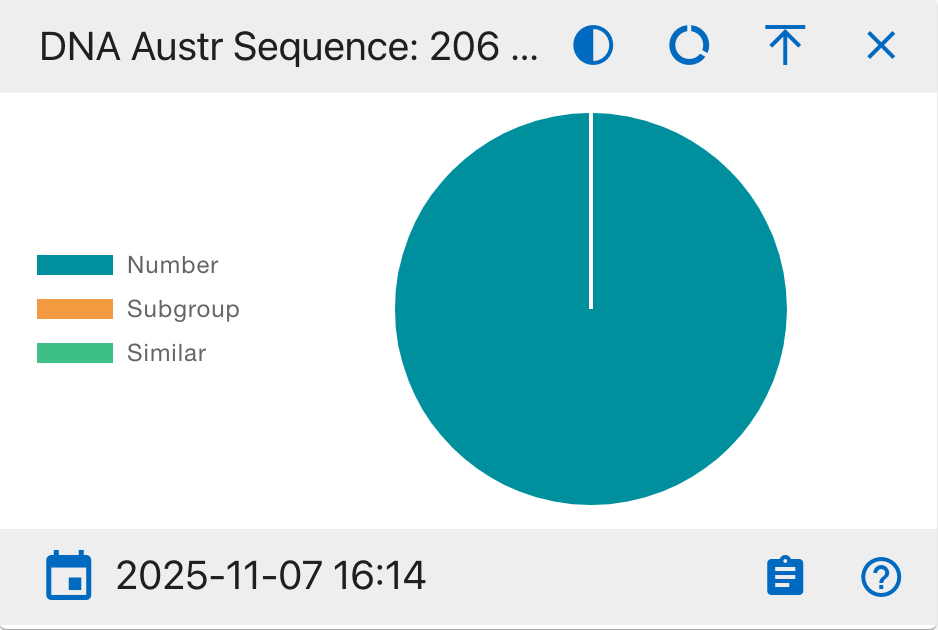{width="400"}

Pie Chart Segments:
* Number 
* Subgroup 
* Similar 

This widget provides insight into the distribution and relationships of austr DNA sequences, helping identify patterns and potential matches.

### DNA Austr Loci 
A status overview of austr DNA marker analysis

{width="400"}

Pie Chart Segments:
* Loci Typed 
* Loci Not Typed 

This widget tracks the progress of genetic marker typing for austr DNA, essential for complete DNA profiling and identification.

### DNA Austr MCC Dates 
A tracking system for austr DNA Multi-Copy Control review status

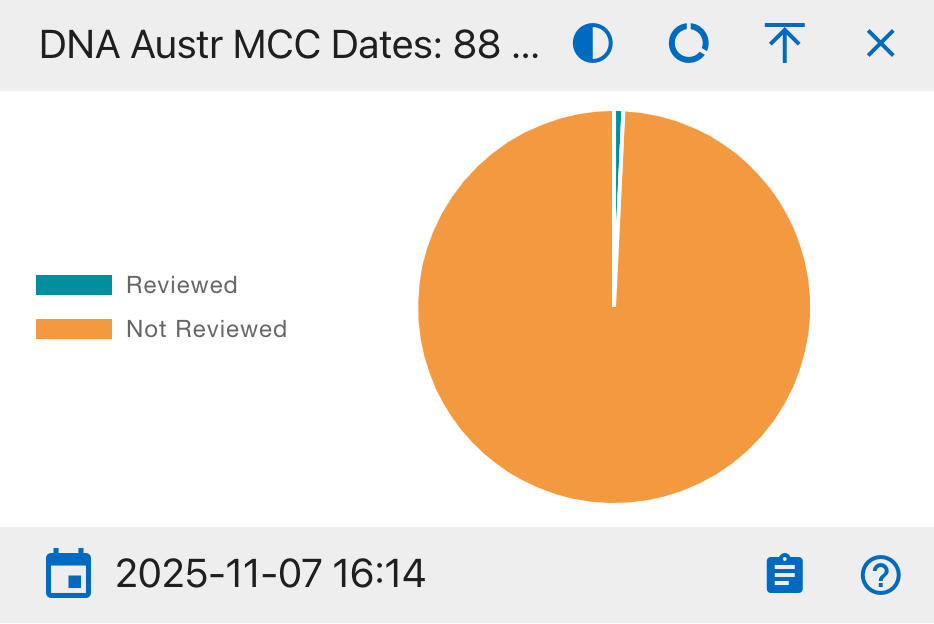{width="400"}

Pie Chart Segments:
* Reviewed 
* Not Reviewed 

This widget monitors the progress of Multi-Copy Control (MCC) reviews for autosomal DNA samples, ensuring quality control standards are met.

### DNA YStr Methods 
A comprehensive overview of YStr DNA testing method assignments

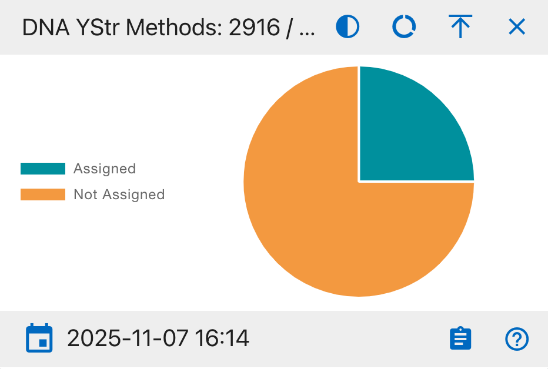{width="400"}

Pie Chart Segments:
* Assigned
* Not Assigned 

This widget tracks the status of method assignments for YStr DNA testing, ensuring appropriate testing protocols are followed.

### DNA YStr Results 
A comprehensive overview of YStr DNA testing outcomes

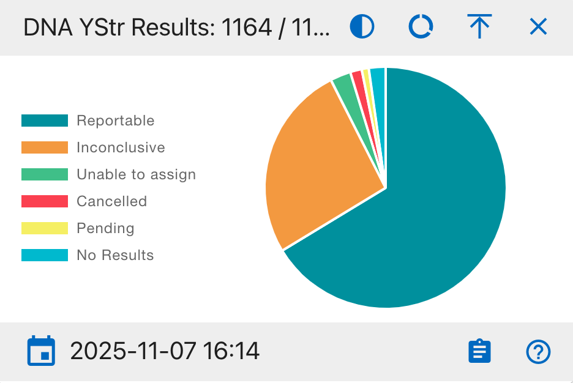{width="400"}

Pie Chart Segments:
* Reportable 
* Inconclusive 
* Unable to assign 
* Cancelled 
* Pending 
* No Results 

This widget provides a complete view of YStr DNA testing outcomes, helping analysts track success rates and identify potential issues in the testing process.

### DNA YStr Dates
A timeline analysis of YStr DNA sample processing status

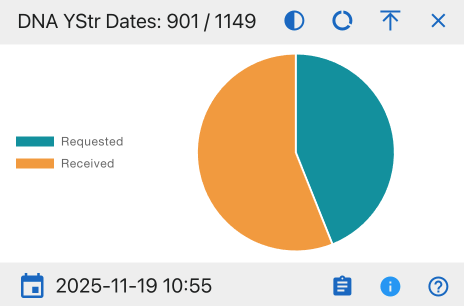{width="400"}

Pie Chart Segments:
* Requested
* Received

This widget helps monitor laboratory workflow efficiency and identify potential processing backlogs by tracking the number of YStr DNA samples requested versus those received.

### DNA YStr Sequence
A categorical analysis of Y-STR DNA sequence data

{width="400"}

Pie Chart Segments:
* Number
* Subgroup
* Similar

This widget provides insight into the distribution and relationships of YStr DNA sequences, helping identify patterns and potential matches. 

### DNA YStr Loci
A status overview of Y-STR DNA genetic marker analysis

{width="400"}

Pie Chart Segments:
* Loci Typed
* Loci Not Typed

This widget tracks the progress of genetic marker typing for YStr DNA samples, essential for complete DNA profiling and identification. 

### DNA YStr Counts
A statistical overview of Y-STR DNA sample matching status

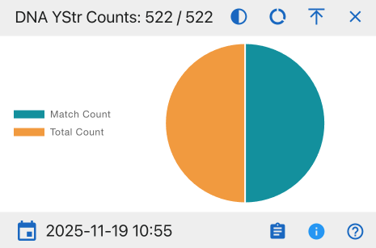{width="400"}

Pie Chart Segments:
* Match Count
* Total Count

This widget provides insights into the success rate of YStr DNA matching processes and helps evaluate overall testing efficiency. 

### DNA YStr MCC Dates
A tracking system for Y-STR DNA Multi-Copy Control review status

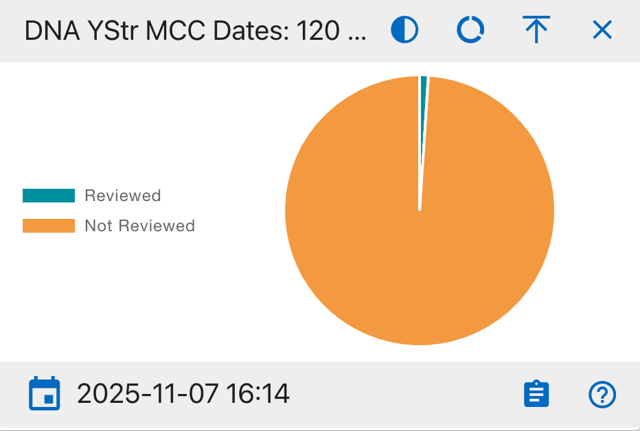{width="400"}

Pie Chart Segments:
* Reviewed
* Not Reviewed

This widget monitors the progress of Multi-Copy Control (MCC) reviews for YStr DNA samples, which are critical for quality assurance and validation of DNA analysis results. 

### DNA line Chart
The bottom section features a comprehensive DNA timeline showing multiple data series in a line graph format:

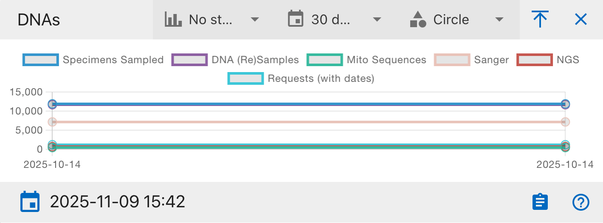{width="500"}

Data Series:
* Specimens Sampled 
* DNA (Re)Samples 
* Mito Sequences 
* Sanger 
* NGS 
* Requests 

The Y-axis shows the count (ranging from 0 to 15,000) while the X-axis shows the date range.

Graph Controls:
* No step/Step options - Toggle between continuous or stepped line visualization
* 30 days time range selector - Adjust the time window for analysis
* Circle point style option - Toggle data point markers
* Full screen toggle - Expand the graph for detailed viewing

The graph updates in real-time and shows the timestamp of the last update. This visualization helps track trends and relationships between different DNA processing stages over time.
