# DNA Dashboard Drilldowns

This page documents the drilldown views available from the DNA Dashboard. Each drilldown provides detailed tabular data corresponding to a specific DNA analysis metric or category. Users can search, filter, sort, and export data from these views.

## Navigation

Click on detail button on any chart widget in the DNA Dashboard to access its corresponding drilldown page. Each drilldown displays a visual representation of the data at the top, followed by a detailed data table below.

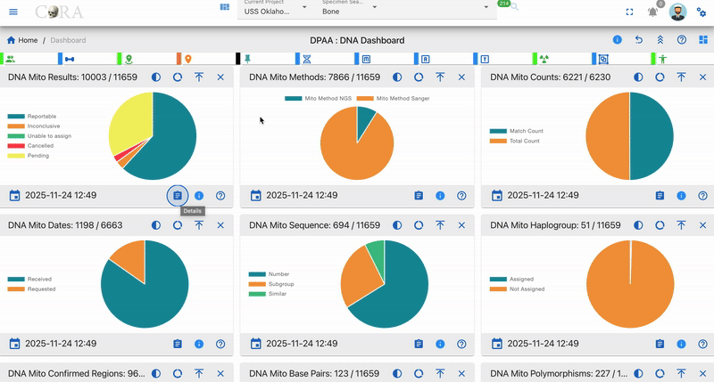

## Available Actions

- Search - Use the search bar at the top of any column to find specific samples by entering text in the search fields
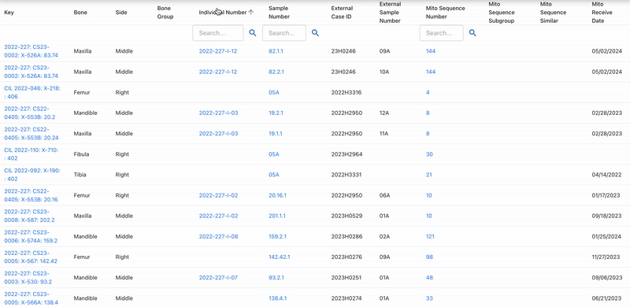
&nbsp;

- Sort - Click any column header to sort data in ascending or descending order for easy data organization
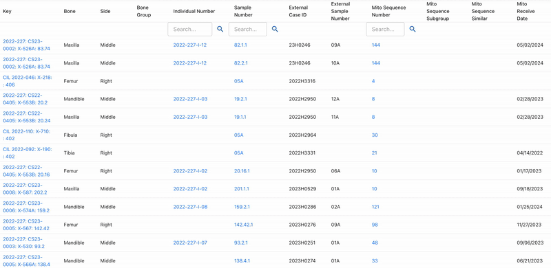
&nbsp;

- Export - Download the filtered data in multiple formats:
  - Excel - Export to Excel spreadsheet for advanced analysis
  - PDF - Generate a printable PDF report
  - Column Visibility - Show or hide columns to customize your view by clicking the column visibility icon
- Pagination - Navigate through large datasets using the pagination controls at the bottom of the table
- Items per Page - Adjust the number of rows displayed (25, 50, 100) using the dropdown menu
- View Details - Click on any row to view complete DNA sample information and related specimen details
- Refresh Data - Click the refresh icon to reload the table with the most current data

## Mitochondrial DNA (Mito) Drilldowns

### Table Fields

- Key - Unique record identifier assigned to each DNA sample entry in the system for tracking and reference purposes
- Bone - Skeletal bone element name indicating the specific bone from which the DNA sample was collected (e.g., Femur, Humerus, Tibia)
- Side - Anatomical side designation showing whether the bone is from the Left or Right side of the body
- Bone Group - Bone classification category grouping similar bones together for organizational and analytical purposes (e.g., Long Bones, Skull, Ribs)
- Individual Number - Associated individual identifier linking the DNA sample to a specific person or skeletal remains for identification purposes
- Sample Number - DNA sample identifier serving as the primary unique reference number for the specific DNA sample collected
- External Case ID - External case reference number used by outside agencies or laboratories to track the case
- External Sample Number - External sample reference number assigned by external laboratories or agencies for their tracking purposes
- Mito Sequence Number - Mitochondrial DNA sequence identifier representing the unique mtDNA profile assigned after analysis
- Mito Sequence Subgroup - Mitochondrial sequence subcategory providing additional classification detail within the main sequence group
- Mito Sequence Similar - Similar mitochondrial sequences showing other samples that share matching or closely related mtDNA profiles
- Mito Receive Date - Date mitochondrial DNA results were received from the laboratory, marking when analysis was completed

### DNA Mito Results

The DNA Mito Results drilldown displays all DNA samples that have mitochondrial DNA (mtDNA) result confidence levels recorded. This view helps track the quality and reliability of mitochondrial DNA analysis results across samples.

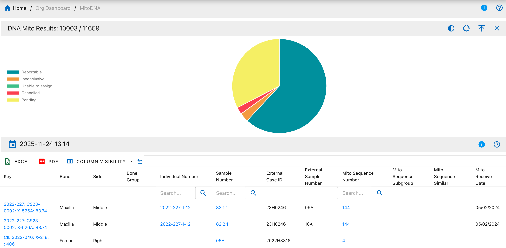

Pie Chart Segments:

* Reportable
* Inconclusive
* Unable to assign
* Cancelled
* Pending

### DNA Mito Methods

The DNA Mito Methods drilldown shows all DNA samples categorized by the laboratory method used for mitochondrial DNA sequencing analysis.

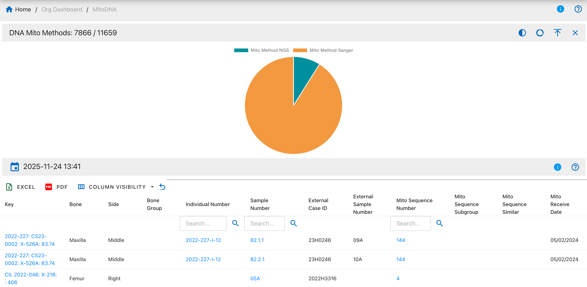

Pie Chart Segments:

* Mito Method NGS
* Mito Method Sanger

### DNA Mito Counts

The DNA Mito Counts drilldown displays DNA samples with recorded match count and total count data, showing how many specimens share the same mitochondrial DNA sequence.

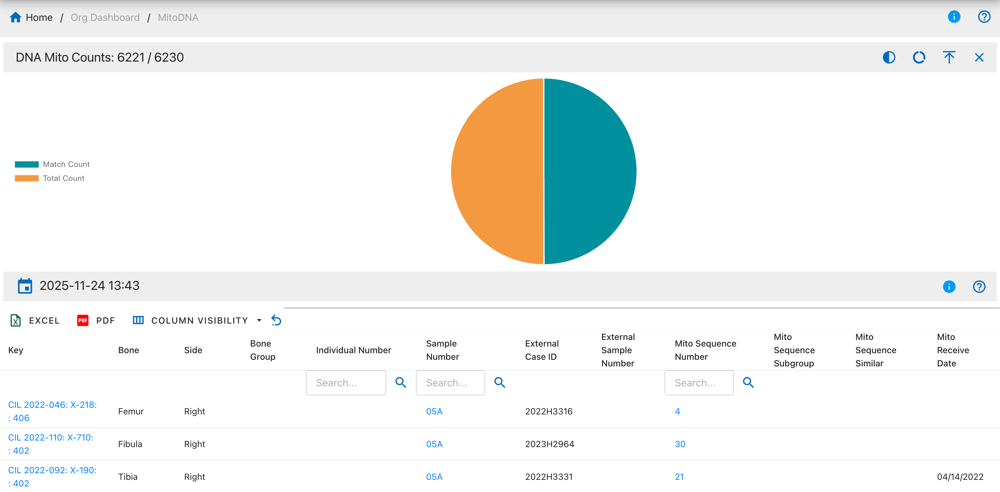

Pie Chart Segments:

* Match Count
* Total Count

### DNA Mito Dates

The DNA Mito Dates drilldown shows all DNA samples with recorded mitochondrial DNA request and receive dates, helping track turnaround times and lab processing schedules.

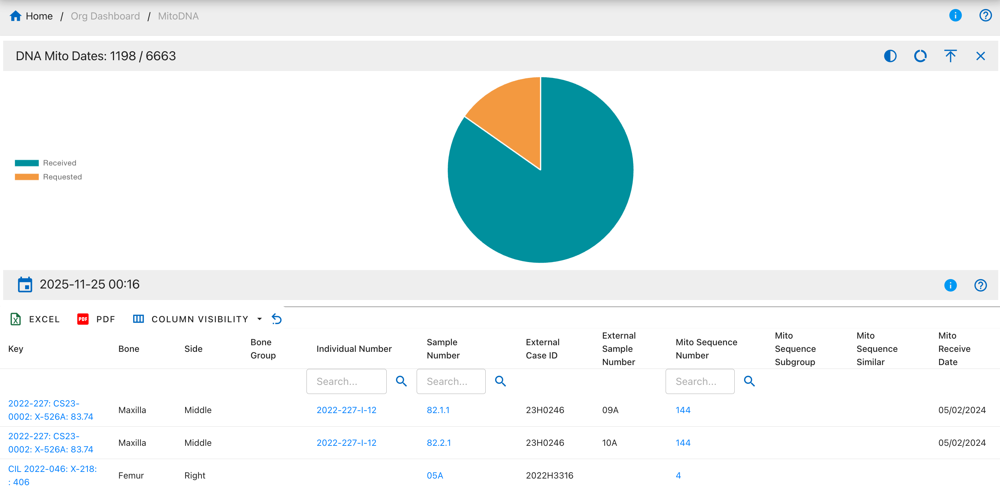

Pie Chart Segments:

* Received
* Requested

### DNA Mito Sequence

The DNA Mito Sequence drilldown displays samples with assigned mitochondrial DNA sequence numbers, allowing tracking of unique mtDNA profiles across specimens.

Pie Chart Segments:

* Number 
* Subgroup
* Similar 

### DNA Mito Haplogroup

The DNA Mito Haplogroup drilldown shows DNA samples categorized by their mitochondrial haplogroup classification, representing maternal lineage.

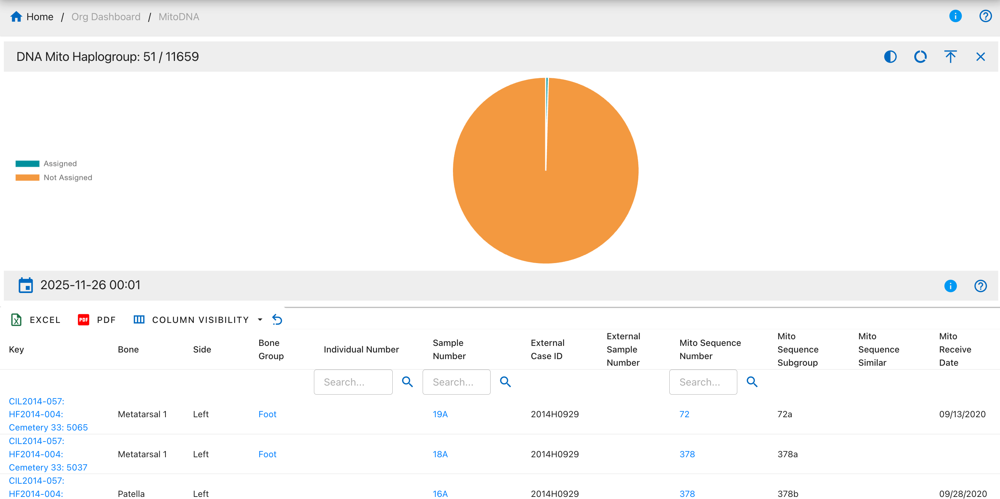

Pie Chart Segments:

* Assigned 
* Not Assigned 

### DNA Mito Confirmed Regions

The DNA Mito Confirmed Regions drilldown displays samples with confirmed mitochondrial DNA sequence regions that have been verified through analysis.

Pie Chart Segments:

* Confirmed
* Not Confirmed

### DNA Mito Base Pairs

The DNA Mito Base Pairs drilldown shows DNA samples with recorded mitochondrial DNA base pair information, indicating the specific nucleotide positions analyzed.

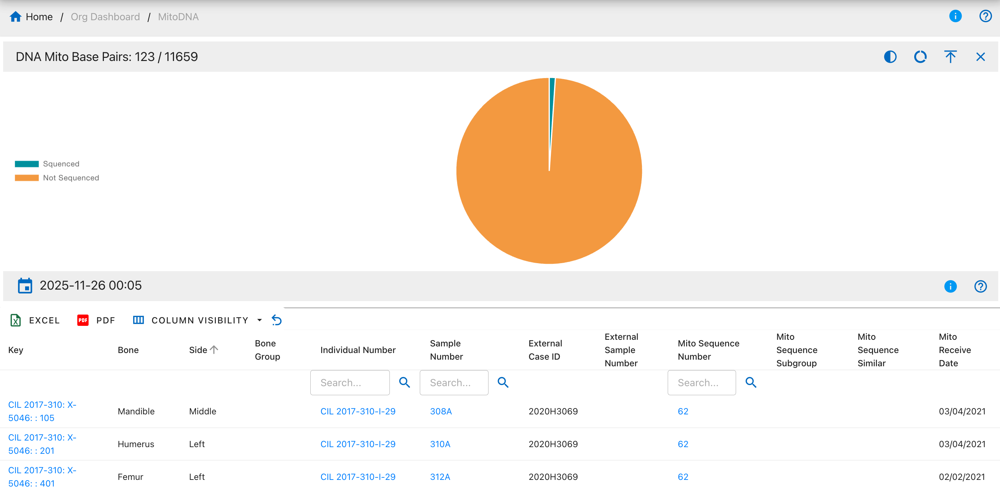

Pie Chart Segments:

* Sequenced
* Not Sequenced

### DNA Mito Polymorphisms

The DNA Mito Polymorphisms drilldown displays samples with recorded mitochondrial DNA polymorphisms (sequence variations).

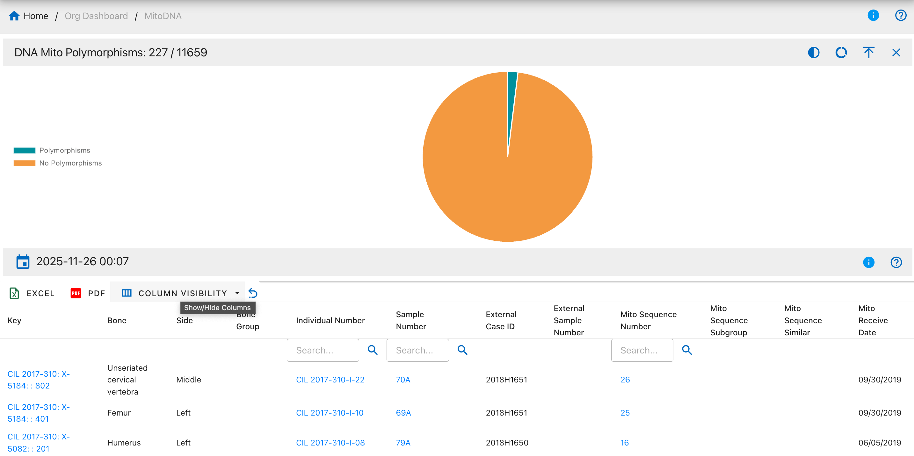

Pie Chart Segments:

* Polymorphisms
* No Polymorphisms

### DNA Mito FASTA Sequence

The DNA Mito FASTA Sequence drilldown shows samples with complete FASTA-formatted mitochondrial DNA sequences available.

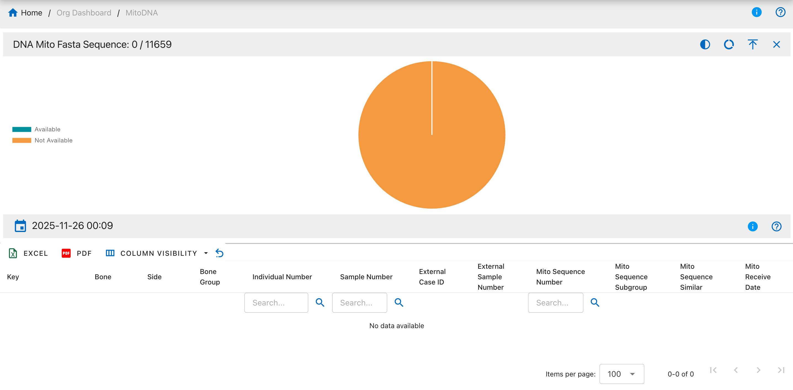

Pie Chart Segments:

* Available
* Not Available

### DNA Mito Haplosubgroup

The DNA Mito Haplosubgroup drilldown displays samples with detailed mitochondrial haplosubgroup classifications, providing more specific maternal lineage information.

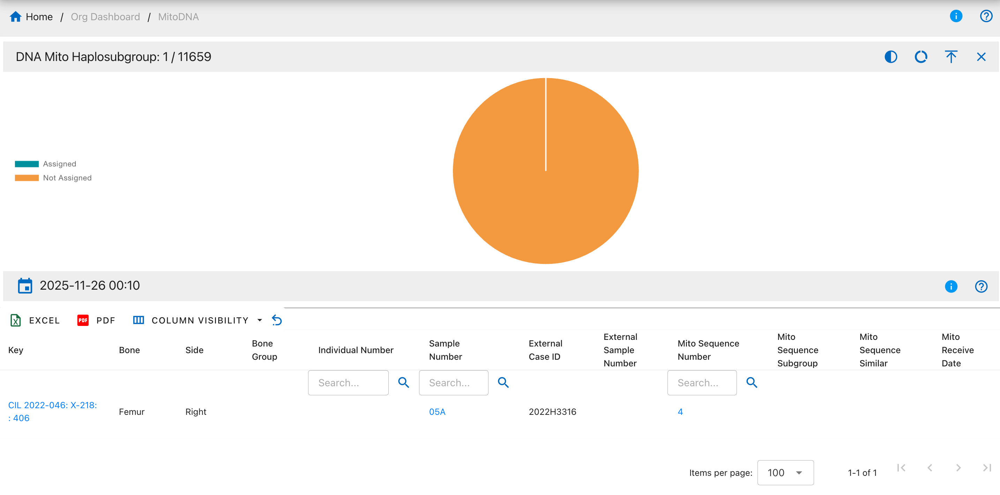

Pie Chart Segments:

* Assigned
* Not Assigned

### DNA Mito Loci

The DNA Mito Loci drilldown shows DNA samples with information about specific mitochondrial DNA loci analyzed.

Pie Chart Segments:

* Loci Typed
* Loci Not Typed

### DNA Mito MCC Dates

The DNA Mito MCC (Mitochondrial Control Region) Dates drilldown displays samples with MCC-specific request and receive dates.

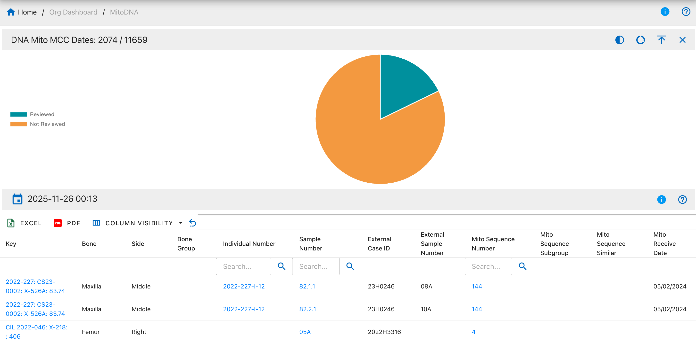

Pie Chart Segments:

* Reviewed
* Not Reviewed 

### DNA Sample Condition

The DNA Sample Condition drilldown displays the physical condition assessment of DNA samples at the time of collection or analysis.

Pie Chart Segments:

* Stored
* Consumed
* Returned 

### DNA Resampled

The DNA Resampled drilldown shows samples that have been resampled for additional DNA analysis due to various reasons such as insufficient quality or quantity.

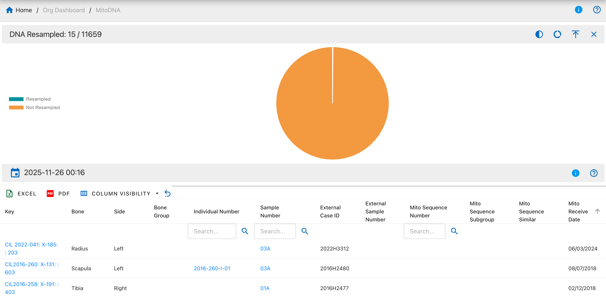

Pie Chart Segments:

* Resampled 
* Not Resampled 

### DNA BTB Dates

The DNA Bone-to-Bone (BTB) Dates drilldown displays samples with bone-to-bone comparison request and receive dates, used for comparing DNA from multiple bones of the same individual.

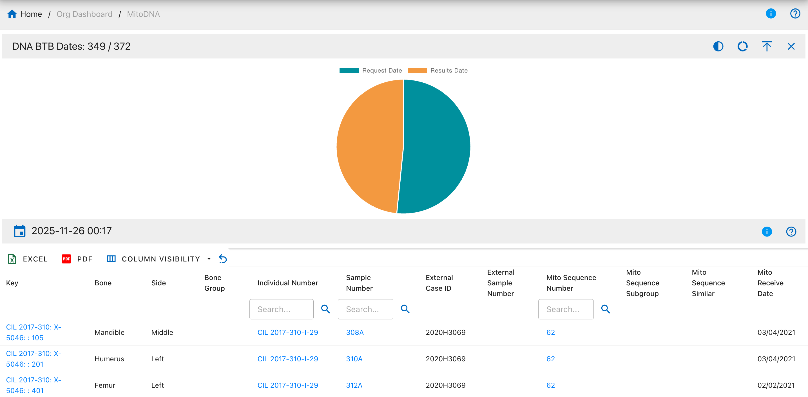

Pie Chart Segments:

* Request Date
* Results Date 

## Autosomal STR (AuSTR) Drilldowns

### Table Fields

- Key - Unique record identifier assigned to each DNA sample entry in the system for tracking and reference purposes
- Bone - Skeletal bone element name indicating the specific bone from which the DNA sample was collected (e.g., Femur, Humerus, Tibia)
- Side - Anatomical side designation showing whether the bone is from the Left or Right side of the body
- Bone Group - Bone classification category grouping similar bones together for organizational and analytical purposes (e.g., Long Bones, Skull, Ribs)
- Individual Number - Associated individual identifier linking the DNA sample to a specific person or skeletal remains for identification purposes
- Sample Number - DNA sample identifier serving as the primary unique reference number for the specific DNA sample collected
- External Case ID - External case reference number used by outside agencies or laboratories to track the case
- External Sample Number - External sample reference number assigned by external laboratories or agencies for their tracking purposes
- AuSTR Sequence Number - Autosomal STR sequence identifier representing the unique autosomal DNA profile assigned after analysis
- AuSTR Sequence Similar - Similar autosomal STR sequences showing other samples that share matching or closely related profiles
- AuSTR Sequence Subgroup - Autosomal STR sequence subcategory providing additional classification detail within the main sequence group
- AuSTR Receive Date - Date autosomal STR DNA results were received from the laboratory, marking when analysis was completed

### DNA AuSTR Methods

The DNA AuSTR Methods drilldown shows DNA samples categorized by the laboratory method used for autosomal STR analysis.

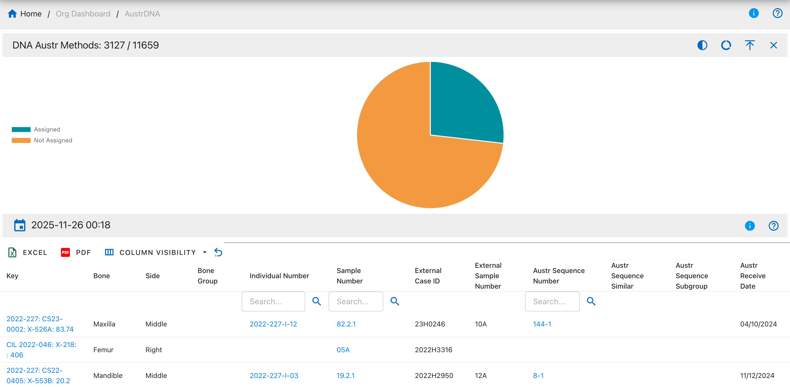

Pie Chart Segments:

* Assigned 
* Not Assigned 

### DNA AuSTR Results

The DNA AuSTR Results drilldown displays all DNA samples with autosomal short tandem repeat (STR) analysis results.

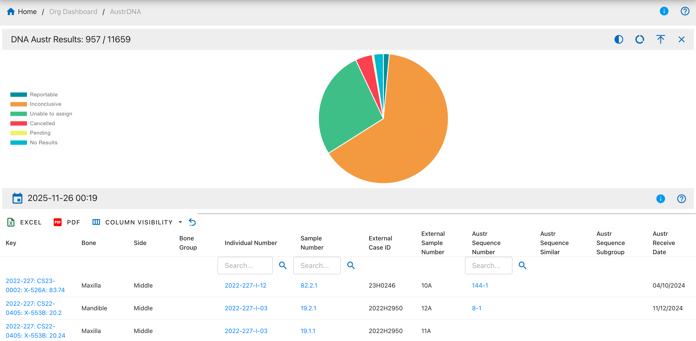

Pie Chart Segments:

* Reportable 
* Inconclusive 
* Unable to assign 
* Cancelled 
* Pending
* No Results 

### DNA AuSTR Dates

The DNA AuSTR Dates drilldown displays samples with autosomal STR request and receive dates.

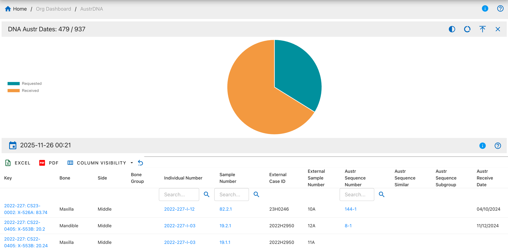

Pie Chart Segments:

* Requested 
* Received 

### DNA AuSTR Sequence

The DNA AuSTR Sequence drilldown shows samples with assigned autosomal STR sequence numbers.

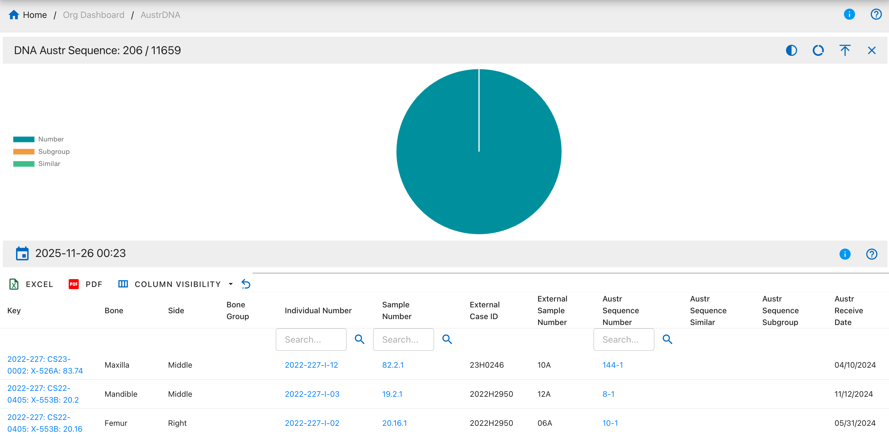

Pie Chart Segments:

* Number 
* Subgroup 
* Similar 

### DNA AuSTR Loci

The DNA AuSTR Loci drilldown displays samples with information about specific autosomal STR loci analyzed.

Pie Chart Segments:

* Loci Typed 
* Loci Not Typed 

### DNA AuSTR MCC Dates

The DNA AuSTR MCC Dates drilldown shows samples with MCC-specific autosomal STR dates.

Pie Chart Segments:

* Reviewed 
* Not Reviewed 

## Y-Chromosome STR (Y-STR) Drilldowns

### Table Fields

- Key - Unique record identifier assigned to each DNA sample entry in the system for tracking and reference purposes
- Bone - Skeletal bone element name indicating the specific bone from which the DNA sample was collected (e.g., Femur, Humerus, Tibia)
- Side - Anatomical side designation showing whether the bone is from the Left or Right side of the body
- Bone Group - Bone classification category grouping similar bones together for organizational and analytical purposes (e.g., Long Bones, Skull, Ribs)
- Individual Number - Associated individual identifier linking the DNA sample to a specific person or skeletal remains for identification purposes
- Sample Number - DNA sample identifier serving as the primary unique reference number for the specific DNA sample collected
- External Case ID - External case reference number used by outside agencies or laboratories to track the case
- External Sample Number - External sample reference number assigned by external laboratories or agencies for their tracking purposes
- Y-STR Sequence Number - Y-chromosome STR sequence identifier representing the unique Y-STR profile assigned after analysis
- Y-STR Sequence Similar - Similar Y-chromosome STR sequences showing other samples that share matching or closely related profiles
- Y-STR Sequence Subgroup - Y-chromosome STR sequence subcategory providing additional classification detail within the main sequence group
- Y-STR Receive Date - Date Y-chromosome STR DNA results were received from the laboratory, marking when analysis was completed

### DNA Y-STR Methods

The DNA Y-STR Methods drilldown shows DNA samples categorized by the method used for Y-chromosome STR analysis.

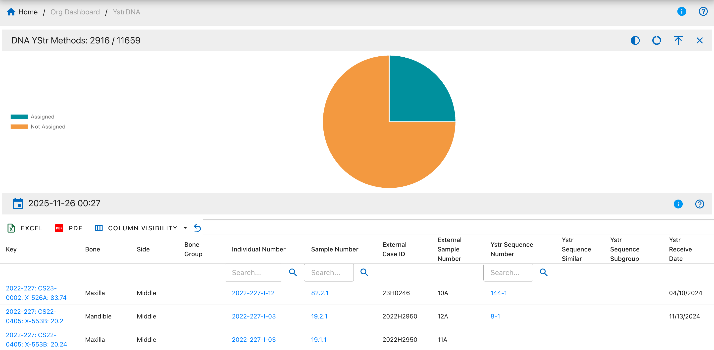

Pie Chart Segments:

* Assigned
* Not Assigned 

### DNA Y-STR Results

The DNA Y-STR Results drilldown displays all DNA samples with Y-chromosome short tandem repeat analysis results.

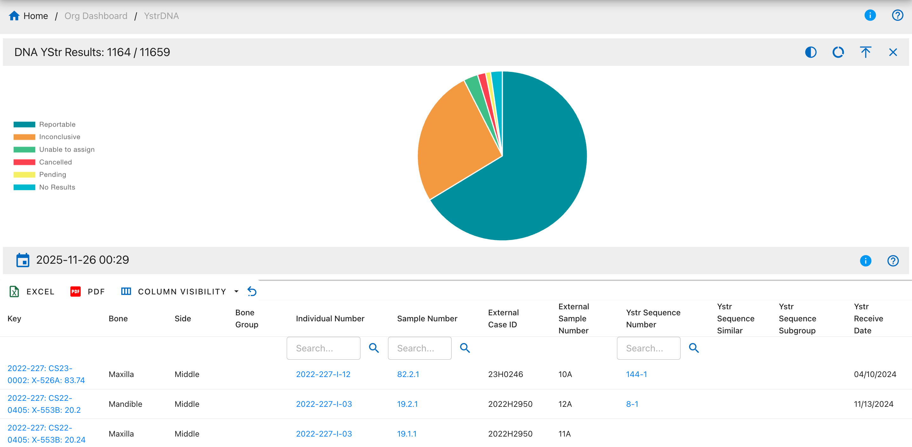

Pie Chart Segments:

* Reportable 
* Inconclusive 
* Unable to assign 
* Cancelled 
* Pending 
* No Results 

### DNA Y-STR Dates

The DNA Y-STR Dates drilldown displays samples with Y-chromosome STR request and receive dates.

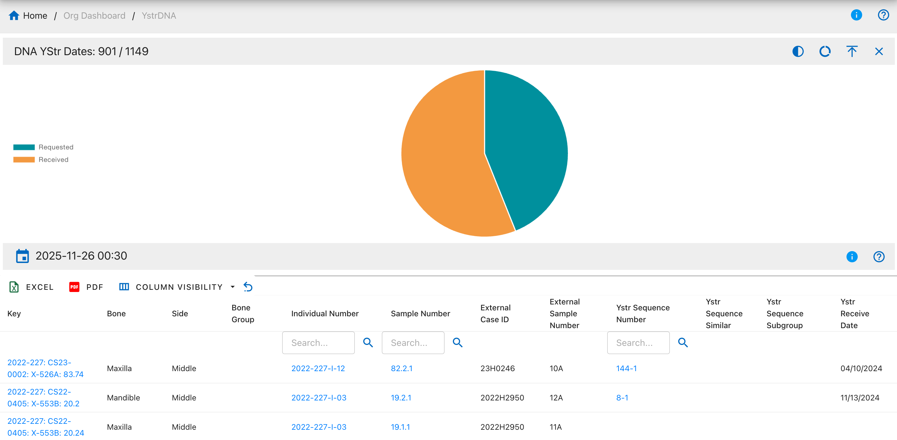

Pie Chart Segments:

* Requested
* Received

### DNA Y-STR Sequence

The DNA Y-STR Sequence drilldown shows samples with assigned Y-chromosome STR sequence numbers.

Pie Chart Segments:

* Number
* Subgroup
* Similar

### DNA Y-STR Loci

The DNA Y-STR Loci drilldown displays samples with information about Y-chromosome STR loci analyzed.

Pie Chart Segments:

* Loci Typed
* Loci Not Typed

### DNA Y-STR Counts

The DNA Y-STR Counts drilldown shows Y-chromosome STR samples with match count data.

Pie Chart Segments:

* Match Count
* Total Count

### DNA Y-STR MCC Dates

The DNA Y-STR MCC Dates drilldown displays samples with Y-STR MCC-specific dates.

Pie Chart Segments:

* Reviewed
* Not Reviewed