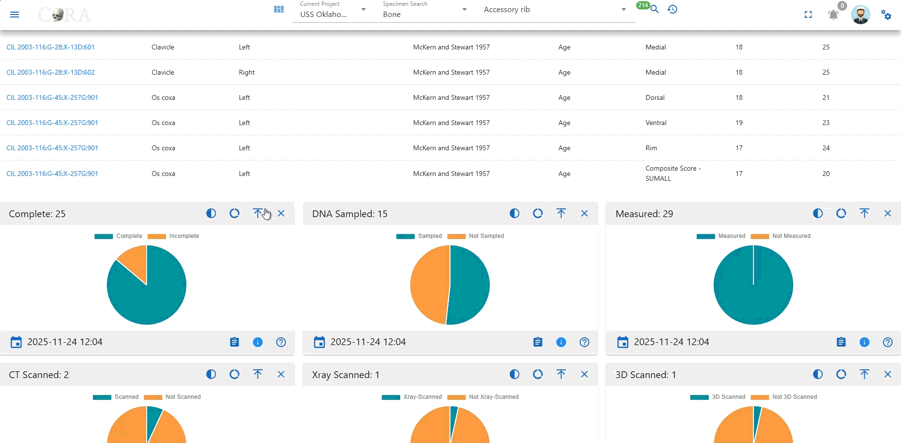
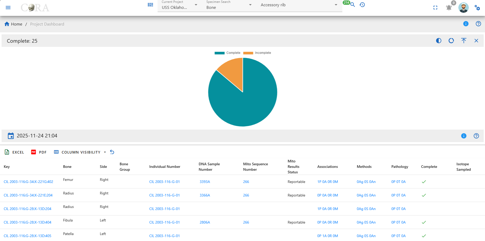
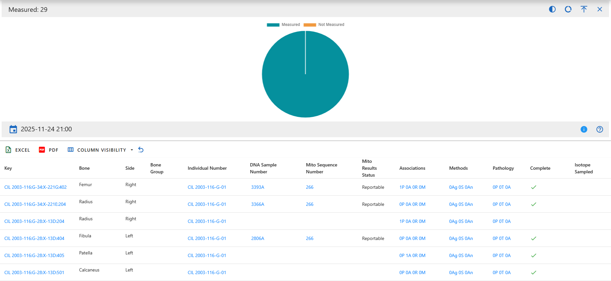
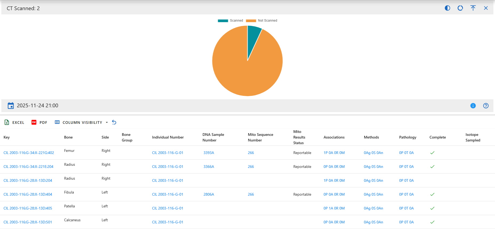
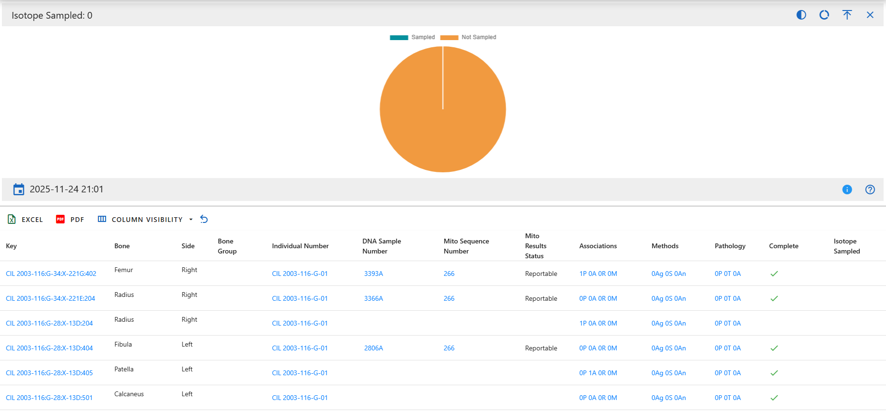
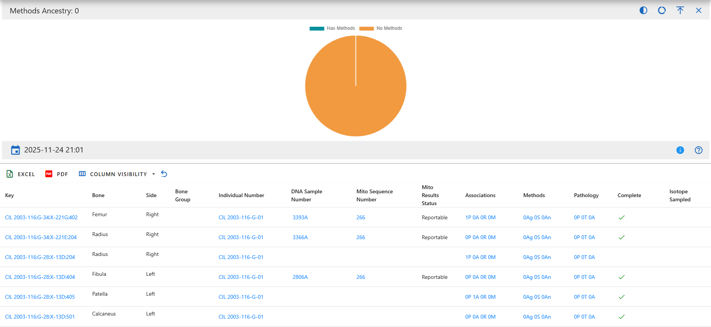

# Individual Analytics Dashboard Drilldowns
## Overview
A drilldown page provides an in-depth view of a specific chart from the Individual Analytics dashboard. While the dashboard gives a quick, high-level snapshot, the drilldown view presents a larger version of the chart along with a complete table of all specimens represented. This allows you to move from a visual summary to the underlying data behind each part of the chart.
## Navigation
You can open drilldown page by selecting the Detail button inside any pie chart widget on the dashboard. Clicking this button loads the dedicated drilldown view for that chart, where you can continue exploring the data with more space and context.

{ width='800' }

## Page Layout and Features
Each drilldown page begins with a full-size versions of the chart you selected. It behaves the same way as the dashboard version, hovering will reveal tooltips, and you can switch between pie and donut views or toggle between full and semi-circle layouts.

{ width='800' }

Below the chart is a comprehensive data table showing all specimens included in the visualizations. The table supports sorting, searching, and hiding or showing additional columns, allowing you to explore the dataset from multiple angles.

{ width='800' }

## Data Table Columns

The drilldown page includes a comprehensive specimen data table. Each row represents a single specimen, and each column provides a specific attribute, measurement, administrative detail, or analytic result. Below is a complete explanation of every column available in the table.

* Key - The unique identifier for the specimen, combining accession and provenance information into a single readable label.
* Accession Number - The collection or case accession number assigned by the project or institution.
* Provenance1 - Primary provenience descriptor
* Provenance2 - Secondary provenience descriptor that provides more specific context
* Designator - The additional identifier used internally to label the specimen, often representing sub-designations.
* External ID - An ID assigned by an outside agency or laboratory, if applicable
* Bone - The specific bone (e.g, Femur, Humerus)
* Side - Indicates whether the specimen is from the left side, right side, or is midline
* Bone Group - A broader grouping of bones, used for sorting and filtering
* Individual Number - The assigned number for the biological individual this specimen belongs to
* Identification Date- The date the individual was identified
* Remains Status - The current status of the remains (e.g, In Lab, Released)
* Remains Release Date - The date the remains was released, if applicable
* DNA Sample Number - Identifier fpr the DNA sample taken from the specimen
* Mito Sequence Number - The mitochondrial DNA sequence ID assigned during analysis
* Mito Results Status - Indicates the confidence or success level of the mitochondrial sequencing results
* Associations - Summarizes how many associations the specimen has across four categories: Articulations, Pair Matches, Refits, and Morphology
* Methods - Shows the number of analytical methods applied to the specimen across these three categories: Age, Sex, and Ancestry
* Pathology - Displays howmany recorded findings the specimen has across three pathology related categories: Pathology, Trauma, and Anomaly
* Taphonomy - Information about environmental or postmortem processes affecting the specimen
* Tags - Any special flags or metadata attached to the specimen
* Dental Codes - Dental notation or coding related to definition
* Measured - Indicates whether measurements have been taken for the specimen
* Complete - States Whether the specimen is complete or incomplete
* Isotope Sampled - Indicates whether an isotope sample was taken
* Clavicle Triage - Status of clavicle triage evaluation
* Count - Quantity count when multiple pieces are associated with the same item
* Mass - The mass or weight of the specimen, if recorded
* Min Age - The computed minimum age for the specimen
* Max Age - The computed maximum age
* Custom Field 1/2/3 - Additional values defined by the project for specialized use
* CT Scanned - Whether CT scanning was completed for the specimen
* CT Scanned At - The date of the CT scan
* Xray Scanned - Whether X-ray imaging was performed
* Xray Scanned At - The date of the X-ray scan
* 3D Scanned - Whether 3D scanning was performed
* 3D Scanned At - The date of the 3D scan
* Inventoried - Indicates whether an inventory check was complete
* Inventoried By - Name of the person who performed the inventory
* Inventoried At - Date the inventory was complete
* Reviewed - Shows whether a review or secondary check was performed
* Reviewed By - Reviewer's name
* Reviewed At - Date of the review
* Created By - User who first created the record
* Created At - Date the record was originally created
* Updated By - User who most recently modified the record
* Updated At - Date of the latest update

## Dashboard Chart Description
### Complete
Categories:

* Complete
* Incomplete

This chart shows how many specimens have undergone DNA sampling. The Sampled category counts specimens that have been processed for DNA extraction, while Not Sampled reflects those without any DNA sampling activity

{ width='800' }

### DNA Sampled
Categories:

* Sampled
* Not Sampled

This chart shows how many specimens have undergone DNA sampling. The Sampled category counts specimens that have been processed for DNA extraction, while Not Sampled reflects those without any DNA sampling activity.

{ width='800' }

### Measured
Categories:

* Measured
* Not Measured

This chart displays whether specimens have recorded osteometric measurements. Measured specimens contain at least one measurement entry, while Not Measured specimens have no measurement data recorded.

{ width='800' }

### CT Scanned
Categories:

* Scanned
* Not Scanned

This chart indicates which specimens have been scanned using CT technology. Scanned specimens have CT scan data associated with them, while Not Scanned do not.

{ width='800' }

### X-ray Scanned
Categories:

* Xray Scanned
* Not Xray Scanned

This chart shows the number of specimens with associated X-ray imaging. Xray Scanned reflects specimens that underwent radiographic imaging, and Not Xray Scanned shows those without X-ray records.

{ width='800' }

### 3D Scanned
Categories:

* 3D Scanned
* Not 3D Scanned

This chart displays whether specimens were captured using 3D scanning technologies (e.g., structured light, laser scanning). 3D Scanned indicates digital 3D models exist, while Not 3D Scanned shows specimens lacking such models.

{ width='800' }

### Isotope Sampled
Categories:

* Sampled
* Not Sampled

This chart tracks whether specimens have undergone isotopic sampling (e.g., strontium, carbon, nitrogen analysis). Sampled indicates an isotopic test has been performed, Not Sampled indicates no record of sampling.

{ width='800' }

### Methods Sex
Categories:

* Has Methods
* No Methods

This chart counts how many specimens have at least one sex estimation method applied. Has Methods includes specimens with sex analysis (e.g., pelvis morphology, cranial features). No Methods indicates no sex-related methods were recorded.

{ width='800' }

### Methods Age
Categories:

* Has Methods
* No Methods

This chart indicates whether age estimation methods have been applied to specimens. Has Methods reflects specimens where age estimation was performed. No Methods shows specimens without age-related analysis.

{ width='800' }

### Methods Ancestry
Categories:

* Has Methods
* No Methods

This chart shows whether ancestry estimation methods were applied. Has Methods includes specimens analyzed for ancestry (e.g., metric or morphoscopic traits). No Methods indicates no ancestry analyses were recorded.

{ width='800' }