# Isotope Dashboard Drilldowns

This page documents the drilldown views available from the Isotope Dashboard. Each drilldown provides detailed tabular data corresponding to a specific isotope analysis metric or category. Users can search, filter, sort, and export data from these views.

## Key Features

- **Interactive Charts** - Click any pie chart to view detailed sample data
- **Advanced Search** - Real-time filtering across all columns
- **Data Export** - Export to Excel or PDF with organization branding
- **Clickable Links** - Navigate directly to specimens, individuals, and bone groups
- **Pagination** - Server-side pagination for optimal performance
- **Column Visibility** - Toggle columns on/off and save preferences
- **Multi-Sort** - Sort by multiple columns simultaneously

## How Drilldown Works

### User Workflow

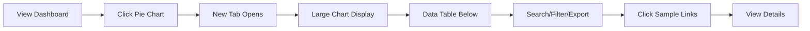

## Navigation

Click on the detail button on any chart widget in the Isotope Dashboard to access its corresponding drilldown page. Each drilldown displays a visual representation of the data at the top, followed by a detailed data table below.


## Available Actions

### Search

Use the search bar at the top to find specific samples by entering text in the search field (e.g., sample number, bone name, individual number). The search is real-time and filters across all visible columns.


#### Real-Time Search

The search bar provides instant filtering across all visible columns:

- **Case-Insensitive** - Searches match regardless of capitalization
- **Multi-Column** - Searches across all text fields simultaneously
- **Instant Results** - Table updates as you type
- **Clear Button** - Quick reset to show all results

#### Search Examples

| Search Term | Matches | Use Case |
|-------------|---------|----------|
| `ISO-7` | All samples from project 7 | Filter by project |
| `CIL 2003` | Samples from CIL 2003 accession | Filter by accession |
| `Femur` | All femur samples | Filter by bone type |
| `Left` | All left-sided bones | Filter by side |
| `2025-123` | Specific individual number | Find individual's samples |

### Sort

Click any column header to sort data in ascending or descending order for easy data organization. Hold Shift and click multiple headers for multi-column sorting.


#### Single-Column Sort

1. Click any column header to sort by that column
2. First click: Ascending order (A→Z, 0→9)
3. Second click: Descending order (Z→A, 9→0)
4. Third click: Remove sort

#### Multi-Column Sort

1. Click the first column header to set primary sort
2. Hold **Shift** key while clicking additional column headers
3. Sort priority follows click order
4. Example: Sort by Bone (ascending), then Side (ascending)

#### Default Sort

- **Default**: Sorted by specimen Key (ascending)
- **Format**: `AccessionNumber:Provenance1:Provenance2:Designator`
- **Purpose**: Groups samples from same specimen together

### Excel Export

Export the filtered isotope data to an Excel spreadsheet for advanced analysis, reporting, or data sharing. The export includes all visible columns and respects current filters and search terms.

#### Excel Export Features

- **File Format**: `.xlsx` compatible with Microsoft Excel and Google Sheets
- **Includes**: All visible columns from current view
- **Data Types**: Preserves numbers, text, and dates properly
- **Metadata**: Organization and project information in header
- **Filtering**: Exports currently filtered/searched data only
- **Use Cases**: 
  - Advanced statistical analysis
  - Lab reports and documentation
  - Data sharing with collaborators
  - Import into statistical software

#### Filename Format

```
Isotope_Pie_chart_{chart_type}_{timestamp}.xlsx
```

**Example:**
```
Isotope_Pie_chart_org_c_to_n_ratio_2025-12-01_143022.xlsx
```

### PDF Export

Generate a printable PDF report of the isotope data with organization branding. The PDF includes headers, footers, and maintains the table structure for professional documentation.

#### PDF Export Features

- **File Format**: Professional PDF report with formatting
- **Branding**: Includes organization logo and header information
- **Layout**: Maintains column structure and alignment
- **Page Numbers**: Automatic page numbering and generation timestamp
- **Print-Ready**: Optimized for printing and archiving
- **Filtering**: Exports currently filtered/searched data only
- **Use Cases**:
  - Quality control documentation
  - Official lab reports
  - Archival records
  - Manuscript supplementary materials
  - Regulatory compliance documentation

#### Filename Format

```
Isotope_Pie_chart_{chart_type}_{timestamp}.pdf
```

**Example:**
```
Isotope_Pie_chart_org_collagen_weights_2025-12-01_143045.pdf
```

### Column Visibility

Show or hide columns to customize your view by clicking the column visibility icon. Your preferences are saved automatically and persist across sessions.


### Additional Actions

- **Pagination** - Navigate through large datasets using the pagination controls at the bottom of the table
- **Items per Page** - Adjust the number of rows displayed (10, 25, 50, 100) using the dropdown menu
- **View Details** - Click on any linked field (Key, Individual Number, Sample Number, Bone Group) to view complete details
- **Refresh Data** - Reload the table with the most current data by refreshing the browser

## Table Fields

All isotope drilldowns display the following table columns:

- **Key** - Specimen identifier in format AN:P1:P2:Designator (Accession Number : Provenance1 : Provenance2 : Designator) serving as the unique specimen reference
- **Bone** - Skeletal bone element name indicating the specific bone from which the isotope sample was collected (e.g., Femur, Tibia, Humerus, Rib)
- **Side** - Anatomical side designation showing whether the bone is from the Left or Right side of the body, or if it is Middle/Unsided
- **Bone Group** - Bone classification category grouping similar bones together for organizational and analytical purposes
- **Individual Number** - Associated individual identifier linking the isotope sample to a specific person or skeletal remains for identification purposes
- **Sample Number** - Isotope sample identifier serving as the primary unique reference number for the specific isotope sample in format ISO-{project_id}-{number} (e.g., ISO-7-000001)


## Isotope Analysis Drilldowns

### Isotope Results

The Isotope Results drilldown displays all isotope samples that have assigned results confidence levels recorded. This view helps track the quality and reliability of isotope analysis results across samples.

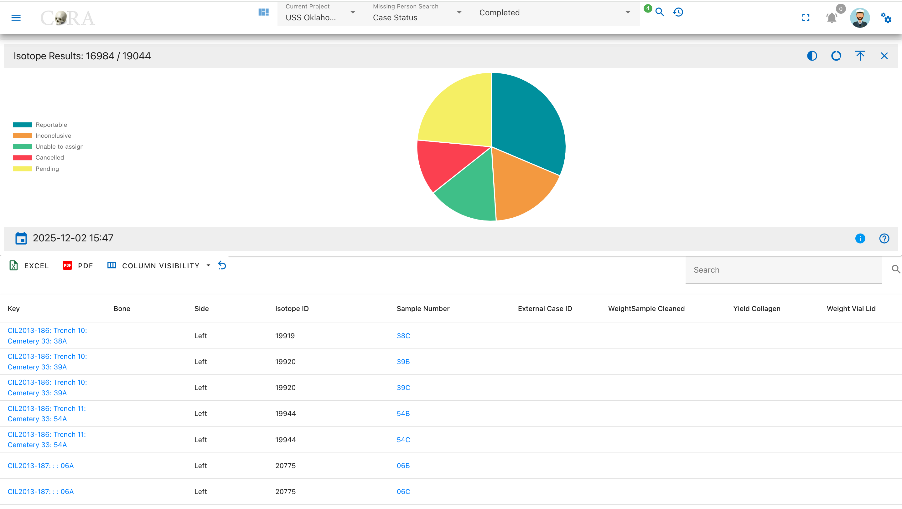

Pie Chart Segments:

* Reportable
* Inconclusive
* Unable to Assign
* Cancelled
* Pending

### Results Status

The Results Status drilldown shows the overall reporting status of isotope samples, indicating which samples have completed analysis with reportable results.

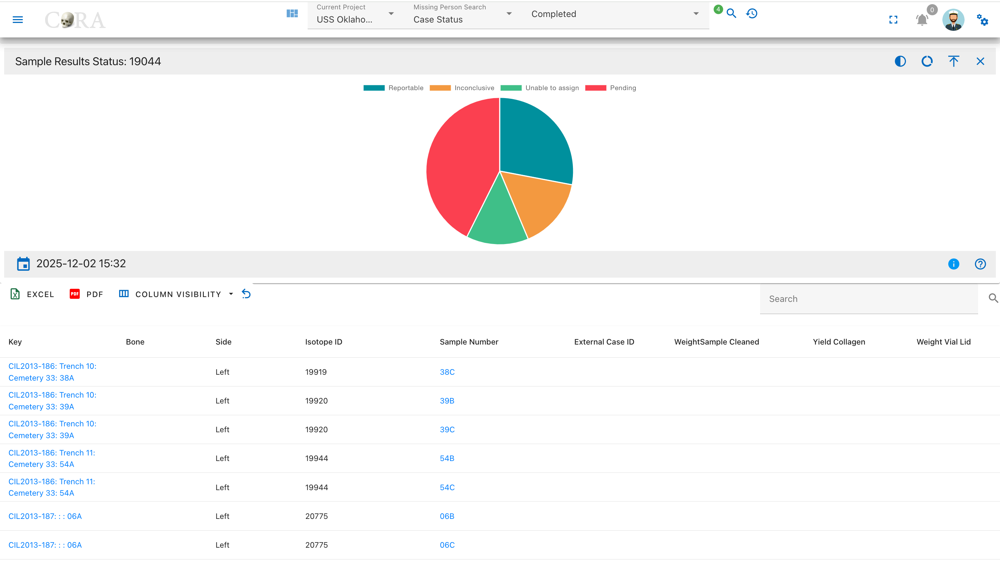

Pie Chart Segments:

* Reportable
* Inconclusive
* Unable to Assign
* Pending

---

## Collagen Processing Drilldowns

### Collagen Weights

The Collagen Weights drilldown displays samples with recorded collagen weight used for isotope analysis, showing the amount of extracted collagen available.

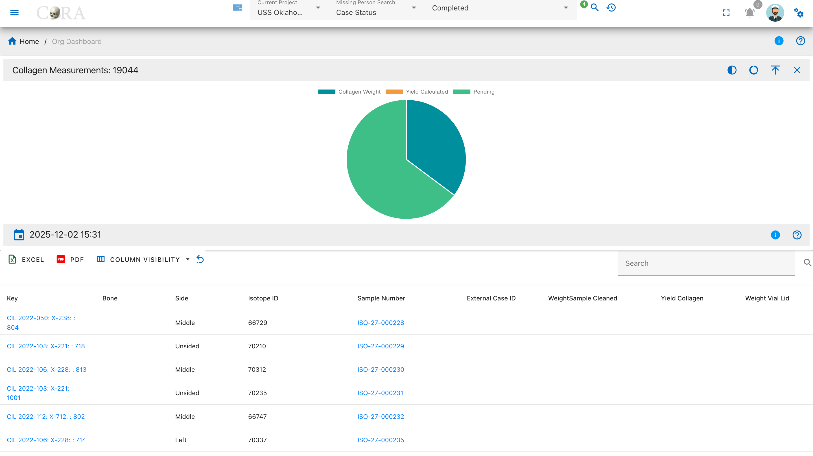

Pie Chart Segments:

* Collagen Weight Recorded
* Pending

---

## Weight Measurement Drilldowns

### Vial Weights

The Vial Weights drilldown displays samples with recorded vial and lid weights, which are necessary for calculating net sample weights.

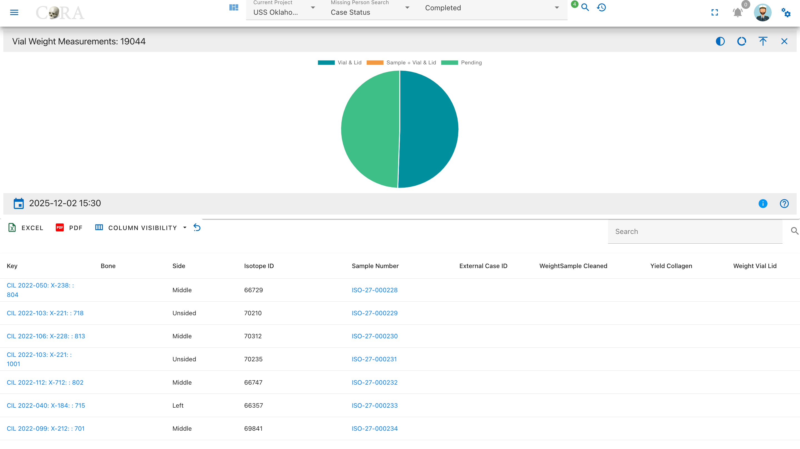

Pie Chart Segments:

* Vial & Lid Weighed
* Pending

### Weight Status

The Weight Status drilldown shows samples categorized by whether any weight measurements have been recorded across all weight fields.

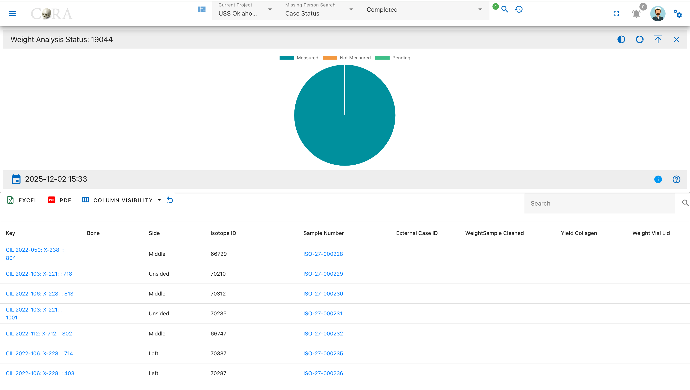

Pie Chart Segments:

* Measured
* Not Measured
* Pending

---

## Demineralization Processing Drilldowns

### Demineralization Status

The Demineralization Status drilldown displays isotope samples categorized by their demineralization processing status, showing which samples have started and completed this critical preparation step.

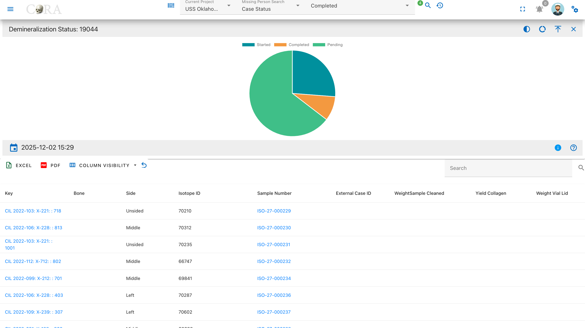

Pie Chart Segments:

* Started
* Completed
* Pending

---

## Isotope Ratio Drilldowns

### Carbon to Nitrogen (C:N) Ratio

The C:N Ratio drilldown displays samples categorized by their carbon to nitrogen ratio values, which indicate collagen preservation quality and sample integrity.


Pie Chart Segments:

* High (>3.6)
* Normal (2.9-3.6)
* Low (<2.9)
* Pending

### Carbon to Oxygen (C:O) Ratio

The C:O Ratio drilldown shows samples categorized by their carbon to oxygen ratio, an indicator of isotopic stability and sample quality.

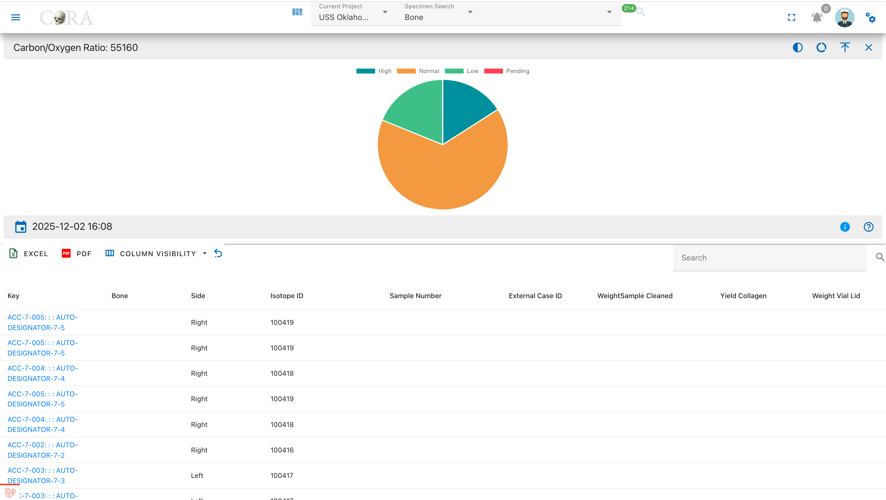

Pie Chart Segments:

* High (>1.4)
* Normal (1.1-1.4)
* Low (<1.1)
* Pending

---

## Elemental Analysis Drilldowns

### Carbon Analysis (δ¹³C)

The Carbon Analysis drilldown displays samples with carbon isotope measurements, showing delta values, weights, and percentages for carbon content.

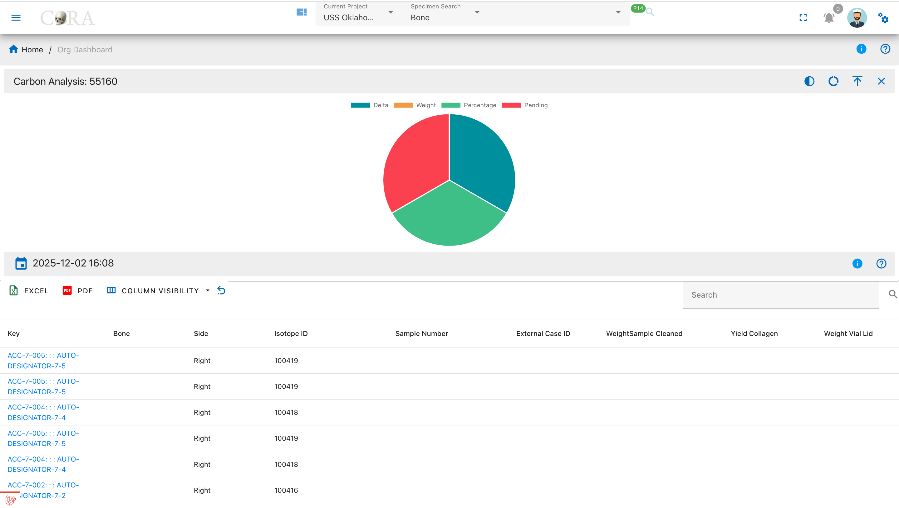

Pie Chart Segments:

* Delta (δ¹³C)
* Weight
* Percentage
* Pending

### Nitrogen Analysis (δ¹⁵N)

The Nitrogen Analysis drilldown shows samples with nitrogen isotope measurements, displaying delta values, weights, and percentages for nitrogen content.

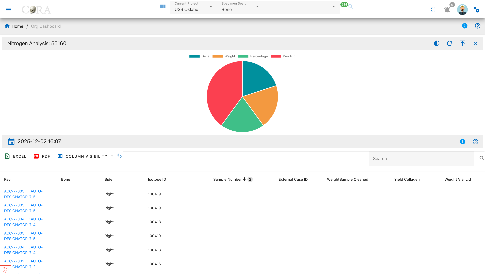

Pie Chart Segments:

* Delta (δ¹⁵N)
* Weight
* Percentage
* Pending

### Oxygen Analysis (δ¹⁸O)

The Oxygen Analysis drilldown displays samples with oxygen isotope measurements, showing delta values, weights, and percentages for oxygen content.

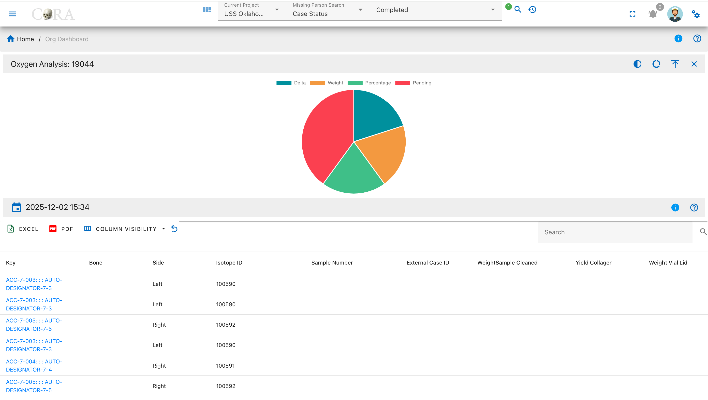

Pie Chart Segments:

* Delta (δ¹⁸O)
* Weight
* Percentage
* Pending

### Sulphur Analysis (δ³⁴S)

The Sulphur Analysis drilldown shows samples with sulphur isotope measurements, displaying delta values, weights, and percentages for sulphur content.

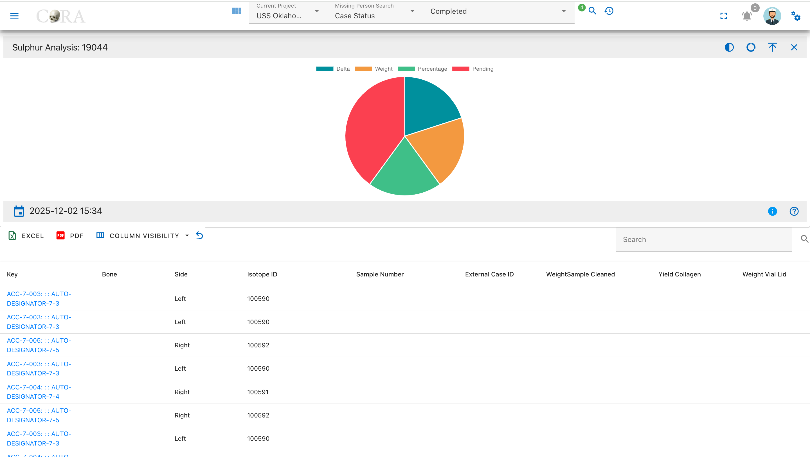

Pie Chart Segments:

* Delta (δ³⁴S)
* Weight
* Percentage
* Pending
