# Missing Person Dashboard Drilldowns

This section of the user guide describes the drilldown pages available from each widget on the Missing Person Dashboard. Each drilldown page provides an in-depth view of the selected data, featuring an interactive chart and a detailed, filterable table. These drilldowns help users investigate specific case details, apply advanced searches, and export results for further review.

The following pages explain what each drilldown displays, the meaning of each data field, and the actions users can perform, such as searching, filtering, sorting, and exporting.

## Navigation

To access the drilldowns, click on the desired widget's chart segment in the main Missing Person Dashboard.

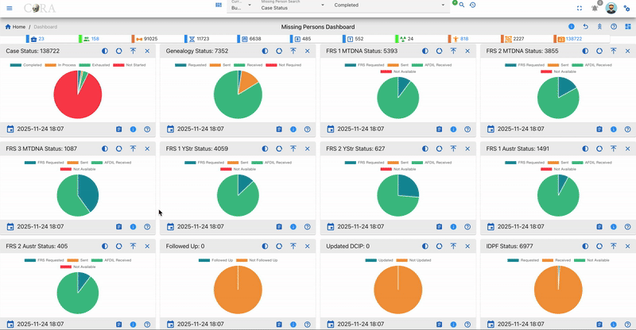

## Table Fields

All drilldown data tables include these columns unless specifically noted:

* Case Number: Unique identifier for each case.
* Owner Service: Branch or agency responsible.
* Service Member Service: Affiliation of the missing individual.
* Case Status: Overall status.
* Full Name: Name of the missing person.
* Conflict: Associated conflict or mission.
* Incident: Incident details, if available.
* Case Manager: Assigned staff member.
* Project: Related project.
* Priority DPAA: DPAA project priority.
* Priority PCRB: PCRB project priority.
* DPAA Case Status: Status per DPAA records.
* Followed Up: Whether follow-up has been performed.
* Updated DCIP: Indicates if DCIP record is current.
* Genealogy Status: Status of genealogy research.
* Action: Edit or delete records, as permitted.

**Exceptions:**

* Case Managers Drilldown: Columns are Case Manager and Total only.

## User Actions

All drilldown tables support:

* Searching and Filtering: Use search boxes under each column header.
* Sorting: Click any column header to sort the data.
* Export: Download data as Excel or PDF.
* Column Visibility: Show/hide columns with the dropdown.
* Refresh: Reload table data with the refresh icon.
* Record Management: Edit or delete records with action icons (where permitted).

**Exceptions:**

* Case Managers Drilldown: Only supports a single top-row search box, sorting, export, column visibility, and refresh. (No per-column filtering or record management.)

## Drilldown Pages

For each drilldown below, refer to Table Fields and User Actions above for details on available columns and controls except where exceptions are listed.

### Case Status 

This page presents a detailed drilldown view of the Case Status widget from the Missing Person Dashboard. Users can analyze the status distribution of all missing person cases via an interactive pie chart and a comprehensive data table.

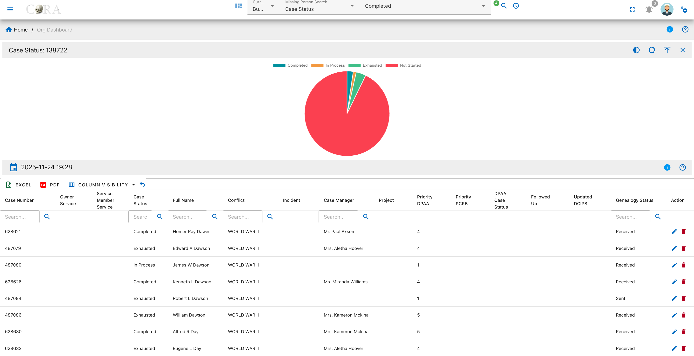

#### Overview

A pie chart on this page visualizes the case status distribution for all missing person records. The four status categories are:

* Completed
* In Process
* Exhausted
* Not Started

The chart legend defines each case status, and tooltips display the number of cases within each segment.

### Genealogy Status 

This page presents a detailed drilldown view of the Genealogy Status widget from the Missing Person Dashboard. Users can review the genealogy request progress for each missing person case, visualized by status in an interactive pie chart and detailed cases in a searchable table.

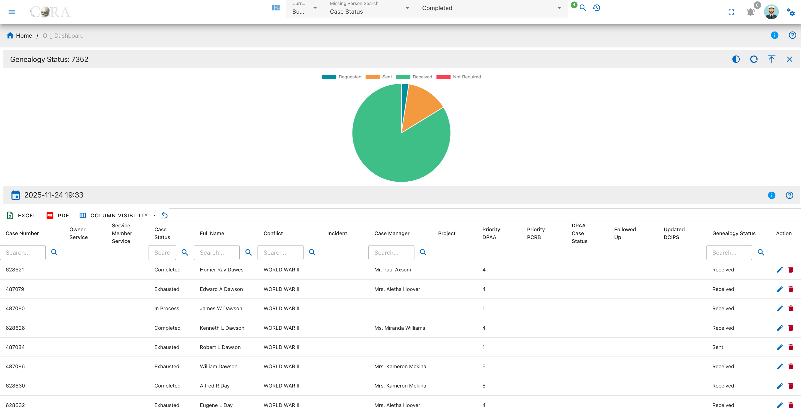

#### Overview

A pie chart on this page displays the breakdown of genealogy research statuses. The common categories include:

* Requested
* Sent
* Received
* Not Required

Hovering over the chart segments reveals the exact count for each category as shown in the legend.

### FRS 1 MTDNA Status 

This page displays a detailed drilldown of the FRS 1 MTDNA Status widget from the Missing Person Dashboard. Users can examine the statuses of Family Reference Sample (FRS) MTDNA requests for missing person cases, with both an interactive pie chart and a comprehensive data table.

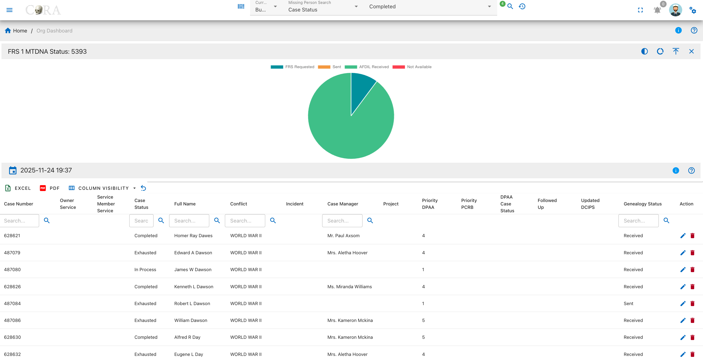

#### Overview

A pie chart on this page visualizes the current statuses for FRS 1 MTDNA requests. The four status categories are:

* FRS Requested
* Sent
* AFDIL Received
* Not Available

The chart legend identifies each status, and tooltips show precise case counts on hover.

### FRS 2 MTDNA Status 

This page presents a detailed drilldown view of the FRS 2 MTDNA Status widget from the Missing Person Dashboard. Users can review the fulfillment status for second Family Reference Sample (MTDNA) requests, visualized in an interactive pie chart and summarized in a comprehensive data table.

#### Overview

A pie chart on this page visualizes the current statuses for FRS 2 MTDNA requests. The four status categories are:

* FRS Requested
* Sent
* AFDIL Received
* Not Available

The chart legend identifies each status, and tooltips show precise case counts on hover.

### FRS 3 MTDNA Status 

This page presents a detailed drilldown view of the FRS 3 MTDNA Status widget from the Missing Person Dashboard. Users can review the status breakdown for third Family Reference Sample (MTDNA) requests across all missing person cases via an interactive pie chart and a searchable, filterable data table.

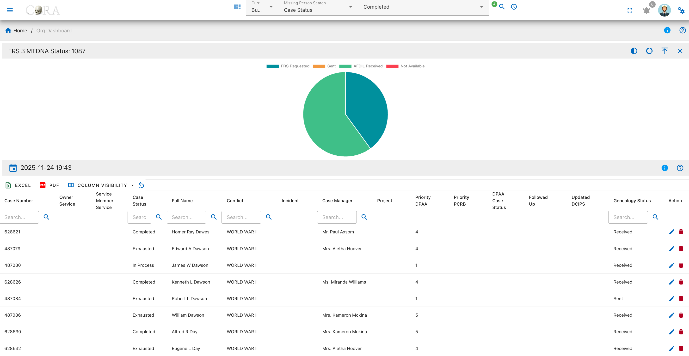

#### Overview

A pie chart on this page visualizes the current statuses for FRS 3 MTDNA requests. The four status categories are:

* FRS Requested
* Sent
* AFDIL Received
* Not Available

The chart legend identifies each status, and tooltips show precise case counts on hover.

### FRS 1 YStr Status 

This page presents a detailed drilldown view of the FRS 1 YStr Status widget from the Missing Person Dashboard. Users can analyze the progress and breakdown of first Family Reference Sample (YStr) requests for missing person cases, with both an interactive pie chart and a comprehensive data table.

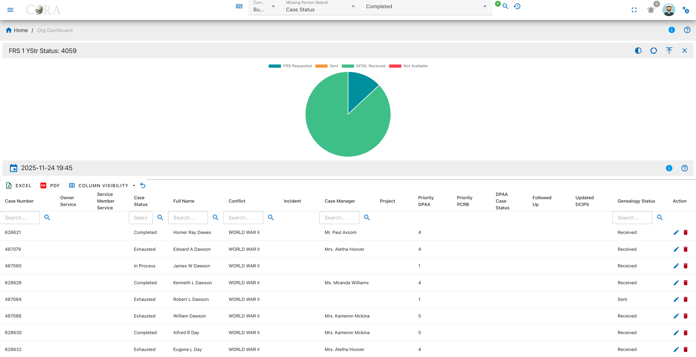

#### Overview

A pie chart on this page visualizes the status distribution for FRS 1 YStr sample requests. The four status categories are:

* FRS Requested
* Sent
* AFDIL Received
* Not Available

The legend defines each status; tooltips show how many cases fall into each group.

### FRS 2 YStr Status 

This page provides a breakdown of the second Family Reference Sample (YStr) request statuses for all missing person cases on the dashboard. Users can quickly visualize the distribution of FRS 2 YStr requests using an interactive pie chart and review detailed case information in a searchable, filterable data table.

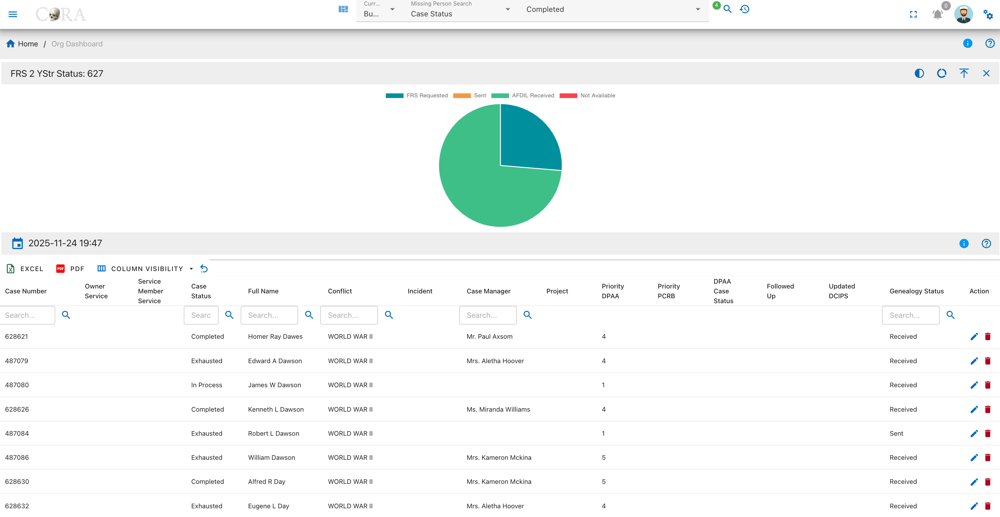

#### Overview

A pie chart on this page visualizes the status distribution for FRS 1 YStr sample requests. The four status categories are:

* FRS Requested
* Sent
* AFDIL Received
* Not Available

The legend defines each status; tooltips show how many cases fall into each group.

### FRS 1 AUSTR Status 

This page provides a detailed view of the first Family Reference Sample (AUSTR) request statuses for all missing person cases. The drilldown uses an interactive pie chart to visualize the distribution of AUSTR requests by status, alongside a searchable, filterable data table containing in-depth case data.

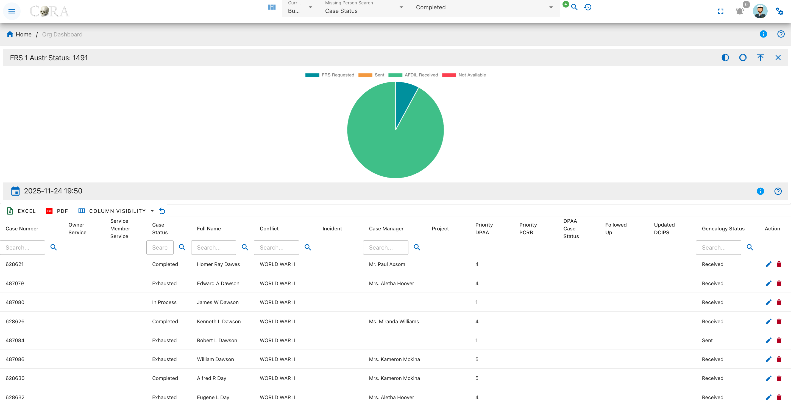

#### Overview

A pie chart on this page shows the breakdown of FRS 1 AUSTR request statuses. The primary categories are:

* FRS Requested
* Sent
* AFDIL Received
* Not Available

Each segment is labeled in the legend, and tooltips explain the case count for that status.

### FRS 2 AUSTR Status 

This page provides a detailed view of the second Family Reference Sample (AUSTR) request statuses for all missing person cases. The drilldown page features an interactive pie chart that visualizes the status distribution for FRS 2 AUSTR requests, as well as a searchable and filterable data table for in-depth case review.

#### Overview

A pie chart on this page shows the breakdown of FRS 2 AUSTR request statuses. The primary categories are:

* FRS Requested
* Sent
* AFDIL Received
* Not Available

Each segment is labeled in the legend, and tooltips explain the case count for that status.

### Followed Up 

This page provides a status summary of follow-up actions for missing person cases. The drilldown features an interactive pie chart and a detailed table, allowing users to quickly assess which cases have been followed up and which have not.

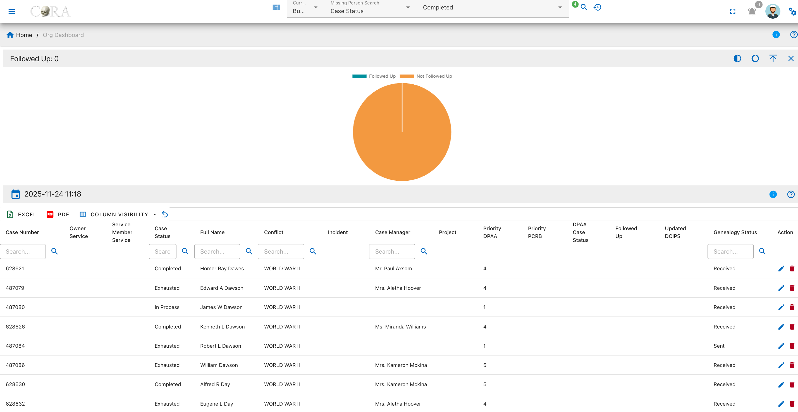

#### Overview

A pie chart on this page visualizes whether follow-up actions have been completed. The status categories are:

* Followed Up
* Not Followed Up

The legend differentiates completed from pending follow-ups, and tooltips display the number of cases in each.

### Updated DCIP 

This page provides a summary and tracking interface for the DCIP update status for all missing person cases. The drilldown features an interactive pie chart and a comprehensive data table, allowing users to evaluate which cases have up-to-date DCIP records and which do not.

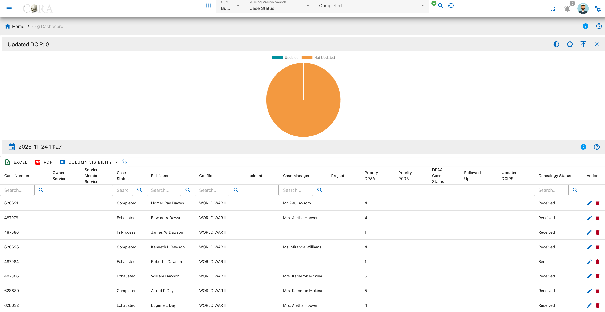

#### Overview

A pie chart on this page displays the update status for DCIP records. The categories are:

* Updated
* Not Updated

The chart legend identifies each status, and tooltips provide the exact number of cases for each.

### IDPF Status 

This page provides an overview and detailed tracking for the IDPF request status associated with missing person cases. The drilldown features an interactive pie chart and a searchable, filterable data table to help users monitor which IDPFs have been requested, received, or are not available.

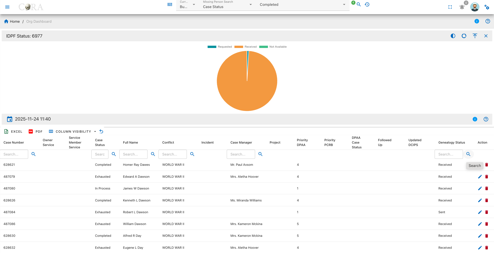

#### Overview

A pie chart on this page visualizes the request status for Individual Deceased Personnel Files. The categories are:

* Requested
* Received
* Not Available

The legend clarifies each segment, and tooltips show the precise number of cases.

### Conflict 

This page presents an analysis of the conflict or mission associated with all missing person cases. Users can visualize the distribution of cases by conflict type using an interactive pie chart, and review detailed case information in a searchable, filterable data table.

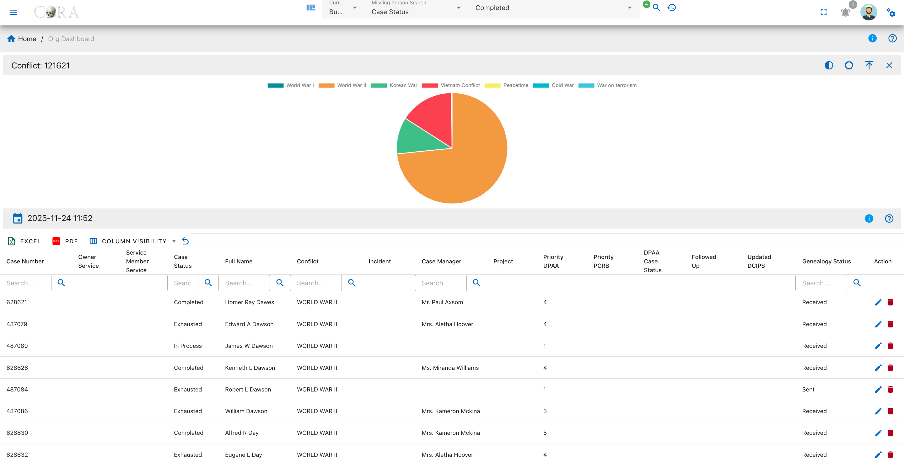

#### Overview

A pie chart on this page displays how cases are distributed by conflict or mission type. The categories are:

* World War I
* World War II
* Korean War
* Vietnam Conflict
* Peacetime
* Cold War
* War on Terrorism

The legend describes each colored segment, and tooltips reveal the number of cases per conflict.

### Case Managers 

This page summarizes the distribution of missing person cases assigned to each case manager. The drilldown features an interactive bar chart displaying case volume by manager and a sortable table showing totals for each individual assigned.

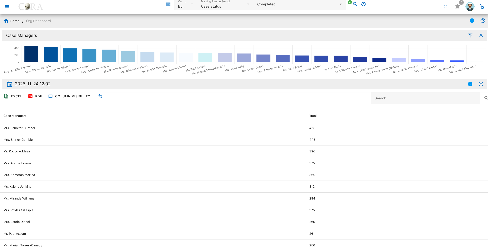

#### Overview

A bar chart on this page shows the total number of missing person cases assigned to each case manager. The table lists two fields for each manager:

* Case Manager
* Total

The chart legend labels each manager, and tooltips display the precise number of cases assigned to each manager when you hover over a bar.

#### Table Fields

Below the chart is a searchable, filterable table with key details for each case:

* Case Manager: The staff member assigned to missing person cases.
* Total: The number of cases assigned to that manager.

#### User Actions

* Searching: Use the search box to find managers by name.
* Sorting: Click any column header to sort the table data.
* Exporting: Download table data to Excel or PDF.
* Column Visibility: Choose which columns are displayed using the column visibility dropdown.
* Refresh: Reload the table using the refresh icon.
