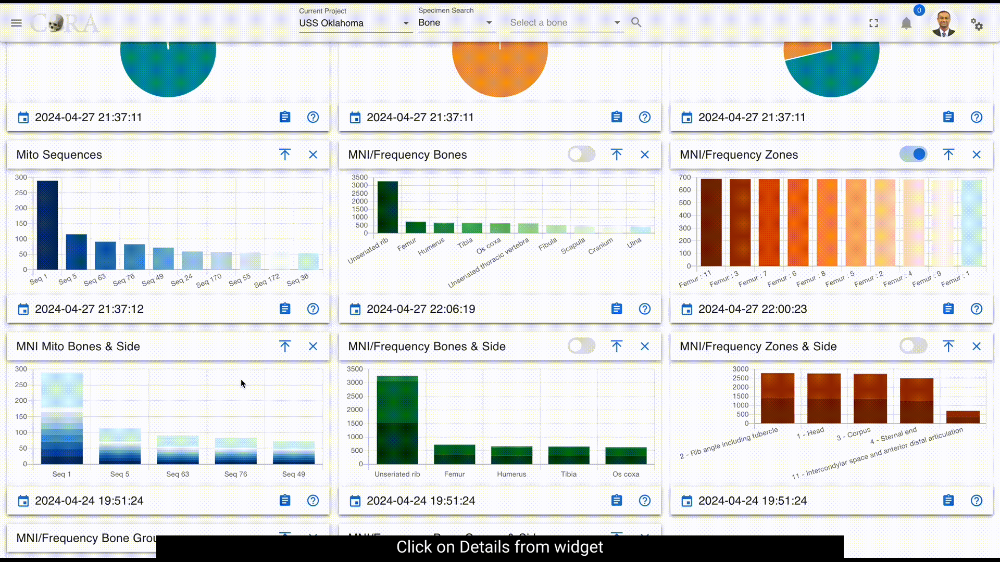
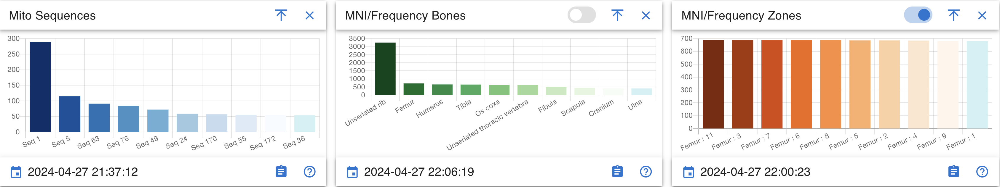
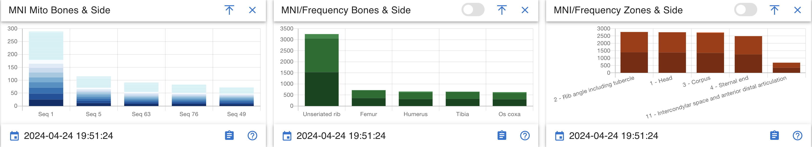

# Dashboards

!!! warning

    This page is work in progress.

# Dashboard Navigation

On the left side bar - you can access the main options for dashboards. 

There are three different dashboards available in CoRA with each view being driven by the user's profile attributes.
1.  The Org Admin Dashboard
2.  The Project Manager Dashboard
3.  The User Dashboard

## Dashboard Widgets

 Dashboards are made of many different widgets.  These widgets provide visualization for the data they represent.  Widgets can display Pie Charts, Line Charts, Bar Charts, Maps, etc...

  
Widgets come with a handful of standard features/functions. 

1.  Last Updated Timestamp
2.  Mouse Over Detail
3.  View Details (Drill Into The Data)
4.  Widget Controls

## Org Admin Dashboard

### Project Map

### Markers
The markers displayed on the map showcase the latitude and longitude of a particular project. 
On mouse over additional project details as well as a link 
to the corresponding project dashboard can be found in the in popup window.

### DNA Summary
A data table provides a link to a project dashboard and shows high level DNA summary details for each project

### Specimen Summary
A data table provides a link to a project dashboard and shows high level Skeletal Elements summary details for each project

### Isotope Summary
A data table provides a link to a project dashboard and shows high level Isotope summary details for each project

### Missing Person Summary
A data table provides a link to a project dashboard and shows high level Missing Person summary details for each project

## Project Manager Dashboard
The Project Manager Dashboard serves as a high level view of both summary and aggregated project data. 
The dashboard is comprised of *widgets*, which are individual visual representations of data.  Examples of those widgets include:
  
  * Skeletal Elements Associated To Individual
  * DNA Sample Information
  * Mito sequence Information
  * Inventory Process
  
Those *widgets* can be added and removed via the *widget selector*.  

The data in the dashboard is represented in 4 different formats:
 
  * Pie Chart
  * Bar Graph
  * Stacked Bar Graph
  * Line Graph

On Click of details from widgets project dashboard will be visible. It provides a detailed view of visualization and the data.

### Pie Chart 

Data can be visualized in different ways by *widget selector* for pie chart. 

The data in the widgets will be seen as shown below

Clicking on the show donut option provides a dynamic semicircle view, offering a perspective on data representation.

Clicking on show pie provides a dynamic pie view, offering a perspective on data representation.

On Click of details present on widgets, provides a detailed view of the visualization along with column details.

Below are the fields that are visible:

 * Key
 * Bone
 * Side
 * Bone Group
 * Individual Number
 * DNA Sample Number
 * Mito Sequence Number
 * Associations
 * Pathology
 * Methods
 * Measured
 * Complete
 * Isotope Sampled
 * Clavicle Triage
 * CT Scanned
 * Xray Scanned
 * Inventoried
 * Reviewed
 * Inventoried By

### Bar Graph

Bar Graph helps provide comparisons between discrete categories or groups.

On Click of details present on widgets, provides a detailed view of the visualization along with column details.

Below are the fields that are visible:
 
* Mito Sequence Number
* Total

***These fields will vary depending on type of module selected***

### Stacked Bar graph

Stacked bar graph is divided into segments or "stacks" to represent different categories or subgroups within a single category.

On Click of details present on widgets, provides a detailed view of the visualization along with column details.

Below are the fields that are visible:

* bone
* side
* Total

***These fields will vary depending on type of module selected***

### Line graph

Line graph helps visualize data trends over time or across different data categories.

Line graph widget contains the following:

* Line step
* Days
* Point Style

 
## User Dashboard
The User Dashboard serves as a high level view of both summary and aggregated user data. 

### User Activity

User activity contains *widgets*, which are individual visual representations of data.  Examples of those widgets include:

* Skeletal Elements Assocciated To Individual
* DNA Sample Information

Those *widgets* can be added and removed via the *widget selector*. User activity widgets are present in the Org admin dashboards

On Click of key from the user activity widget present on dashboard shows the specimen page with details to edit and other actions.

On Click of details present on widgets, provides all the data for the selected module.

Below are the fields that are visible:

* Key
* Name
* Side
* Completeness
* Individual Number
* Measured
* Isotope Sampled
* Clavicle Triage
* CT Scanned
* Xray Scanned 
* Inventoried
* Reviewed
* Inventoried At
* Reviewed At
* Created By
* Created At
* Updated By
* Updated At

***These fields will vary depending on type of module selected***

 
 
