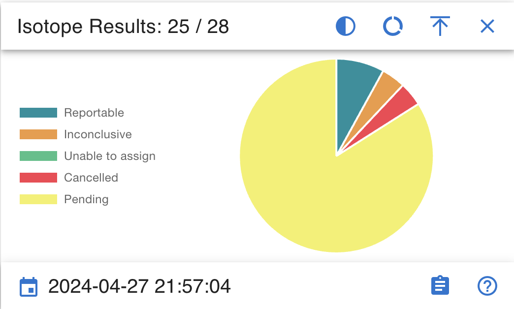
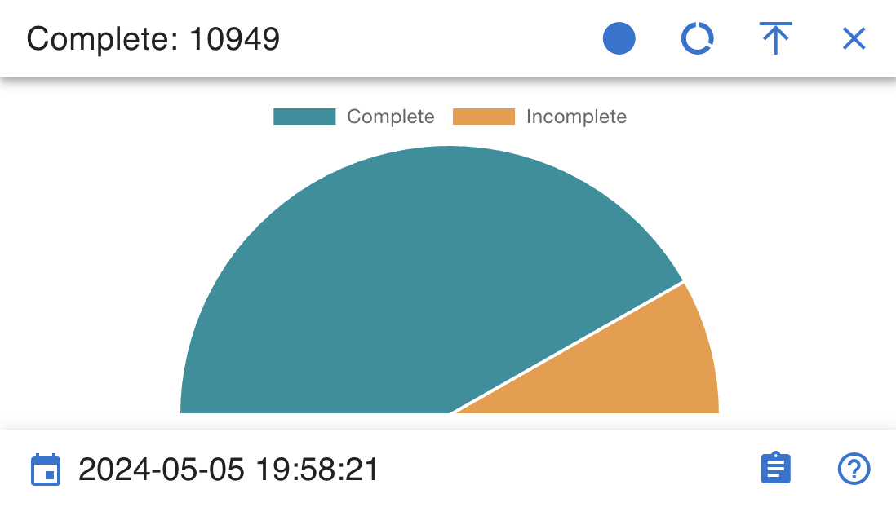

# Dashboards

## Dashboard Navigation

On the left side bar - you can access the main options for dashboards. 

There are many different dashboards available in CoRA with each view being driven by the user's profile attributes.

 1. The Org Admin Dashboard
 2. The Project Manager Dashboard
 3. The User Dashboard
 4. The DNA Dashboard
 5. The Isotope Dashboard
 6. The Missing Person Dashboard
 7. The Individual Analytics Dashboard
 8. The Individual Dashboard - coming soon

## User Preferences for Dashboard

CoRA dashboards provide several user preference options that allow you to customize your dashboard layout and view according to your workflow needs. These preferences enable you to personalize widget arrangement, visibility, and overall dashboard organization.

### Accessing the Dashboard

There are two ways to access your project dashboard:

1. **Dashboard Icon Method**: Click the dashboard icon located next to the "Current Project" dropdown in the top navigation bar
2. **Sidebar Method**: Click "Dashboard" from the left sidebar navigation menu

{ width="700" }

Both methods will navigate you to the project dashboard view where you can utilize the user preference features.

### Collapse and Expand

The collapse and expand feature allows you to quickly manage the visibility of all widgets on your dashboard simultaneously.

{ width="700" }

**To collapse all widgets:**
1. Locate the collapse/expand icon in the top toolbar (positioned before the help icon)
2. Click the icon once to collapse all dashboard widgets
3. All widgets will minimize, showing only their titles and basic information

**To expand all widgets:**
1. Click the same collapse/expand icon again
2. All widgets will return to their full expanded view, displaying their complete data visualizations

This feature is particularly useful when you need to:
- Get a quick overview of available widgets without scrolling
- Temporarily reduce visual clutter on the dashboard
- Quickly navigate between different sections of a large dashboard

### Drag and Drop Widgets

The drag and drop functionality enables you to rearrange widgets on your dashboard to create a personalized layout that matches your workflow preferences.

{ width="700" }

**To move widgets:**
1. Position your cursor over the widget you want to move
2. Click and hold on the widget's header area
3. Drag the widget to your desired location on the dashboard
4. Release the mouse button to drop the widget in its new position

**Layout Benefits:**
- Prioritize frequently used widgets by placing them at the top
- Group related widgets together for easier data comparison
- Create a workflow-optimized arrangement based on your daily tasks

The drag and drop feature maintains your custom layout throughout your session, allowing you to work more efficiently with your preferred widget organization.

### Remove Widgets

You can remove individual widgets from your dashboard view to focus only on the data that's relevant to your current work.

{ width="700" }

**To remove a widget:**
1. Locate the widget you want to remove
2. Click the "X" (cross) icon in the widget's control area (top-right corner of the widget)
3. The widget will immediately disappear from your dashboard view

**Important Notes:**
- Removing a widget only hides it from your current dashboard view
- The widget and its data are not permanently deleted
- You can restore removed widgets using the Reset Dashboard feature
- This feature helps create a cleaner, more focused workspace

### Reset Preferences

The reset dashboard feature allows you to quickly restore your dashboard to its original default state, undoing all customizations you've made.

**To reset your dashboard:**
1. Locate the reset dashboard icon in the top toolbar
2. Click the reset icon
3. Your dashboard will immediately return to the default layout

{ width="700" }

**What gets reset:**
- **Widget positions**: All widgets return to their original default positions
- **Removed widgets**: Any widgets you've closed/removed will reappear on the dashboard
- **Custom arrangements**: Your personalized drag-and-drop layout will be restored to the system default

**When to use reset:**
- When you want to start fresh with widget arrangement
- If you've accidentally removed important widgets and want them back quickly
- When switching between different types of analysis work that require different layouts
- To restore the dashboard after experimenting with different configurations

The reset feature provides a quick way to return to a known working state without having to manually restore each individual change.

## Dashboard Widgets

 Dashboards are made of many different widgets.  These widgets provide visualization for the data they represent.  Widgets can display Pie Charts, Line Charts, Bar Charts, Maps, etc...

{ width="400" }
  
Widgets come with a handful of standard features/functions. 

1.  Last Updated Timestamp :-  It shows the latest date when the data was updated. From the above image the last updated timestamp is shown at bottom left corner

2.  Mouse Over Detail :- On hovering over the graphs present in the widgets provides information on data.
{ width="400" }

3.  View Details (Drill Into The Data) :- On click of details from the widget gives all the details of the visual data represented.
{ width="400" }

4.  Widget Controls :- The common widget controls present on all the widgets are
* Collapse
* Close
{ width="400" }

* Help-Cora Docs
  { width="400" }

## Pie Chart

The widgets that shows data in pie chart has different options to view data.

1. Semi Circle:- Clicking on the semi-circle option provides a dynamic semicircle view, offering a perspective on data representation.

{ width="400" }

{ width="400" }

2. Full Circle:- Clicking on the full-circle option provides a dynamic full circle view, offering a perspective on data representation.

{ width="400" }

{ width="400" }

3. Show Donut:- Clicking on Donut option provides a dynamic donut view of data representation.

{ width="400" }

{ width="400" }

4. Show Pie:- Clicking on Pie option provides a dynamic Pie view of data representation.

{ width="400" }

{ width="400" }

## Bar Graph & Stacked Bar Graph

The widgets for bar graph has a toggle switch. 

The toggle switch has 2 options:

1. Show all
2. Show MNI Data

If the toggle switch is deactivated, bar graph/stacked bar graph would show data for all.

{ width="500" }
{ width="500" }

If the toggle switch is activated, bar graph/stacked bar graph would show data related to MNI Only

{ width="500" }

## Line Graph

The widgets that shows data in Line graph has different options to view data.

Line graph has below widget controls:

1. Line Step
2. Days
3. Point Style

### Line Step

Line step is a dropdown which shows 4 options to select from

{ width="200" }

The view of data in line graph changes depending on the Line step chosen. Below image shows data for line step selected as "before".

{ width="500" }

### Days

Days is a dropdown which shows 4 options to select from

{ width="200" }

The view of data in line graph changes depending on the days selected. If the days selected is 180 or 1 year then the line graph will show a lot of data compared to days selected as 30 or 90. Below image shows data for days selected as "180 days".

{ width="500" }

### Point Style

Point style is also a dropdown which shows 4 options to select from

{ width="200" }

The view of data in line graph changes depending on the point style chosen. Below image shows data when point style selected is "Triangle".

{ width="500" }

