# Isotope Dashboard

The **Isotope Dashboard** provides a comprehensive visual overview of isotopic data and laboratory progress within CoRA.  
It helps analysts, isotope specialists, and researchers monitor the entire workflow from **demineralization** and **collagen extraction** to **isotope measurement** and **ratio analysis** through interactive charts and analytical metrics.

## Accessing the Isotope Dashboard

To open the Isotope Dashboard:

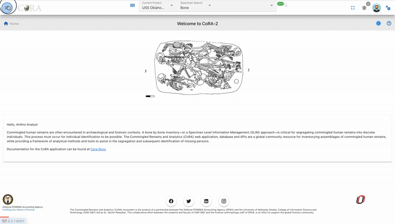{ width="800" }

## Dashboard Overview

Once the page loads, you’ll see a collection of **draggable**, **collapsible**, and **interactive widgets**.  
Each widget represents a unique phase or analytical aspect of isotope processing from **sample results** to **elemental isotope analyses**.

The dashboard includes **pie charts**, **donut charts**, and a **timeline chart** that visually summarize data completeness and lab progress across projects.

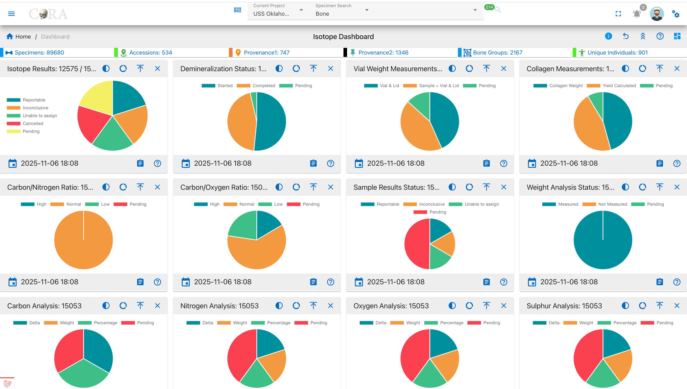{ width="800" }

## Widget Interaction

Each widget in the dashboard is fully interactive and customizable:

### Collapse / Expand

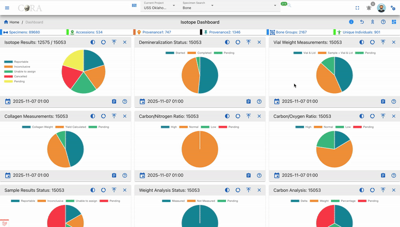{ width="800" }
  
- To manage all widgets at once, use the **Collapse All / Expand All** buttons at the top of the dashboard.

### Drilldown

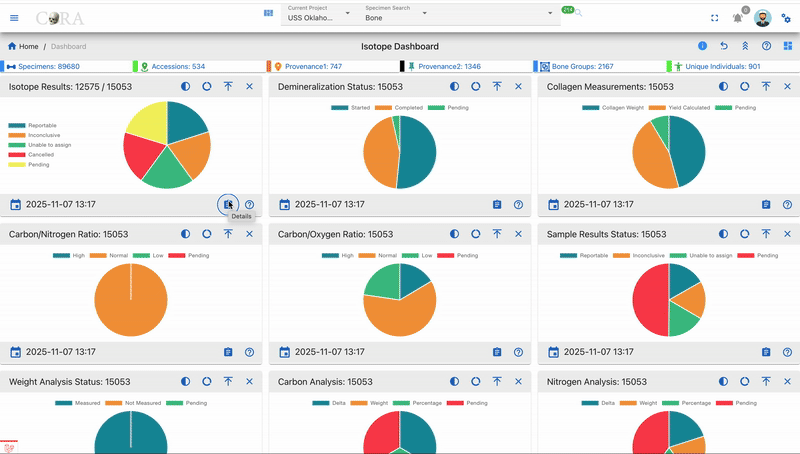{ width="800" }

- Click any **pie segment** or chart bar to view detailed, filtered data for that specific category (e.g., Reportable Results).

### Reorder Widgets

- Click and drag widgets to rearrange them on the dashboard.  
- The layout is automatically saved in your browser’s localStorage, so your preferences persist between sessions.

### Timestamp

{ width="200" }

- Each widget shows a **timestamp** (e.g., *2025-11-05 18:24*) at the bottom, indicating when its data was last refreshed.

## Chart Controls and Visualization Modes

Every widget contains a set of **chart control icons** in the top right corner.  
These controls help users customize visualization, open documentation, and manage layout making interpretation of isotope data more intuitive.

### Chart Control Icons

| **Icon** | **Name** | **Function / Description** |
|-----------|-----------|-----------------------------|
| **? (Help Link)** | **Documentation Access** | Opens the related **CoRA User Documentation** in a new tab. This helps users understand the scientific process behind that widget (e.g., Demineralization, Collagen Yield, or Isotope Analysis). |
| **⭘ / ◉ / ◔** | **Chart Type Toggle** | Switches between:  - **Full Pie:** complete dataset view.  - **Half Pie:** highlights progress (e.g., completed vs pending).  - **Donut:** shows a ringed chart emphasizing proportions. |
| **⇵ (Collapse)** | **Toggle Visibility** | Minimizes or expands the widget body while keeping its title visible. |
| **× (Close)** | **Remove Widget** | Temporarily hides the widget from the view; restoring it requires page refresh. |

### Chart Visualization Types

#### 1 Full Pie Chart

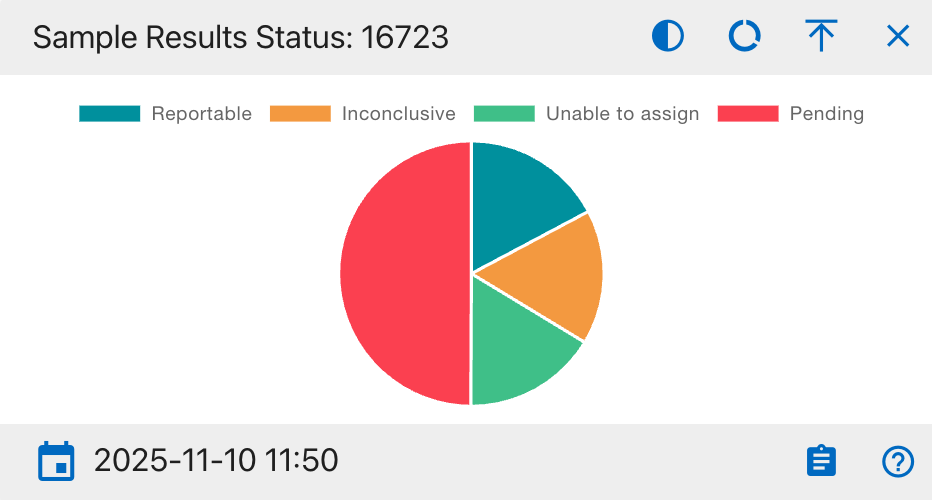{ width="400" }

- Displays the **complete dataset** as a 360° circle.  
- Best for viewing category distribution.  
- Each color segment shows its proportional share out of the total.

**Use when:** You want a full snapshot of how data is distributed across categories.

#### 2 Half Pie Chart

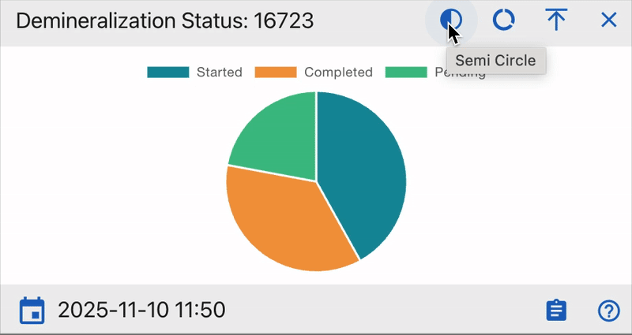{ width="400" }

- Shows only the **top half** of the chart ideal for **progress visualization** (e.g., completed vs pending).  
- Provides a clean comparison of workflow completion rates.

**Use when:** You want to monitor lab progress or readiness visually.

#### 3 Donut Chart

{ width="400" }

- Displays the chart as a **ring** with a hollow center.  
- The empty middle area draws attention to completed vs remaining work.  
- Often used for **ratio** and **yield** comparisons.

**Use when:** You want to emphasize proportional completeness or compare processed vs unprocessed data.

###  4 “?” Help Link Integration

Each widget contains a **question mark (?)** icon linking directly to CoRA’s official User Documentation.  
This feature connects real-time analytics to the lab procedures that generate the data.

### Tips for Users

- Use **Donut Mode** for visual progress tracking.  
- Use **Half Pie Mode** for workflow monitoring.  
- Click **?** to access the relevant **CoRA docs** for step by step explanations.  
- Expand (**⤢**) and switch to Full Pie for detailed reviews.

## Understanding the Dashboard Widgets

Each widget in the Isotope Dashboard visualizes a specific isotopic analysis process or metric.  
All are color-coded, interactive, and linked to drilldown views for deeper exploration.

### General Notes

- Each chart segment is clickable and supports drilldown exploration.  
- Hovering over segments shows precise counts and percentages.  
- Widgets update automatically when isotope data changes or seeding is rerun.  
- Timestamps indicate the last data refresh.

Together, these widgets offer both qualitative (status, workflow completion) and quantitative (ratios, percentages) insights into isotope analysis.  
They enable analysts to monitor sample quality, detect irregularities, and validate isotopic data across projects and organizations.

### Isotope Results
**Purpose:**  
Displays isotopic sample results based on reporting status.

{ width="400" }

**Pie Chart Segments:**

- **Reportable:** Verified isotopic results ready for reporting.  
- **Inconclusive:** Data analyzed but not definitive.  
- **Unable to Assign:** Data insufficient for conclusion.  
- **Cancelled:** Invalidated or canceled tests.  
- **Pending:** Samples awaiting processing.

**How to Use:**  
Track analytical output and pending workload. Click on any segment to drill down to project-level data.

### Demineralization Status
**Purpose:**  
Tracks sample demineralization progress essential for collagen extraction.

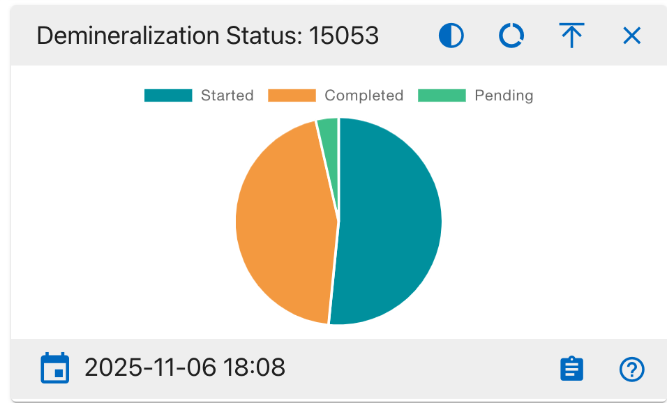{ width="400" }

**Pie Chart Segments:**

- **Started:** Demineralization initiated.  
- **Completed:** Process finished.  
- **Pending:** Not started.

**How to Use:**  
Confirm progress of sample preparation. High *Completed* means readiness for further processing.

### Vial Weight Measurements
**Purpose:**  
Monitors vial-based weighing consistency.

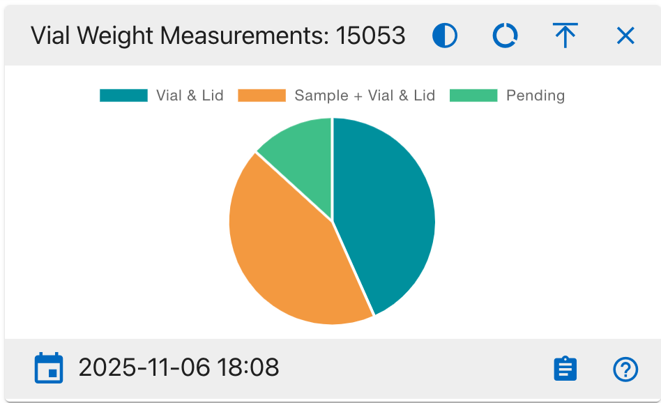{ width="400" }

**Pie Chart Segments:**

- **Vial & Lid:** Empty container weight.  
- **Sample + Vial & Lid:** Sample included weight.  
- **Pending:** Measurements not done.

**How to Use:**  
Used for verifying pre- and post weighting consistency to ensure analytical accuracy.

### Collagen Measurements
**Purpose:**  
Shows extracted collagen weight and yield.

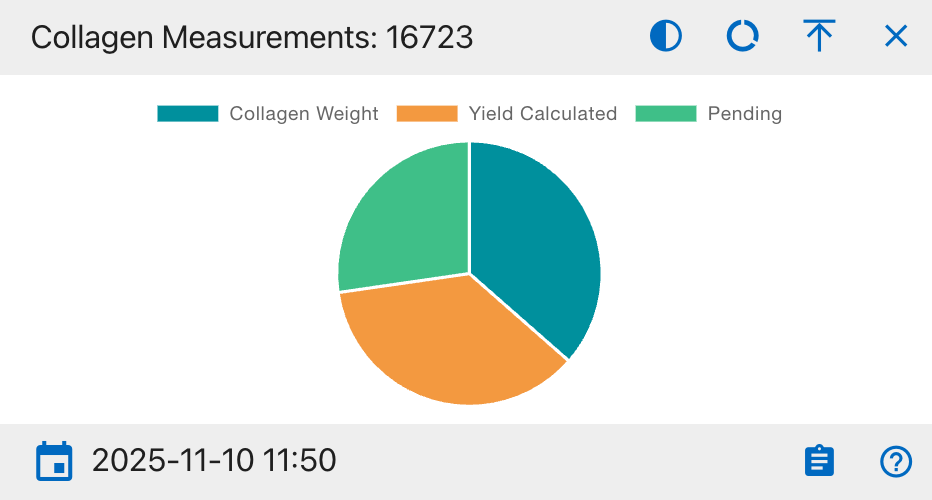{ width="400" }

**Pie Chart Segments:**

- **Collagen Weight:** Extracted weight recorded.  
- **Yield Calculated:** Yield percentage computed.  
- **Pending:** Not yet completed.

**How to Use:**  
Tracks collagen recovery efficiency. High *Pending* means incomplete or delayed extractions.

### Carbon/Nitrogen Ratio (C:N)
**Purpose:**  
Evaluates collagen preservation via C:N ratio.

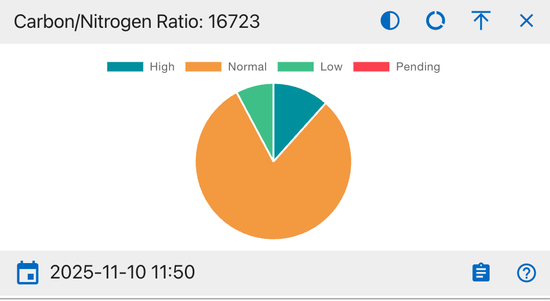{ width="400" }

**Pie Chart Segments:**

- **High (>3.6):** Indicates contamination or degradation.  
- **Normal (2.9–3.6):** Ideal preservation range.  
- **Low (<2.9):** Possible underprocessing.  
- **Pending:** Ratio not computed.

**How to Use:**  
Healthy samples fall mostly under *Normal*. Alerts if ratio trends deviate.

### Carbon/Oxygen Ratio (C:O)
**Purpose:**  
Analyzes isotopic stability via C:O ratio.

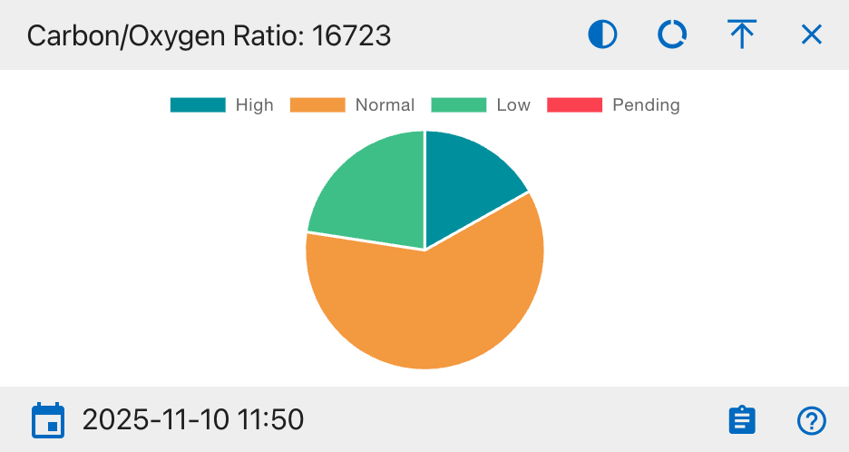{ width="400" }

**Pie Chart Segments:**

- **High (>1.4):** Oxygen deficiency.  
- **Normal (1.1–1.4):** Balanced.  
- **Low (<1.1):** Oxygen rich contamination.  
- **Pending:** Not calculated.

**How to Use:**  
Used for consistency checks in isotope balance assessments.

### Sample Results Status
**Purpose:**
Displays overall isotope sample distribution by result status for tracking analytical completion.
{ width="400"}

**Pie Chart Segments:**

- **Reportable:** Verified isotopic results ready for reporting.
- **Inconclusive:** Data analyzed but not definitive.
- **Unable to Assign:** Insufficient data to categorize.
- **Pending:** Samples awaiting processing.

**How to Use:**
Monitor lab analysis completion and identify pending or inconclusive samples. A higher Reportable ratio indicates improved analysis progress.

### Weight Analysis Status
**Purpose:**
Shows progress of sample weighing during isotope preparation.

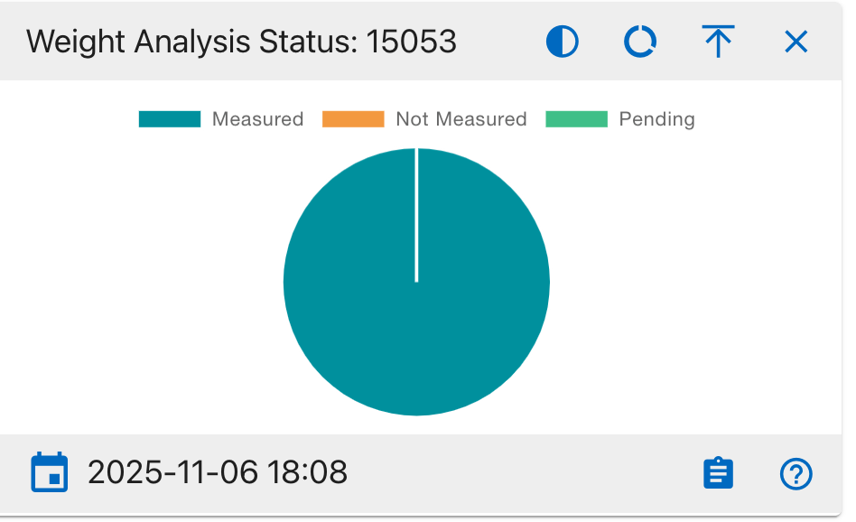{ width="400"}

**Pie Chart Segments:**

- **Measured:** Samples successfully weighed.
- **Not Measured:** Samples yet to be weighed.
- **Pending:** Awaiting confirmation or data entry.

**How to Use:**
Use this chart to verify weighing consistency and data completeness before analysis. A high Measured ratio indicates accurate preparation workflow.

### Carbon Analysis (δ¹³C)
**Purpose:**  
Visualizes completeness of carbon isotopic readings.

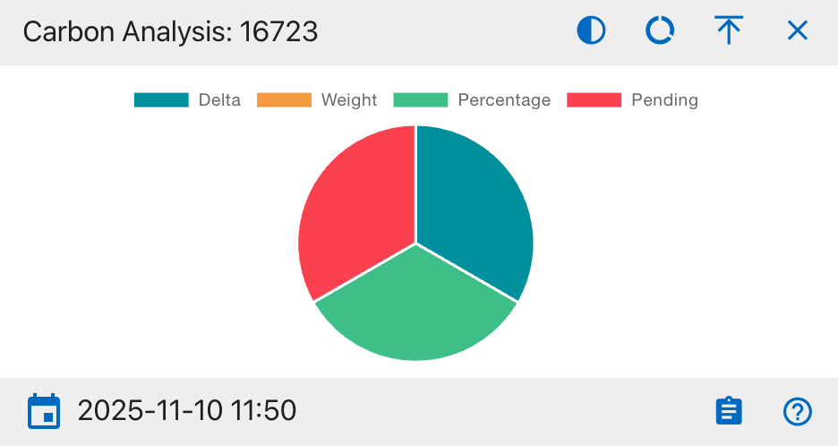{ width="400" }

**Pie Chart Segments:**

- **Delta (δ¹³C):** Delta value recorded.  
- **Weight:** Carbon weight data present.  
- **Percentage:** Percent value entered.  
- **Pending:** Missing carbon data.

**How to Use:**  
Ensures all carbon-related fields are filled before analysis.

### Nitrogen Analysis (δ¹⁵N)
**Purpose:**  
Displays nitrogen isotope data completeness.

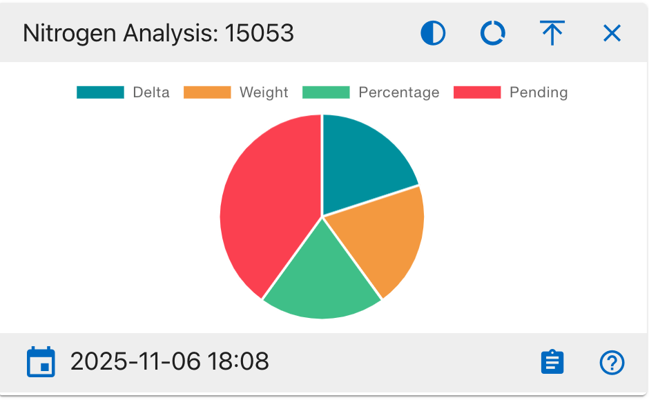{ width="400" }

**Pie Chart Segments:**

- **Delta (δ¹⁵N):** Delta measured.  
- **Weight:** Weight recorded.  
- **Percentage:** Percent recorded.  
- **Pending:** Incomplete nitrogen data.

**How to Use:**  
Used by analysts studying dietary or ecological nitrogen variations.

### Oxygen Analysis (δ¹⁸O)
**Purpose:**  
Shows isotopic completeness for oxygen.

{ width="400" }

**Pie Chart Segments:**

- **Delta (δ¹⁸O):** Delta recorded.  
- **Weight:** Weight recorded.  
- **Percentage:** Percentage calculated.  
- **Pending:** Missing oxygen data.

**How to Use:**  
Ensures oxygen-related readings are sufficient for isotopic comparison.

### Sulphur Analysis (δ³⁴S)
**Purpose:**  
Summarizes sulphur isotope analysis results.

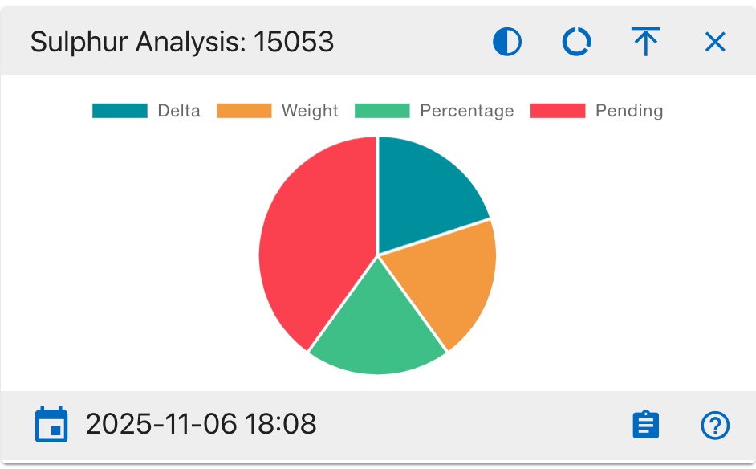{ width="400" }

**Pie Chart Segments:**

- **Delta (δ³⁴S):** Delta measured.  
- **Weight:** Weight captured.  
- **Percentage:** Percent value recorded.  
- **Pending:** Awaiting analysis.

**How to Use:**  
Helps evaluate trace element (sulphur) data completeness.

### Isotopes (Line Chart)
**Purpose:**  
Displays time-based progress of isotope sample processing.

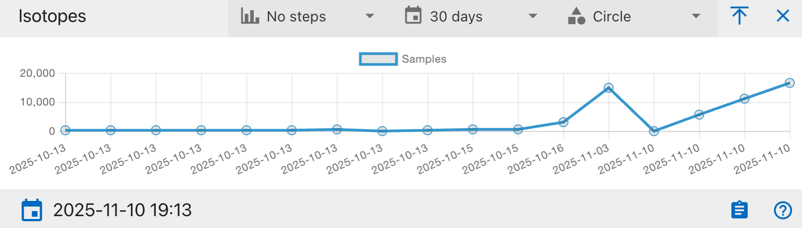{ width="500" }

**Chart Axes:**

- **X-Axis:** Processing or entry date.  
- **Y-Axis:** Number of analyzed samples.

**How to Use:**  
Used to track throughput trends or identify bottlenecks.
