# Missing Person Dashboard

The Missing Person Dashboard provides a centralized interface for tracking, visualizing, and analyzing all Missing Person records within CoRA. It helps organization administrators and case managers to view key statistics and quickly access details for ongoing cases.

## Navigation

To access the Missing Person Dashboard, use the left sidebar and select 'Missing Person Dashboard'. The dashboard will appear with various widgets and visual summaries.

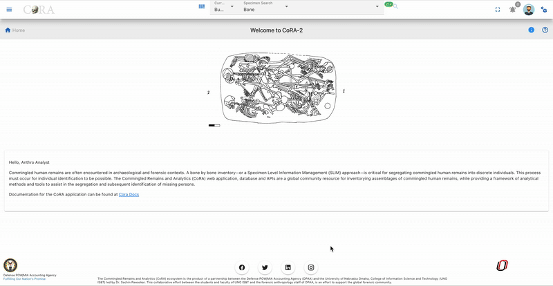{width="800"}

On the left side bar - you can access the main options for dashboards. 

We can see the dashboard for Missing person.

## Dashboard Overview

The Missing Person Dashboard provides visual insights into the status and progress of missing persons cases through a variety of widgets. These include pie charts and bar graphs that display case statuses, genealogical statuses, conflict categories, and case manager workloads. Each widget is interactive, allowing users to view detailed data, apply filters, and drill into specific case information. This centralized dashboard supports efficient case management and monitoring for organization administrators and case managers.

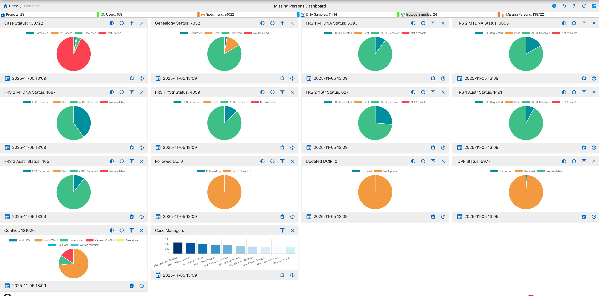{width="800"}

This dashboard provides essential tools to support effective case management and monitoring of missing persons within organization. For further information, detailed instructions, and troubleshooting, please refer to the comprehensive help documentation.

## Widget Controls & Interactive Features

This dashboard supports the following user interactions and controls:

**Common Controls**

* Expand, Collapse & Close - Adjust widget layout for optimal viewing.
* Help/Info Icon - Access widget usage details and documentation links.

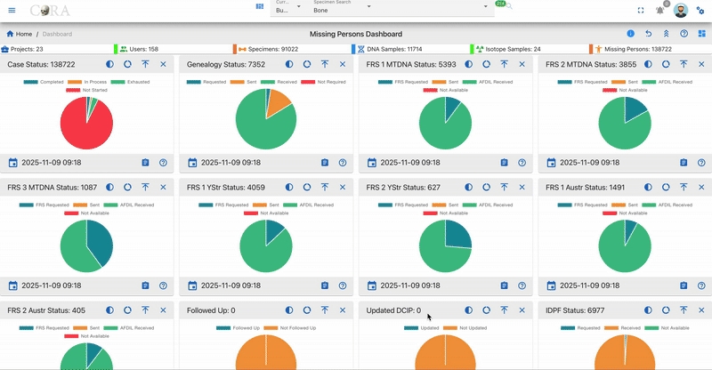{width="800"}

**Interactivity**

* Hover for Details - Move your mouse over chart segments or bars to view tooltips and counts.
* Drill Down - Click chart elements to reveal detailed tables or filtered records for deeper investigation.

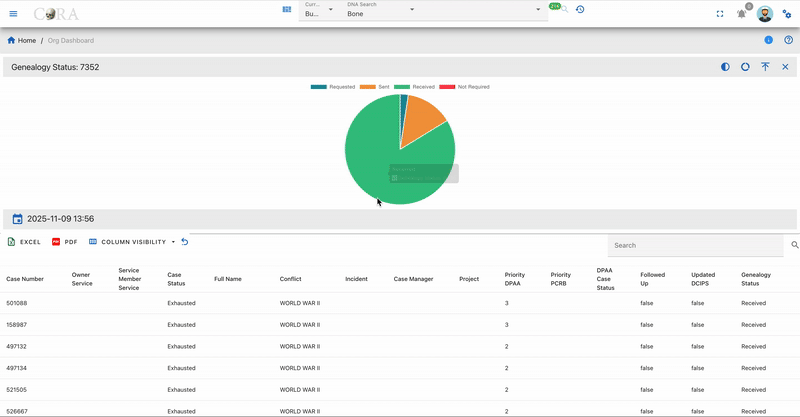{width="800"}

**Data Operations**

* Export - Download data tables to Excel or PDF using icons above each table.
* Column Visibility - Choose which data columns to display.
* Search & Filter - Use the built-in table search for rapid filtering.

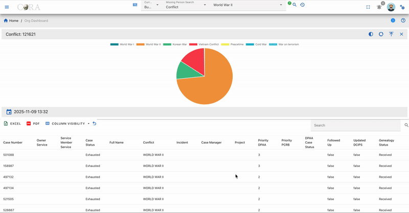{width="800"}

**Data Freshness**
* Timestamp - A 'Last Updated' timestamp is shown below each widget, so you can confirm the data is up to date.

{width="400"}

## Chart Visualization Types

The dashboard uses three main types of charts: full pie charts, which display a complete 360-degree representation of category proportions; half pie charts, which offer a compact semicircular visualization suitable for binary comparisons or space-constrained layouts; and donut charts, which emphasize individual segments while providing space in the center for additional information or layered data. Each chart type supports interactive features like hover tooltips and click-through details for enhanced user engagement.

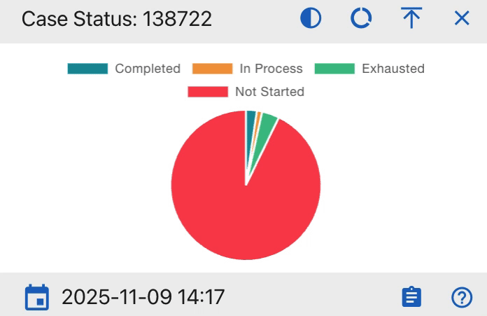{width="400"}

## Widget Details

Below is a detailed description of each widget included in the Missing Person Dashboard, their purpose, and interaction capabilities.

### Case Status Pie Chart

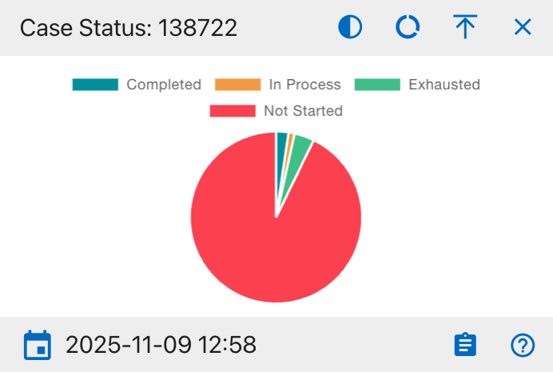{width="400"}

The details shown include:

* Completed
* In Process
* Exhausted
* Not Started

This widget provides a visual breakdown of all missing person case statuses within the organization. The pie chart displays the proportion of cases that are completed, in process, exhausted, or not started. Users can hover over segments for further data and click to export the supporting table to Excel or PDF. Filters and column visibility options are available in the integrated data table beneath the chart.

### Genealogy Status Pie Chart

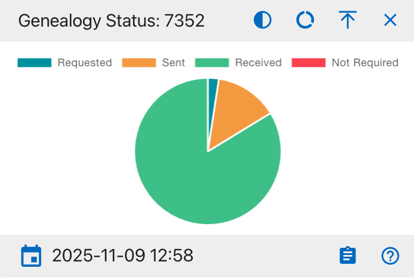{width="400"}

The details shown include:

* Requested
* Sent
* Received
* Not Required

This widget displays the current genealogy status for missing person cases. The pie chart segments represent the cases that have been requested, sent, received, or do not require genealogy updates. Users can hover over segments for further data and click to export the supporting table to Excel or PDF. Filters and column visibility options are available in the integrated data table beneath the chart.

### FRS 1 MTDNA Status Pie Chart

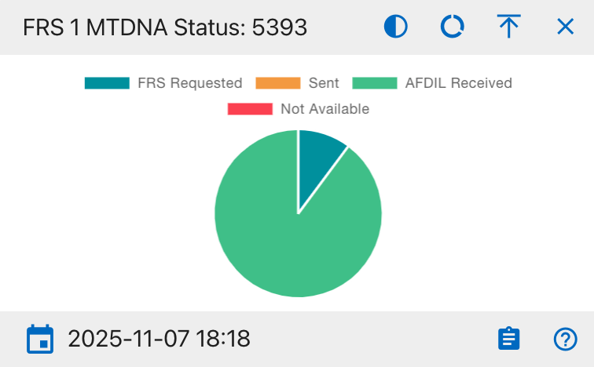{width="400"}

The details shown include:

* FRS Requested
* Sent
* AFDIL Received
* Not Available

This widget displays the status distribution of the first Family Reference Sample (MTDNA) requests for all missing person cases. The pie chart sections represent the proportion of samples that are requested, sent, received by AFDIL, or not available. Users can hover over segments for further data and click to export the supporting table to Excel or PDF. Filters and column visibility options are available in the integrated data table beneath the chart.

### FRS 2 MTDNA Status Pie Chart

{width="400"}

The details shown include:

* FRS Requested
* Sent
* AFDIL Received
* Not Available

This widget displays the status distribution for the second Family Reference Sample (MTDNA) requests in missing person cases. Users can hover over segments for further data and click to export the supporting table to Excel or PDF. Filters and column visibility options are available in the integrated data table beneath the chart.

### FRS 3 MTDNA Status Pie Chart

{width="400"}

* FRS Requested
* Sent
* AFDIL Received
* Not Available

This widget displays the status of the third Family Reference Sample (MTDNA) requests for missing person cases. Users can hover over segments for further data and click to export the supporting table to Excel or PDF. Filters and column visibility options are available in the integrated data table beneath the chart.

### FRS 1 YStr Status Pie Chart

{width="400"}

* FRS Requested
* Sent
* AFDIL Received
* Not Available

This widget displays the status of the first Family Reference Sample (YStr) requests for missing person cases. Users can hover over segments for further data and click to export the supporting table to Excel or PDF. Filters and column visibility options are available in the integrated data table beneath the chart.

### FRS 2 YStr Status Pie Chart

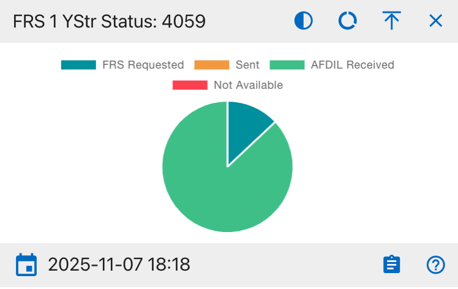{width="400"}

* FRS Requested
* Sent
* AFDIL Received
* Not Available

This widget provides the status distribution for the second Family Reference Sample (YStr) requests in missing person cases. Users can hover over segments for further data and click to export the supporting table to Excel or PDF. Filters and column visibility options are available in the integrated data table beneath the chart.

### FRS 1 AUSTR Status Pie Chart

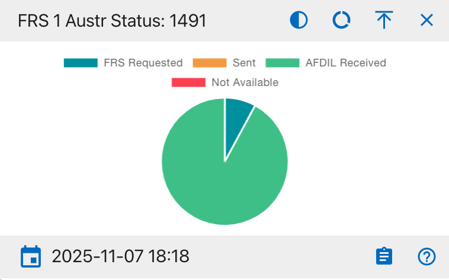{width="400"}

* FRS Requested
* Sent
* AFDIL Received
* Not Available

This widget displays the status breakdown of the first Family Reference Sample (AUSTR) requests for missing person cases. Users can hover over segments for further data and click to export the supporting table to Excel or PDF. Filters and column visibility options are available in the integrated data table beneath the chart.

### FRS 2 AUSTR Status Pie Chart

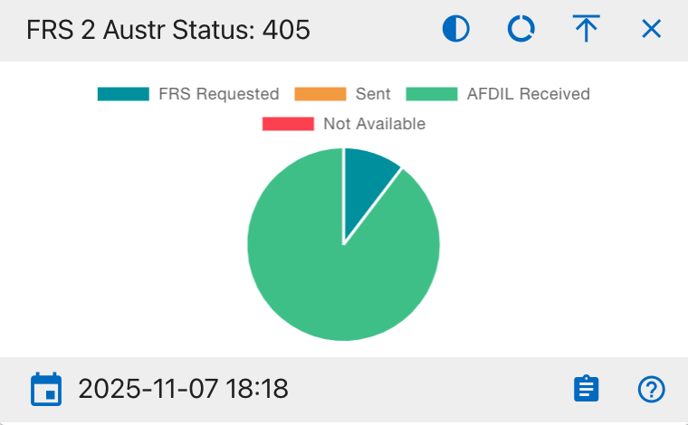{width="400"}

* FRS Requested
* Sent
* AFDIL Received
* Not Available

This widget displays the status breakdown of the second Family Reference Sample (AUSTR) requests for missing person cases. Users can hover over segments for further data and click to export the supporting table to Excel or PDF. Filters and column visibility options are available in the integrated data table beneath the chart.

### Followed Up Pie Chart

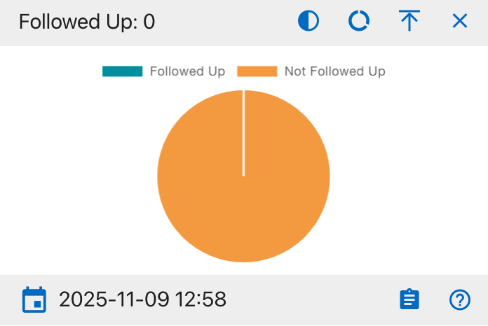{width="400"}

* Followed Up
* Not Followed Up

This widget displays the proportion of missing person cases that have been followed up by a case manager. Users can hover over segments for further data and click to export the supporting table to Excel or PDF. Filters and column visibility options are available in the integrated data table beneath the chart.

### Updated DCIP Pie Chart

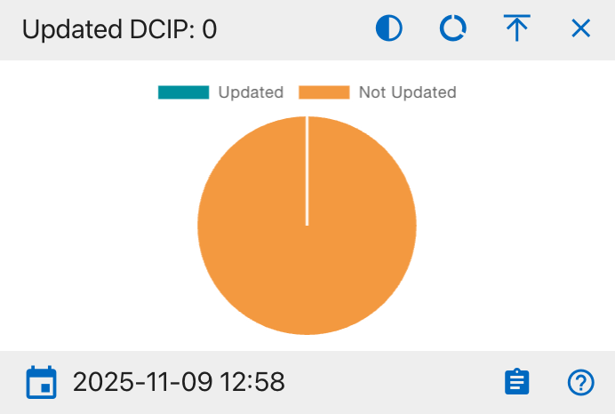{width="400"}

* Updated
* Not Updated

This widget displays how many missing person cases have their DCIP records updated versus not updated. Users can hover over segments for further data and click to export the supporting table to Excel or PDF. Filters and column visibility options are available in the integrated data table beneath the chart.

### IDPF Status Pie Chart

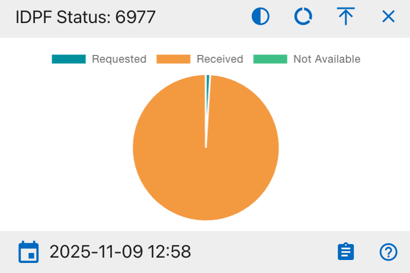{width="400"}

The details shown include:

* Requested
* Received
* Not Available

This widget displays the status of IDPF (Individual Deceased Personnel File) requests for missing person cases. The pie chart shows the number of requests in each state (Requested, Received, Not Available). Users can hover over segments for further data and click to export the supporting table to Excel or PDF. Filters and column visibility options are available in the integrated data table beneath the chart.

### Conflict Pie Chart

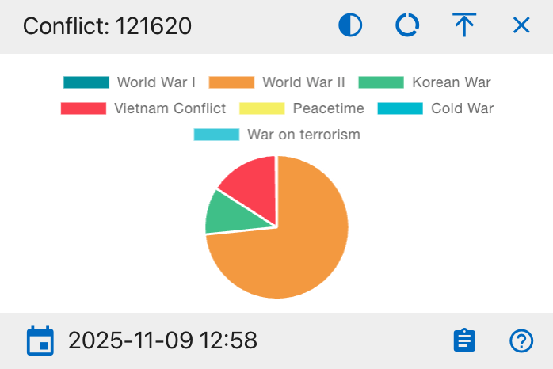{width="400"}

The details shown include:

* World War I
* World War II
* Korean War
* Vietnam Conflict
* Peacetime
* Cold War
* War on Terrorism

This widget visualizes missing person cases by conflict type. Each segment represents the number of cases from a particular conflict era. Users can hover over segments for further data and click to export the supporting table to Excel or PDF. Filters and column visibility options are available in the integrated data table beneath the chart.

### Case Managers Bar Chart

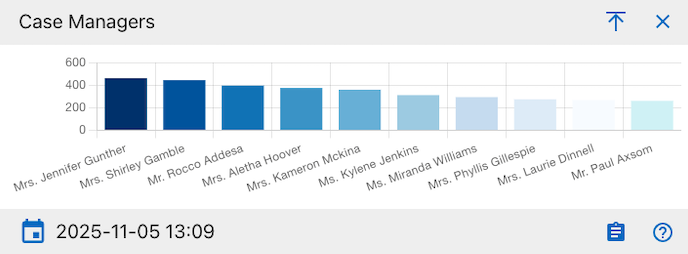{width="500"}

The details shown include:

* Case Manager name
* Total number of cases assigned

This widget displays the number of missing person cases assigned to each case manager using a horizontal bar chart. Each bar represents an individual case manager, with the height indicating their total case load. Users can hover over bars for further data and click to export the supporting table to Excel or PDF. Filters and column visibility options are available in the integrated data table beneath the chart.