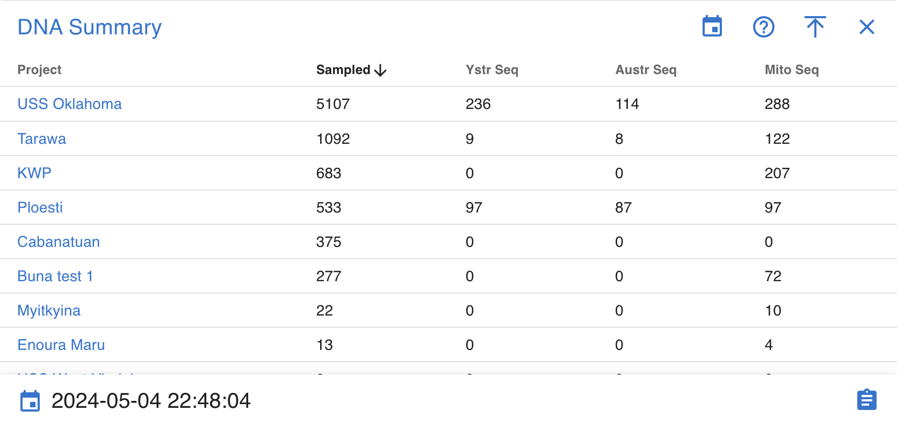

# Org Dashboard

!!! warning

    This page is work in progress.

The Org dashboard provides at a glance high level charts and tables 
of org data, information, statistics and charts for the current org.

### Project Map

### Markers
The markers displayed on the map showcase the latitude and longitude of a particular project. 
On mouse over additional project details as well as a link 
to the corresponding project dashboard can be found in the in popup window.

### Specimen Summary
A data table provides a link to a project dashboard and shows high level Skeletal Elements summary details for each project

### DNA Summary
A data table provides a link to a project dashboard and shows high level DNA summary details for each project

### Isotope Summary
A data table provides a link to a project dashboard and shows high level Isotope summary details for each project

### Missing Person Summary
A data table provides a link to a project dashboard and shows high level Missing Person summary details for each project

### User Activity Specimen

!!! warning

    This section is work in progress.

### User Activity DNA

!!! warning

    This section is work in progress.
