# Project Dashboard

## Project Manager Dashboard
The Project Manager Dashboard serves as a high level view of both summary and aggregated project data. 
The dashboard is comprised of *widgets*, which are individual visual representations of data.  Examples of those widgets include:
  
  * Skeletal Elements Associated To Individual
  * DNA Sample Information
  * Mito sequence Information
  * Inventory Process
  
Those *widgets* can be added and removed via the *widget selector*.

The data in the dashboard is represented in 4 different formats:
 
  * Pie Chart
  * Bar Graph
  * Stacked Bar Graph
  * Line Graph

On Click of details from widgets project dashboard will be visible. It provides a detailed view of visualization and the data.

### Pie Chart 

Data can be visualized in different ways by *widget selector* for pie chart. 

The data in the widgets will be seen as shown below

Clicking on the show donut option provides a dynamic semicircle view, offering a perspective on data representation.

Clicking on show pie provides a dynamic pie view, offering a perspective on data representation.

On Click of details present on widgets, provides a detailed view of the visualization along with column details.

Below are the fields that are visible:

 * Key
 * Bone
 * Side
 * Bone Group
 * Individual Number
 * DNA Sample Number
 * Mito Sequence Number
 * Associations
 * Pathology
 * Methods
 * Measured
 * Complete
 * Isotope Sampled
 * Clavicle Triage
 * CT Scanned
 * Xray Scanned
 * Inventoried
 * Reviewed
 * Inventoried By

### Bar Graph

Bar Graph helps provide comparisons between discrete categories or groups.

On Click of details present on widgets, provides a detailed view of the visualization along with column details.

Below are the fields that are visible:
 
* Mito Sequence Number
* Total

***These fields will vary depending on type of module selected***

### Stacked Bar graph

Stacked bar graph is divided into segments or "stacks" to represent different categories or subgroups within a single category.

On Click of details present on widgets, provides a detailed view of the visualization along with column details.

Below are the fields that are visible:

* bone
* side
* Total

***These fields will vary depending on type of module selected***

### Line graph

Line graph helps visualize data trends over time or across different data categories.

Line graph widget contains the following:

* Line step
* Days
* Point Style

### Widget Details

Below is a detailed description of each widget included in the Project Dashboard, their purpose, and interaction capabilities.

#### Complete

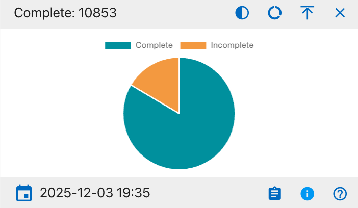{width="400"}

The details shown include:

* Complete
* Incomplete

This widget provides a visual breakdown of record completion status across all projects on the Project Dashboard. The pie chart displays the proportion of records that are complete versus incomplete, helping users quickly assess overall progress. Users can hover over each segment to view the exact counts and click to export the supporting table to Excel or PDF. Column visibility options are available in the integrated data table beneath the chart.

#### Individual Assigned

{width="400"}

The details shown include:

* Associated
* Unassociated

This widget provides a visual breakdown of how many individual records are currently associated versus unassociated on the Project Dashboard. The pie chart displays the proportion of individuals in each category, helping users quickly see whether most individuals have been properly linked to projects. Users can hover over each segment to view the exact counts and click to export the supporting table to Excel or PDF. Column visibility options are available in the integrated data table beneath the chart.

#### DNA Sampled

{width="400"}

The details shown include:

* Sampled
* Not Sampled

This widget provides a visual breakdown of DNA sampling status across all relevant records on the Project Dashboard. The pie chart displays the proportion of records that have been sampled versus not sampled, helping users quickly assess overall sampling coverage. Users can hover over each segment to view the exact counts and click to export the supporting table to Excel or PDF. Column visibility options are available in the integrated data table beneath the chart.

#### DNA Mito Results

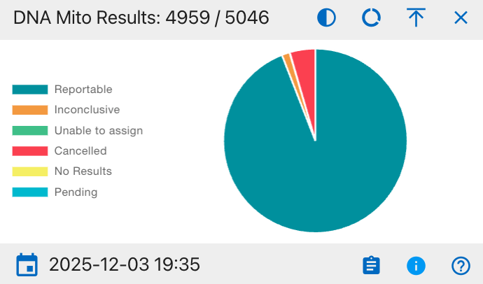{width="400"}

The details shown include:

* Reportable
* Inconclusive
* Unable to assign
* Cancelled
* No Results
* Pending

This widget provides a visual breakdown of mitochondrial DNA (Mito) test results across all relevant records on the Project Dashboard. The pie chart displays the proportion of records in each result category, helping users quickly understand overall identification outcomes and remaining work. Users can hover over each segment to view the exact counts and click to export the supporting table to Excel or PDF. Column visibility options are available in the integrated data table beneath the chart.

#### DNA YSTR Results

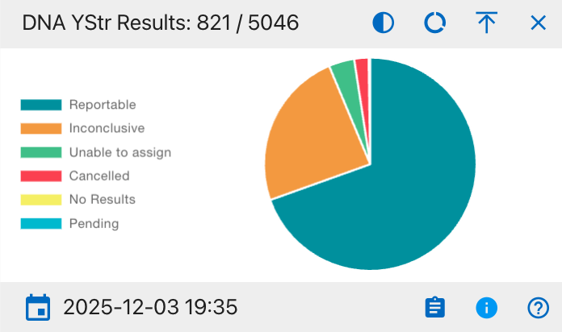{width="400"}

The details shown include:

* Reportable
* Inconclusive
* Unable to assign
* Cancelled
* No Results
* Pending

This widget provides a visual breakdown of YStr DNA test results across all relevant records on the Project Dashboard. The pie chart displays the proportion of records in each result category, helping users quickly understand overall YStr testing outcomes and where additional work may be required. Users can hover over each segment to view the exact counts and click to export the supporting table to Excel or PDF. Column visibility options are available in the integrated data table beneath the chart.

#### DNA AUSTR Results

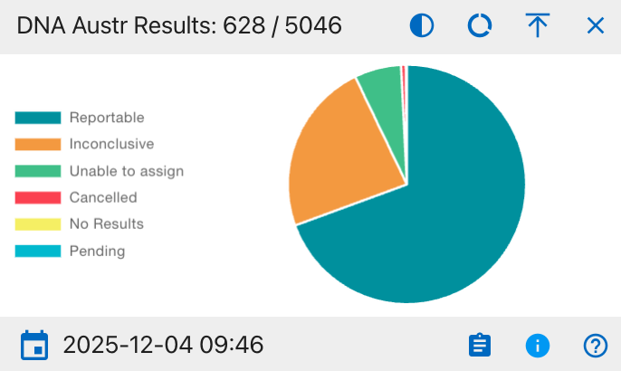{width="400"}

The details shown include:

* Reportable
* Inconclusive
* Unable to assign
* Cancelled
* No Results
* Pending

This widget provides a visual breakdown of AUSTR DNA test results across all relevant records on the Project Dashboard. The pie chart displays the proportion of records in each result category, helping users quickly understand overall AUSTR testing outcomes and where additional follow-up may be required. Users can hover over each segment to view the exact counts and click to export the supporting table to Excel or PDF. Column visibility options are available in the integrated data table beneath the chart.

#### Measured

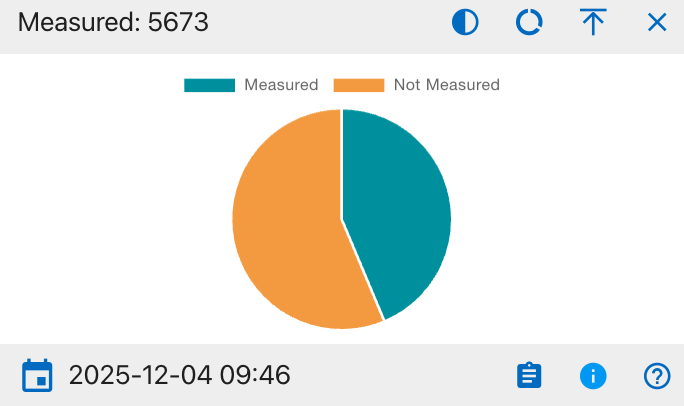{width="400"}

The details shown include:

* Measured
* Not Measured

This widget provides a visual breakdown of measurement status across all relevant records on the Project Dashboard. The pie chart displays the proportion of records that have been measured versus those that have not, helping users quickly assess coverage of required measurements. Users can hover over each segment to view the exact counts and click to export the supporting table to Excel or PDF. Column visibility options are available in the integrated data table beneath the chart.

#### CT Scanned

{width="400"}

The details shown include:
* Scanned
* Not Scanned

This widget provides a visual breakdown of CT scanning status across all relevant records on the Project Dashboard. The pie chart displays the proportion of records that have undergone CT scanning versus those that have not, helping users quickly gauge imaging coverage. Users can hover over each segment to view the exact counts and click to export the supporting table to Excel or PDF. Column visibility options are available in the integrated data table beneath the chart.

#### XRAY Scanned

{width="400"}

The details shown include:

* Xray-Scanned
* Not Xray-Scanned

This widget provides a visual breakdown of X-ray scanning status across all relevant records on the Project Dashboard. The pie chart displays the proportion of records that have been X-ray scanned versus those that have not, helping users quickly assess imaging coverage. Users can hover over each segment to view the exact counts and click to export the supporting table to Excel or PDF. Column visibility options are available in the integrated data table beneath the chart.

#### Clavicle Triage

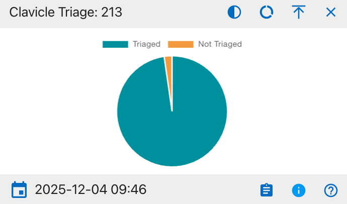{width="400"}

The details shown include:

* Triaged
* Not Triaged

This widget provides a visual breakdown of clavicle triage status across all relevant records on the Project Dashboard. The pie chart displays the proportion of records that have been triaged versus those that have not, helping users quickly assess progress on clavicle evaluations and identify remaining cases needing review. Users can hover over each segment to view the exact counts and click to export the supporting table to Excel or PDF. Column visibility options are available in the integrated data table beneath the chart.

#### Isotope Sampled

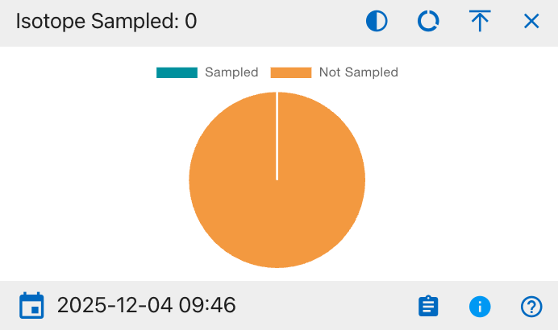{width="400"}

The details shown include:

* Sampled
* Not Sampled

This widget provides a visual breakdown of isotope sampling status across all relevant records on the Project Dashboard. The pie chart displays the proportion of records that have isotope samples collected versus those that have not, helping users quickly identify the current level of isotope sampling coverage and remaining cases needing sampling. Users can hover over each segment to view the exact counts and click to export the supporting table to Excel or PDF. Column visibility options are available in the integrated data table beneath the chart.

#### Remains Status

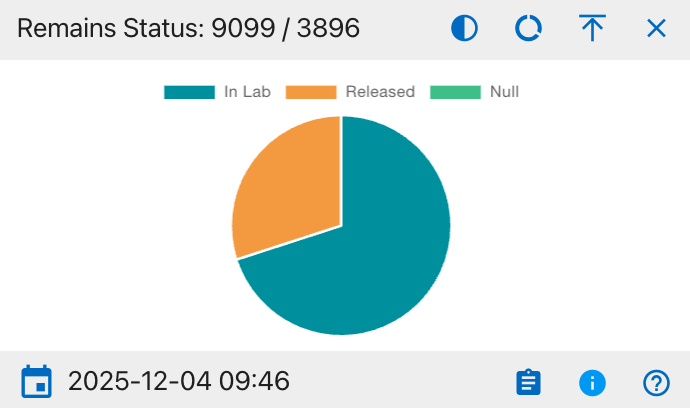{width="400"}

The details shown include:

* In Lab
* Released
* Null

This widget provides a visual breakdown of the current status of remains across all relevant records on the Project Dashboard. The pie chart displays the proportion of remains that are still in the lab, those that have been released, and those with a null or unspecified status, helping users quickly understand overall case disposition and remaining lab workload. Users can hover over each segment to view the exact counts and click to export the supporting table to Excel or PDF. Column visibility options are available in the integrated data table beneath the chart.

#### Inventoried

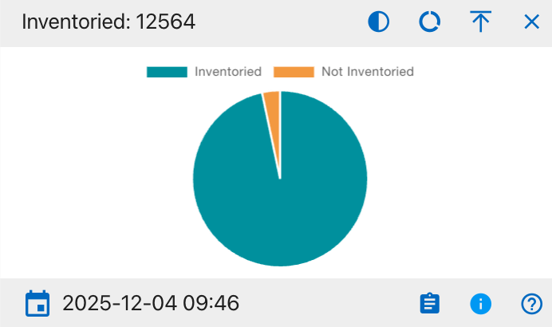{width="400"}

The details shown include:

* Inventoried
* Not Inventoried

This widget provides a visual breakdown of inventory status across all relevant records on the Project Dashboard. The pie chart displays the proportion of records that have been fully inventoried versus those that have not, helping users quickly assess inventory completion and identify any remaining items requiring cataloging. Users can hover over each segment to view the exact counts and click to export the supporting table to Excel or PDF. Column visibility options are available in the integrated data table beneath the chart.

#### Reviewed

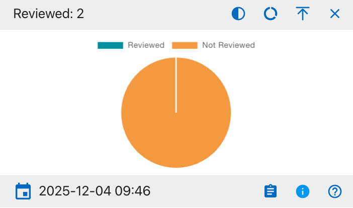{width="400"}

The details shown include:

* Reviewed
* Not Reviewed

This widget provides a visual breakdown of review status across all relevant records on the Project Dashboard. The pie chart displays the proportion of records that have been formally reviewed versus those still awaiting review, helping users quickly see overall QA progress and identify items that need attention. Users can hover over each segment to view the exact counts and click to export the supporting table to Excel or PDF. Column visibility options are available in the integrated data table beneath the chart.

#### Mito Sequence Number

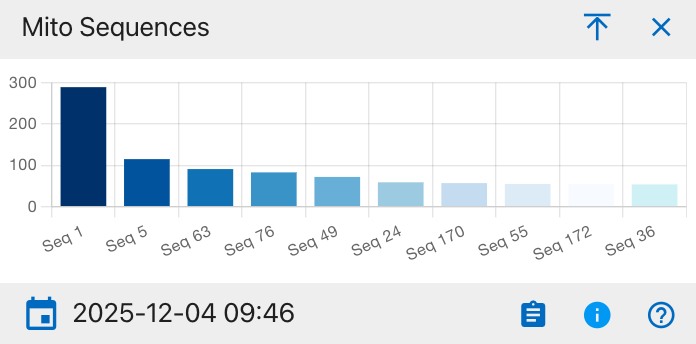{width="400"}

This widget displays the distribution of mitochondrial DNA (mito) sequence groups across all relevant records on the Project Dashboard. Each bar represents a different sequence group (for example, Seq 1, Seq 5, Seq 63), and the bar height shows how many records fall into that sequence, allowing users to see which mito sequences are most common and to spot patterns that may inform comparative or kinship analysis. Users can hover over each segment to view the exact counts and click to export the supporting table to Excel or PDF. Column visibility options are available in the integrated data table beneath the chart.

#### MNI Bones

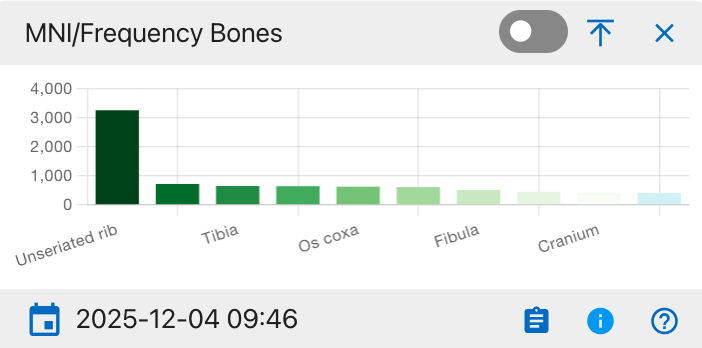{width="400"}

This widget shows the distribution of bones by either minimum number of individuals (MNI) or element frequency across all records on the Project Dashboard. Each bar represents a specific skeletal element (for example, unseriated ribs, tibia, os coxa, fibula, cranium), and the bar height indicates how many occurrences of that element are recorded, helping users see which bones are most frequently represented in the assemblage and guiding sampling or analysis priorities. Users can hover over each segment to view the exact counts and click to export the supporting table to Excel or PDF. Column visibility options are available in the integrated data table beneath the chart.

#### MNI Zones

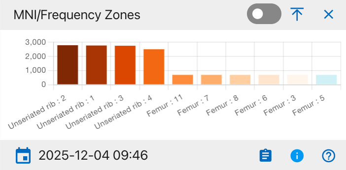{width="400"}

This widget shows the distribution of anatomical zones (for example, specific rib zones and femur zones) by minimum number of individuals (MNI) or occurrence frequency across all records on the Project Dashboard. Each bar represents a particular zone label (such as unseriated rib zones 1–4 or numbered femur zones), and the bar height indicates how many times that zone is present, helping users pinpoint which skeletal zones are most commonly observed and prioritize detailed recording or analysis. Users can hover over each segment to view the exact counts and click to export the supporting table to Excel or PDF. Column visibility options are available in the integrated data table beneath the chart.

#### MNI Mito Bones Side

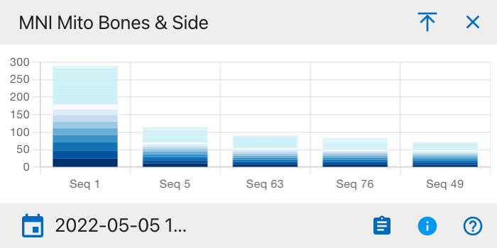{width="400"}

This widget uses a stacked bar chart to display, for each mitochondrial sequence group (for example, Seq 1, Seq 5, Seq 63), the minimum number of individuals (MNI) broken down by skeletal element and body side. Each vertical bar represents one sequence group, and the colored segments stacked within that bar correspond to different bones and left/right sides, so the total bar height shows the overall MNI for that sequence while the segment heights show how much each element and side contributes to that total. Users can hover over each segment to view the exact counts and click to export the supporting table to Excel or PDF. Column visibility options are available in the integrated data table beneath the chart.

#### MNI Bones Side

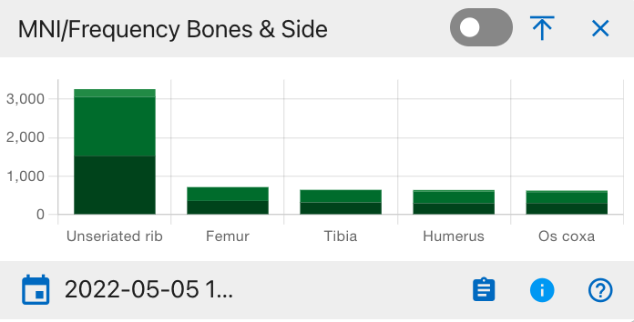{width="400"}

This widget shows, for each major skeletal element (for example, unseriated rib, femur, tibia, humerus, os coxa), the count or minimum number of individuals (MNI) broken down by body side. Each vertical bar represents one bone, and the stacked segments within that bar correspond to left and right sides (and, if used, midline or unspecified), so the total bar height reflects the overall frequency or MNI for that element while the segment heights show how much each side contributes. Users can hover over each segment to view the exact counts and click to export the supporting table to Excel or PDF. Column visibility options are available in the integrated data table beneath the chart.

#### MNI Zones Side

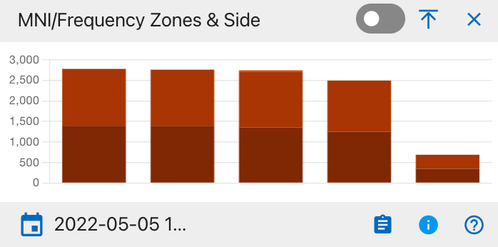{width="400"}

This widget shows, for each defined anatomical zone group, the count or minimum number of individuals (MNI) broken down by body side. Each vertical stacked bar represents one zone group, and the darker and lighter segments within the bar correspond to left and right (and, where applicable, midline or unspecified) sides, so the total bar height reflects the overall frequency or MNI for that zone while the segment heights show the contribution of each side. Users can hover over each segment to view the exact counts and click to export the supporting table to Excel or PDF. Column visibility options are available in the integrated data table beneath the chart.

#### MNI Bone Groups

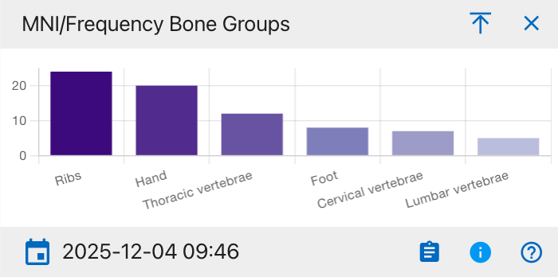{width="400"}

This widget shows the count or minimum number of individuals (MNI) summarized by higher-level skeletal groups, such as ribs, hand, thoracic vertebrae, foot, cervical vertebrae, and lumbar vertebrae. Each bar represents one bone group, and its height indicates how many occurrences or individuals are represented in that group, helping users quickly see which skeletal regions are most prevalent in the assemblage. Users can hover over each segment to view the exact counts and click to export the supporting table to Excel or PDF. Column visibility options are available in the integrated data table beneath the chart.

#### MNI Bone Groups and Side

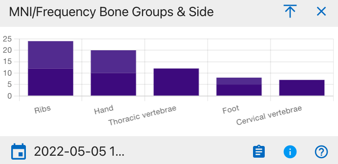{width="400"}

This widget shows the count or minimum number of individuals (MNI) summarized by higher-level skeletal groups, such as ribs, hand, thoracic vertebrae, foot, cervical vertebrae, and lumbar vertebrae. Each bar represents one bone group, and its height indicates how many occurrences or individuals are represented in that group, helping users quickly see which skeletal regions are most prevalent in the assemblage. Users can hover over each segment to view the exact counts and click to export the supporting table to Excel or PDF. Column visibility options are available in the integrated data table beneath the chart.

#### Specimens

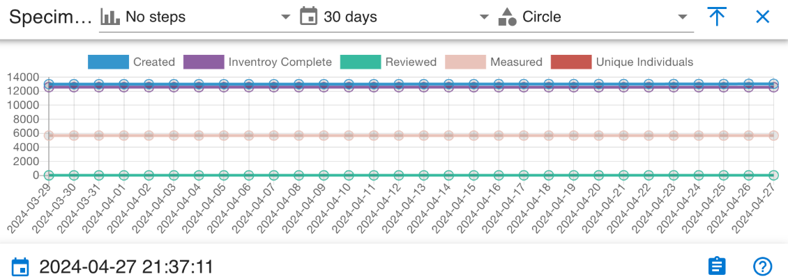{width="400"}

This widget is a time‑series line chart that tracks specimen workflow activity over the selected 30‑day period. Each line represents a different status count-Created, Inventory Complete, Reviewed, Measured, and Unique Individuals so users can see how many specimens are in each state on each date and quickly assess whether work volume or completion is changing over time. Users can hover over each segment to view the exact counts and click to export the supporting table to Excel or PDF. Column visibility options are available in the integrated data table beneath the chart.

### DNAS

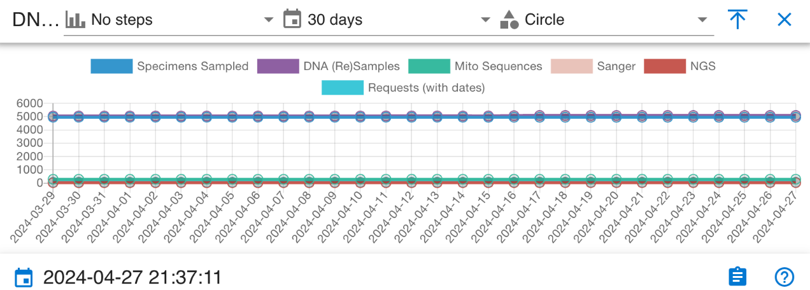{width="400"}

This widget is a time‑series line chart that tracks key DNA‑related workflow metrics over the selected 30‑day period. Each line represents a different metric—Specimens Sampled, DNA (Re)Samples, Mito Sequences, Sanger, NGS, and Requests (with dates),so users can see how many items fall into each category on each date and monitor trends or stability in DNA sampling, sequencing, and request activity across the month. Users can hover over each segment to view the exact counts and click to export the supporting table to Excel or PDF. Column visibility options are available in the integrated data table beneath the chart.

   
## Cabanatuan Project Manager Dashboard
 
The dashboard displays an interactive cemetery map with numbered grave plots. Selecting a highlighted grave will update the panels and widgets to show information for the related burials and accessions.

### Navigation

From the top navigation, select Project Dashboard to open the main interface for the Cabanatuan POW Camp.

 
We can see the dashboard for Cabanatuan

### Cabanatuan Cemetery Map

The Cabanatuan dashboard map shows a simple layout of the POW cemetery, with each grave drawn as a numbered rectangle so you can quickly see where plots are located. Highlighted plots show the graves that are currently in view for the project, and clicking one of these plots focuses the dashboard on that grave and its related accessions, helping you connect the cemetery layout to the underlying case records.

### Filters
 
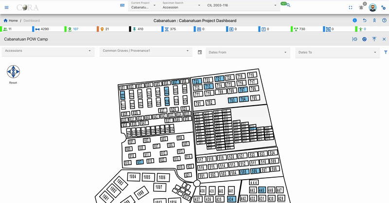

Use the filters above the map to refine which graves and records are shown.
You can filter by:

* Accessions
* Common Graves / Provenance
* Dates From
* Dates To

Click Apply to activate the filters or Reset to clear them and return to the full Cabanatuan view.

### Widgets

Widgets below the map summarize key information about the Cabanatuan project.

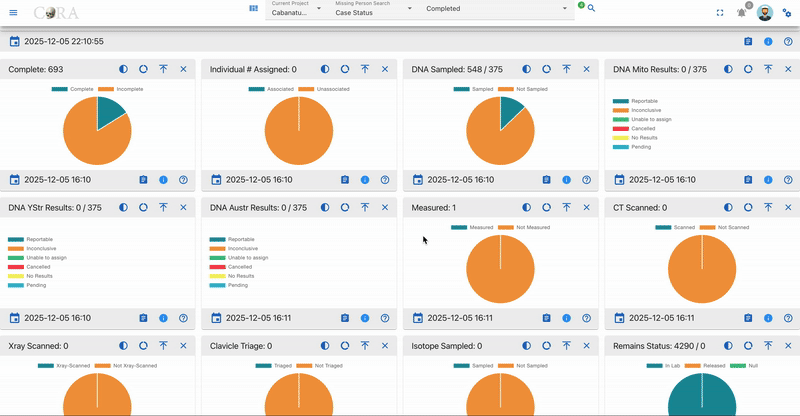

The main widget groups include:

* Workflow Status – Complete, Individuals Assigned, Inventoried, Reviewed, Measured, X‑ray Scanned, CT Scanned, Isotope Sampled, Clavicle Triage, Remains Status.
* DNA Sampling and Results – DNA Sampled, DNA Mito Results, DNA YSTR Results, DNA AUSTR Results, Mito Sequences.
* Skeletal Representation (MNI/Frequency) – Bones, Bones & Side, Zones, Zones & Side, Bone Groups.
* Activity Over Time – 30‑day lines for specimen steps (Created, Inventory Complete, Reviewed, Measured, Unique Individuals) and for DNA steps (Specimens Sampled, DNA (Re)Samples, Mito Sequences, Sanger, NGS, Requests).

