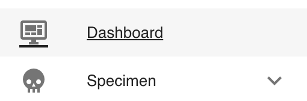
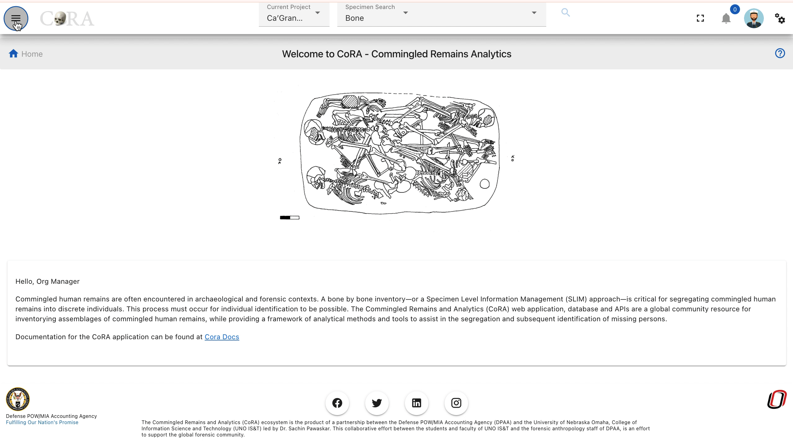
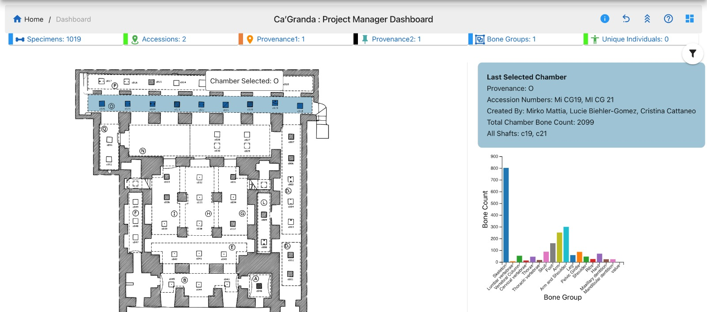
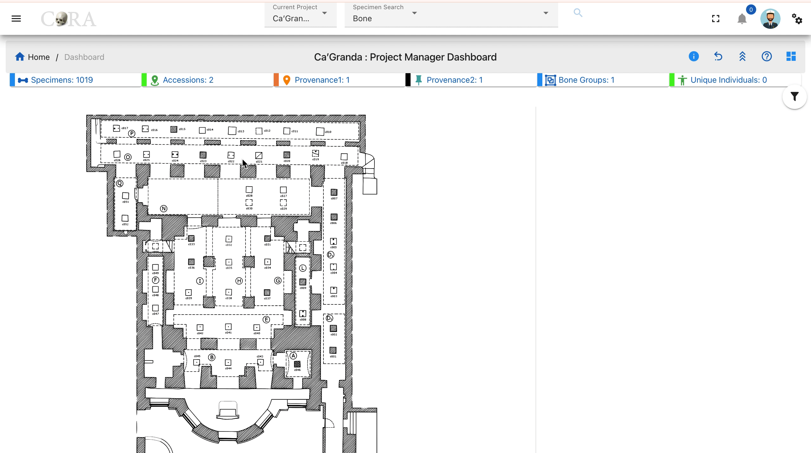
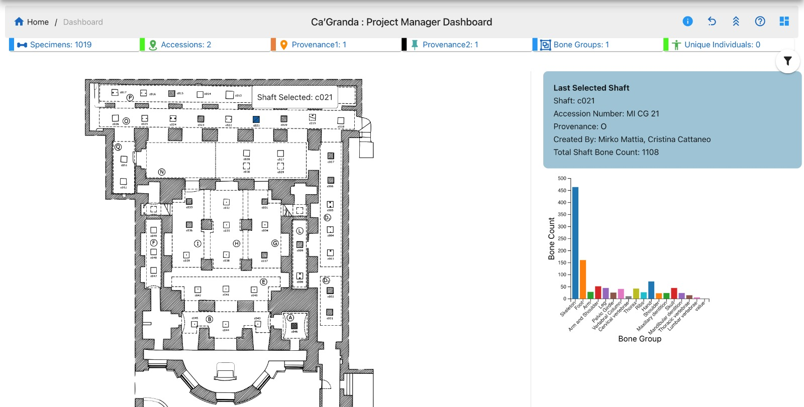
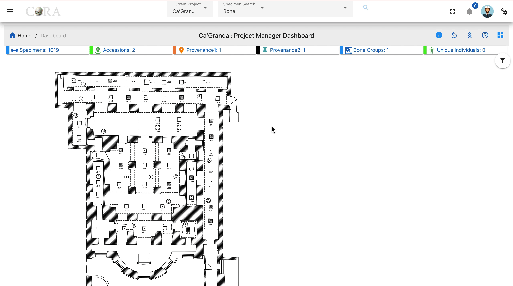
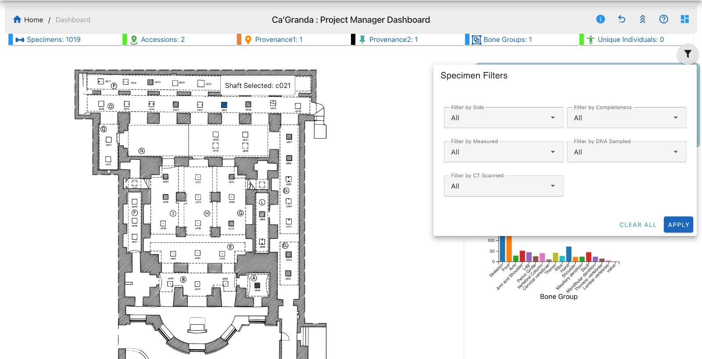

# Project Dashboard
 
## Ca'Granda Project Manager Dashboard
 
From the left sidebar, navigate to the Dashboard to access the main interface for Ca'Granda
 
The dashboard displays an interactive site map with chambers and bone shafts. Clicking on any chamber or shaft will reveal detailed information on the right panel.
 

 

 
On the left side bar - you can access the main options for dashboards.
 
We can see the dashboard for Ca'Granda
 
## Ca’Granda Chambers
 

 

 
Click on a chamber (e.g., Chamber O) in the site layout to view data.
 
The details shown include:
 
* Provenance
* Accession number
* Created By
* Total Chamber Bone Count
* All Shafts (c19, c21 only have data)

## Chamber Shafts
 

 

 
Click on a shaft (e.g., c019) to see more specific information.
 
The details include:
 
* Shaft
* Accession number
* Provenance
* Created By
* Total Shaft Bone Count

## Filters
 

 

 
Click the filter icon to refine the data based on the following criteria:
 
* Filter by Side
* Filter by Completeness
* Filter by Measured
* Filter by DNA Sampled
* Fiter by CT Scanned
 
Click Apply to activate the filters or Clear All to reset them.