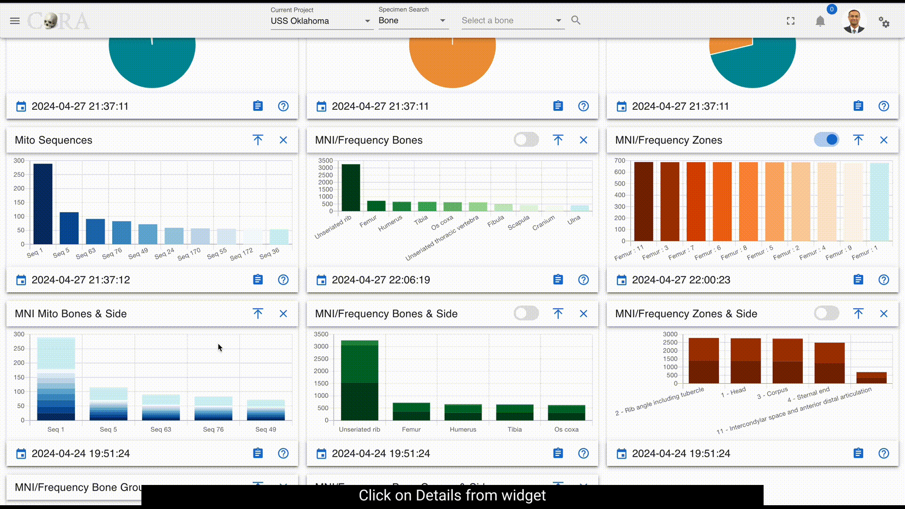
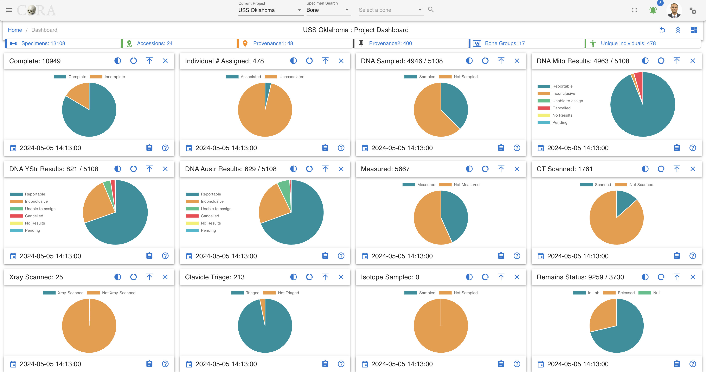
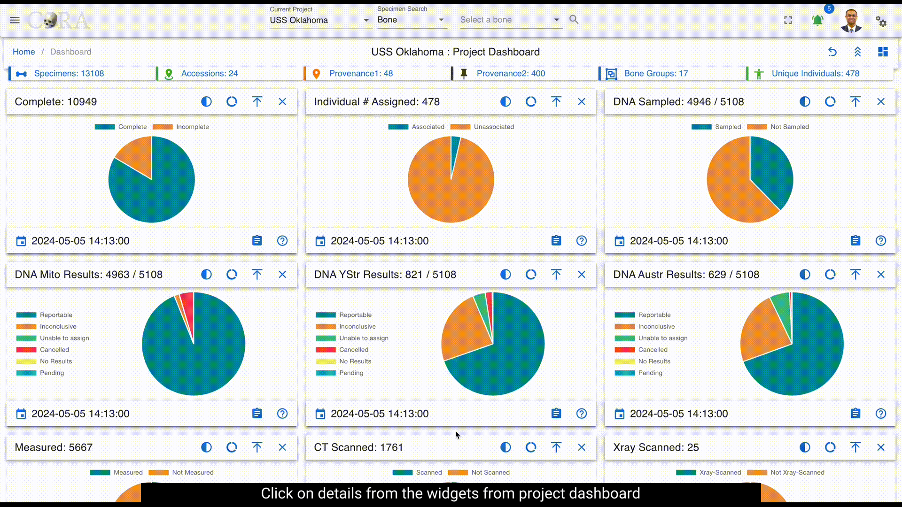
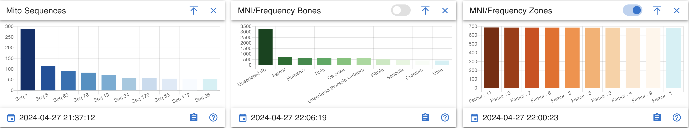
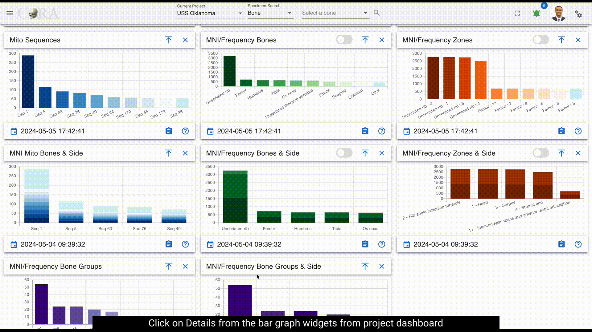
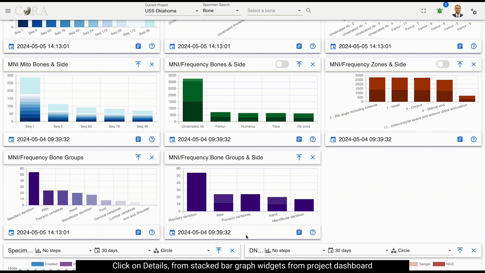
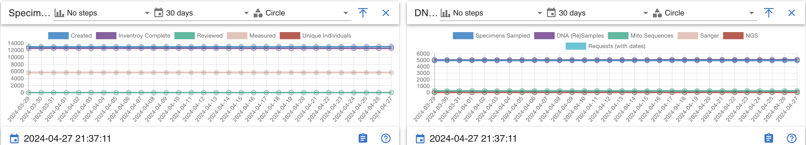

# Project Dashboard

## Project Manager Dashboard
The Project Manager Dashboard serves as a high level view of both summary and aggregated project data. 
The dashboard is comprised of *widgets*, which are individual visual representations of data.  Examples of those widgets include:
  
  * Skeletal Elements Associated To Individual
  * DNA Sample Information
  * Mito sequence Information
  * Inventory Process
  
Those *widgets* can be added and removed via the *widget selector*.

The data in the dashboard is represented in 4 different formats:
 
  * Pie Chart
  * Bar Graph
  * Stacked Bar Graph
  * Line Graph

On Click of details from widgets project dashboard will be visible. It provides a detailed view of visualization and the data.

### Pie Chart 

Data can be visualized in different ways by *widget selector* for pie chart. 

The data in the widgets will be seen as shown below

Clicking on the show donut option provides a dynamic semicircle view, offering a perspective on data representation.

Clicking on show pie provides a dynamic pie view, offering a perspective on data representation.

On Click of details present on widgets, provides a detailed view of the visualization along with column details.

Below are the fields that are visible:

 * Key
 * Bone
 * Side
 * Bone Group
 * Individual Number
 * DNA Sample Number
 * Mito Sequence Number
 * Associations
 * Pathology
 * Methods
 * Measured
 * Complete
 * Isotope Sampled
 * Clavicle Triage
 * CT Scanned
 * Xray Scanned
 * Inventoried
 * Reviewed
 * Inventoried By

### Bar Graph

Bar Graph helps provide comparisons between discrete categories or groups.

On Click of details present on widgets, provides a detailed view of the visualization along with column details.

Below are the fields that are visible:
 
* Mito Sequence Number
* Total

***These fields will vary depending on type of module selected***

### Stacked Bar graph

Stacked bar graph is divided into segments or "stacks" to represent different categories or subgroups within a single category.

On Click of details present on widgets, provides a detailed view of the visualization along with column details.

Below are the fields that are visible:

* bone
* side
* Total

***These fields will vary depending on type of module selected***

### Line graph

Line graph helps visualize data trends over time or across different data categories.

Line graph widget contains the following:

* Line step
* Days
* Point Style

### Complete

!!! warning

    This section is work in progress.

### Individual Assigned

!!! warning

    This section is work in progress.
### DNA Sampled

!!! warning

    This section is work in progress.

### DNA Mito Results

!!! warning

    This section is work in progress.

### DNA YSTR Results

!!! warning

    This section is work in progress.

### DNA AUSTR Results

!!! warning

    This section is work in progress.

### Measured

!!! warning

    This section is work in progress.

### CT Scanned

!!! warning

    This section is work in progress.

### XRAY Scanned

!!! warning

    This section is work in progress.

### Clavicle Triage

!!! warning

    This section is work in progress.

### Isotope Sampled

!!! warning

    This section is work in progress.

### Remains Status

!!! warning

    This section is work in progress.

### Inventoried

!!! warning

    This section is work in progress.

### Reviewed

!!! warning

    This section is work in progress.

### Mito Sequence Number

!!! warning

    This section is work in progress.

### MNI Bones

!!! warning

    This section is work in progress.

### MNI Zones

!!! warning

    This section is work in progress.

### MNI Mito Bones Side

!!! warning

    This section is work in progress.

### MNI Bones Side

!!! warning

    This section is work in progress.

### MNI Zones Side

!!! warning

    This section is work in progress.

### MNI Bone Groups

!!! warning

    This section is work in progress.

### MNI Bone Groups and Side

!!! warning

    This section is work in progress.

### Specimens

!!! warning

    This section is work in progress.

### DNAS

!!! warning

    This section is work in progress.

### Isotopes

!!! warning

    This section is work in progress.
   
## Ca'Granda Project Manager Dashboard
 
From the left sidebar, navigate to the Dashboard to access the main interface for Ca'Granda
 
The dashboard displays an interactive site map with chambers and bone shafts. Clicking on any chamber or shaft will reveal detailed information on the right panel.
 

 

 
On the left side bar - you can access the main options for dashboards.
 
We can see the dashboard for Ca'Granda
 
## Ca’Granda Chambers
 

 

 
Click on a chamber (e.g., Chamber O) in the site layout to view data.
 
The details shown include:
 
* Provenance
* Accession number
* Created By
* Total Chamber Bone Count
* All Shafts (c19, c21 only have data)

## Chamber Shafts
 

 

 
Click on a shaft (e.g., c019) to see more specific information.
 
The details include:
 
* Shaft
* Accession number
* Provenance
* Created By
* Total Shaft Bone Count

## Filters
 

 

 
Click the filter icon to refine the data based on the following criteria:
 
* Filter by Side
* Filter by Completeness
* Filter by Measured
* Filter by DNA Sampled
* Fiter by CT Scanned
 
Click Apply to activate the filters or Clear All to reset them.