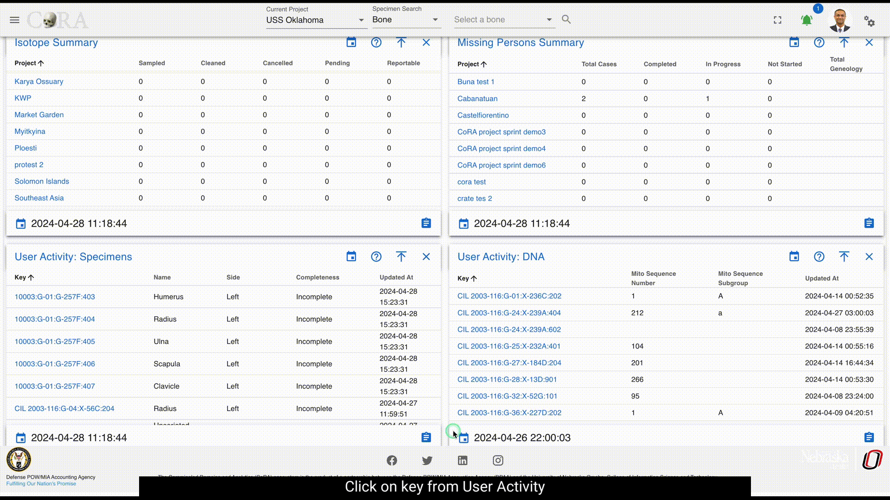

# User Dashboard

!!! warning

    This page is work in progress.
    
The User Dashboard serves as a high level view of both summary and aggregated user data. 
### User Activity

User activity contains *widgets*, which are individual visual representations of data.  Examples of those widgets include:

* Skeletal Elements Assocciated To Individual
* DNA Sample Information

Those *widgets* can be added and removed via the *widget selector*. User activity widgets are present in the Org admin dashboards

On Click of key from the user activity widget present on dashboard shows the specimen page with details to edit and other actions.

On Click of details present on widgets, provides all the data for the selected module.

Below are the fields that are visible:

* Key
* Name
* Side
* Completeness
* Individual Number
* Measured
* Isotope Sampled
* Clavicle Triage
* CT Scanned
* Xray Scanned 
* Inventoried
* Reviewed
* Inventoried At
* Reviewed At
* Created By
* Created At
* Updated By
* Updated At

***These fields will vary depending on type of module selected***