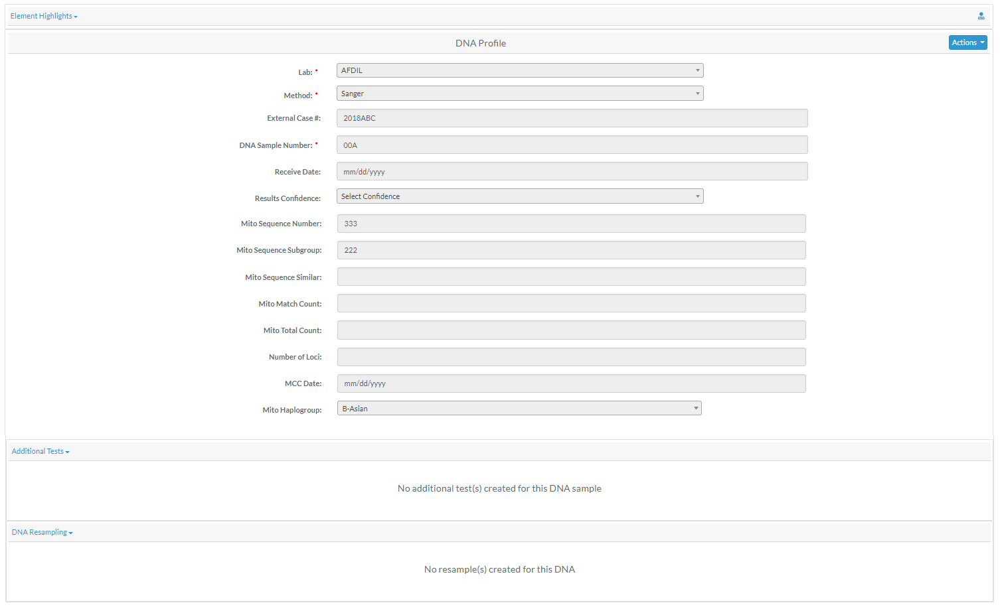
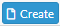
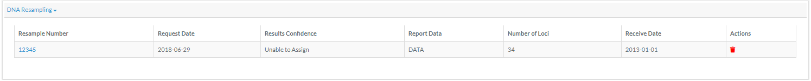

#DNA Profile
Skeletal elements which have had a DNA sample successfully completed will 
have an associated *DNA Profile*.  The profile contains all relevant DNA attributes and are editable via  (appropriate permissions required) 

##Additional Tests
This area will be used to display any additional DNA test request information.  By default this section is collapsed, unless data is present.  
From this section users can also create new requests by clicking  during edit mode

##Additional Sampling
This area will be used to display any additional DNA sample request information.  By default this section is collapsed, unless data is present.  
From this section users can also create new requests by clicking  during edit mode

##Element Highlights
Additional skeletal element attributes about the DNA sample can found in the *Element Highlights* section above the DNA Profile.  By default this section is collapsed.
 
