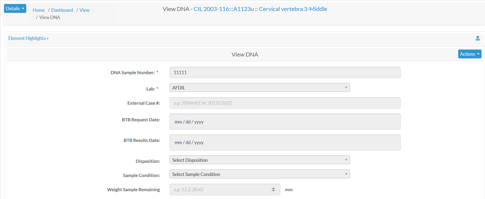
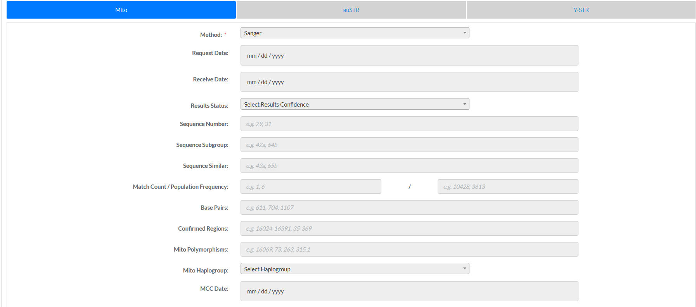
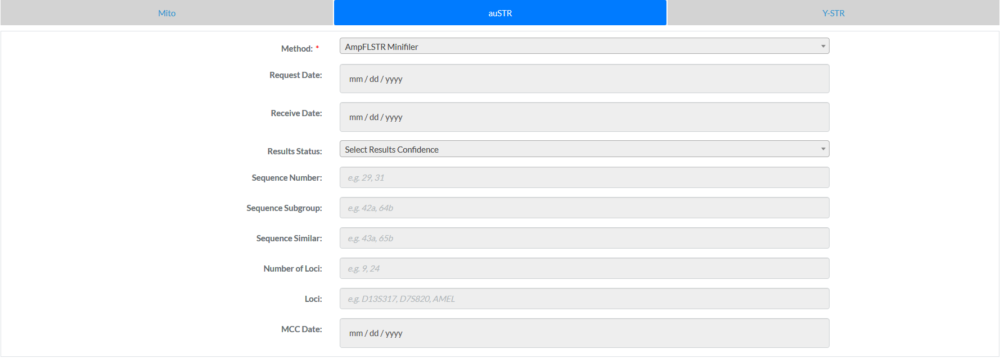
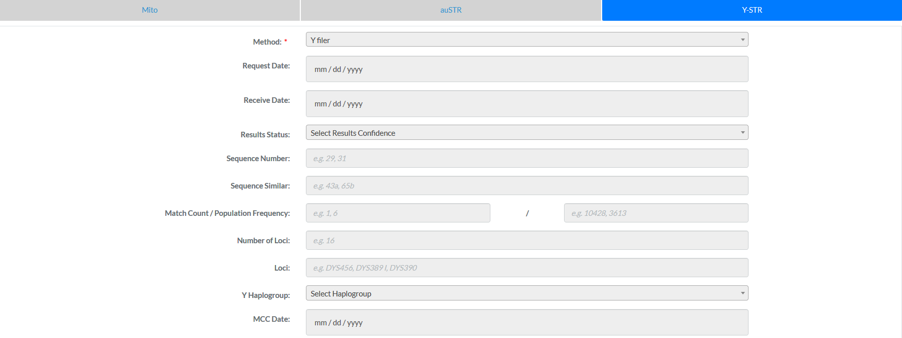

#DNA Profile
Specimens which have had a DNA sample successfully completed will 
have an associated *DNA Profile*.  The profile contains all relevant DNA attributes and are editable via  (appropriate permissions required)  
  

Here are all the DNA elements along with their Data Type and Validation Rule

Element  | Data Type  | Validation Rule  | Required/Optional
------------- | -------------| ------------- | -------------
DNA Sample Number  | Alphanumeric |Can only contain letters and numbers| Required
Lab | Lookup |  Choose from the options available  | Required
External Case id  | Alphanumeric |Can only contain letters and numbers| Optional
BTB Request Date  | Date Type |Should be in date Format| Optional
BTB Result Date | Date Type |Should be in date Format| Optional
Disposition  | Lookup | Choose from the options available | Optional
Sample Condition  | Lookup | Choose from the options available   | Optional
Weight Sample Remaining | Float | Can only contain numbers and decimals | Optional

DNA elements are further divided into Mito, auSTR and Y-STR. 

Here are all the Mito elements along with their Data Type and Validation Rule 

Element  | Data Type  | Validation Rule  | Required/Optional
------------- | -------------| ------------- | -------------
Method  | Lookup | Choose from the options available | Required
Request Date | Date Type |Should be in date Format  | Optional
Receive Date | Date Type |Should be in date Format| Optional
Results Status  | Lookup |Choose from the options available| Optional
Sequence Number| Numeric |Can only contains numbers| Optional
Sequence Subgroup  | Alphanumeric | Can only contain letters, numbers, dash and space | Optional
Sequence Similar  | Alphanumeric | Can only contain letters, numbers, dash and space  | Optional
Match Count / Population Frequency | Numeric | Can only contains numbers | Optional
Base Pairs | Numeric |Can only contain numbers| Optional
Confirmed Regions| Numeric |Can only contains numbers| Optional
Mito Polymorphisms  | Float | Can only contain integer and decimals | Optional
Mito Haplogroup | Lookup | Choose from the options available   | Optional
MCC Date | Date Type | Should be in date Format | Optional

Here are all the Austr elements along with their Data Type and Validation Rule 

Element  | Data Type  | Validation Rule  | Required/Optional
------------- | -------------| ------------- | -------------
Method  | Lookup | Choose from the options available | Required
Request Date | Date Type |Should be in date Format | Optional
Receive Date | Date Type |Should be in date Format| Optional
Results Status  | Lookup |Choose from the options available| Optional
Sequence Number| Numeric |Can only contains numbers| Optional
Sequence Subgroup  | Alphanumeric | Can only contain letters, numbers, dash and space | Optional
Sequence Similar  | Alphanumeric | Can only contain letters, numbers, dash and space  | Optional
Number of Loci | Numeric | Can only numbers| Optional
Loci | Alphanumeric | Can only contain letters, numbers, dash and space| Optional
MCC Date | Date Type |  Should be in date Format | Optional

Here are all the Y-STR elements along with their Data Type and Validation Rule 

Element  | Data Type  | Validation Rule  | Required/Optional
------------- | -------------| ------------- | -------------
Method  | Lookup | Choose from the options available | Required
Request Date | Date Type |Should be in date Format | Optional
Receive Date | Date Type |Should be in date Format| Optional
Results Status  | Lookup |Choose from the options available| Optional
Sequence Number| Numeric |Can only contains numbers| Optional
Sequence Similar  | Alphanumeric | Can only contain letters, numbers, dash and space  | Optional
Match Count / Population Frequency | Numeric |   Can only contains numbers | Optional
Number of Loci | Numeric |   Can only contains numbers | Optional
Loci | Alphanumeric | Can only contain letters, numbers, dash and space| Optional
Y Haplogroup | Lookup | Choose from the options available   | Optional
MCC Date | Date Type |   Should be in date Format | Optional

##Element Highlights
Additional skeletal element attributes about the DNA sample can found in the *Element Highlights* section above the DNA Profile.  By default this section is collapsed.
 
