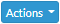
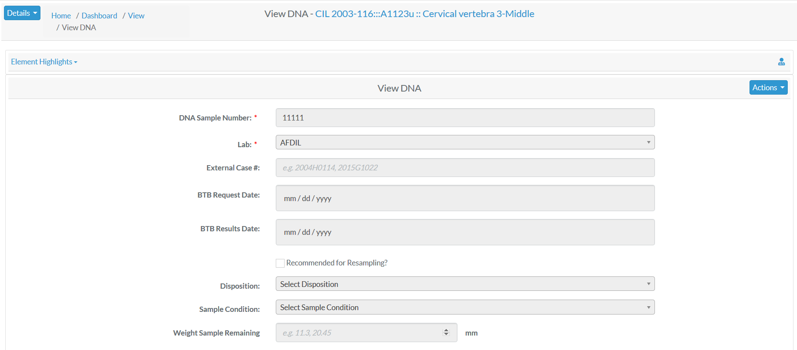
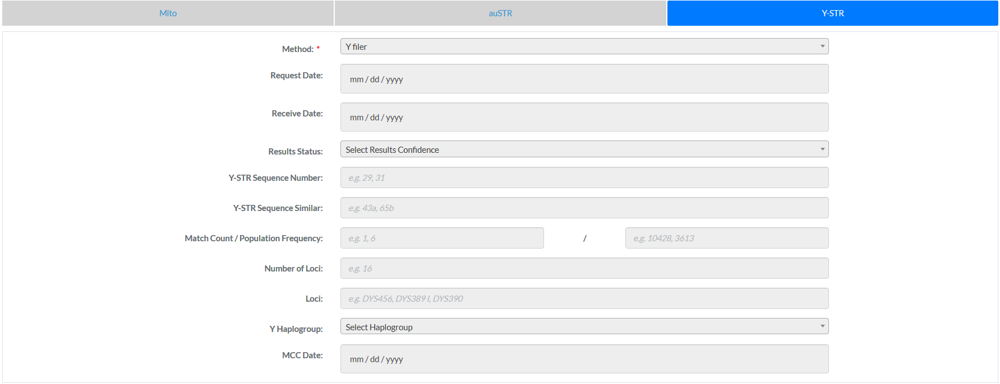
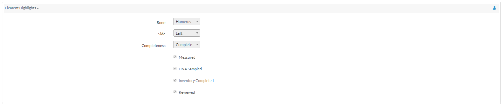

#DNA Profile
Specimens which have had a DNA sample successfully completed will 
have an associated *DNA Profile*.  The profile contains all relevant DNA attributes and are editable via  (appropriate permissions required)  
  

The fields associated with a DNA are:

- **DNA Sample Number**
- **Lab**
- External Case id 
- BTB Request Date
- BTB Result Date
- Recommended for Resampling (Checkbox)
- Disposition
- Sample Condition
- Weight Sample Remaining 

The bolded fields are required. Below are some fields with their validation rule

Element  | Data Type  | Validation Rule  | Required/Optional
------------- | -------------| ------------- | -------------
DNA Sample Number  | Alphanumeric |Can only contain letters and numbers| Required
External Case id  | Alphanumeric |Can only contain letters and numbers| Optional

DNA elements are further divided into Mito, auSTR and Y-STR. 

##Mito

The elements associated with Mito are:

- **Method**
- Request Date
- Receive Date
- Results Status
- Mito Sequence Number
- Mito Sequence Subgroup
- Mito Sequence Similar
- Match Count / Population Frequency
- Base Pairs 
- Confirmed Regions
- Mito Polymorphisms
- Mito Haplogroup
- MCC Date

The bolded fields are required. Below are some fields with their data type and validation rule

Element  | Data Type  | Validation Rule  | Required/Optional
------------- | -------------| ------------- | -------------
Mito Sequence Number| Numeric |Can only contains numbers| Optional
Mito Sequence Subgroup  | Alphanumeric Dash Space| Can only contain letters, numbers, dash and space | Optional
Mito Sequence Similar  | Alphanumeric Dash Space| Can only contain letters, numbers, dash and space  | Optional
Match Count / Population Frequency | Numeric | Can only contains numbers | Optional
Base Pairs | Numeric |Can only contain numbers| Optional

##auSTR

The elements associated with auSTR are:

- **Method**
- Request Date
- Receive Date
- Results Status
- auSTR Sequence Number
- auSTR Sequence Subgroup
- auSTR Sequence Similar
- Number of Loci
- Loci 
- MCC Date

The bolded fields are required. Below are some fields with their data type and validation rule

Element  | Data Type  | Validation Rule  | Required/Optional
------------- | -------------| ------------- | -------------
Method  | Lookup | Choose from the options available | Required
auSTR Sequence Number| Numeric |Can only contains numbers| Optional
auSTR Sequence Subgroup  | Alphanumeric Dash Space| Can only contain letters, numbers, dash and space | Optional
auSTR Sequence Similar  | Alphanumeric Dash Space| Can only contain letters, numbers, dash and space  | Optional
Number of Loci | Numeric | Can only numbers| Optional

##Y-STR

The elements associated with Y-STR are:

- **Method**
- Request Date
- Receive Date
- Results Status
- Y-STR Sequence Number
- Y-STR Sequence Similar
- Match Count / Population Frequency
- Number of Loci
- Loci 
- Y Haplogroup
- MCC Date

The bolded fields are required. Below are some fields with their data type and validation rule

Element  | Data Type  | Validation Rule  | Required/Optional
------------- | -------------| ------------- | -------------
Y-STR Sequence Number| Numeric |Can only contains numbers| Optional
Y-STR Sequence Similar  | Alphanumeric Dash Space | Can only contain letters, numbers, dash and space  | Optional
Match Count / Population Frequency | Numeric |   Can only contains numbers | Optional
Number of Loci | Numeric |   Can only contains numbers | Optional

##Element Highlights
Additional skeletal element attributes about the DNA sample can found in the *Element Highlights* section above the DNA Profile.  By default this section is collapsed.
 
