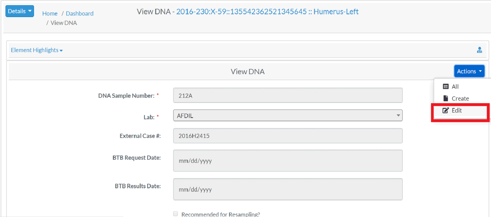

#DNA Profile
Specimens which have had a DNA sample successfully completed will 
have an associated *DNA Profile*.  The profile contains all relevant DNA attributes and are editable via  (appropriate permissions required)  
  

The fields associated with a DNA are:

- **DNA Sample Number**
- **Lab**
- External Case id 
- BTB Request Date
- BTB Result Date
- Recommended for Resampling (Checkbox)
- Disposition
- Sample Condition
- Weight Sample Remaining 

The bolded fields are required. Below are some fields with their validation rule

Element  |  Validation Rule  | Required/Optional
------------- | ------------- | -------------
DNA Sample Number  | Can only contain letters and numbers| Required
External Case id  | Can only contain letters and numbers| Optional
Priority  |  Can only contain letters, numbers, dash, space and dot  | Optional
External Sample Number  | Can only contain letters, numbers, dash and space  | Optional
Disposition of Evidence | Can only contain letters and numbers  | Optional
Additional Testing | Boolean (True or False)  | Optional
Priority Date  | Can only contain dates| Optional
BTB Request Date  | Can only contain dates| Optional
BTB Result Date | Can only contain dates| Optional
Disposition | Either Stored, Consumed or Returned| Optional
Sample Condition| Either Stored, Consumed or Returned| Optional
Weight Sample Remaining| Can only contain numeric value| Optional
Resample Indicator| Boolean (True or False)| Optional
Notes| | Optional

DNA elements are further divided into Mito, auSTR and Y-STR. 

##Mito

The elements associated with Mito are:

- **Method**
- Request Date
- Receive Date
- Results Status
- Mito Sequence Number
- Mito Sequence Subgroup
- Mito Sequence Similar
- Match Count / Population Frequency
- Base Pairs 
- Confirmed Regions
- Mito Polymorphisms
- Mito Haplogroup
- MCC Date

The bolded fields are required. Below are some fields with their data type and validation rule

Element  |  Validation Rule  | Required/Optional
------------- | ------------- | -------------
Mito Method  | Choose from the options available | Required
Mito Request Date|Can only contain date| Optional
Mito Receive Date|Can only contain date| Optional
Mito Results Confidence|Either Pending, Reportable, Inconclusive, Unable to Assign, Cancelled or No Results| Optional
Mito Sequence Number|Can only contain numeric value| Optional
Mito Sequence Subgroup  |  Can only contain letters, numbers, dash and space | Optional
Mito Sequence Similar  |  Can only contain letters, numbers, dash and space  | Optional
Mito Match Count |  Can only contain numeric value | Optional
Mito Total Count |  Can only contain numbers | Optional
Mito Base Pairs | Can only contain letters, numbers, dash and space | Optional
Mito Confirmed Regions | Can only contain letters, numbers, dash and space | Optional
Mito Polymorphisms | Can only contain letters, numbers, dash and space | Optional
Mito Haplogroup|  Choose from the options available| Optional
Mito MCC Date|Can only contain date| Optional
Mito Fasta Sequence| Can only contain letters, numbers, dash and space | Optional
Mito Haplosubgroup | Can only contain letters, numbers, dash and space | Optional
Mito locus | Special characters are not allowed | Optional
Mito Num Loci|  Can only contain numeric value | Optional
##auSTR

The elements associated with auSTR are:

- **Method**
- Request Date
- Receive Date
- Results Status
- auSTR Sequence Number
- auSTR Sequence Subgroup
- auSTR Sequence Similar
- Number of Loci
- Loci 
- MCC Date

The bolded fields are required. Below are some fields with their data type and validation rule

Element  |  Validation Rule  | Required/Optional
------------- |  ------------- | -------------
AuSTR Method  | Choose from the options available | Required
AuSTR Request Date|Can only contain date| Optional
AuSTR Receive Date|Can only contain date| Optional
AuSTR Results Confidence|Either Pending, Reportable, Inconclusive, Unable to Assign, Cancelled or No Results| Optional
AuSTR Sequence Number| Can only contain numeric value| Optional
AuSTR Sequence Subgroup  |  Can only contain letters, numbers, dash and space | Optional
AuSTR Sequence Similar  |  Can only contain letters, numbers, dash and space  | Optional
AuSTR Match Count |  Can only contain numeric value| Optional
AuSTR Total Count |  Can only contain numbers | Optional
AusTR loci | Special characters are not allowed | Optional
AusTR Number of Loci | Can only contain numeric value| Optional
AusTR MCC Date|Can only contain date| Optional

##Y-STR

The elements associated with Y-STR are:

- **Method**
- Request Date
- Receive Date
- Results Status
- Y-STR Sequence Number
- Y-STR Sequence Similar
- Match Count / Population Frequency
- Number of Loci
- Loci 
- Y Haplogroup
- MCC Date

The bolded fields are required. Below are some fields with their data type and validation rule

Element  |  Validation Rule  | Required/Optional
------------- |  ------------- | -------------
Y-STR Method  | Choose from the options available | Required
Y-STR Request Date|Can only contain date| Optional
Y-STR Receive Date|Can only contain date| Optional
Y-STR Results Confidence|Either Pending, Reportable, Inconclusive, Unable to Assign, Cancelled or No Results| Optional
Y-STR Sequence Number| Can only contain numeric value| Optional
Y-STR Sequence Subgroup  |  Can only contain letters, numbers, dash and space | Optional
Y-STR Sequence Similar  |  Can only contain letters, numbers, dash and space  | Optional
Y-STR Match Count |  Can only contain numeric value | Optional
Y-STR Total Count |  Can only contain numbers | Optional
Y-STR loci | Special characters are not allowed | Optional
Y-STR Number of Loci | Can only contain numeric value| Optional
Y-STR MCC Date|Can only contain date| Optional
Y-STR Haplogroup|  Choose from options available | Optional
Y-STR Haplosubgroup|  Can only contain letters, numbers, dash and space| Optional

##Element Highlights
Additional skeletal element attributes about the DNA sample can found in the *Element Highlights* section above the DNA Profile.  By default this section is collapsed.
 
