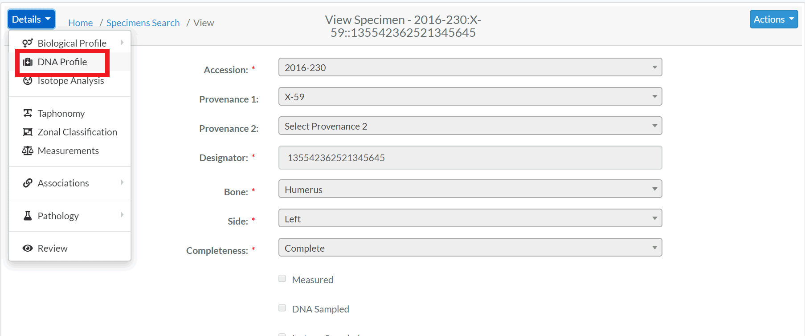

# DNA Profile

## Create DNA

Specimens which have had a DNA sample successfully completed will 
have an associated *DNA Profile*.  The profile contains all relevant DNA attributes and are editable via  (appropriate permissions required)  
  

The fields associated with a DNA are:

- **DNA Sample Number**
- **Lab**
- External Case id 
- BTB Request Date
- BTB Result Date
- Recommended for Resampling (Checkbox)
- Disposition
- Sample Condition
- Weight Sample Remaining 

The bolded fields are required. Below are some fields with their validation rule

Attributes  |   Data Type |Size |Validation Rule  | Required/Optional
------------- | ------------- | ------------- |------------- | -------------
DNA Sample Number  | Alphanumeric |32 chars|Can only contain letters and numbers| Required
External Case id  | Alphanumeric |32 chars|Can only contain letters and numbers| Optional
Priority  |   String |32 chars|Can only contain letters, numbers, dash, space and dot  | Optional
External Sample Number  | String |32 chars| Can only contain letters, numbers, dash and space  | Optional
Disposition of Evidence | Alphanumeric |32 chars| Can only contain letters and numbers  | Optional
Additional Testing | Boolean |NA|True or False  | Optional
Priority Date  | Date| NA|Can only contain dates| Optional
BTB Request Date  | Date| NA|Can only contain dates| Optional
BTB Result Date | Date| NA|Can only contain dates| Optional
Disposition | NA|NA|Either Stored, Consumed or Returned| Optional
Sample Condition| NA| NA|Either Stored, Consumed or Returned| Optional
Weight Sample Remaining| Numeric|32 chars|Can only contain numeric value| Optional
Resample Indicator| Boolean |NA|True or False  | Optional
Notes| String |64 chars | Can contains a string of letters, numbers| Optional

DNA elements are further divided into Mito, auSTR and Y-STR. 

## Mito

The elements associated with Mito are:

- **Method**
- Request Date
- Receive Date
- Results Status
- Mito Sequence Number
- Mito Sequence Subgroup
- Mito Sequence Similar
- Match Count / Population Frequency
- Base Pairs 
- Confirmed Regions
- Mito Polymorphisms
- Mito Haplogroup
- MCC Date

The bolded fields are required. Below are some fields with their data type and validation rule

Attributes  |  Data Type |Size |Validation Rule  | Required/Optional
------------- |------------- | ------------- | ------------- | -------------
Mito Method  | NA|NA|Choose from the options available | Required
Mito Request Date| Date| NA|Can only contain date| Optional
Mito Receive Date| Date| NA|Can only contain date| Optional
Mito Results Confidence|NA|NA|Either Pending, Reportable, Inconclusive, Unable to Assign, Cancelled or No Results| Optional
Mito Sequence Number|String| 32 chars|Can only contain letters, numbers, dash and space| Optional
Mito Sequence Subgroup  | String|32 chars| Can only contain letters, numbers, dash and space | Optional
Mito Sequence Similar  |  String|32 chars|Can only contain letters, numbers, dash and space  | Optional
Mito Match Count |  Numeric| 32 chars|Can only contain numeric value | Optional
Mito Total Count |  Numeric|32 chars|Can only contain numbers | Optional
Mito Base Pairs |  String|32 chars|Can only contain letters, numbers, dash and space | Optional
Mito Confirmed Regions |  String|32 chars|Can only contain letters, numbers, dash and space | Optional
Mito Polymorphisms |  String|32 chars|Can only contain letters, numbers, dash and space | Optional
Mito Haplogroup| NA|NA| Choose from the options available| Optional
Mito MCC Date|Date|NA|Can only contain date| Optional
Mito Fasta Sequence|  String|32 chars|Can only contain letters, numbers, dash and space | Optional
Mito Haplosubgroup | String|32 chars| Can only contain letters, numbers, dash and space | Optional
Mito locus | String|32 chars|Special characters are not allowed | Optional
Mito Num Loci| Numeric |32 chars| Can only contain numeric value | Optional

## auSTR

The elements associated with auSTR are:

- **Method**
- Request Date
- Receive Date
- Results Status
- auSTR Sequence Number
- auSTR Sequence Subgroup
- auSTR Sequence Similar
- Number of Loci
- Loci 
- MCC Date

The bolded fields are required. Below are some fields with their data type and validation rule

Attributes  |   Data Type |Size |Validation Rule  | Required/Optional
------------- | ------------- |  ------------- | ------------- | -------------
AuSTR Method  | NA|NA|Choose from the options available | Required
AuSTR Request Date| Date| NA|Can only contain date| Optional
AuSTR Receive Date| Date| NA|Can only contain date| Optional
AuSTR Results Confidence|NA|NA|Either Pending, Reportable, Inconclusive, Unable to Assign, Cancelled or No Results| Optional
AuSTR Sequence Number| String| 32 chars|Can only contain letters, numbers, dash and space| Optional
AuSTR Sequence Subgroup  | String| 32 chars| Can only contain letters, numbers, dash and space | Optional
AuSTR Sequence Similar  |  String| 32 chars|Can only contain letters, numbers, dash and space  | Optional
AuSTR Match Count | Numeric| 32 chars| Can only contain numeric value| Optional
AuSTR Total Count |  Numeric| 32 chars|Can only contain numbers | Optional
AusTR loci | String| 32 chars|Special characters are not allowed | Optional
AusTR Number of Loci | Numeric| 32 chars|Can only contain numeric value| Optional
AusTR MCC Date|Date| NA|Can only contain date| Optional

## Y-STR

The elements associated with Y-STR are:

- **Method**
- Request Date
- Receive Date
- Results Status
- Y-STR Sequence Number
- Y-STR Sequence Similar
- Match Count / Population Frequency
- Number of Loci
- Loci 
- Y Haplogroup
- MCC Date

The bolded fields are required. Below are some fields with their data type and validation rule

Attributes  |  Data Type |Size | Validation Rule  | Required/Optional
------------- |  ------------- |  ------------- |------------- | -------------
Y-STR Method  | NA|NA|Choose from the options available | Required
Y-STR Request Date|Date| NA|Can only contain date| Optional
Y-STR Receive Date|Date| NA|Can only contain date| Optional
Y-STR Results Confidence|NA|NA|Either Pending, Reportable, Inconclusive, Unable to Assign, Cancelled or No Results| Optional
Y-STR Sequence Number|String|32 chars |Can only contain letters, numbers, dash and space| Optional
Y-STR Sequence Subgroup  | String| 32 chars| Can only contain letters, numbers, dash and space | Optional
Y-STR Sequence Similar  | String| 32 chars| Can only contain letters, numbers, dash and space  | Optional
Y-STR Match Count |  Numeric|32 chars |Can only contain numeric value | Optional
Y-STR Total Count |  Numeric|32 chars |Can only contain numbers | Optional
Y-STR loci | String|32 chars |Special characters are not allowed | Optional
Y-STR Number of Loci |Numeric| 32 chars| Can only contain numeric value| Optional
Y-STR MCC Date|Date|NA|Can only contain date| Optional
Y-STR Haplogroup| NA|NA| Choose from options available | Optional
Y-STR Haplosubgroup| String|32 chars | Can only contain letters, numbers, dash and space| Optional

## Element Highlights

Additional skeletal element attributes about the DNA sample can found in the *Element Highlights* section above the DNA Profile.  By default this section is collapsed.

