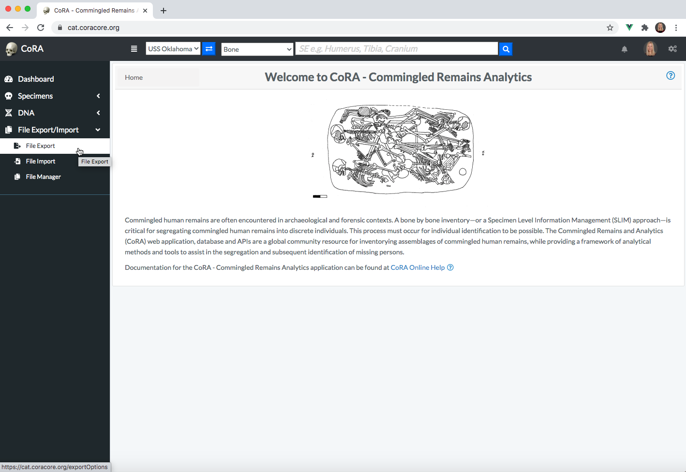
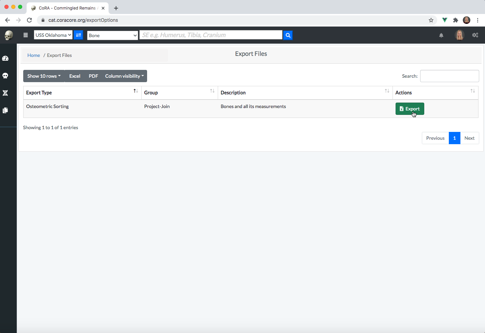
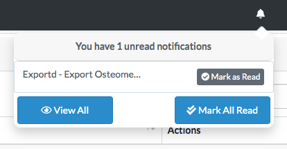
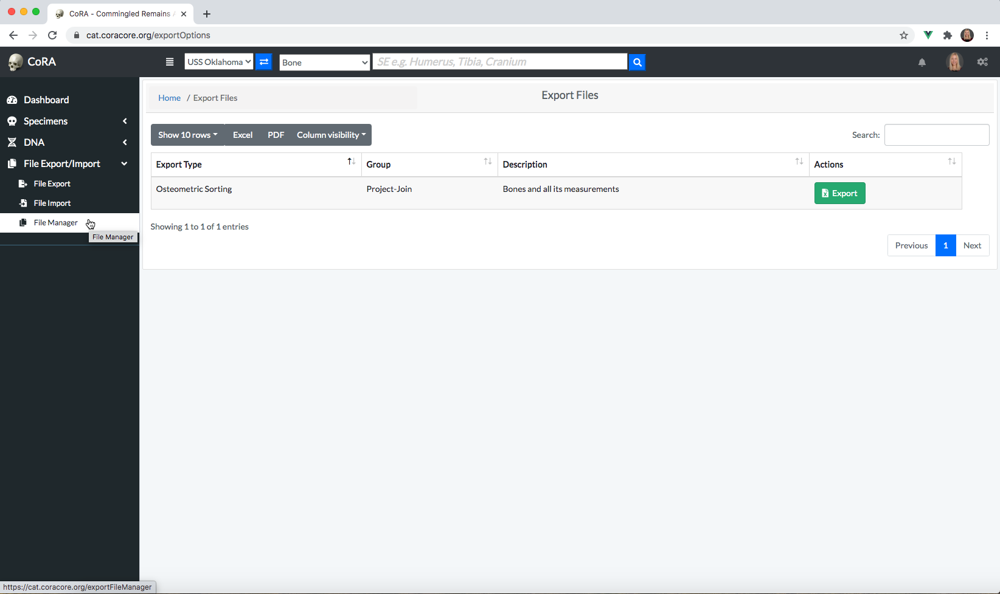
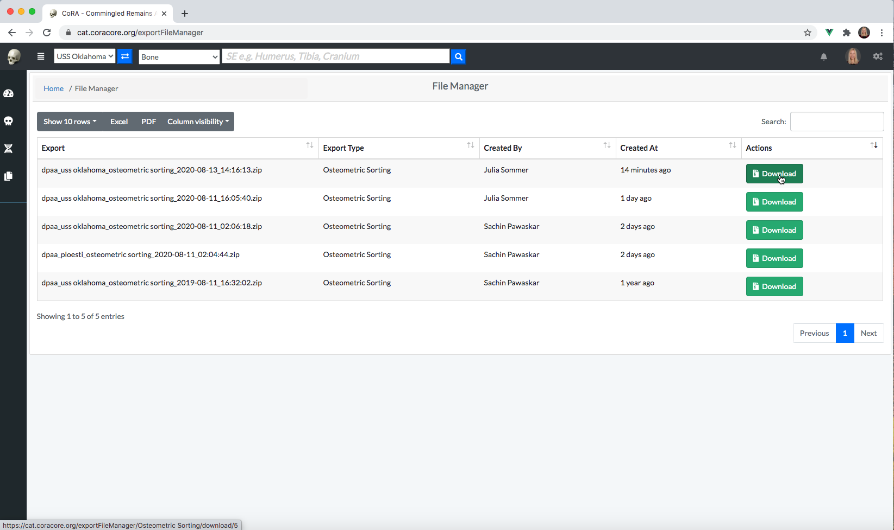
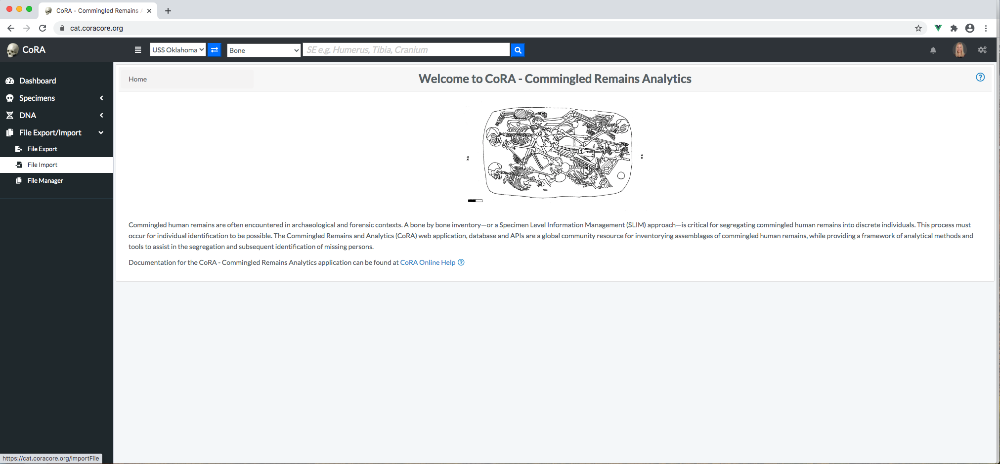
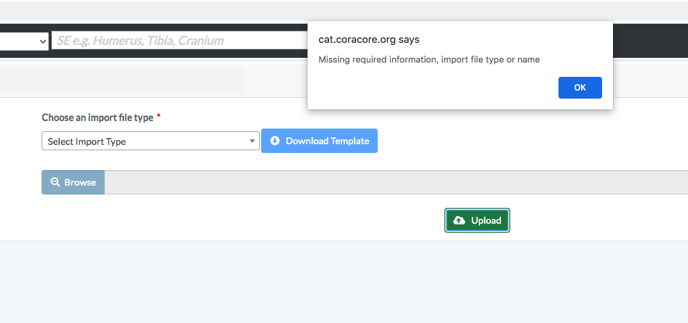
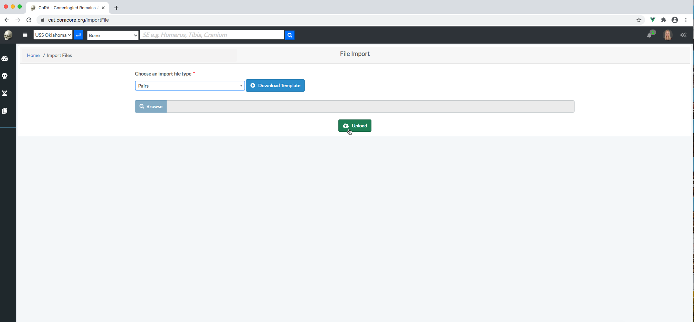
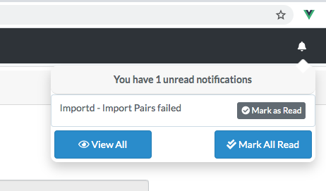

# File Export and Import 

Files can be exported from and import into CoRA via the File Import/Export and File Manager system. Options for File Export and Import can be viewed under the left navigation bar.

## File Export 

In order to create a file export, click on 'File Export' under 'File Export/Import' on the left navigation bar. 

This will take you to the File Export page. This page lists different types of files available to export from CoRA. Currently, bone measurements formatted for intput into osteometric sorting tools are avaiable. Click on the green export button for the file(s) that you want to export. 

Clicking on a file export button will not result in an immediate file(s) download. Instead, a request is made to CoRA to begin a file export job in the background. This may take several minutes depending on the number of background jobs that are currently queued in CoRA. Once the file export job is competed a real-time notification will be seen under the notifications bell located on the top right of the CoRA webpage header. You may have to refresh the page to see the notification.        

To get rid of the notification, click on mark as read. 

## File Manager

All files exported and imported into CoRA can be accessed at a central location called the File Manager. The file(s) that you just exported will be located here after CoRA completes the file export job. To access the File Manager, click on 'File Manager' under 'File Export/Import' on left navigation bar.

The File Manager will list all of the file export/import jobs that have been completed by CoRA with most recent export/import jobs listed first. To download a file export, click download.  A file export does not become available on this page until the requested file export job has been completed by CoRA. 

## File Export Types

This section details the type of file export types availiable to the user. 

### Osteometric Sorting
Osteometric sorting uses size and shape to separate bones from one another. Several statistical methods exist; some references for osteometric sorting are shown below. 

- Byrd, John E., and Bradley J. Adams. "Osteometric sorting of commingled human remains." Journal of forensic sciences 48.4 (2003): 717-724.
- Lynch, Jeffrey James, John Byrd, and Carrie B. LeGarde. "The power of exclusion using automated osteometric sorting: pair‐matching." Journal of forensic sciences 63.2 (2018): 371-380.
- Warnke‐Sommer, Julia D., et al. "Z‐transform method for pairwise osteometric pair‐matching." Journal of forensic sciences 64.1 (2019): 23-33.

CoRA produces a zip file of osteometric sorting bone measurement files for all long bones. Any osteometric sorting program used to process these files must accept the following fields.

|  Field | Description   |
|---|---|
|  se_id |  The skeletal element internal CoRA id  |
| skeletal_element  | The composite key the skeletal element   |
| accession_number, provenance1,	provenance2,	designator  | Elements of the composite key |
| skeletal_bone  |  The skeletal bone type |
| side  | The side: right, left, unsided  |
| measurements  | Example measuement headers for the femur: Fem_01, Fem_02, Fem_03, Fem_04, Fem_05, Fem_06, Fem_07 |

## File Import
In order to import a file, click on 'File Import' under 'File Export/Import' on the left navigation bar.

On the file import screen, select the import file type that you wish to upload. A template can be download for the file type that you are importing. CoRA will not allow you to import a file unless the file import type is selected.

The pairs file type is shown as selected in the screenshot below. Click on browse to select a file to upload from your computer. Once selected, hit upload to upload the file to CoRA. 

As with file export, CoRA creates a background job for the file import process. A notification will appear when the job has completed. You may need to refresh your screen to see the notification. The notification will indicate whether your import was successful or not. The imported records will appear in CoRA after a successful import. 

## File Import Types 
This section details the type of file import types availiable to the user. Templates can be downloaded for each import file type on the file import page. 

### Osteometric Sorting  

#### Pairs

A pairs file produced by an osteometric sorting program must have the following fields for upload to CoRA. Only pairs that were **not** excluded should be uploaded to CoRA. 

|  Field | Description   |
|---|---|
|  se_id |  The skeletal element internal CoRA id.  |
| pair_id  | The skeletal element internal CoRA id for the paired element   |
| se_skeletal_element | The composite key for the skeletal element    |
| se_accession_number, se_provenance1,	se_provenance2,	se_designator  | Elements of the composite key |
| pair_skeletal_element | The composite key for the paired skeletal element    |
| pair_accession_number, pair_provenance1,	pair_provenance2,	pair_designator  | Elements of the composite key for the paired sleletal element|
| bonename  |  The skeletal bone type |
| compare_method  | The osteometric sorting method used |
| compare_method_settings | Program settings |
| sample_size | The size of the reference sample |
| pvalue| The p-value of the statistical test |
| num_measurements | Number of measurements used for the comparison |
| measurements_used | The measurements that were used | 
| measurement_means | The means of the measurements in the reference population |
| measurement_sd | The standard deviation of the measurements 

