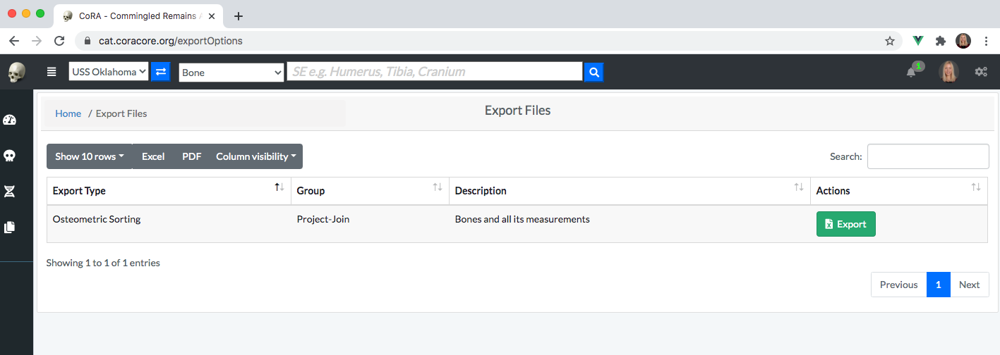

# File Export and Import 
Files can be exported from and import into CoRA via the File Import/Export and File Manager system. Options for File Export and Import can be viewed under the left navigation bar.

## File Export 
In order to create a file export, click on 'File Export' under 'File Export/Import' on the left navigation bar. 

This will take you to the File Export page. This page lists different types of files available to export from CoRA. Currently, bone measurements formatted for intput into osteometric sorting tools are avaiable. Click on the green export button for the file(s) that you want to export. 

Clicking on a file export button will not result in an immediate file(s) download. Instead, a request is made to CoRA to begin a file export job in the background. This may take several minutes depending on the number of background jobs that are currently queued in CoRA. Once the file export job is competed a real-time notification will be seen under the notifications bell located on the top right of the CoRA webpage header. You may have to refresh the page to see the notification.        

To get rid of the notification, click on mark as read. 

## File Manager
All files exported and imported into CoRA can be accessed at a central location called the File Manager. The file(s) that you just exported will be located here after CoRA completes the file export job. To access the File Manager, click on 'File Manager' under 'File Export/Import' on left navigation bar.

The File Manager will list all of the file export/import jobs that have been completed by CoRA with most recent export/import jobs listed first. To download a file export, click download.  A file export does not become available on this page until the requested file export job has been completed by CoRA. 

