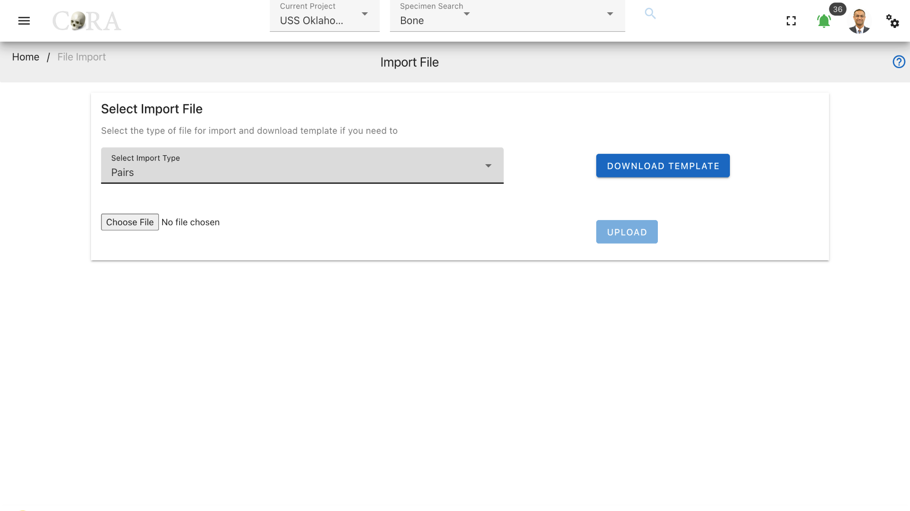
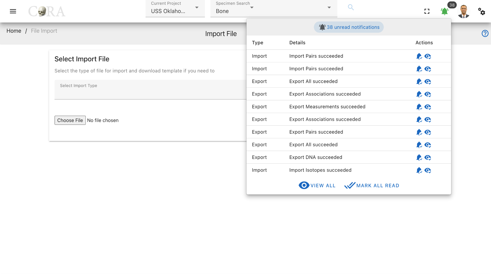

# File Export, Import and Manager

Data can be exported from and imported into CoRA via the File Export/Import and File Manager system. Options for File Export and Import can be viewed under the left navigation bar. This capability is different from the Excel and PDF export that you will find on all data tables within CoRA such as with Search screens and Reports screens.

## File Export 

In order to export data from CoRA, navigate to Left Sidebar Menu -\> File Export/Import-\> File Export. Please note that users can only export data for the current project.

This will take you to the File Export page. This page lists the different types of files exports available in CoRA. 

### Export Types

The available type of exports and their descriptions are shown in the below table

| Export Type          | Description                                                      |
|----------------------|------------------------------------------------------------------|
| Base - All           | Base tables that hold descriptive data for CoRA                  |
| All                  | Specimens and all its associations                               |
| DNA                  | Specimens, DNA and all DNA associations                          |
| Measurements         | Specimens and all its measurements                               |
| Zones                | Specimens and all its zones                                      |
| Associations         | Specimens and its pair, articualtion and refit associations      |
| Pairs                | Specimens and all its pairs                                      |
| Articulations        | Specimens and all its articulations                              |
| Refits               | Specimens and all its refits                                     |
| Taphonomies          | Specimens and all its taphonomies                                |
| Pathology All        | Specimens and all its pathology, trauma and anomaly associations |
| Pathology            | Specimens and all its pathologies                                |
| Trauma               | Specimens and all its traumas                                    |
| Anomaly              | Specimens and all its anomalies                                  |
| Methods              | Specimens, its methods and method features                       |
| Missing Persons      | Missing Persons, and Genealogy                                   |
| Instruments          | Instruments                                                      |
| Osteometric Sorting  | Bones and all its measurements                                   |

***Export types options available to different role***

| Role              | Available Export Type                                                                                                                                                                                          | 
|-------------------|----------------------------------------------------------------------------------------------------------------------------------------------------------------------------------------------------------------|
| anthropologist    | Base - All, All, DNA, Measurements, Zones, Associations, Pairs, Articulations, Refits, Taphonomies,  Pathology All, Pathology, Trauma, Anomaly, Methods, Instruments, Osteometric Sorting                  |
| org administrator | Base - All, All, DNA, Measurements, Zones, Associations, Pairs, Articulations, Refits, Taphonomies,  Pathology All, Pathology, Trauma, Anomaly, Methods, Missing Persons, Instruments, Osteometric Sorting |
| mp administrator  | Missing Persons                                                                                                                                                                                                |

### Osteometric Sorting

Osteometric sorting uses size and shape to separate bones from one another. Several statistical methods exist; some references for osteometric sorting are shown below.

???+ abstract "References for osteometric sorting"

    - Byrd, John E., and Bradley J. Adams. "Osteometric sorting of commingled human remains." Journal of forensic sciences 48.4 (2003): 717-724.
    - Lynch, Jeffrey James, John Byrd, and Carrie B. LeGarde. "The power of exclusion using automated osteometric sorting: pair‐matching." Journal of forensic sciences 63.2 (2018): 371-380.
    - Warnke‐Sommer, Julia D., et al. "Z‐transform method for pairwise osteometric pair‐matching." Journal of forensic sciences 64.1 (2019): 23-33.

CoRA produces a zip file of osteometric sorting bone measurement files for all long bones. Any osteometric sorting program used to process these files must accept the following fields.

|Attribute               |Description                                                                                           |
|------------------------|-------------------------------------------------------------------------------------------------------|
|se_id                   |The specimen or skeletal element id within CoRA                                                        |
|skeletal_element        |The composite key the specimen or skeletal element                                                     |
|accession_number        |The accession number for the specimen                                                                  |
|provenance1             |The provenance1 for the specimen                                                                       |
|provenance2             |The provenance2 for the specimen                                                                       |
|designator              |The designator for the specimen                                                                        |
|skeletal_bone           |The skeletal bone type                                                                                 |
|side                    |The side: right, left, unsided                                                                         |
|measurements            |Example measurement headers for the femur: Fem_01, Fem_02, Fem_03, Fem_04, Fem_05, Fem_06, Fem_07      |

!!! tip

    Use the osteometric sorting export to download bone measurements formatted for input into the **osteometric sorting tools**.

CoRA creates a background job for the file export process. A notification will appear when the job has completed. You may need to refresh your screen to see the notification. The notification will indicate whether your export was successful or not. The exported records will appear in CoRA under File manager Section.

### File Export Notification

Clicking on a file export button will not result in an immediate file(s) download. Instead, a request is made to CoRA to begin a file export job in the background. This may take several minutes depending on the number of records to be exported and the number of background jobs that are currently queued in CoRA. Once the file export job is competed a real-time notification will be seen under the notifications bell located on the top right header of the CoRA application.      

To get rid of the notification, click on mark as read.

### Advanced Exports Feature

The anthropologist and mp admin role can only see the export button option, which will export the entire column from that table. The org admin role had both the export and advanced button. The feature of the advanced button is that we can export specific columns from that table to export. Selecting the include timestamp check box, adds the four columns 'created_by, created_at, updated_by, updated_at, deleted_at' in the excel.

Click on 'Export Tables' to start the export for those particular tables and columns.

## File Manager

All files exported and imported into CoRA can be accessed at a central location called the File Manager. The file(s) that you just exported will be located here after CoRA completes the file export job. To access the File Manager, navigate to Left Sidebar Menu -\> File Export/Import-\> File Manager.

The File Manager will list all the file export/import jobs that have been completed by CoRA with most recent export/import jobs listed first. To download a file export, click download.  A file export does not become available on this page until the requested file export job has been completed by CoRA. 

Click on the 'Download' button in green to download the particular files exported to CoRA.

## File Import

In order to import a file, navigate to Left Sidebar Menu -\> File Export/Import-\> File Import

On the file import screen, select the import file type that you wish to upload. A template can be downloaded for the 
file type that you are importing. CoRA will not allow you to import a file unless the file import type is selected.

The pairs file type is shown as selected in the screenshot below. Click on browse to select a file to upload from your 
computer. Once selected, hit upload to upload the file to CoRA.

As with file export, CoRA creates a background job for the file import process. A notification will appear when the job 
has completed. You may need to refresh your screen to see the notification. 
The notification will indicate whether your import was successful or not. 
The imported records will appear in CoRA after a successful import. Click on 'view notification' to read the import 
information in detail.

### Import Types

This section details the type of file import types available to the user. Templates can be downloaded for each import file type on the file import page. Following are the import types that are available to the user.

1. Specimens
2. Zones
3. Measurements
4. DNA sample
5. Pairs (Results From Osteometric Sorting Tools)
6. Articulations (Results From Osteometric Sorting Tools)
7. DNA
8. Isotopes
9. Missing Persons
10. Missing Persons-DCIPS
11. External Systems - Specimens & DNA sample
12. External Systems - Specimens
13. External Systems - DNA sample

The file being imported must contain a specific word depending on the import type. The filename can contain other words 
and characters, but it must contain one of the following words.  

| Import Type                         | Required Word    | 
|-------------------------------------|------------------|
| Specimens                           | specimens        |
| Zones                               | zone             |
| Measurements                        | measurement      |
| DNA                                 | dna              |
| DNA Sample                          | dna              |
| Pairs                               | pair             |
| Articulations                       | articulation     |
| Missing Persons                     | missing / dcips  |
| Missing Persons - DCIPS             | dcips            |
| Isotopes                            | Isotope          |
| External Systems - Specimen and DNA | externalsystem   |
| External Systems - Specimen         | externalse       |
| External Systems - DNA              | externaldna      |

***Import types options available to different role***

| Role              | Available Import Type                                                                                                                                                                      | 
| ----------------- |--------------------------------------------------------------------------------------------------------------------------------------------------------------------------------------------|
| anthropologist    | Specimens,Zones,Measurements,DNA, DNA Sample, Isotopes, Pairs, Articulations,  External Systems - Specimens & DNA, External Systems - Specimens, External Systems - DNA                |
| org administrator | Specimens,Zones,Measurements,DNA,Pairs,Articulations,Missing Persons, Missing Persons-DCIPS,  External Systems - Specimens & DNA, External Systems - Specimens, External Systems - DNA |
| mp administrator  | Missing Persons, Missing Persons-DCIPS                                                                                                                                                     |

### File Upload

Click on browse to select a file to upload from your computer. Once selected, click upload to upload the file to CoRA. 
The upload button will be disabled until the import type selected and file is attached. Both are the mandatory input for 
the upload to get triggered.

!!! tip
    CoRA validates that the type chosen and file name attached match, it will throws an error if they don't match.

#### File Upload - External Systems

Data can also be imported from external systems for DNA and Skeletal elements. The column names mapping from external systems to
CoRA is shown below.

##### DNA
Data in a row is mapped to DNA if the value of the 'progname' column in the external systems is 'DNA Sample'.

| External Systems             | DNA (CoRA)               |
|------------------------------|--------------------------|
| org_id                       | org_id                   |
| project_id                   | project_id               |
| afdil_case_no                | external_case_id         |
| afdil_sample_no              | sample_number            |
| priority                     | priority                 |
| mito_sequence_number         | mito_sequence_number     |
| mito_sequence_subgroup       | mito_sequence_subgroup   |
| mito_sequence_similar        | mito_sequence_similar    |
| mito_match_count             | mito_match_count         |
| mito_total_count             | mito_total_count         |
| mito_receive_date            | mito_receive_date        |
| mito_haplogroup_id           | mito_haplogroup_id       |
| analysis_type_id             | analysis_type_id         |
| mito_results_confidence      | mito_results_confidence  |
| mito_num_loci                | mito_num_loci            |
| progname (checks conditions) | sbId                     |
| austr_match_count            | austr_match_count        |
| austr_total_count            | austr_total_count        |
| austr_num_loci               | austr_num_loci           |
| ystr_match_count             | ystr_match_count         |
| ystr_total_count             | ystr_total_count         |
| ystr_num_loci                | ystr_num_loci            |
| ystr_haplogroup              | ystr_haplogroup          |
| mito_mcc_date                | mito_mcc_date            |
| priority_date                | priority_date            |
| btb_request_date             | btb_request_date         |
| btb_results_date             | btb_results_date         |
| mito_request_date            | mito_request_date        |
| austr_request_date           | austr_request_date       |
| austr_receive_date           | austr_receive_date       |
| austr_mcc_date               | austr_mcc_date           |
| ystr_request_date            | ystr_request_date        |
| ystr_receive_date            | ystr_receive_date        |
| ystr_mcc_date                | ystr_mcc_date            |
| mito_fasta_sequence          | mito_fasta_sequence      |
| uuid                         | uuid                     |
| mito_confirmed_regions       | mito_confirmed_regions   |
| mito_base_pairs              | mito_base_pairs          |
| locus                        | locus                    |
| weight_sample_remaining      | weight_sample_remaining  |
| notes                        | notes                    |
| mito_method                  | mito_method              |
| external_sample_number       | external_sample_number   |
| dispostion_of_evidence       | dispostion_of_evidence   |
| disposition                  | disposition              |
| sample_condition             | sample_condition         |
| mito_polymorphisms           | mito_polymorphisms       |
| austr_method                 | austr_method             |
| austr_results_confidence     | austr_results_confidence |
| austr_sequence_number        | austr_sequence_number    |
| austr_sequence_subgroup      | austr_sequence_subgroup  |
| austr_sequence_similar       | austr_sequence_similar   |
| austr_loci                   | austr_loci               |
| ystr_method                  | ystr_method              |
| ystr_results_confidence      | ystr_results_confidence  |
| ystr_sequence_number         | ystr_sequence_number     |
| ystr_sequence_subgroup       | ystr_sequence_subgroup   |
| ystr_sequence_similar        | ystr_sequence_similar    |
| ystr_loci                    | ystr_loci                |
| custom_field_1               | custom_field_1           |
| custom_field_2               | custom_field_2           |
| custom_field_3               | custom_field_3           |
| mito_haplosubgroup           | mito_haplosubgroup       |
| ystr_haplosubgroup           | ystr_haplosubgroup       |
| additional_testing           | additional_testing       |
| resample_indicator           | resample_indicator       |
| exhibitcreatedby             | created_by               |
| exhibitcreatedby             | updated_by               |

##### Skeletal Elements

Data is mapped to skeletal elements if 'progname' column of external systems is not 'DNA Sample'.

| External Systems             | DNA (CoRA)           |
|------------------------------|----------------------|
| casenumber                   | accession_number     |
| crimesceneid                 | provenance 1         |
| location_found               | provenance 2         |
| exhibitno                    | designator           |
| user_id                      | user_id              |
| org_id                       | org_id               |
| project_id                   | project_id           |
| side                         | side                 |
| progname (checks conditions) | sb_id                |
| inv_completeness             | completeness         |
| measured                     | measured             |
| dna_sampled                  | dna_sampled          |
| ct_scanned                   | ct_scanned           |
| xray_scanned                 | xray_scanned         |
| clavicle_triage              | clavicle_triage      |
| inventoried                  | inventoried          |
| reviewed                     | reviewed             |
| casenumber & exhibitno       | external_id          |
| individual_number            | individual_number    |
| inventoried_at               | inventoried_at       |
| reviewed_at                  | reviewed_at          |
| consolidated_on              | consolidated_on      |
| isotope_sampled              | isotope_sampled      |
| count                        | count                |
| mass                         | mass                 |
| bone_group_id                | bone_group_id        |
| inventoried_by_id            | inventoried_by_id    |
| remains_status               | remains_status       |
| remains_release_date         | remains_release_date |
| identification_date          | identification_date  |
| 3D_scanned                   | 3D_scanned           |
| notes                        | notes                |
| uuid                         | uuid                 |
| ct_scanned_date              | ct_scanned_date      |
| xray_scanned_date            | xray_scanned_date    |
| 3D_scanned_date              | 3D_scanned_date      |
| min_age                      | min_age              |
| max_age                      | max_age              |
| custom_field_1               | custom_field_1       |
| custom_field_2               | custom_field_2       |
| custom_field_3               | custom_field_3       |
| exhibitcreatedby             | created_by           |
| exhibitcreatedby             | updated_by           |

### File Import Notification

As with file export, CoRA creates a background job for the file import process. A notification will appear when the job 
has completed. You may need to refresh your screen to see the notification. The notification will indicate whether your 
import was successful or not. The imported records will appear in CoRA after a successful import. You can click the eye 
icon under the Action menu to see the detailed result of the import process. It explains how many records were successfully 
imported and if there were failures it will also provide the reason for the failure rows. Click the green bell sign in 
the top right corner to view and mark all notifications.

### Osteometric Sorting  

#### Pairs

A pairs file produced by an osteometric sorting program must have the following fields for upload to CoRA. Only pairs that were **not** excluded should be uploaded to CoRA. 

|Attribute               |Description                                                                                        |
|------------------------|---------------------------------------------------------------------------------------------------|
|se_id                   |The specimen or skeletal element id internal to CoRA.                                              |
|pair_id                 |The specimen or skeletal element id internal to CoRA for the paired element                        |
|se_skeletal_element     |The composite key for the specimen                                                                 |
|se_accession_number     |The accession number for the specimen                                                              |
|se_provenance1          |The provenance1 for the specimen                                                                   |
|se_provenance2          |The provenance2 for the specimen                                                                   |
|se_designator           |The designator for the specimen                                                                    |
|pair_skeletal_element   |The composite key for the paired specimen                                                          |
|pair_accession_number   |The accession number for the paired specimen                                                       |
|pair_provenance1        |The provenance1 for the paired specimen                                                            |
|pair_provenance2        |The provenance2 for the paired specimen                                                            |
|pair_designator         |The designator for the paired specimen                                                             |
|bonename                |The specimen bone type                                                                             |
|compare_method          |The osteometric sorting method used                                                                |
|compare_method_settings |Program settings                                                                                   |
|sample_size             |The size of the reference sample                                                                   |
|pvalue                  |The p-value of the statistical test                                                                |
|num_measurements        |Number of measurements used for the comparison                                                     |
|measurements_used       |The measurements that were used                                                                    |
|measurement_means       |The means of the measurements in the reference population                                          |
|measurement_sd          |The standard deviation of the measurements                                                         |

#### Articulations

A articulations file produced by an osteometric sorting program must have the following fields for upload to CoRA. Only articulations that were **not** excluded should be uploaded to CoRA. 

|Attribute                      |Description                                                                                 |
|-------------------------------|--------------------------------------------------------------------------------------------|
|se_id                          |The specimen or skeletal element id internal to CoRA.                                       |
|articulation_id                |The specimen or skeletal element id internal to CoRA for the articulated element            |
|se_skeletal_element            |The composite key for the specimen                                                          |
|se_accession_number            |The accession number for the specimen                                                       |
|se_provenance1                 |The provenance1 for the specimen                                                            |
|se_provenance2                 |The provenance2 for the specimen                                                            |
|se_designator                  |The designator for the specimen                                                             |
|articulation_skeletal_element  |The composite key for the articulated specimen                                              |
|articulation_accession_number  |The accession number for the articulated specimen                                           |
|articulation_provenance1       |The provenance1 for the articulated specimen                                                |
|articulation_provenance2       |The provenance2 for the articulated specimen                                                |
|articulation_designator        |The designator for the articulated specimen                                                 |
|bonename                       |The specimen bone type                                                                      |
|compare_method                 |The osteometric sorting method used                                                         |
|compare_method_settings        |Program settings                                                                            |
|sample_size                    |The size of the reference sample                                                            |
|pvalue                         |The p-value of the statistical test                                                         |
|num_measurements               |Number of measurements used for the comparison                                              |
|measurements_used              |The measurements that were used                                                             |
|measurement_means              |The means of the measurements in the reference population                                   |
|measurement_sd                 |The standard deviation of the measurements                                                  |

## Missing Persons DCIPS Import

There is currently an issue affecting the Missing Persons DCIPS import. No more than 20,000 rows can be imported at one time, and the fields in the excel file generated by DCIPS are inaccurate.

Less than 20,000 rows at a time must be taken from the DCIPS excel file and pasted into the Missing Persons template. The import must then be run until all the fields have been imported. Currently, there are about 130,000 rows exported from DCIPS, and the import process requires seven separate files.

Another possible solution is to obtain a delta file containing only the changes from the last import. This approach has not yet been tested. 

