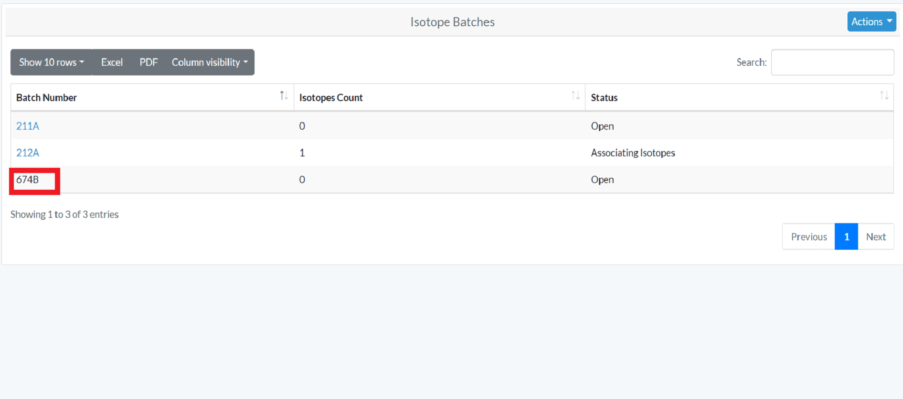
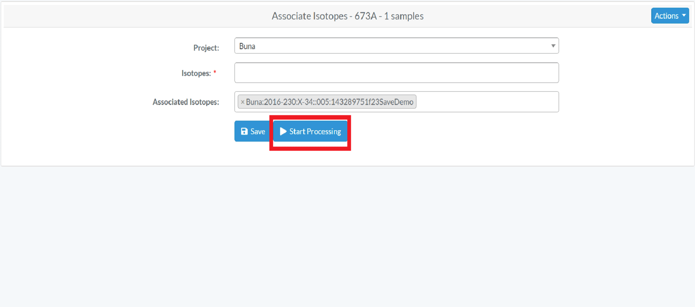

# Isotope 

## Create Isotope Batch
- You can create/view Isotope Batches as an Admin and Manager. In order to view the isotope batches, click on 'Isotope Batches' on left navigation bar
- In order to create a new isotope batch, click on 'New Isotope Batch' or 'Action/Create' under Isotope Batches.
- On the Create Isotope Batch page, enter the required information and click save (required fields are marked with a red asterisk*)

- After the isotope batch is created successfully, you will receive success message 

### Add Isotopes Count

- After Isotope Batch is created, you can view it under "Isotope Batch" in left navigation bar. 
- In order to add isotope counts and change the status of the isotope, you can further edit the isotope by clicking it.

### Edit Isotope Batch

After the creation of a Isotope Batch, the Org Admin and Manager can edit the Isotope Batch.
On the Isotope Batches page, click on the batch number to edit

Edit the needed information on the page, and click save. Under Edit Isotope Batch you can move to different tabs and edit different attributes. The tabs are 
- Cleaning
- Demineralizing
- Remove Humic Acid
- Solubilizing
- Freeze Drying
- Collagen Yield

To edit the Tabs, click "Start Processing" after you create an Isotope Batch. In order to move to the next tab, click "Edit" under Action and Check all the given fields and click "Save". Repeat this step, until all the fields are checked mark.

Below are some validation rules associated with Isotope Batch
 
Attributes  |Data Type |Size | Validation Rule  | Required/Optional
------------- | -------------| ------------- |-------------|  -------------|
Lab | NA |NA |Can choose from the option available | Required
External Case # |  Alphanumeric |32 chars |Can only contain letters and numericals| Optional
Isotope Batch Number| Alphanumeric |32 chars |Can only contain letters and numericals| Required
Status|NA |NA |Either Open, Associating Isotopes, Cleaning, Demineralizing, Removal Humic Acids, Solubilizing, Freeze Drying Collagen, Determining Collagen Yield and closed|Optional
Cleaning start date | Date |NA |Can only contain Date | Optional
Label tubes and caps| Boolean |NA | True or False| Optional
Remove all visible signs of surface contamination |Boolean |NA | True or False| Optional
Ringes sample with dH20 | Boolean |NA | True or False| Optional
Sonicate samples with dh2o-cycle1| Boolean |NA | True or False| Optional
Sonicate samples with dh2o-cycle1 Start Date | Date |NA |Can only contain Date | Optional
Sonicate samples with dh2o-cycle2 | Boolean |NA | True or False| Optional
Sonicate samples with dh2o-cycle2 Start Date | Date |NA |Can only contain Date| Optional
Sonicate samples with 95% ethanol | Boolean |NA | True or False| Optional
Sonicate samples with 95% ethanol Start Date | Date |NA |Can only contain Date| Optional
Sonicate samples with 100% ethanol | Boolean |NA | True or False| Optional
Sonicate samples with 100% ethanol Start Date | Date |NA |Can only contain Date| Optional
Dry samples start | Boolean |NA | True or False| Optional
Dry sample start date | Date |NA |Can only contain Date| Optional
Dry samples end | Boolean |NA | True or False| Optional
Dry sample end date | Date |NA |Can only contain Date | Optional
Cleaning initials | Alphanumeric |32 chars |Can only contain letters and numericals | Optional
Demineralizing Treatment Start | Boolean |NA | True or False| Optional
Demineralizing Treatment End | Boolean |NA | True or False|Optional
Demineralizing Treatment Start Date | Date |NA |Can only contain Date | Optional
Demineralizing Treatment End Date | Date |NA |Can only contain Date | Optional
Rinse Demineralized Samples | Boolean |NA | True or False| Optional
Removal Humic Acids treatment start | Boolean |NA | True or False| Optional
Removal Humic Acids treatment End | Boolean |NA | True or False| Optional
Removal Humic Acids treatment start Date | Date |NA |Can only contain Date| Optional
Removal Humic Acids treatment End Date | Date |NA |Can only contain Date| Optional
Removal Humic Acids treatment rinse 1 start | Boolean |NA | True or False| Optional
Removal Humic Acids treatment rinse 1 End | Boolean |NA | True or False| Optional
Removal Humic Acids treatment rinse 1 start Date | Date |NA |Can only contain Date | Optional
Removal Humic Acids treatment rinse 1 End Date | Date |NA |Can only contain Date| Optional
Removal Humic Acids treatment rinse 2 start | Boolean |NA | True or False| Optional
Removal Humic Acids treatment rinse 2 End | Boolean |NA | True or False| Optional
Removal Humic Acids treatment rinse 2 start Date | Date |NA |Can only contain Date | Optional
Removal Humic Acids treatment rinse 2 End Date | Date |NA |Can only contain Date| Optional
Removal Humic Acids treatment rinse 3 start | Boolean |NA | True or False| Optional
Removal Humic Acids treatment rinse 3 End | Boolean |NA | True or False|Optional
Removal Humic Acids treatment rinse 3 start Date | Date |NA |Can only contain Date | Optional
Removal Humic Acids treatment rinse 3 End Date | Date |NA |Can only contain Date| Optional
Removal Humic Acids treatment rinse 4 start | Boolean |NA | True or False| Optional
Removal Humic Acids treatment rinse 4 End | Boolean |NA | True or False| Optional
Removal Humic Acids treatment rinse 4 start Date | Date |NA |Can only contain Date | Optional
Removal Humic Acids treatment rinse 4 End Date | Date |NA |Can only contain Date| Optional
Removal Humic Acids treatment rinse 5 start | Boolean |NA | True or False| Optional
Removal Humic Acids treatment rinse 5 End | Boolean |NA | True or False| Optional
Removal Humic Acids treatment rinse 5 start Date | Date |NA |Can only contain Date| Optional
Removal Humic Acids treatment rinse 5 End Date | Date |NA |Can only contain Date| Optional
Solubilizing clean vials and lids | Boolean |NA | True or False| Optional
Solubilizing clean vials and lids date| Date |NA |Can only contain Date | Optional
Solubilizing add solubale | Boolean |NA | True or False| Optional
Solubilizing place in oven | Boolean |NA | True or False| Optional
Solubilizing centrifuge tubes |Boolean |NA | True or False| Optional
Solubilizing num acid heat treatment |Numeric |32 chars | Can only contain numbers | Optional
Solubilizing num collagen transfers| Numeric |32 chars |Can only contain numbers | Optional
Solubilizing freeze vials| Boolean |NA | True or False| Optional
Solubilizing freeze vials date| Date |NA |Can only contain Date | Optional
Freeze Drying Collagen on| Boolean |NA | True or False| Optional
Freeze Drying Collagen Start| Boolean |NA | True or False| Optional
Freeze Drying Collagen End| Boolean |NA | True or False| Optional
Freeze Drying Collagen Start Date| Date |NA |Can only contain Date | Optional
Freeze Drying Collagen End Date| Date |NA |Can only contain Date| Optional
Combined Sample Weight| Boolean |NA | True or False|Optional
Notes| String |64 chars | Can contains a string of letters, numbers|Optional
