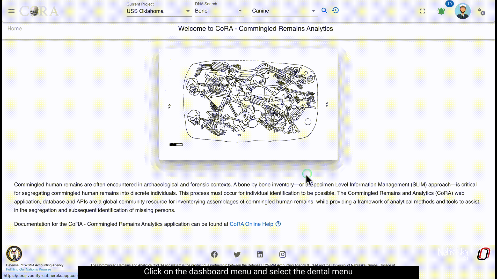
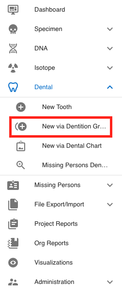

# Dental

Dental remains are extremely important to the identification process. An individual’s dental records are often the best way to identify remains as they have unique individual characteristics and may contain surviving mtDNA. If your project chooses to use Dental analysis as part of your identification process then you have come to the right place. Ideally, the project forensic odontologists will have antemortem (before death) X-rays to use for comparison, but even handwritten charts and treatment notes can be critical to the research and identification process. Here you will learn more about the Dental module in CoRA.

- Dental Navigation
- Create New Dental Specimen
  - New tooth
  - Multiple via Dentition Bone Group
  - Multiple via Dental Chart

## Navigation

Navigate to the Dental section by opening the navigation bar and selecting the Dental dropdown. For Report Dashboard - please see the **Reports** documentation.

## Create Dental Specimen
Users can create a new dental specimen in multiple ways. For example you can create a single tooth or multiple dental specimens belonging to a dentition bone group such as Maxillary dentition.

### New Tooth
User can create a New Tooth by navigate to Left Sidebar Menu -> Dental-> New Tooth. User will be taken to the new dental screen as shown below.

You are now in the create page for the New tooth of the CoRA application. User can create following the below steps.

> The screen fields are shown below. Fields in bold are required.

| Attributes       | Data Type    | Size     | Validation Rule                                                               | Required/Optional |
|------------------|--------------|----------|-------------------------------------------------------------------------------|-------------------|
| **Accession**    | String       | 32 chars | Can only contain letters, numbers, dash and space and should have min 3 chars | Required          |
| Provenance1      | String       | 32 chars | Can only contain letters, numbers, dash and space                             | Optional          |
| Provenance2      | String       | 32 chars | Can only contain letters, numbers, dash and space                             | Optional          |
| **Designator**   | Alphanumeric | 32 chars | Can only contain letters and numbers                                          | Required          |
| **Tooth**        | Id           | id       | valid bones via dropdown                                                      | Required          |
| **Completeness** | String       | 16 chars | valid completeness via dropdown (Complete, Incomplete)                        | Required          |

### Multiple via Dentition Bone Group

To create a multiple specimens via dentition bone group - navigate to the Left Sidebar Menu -> dental -> New via Dentition Bone Group. You will be taken to the new specimens via bone group screen. Here you can create multiple dental specimens that belong to the same dentition bone group.

You are now in the create page for the new dental via dentition bne group of the CoRA application. User can create following the below steps.

The fields to create a new bone group are:

- Bone Group
    - **Grouping**
    - Bone group
    - **Side** (defaulted to 'Left')
    - **Completeness** (defaulted to 'Complete')
- Accession
    - **Accession Number**
    - Provenance 1
    - Provenance 2
    - **Designator**
- Pathology
    - Traumas
    - Pathologies
    - Taphonomies

The bolded fields are required.

| Attributes              | Data Type    | Size     | Validation Rule                                                               | Required/Optional |
|-------------------------|--------------|----------|-------------------------------------------------------------------------------|-------------------|
| **Bone Group**          | String       | 64 chars | can only contain letters                                                      | Required          |
| Bone Group Id           | String       | 64 chars | valid UUID, auto generated                                                    | Required          |
| **Side**                | String       | 8 chars  | valid sides via dropdown (Left, Right, Middle, Unsided)                       | Required          |
| **Completeness**        | String       | 16 chars | valid completeness via dropdown (Complete, Incomplete)                        | Required          |
| **Accession**           | String       | 32 chars | can only contain letters, numbers, dash and space and should have min 3 chars | Required          |
| Provenance1             | String       | 32 chars | can only contain letters, numbers, dash and space                             | Optional          |
| Provenance2             | String       | 32 chars | can only contain letters, numbers, dash and space                             | Optional          |
| **Starting Designator** | Alphanumeric | 32 chars | can only contain letters and numbers                                          | Required          |

### Multiple via Dental Chart

To create a multiple specimens via Dental Chart - navigate to the Left Sidebar Menu -> dental -> New via Dental Chart. You will be taken to the create dental specimen screen.

You are now in the create page for the new dental via dental chart of the CoRA application. User can create following the below steps.

The fields to create a new bone group are:

- **Accession Number**
- Provenance 1
- Provenance 2
- **Designator**
- **Bone group**
- **Completeness** (defaulted to 'Complete')
- **Teeth**
- **Numbering System** (defaulted to 'Universal')
- **Tooth Selection** (defaulted to 'Whole Tooth')
- **Dental Code** (defaulted to 'Missing Postmortem')

Your new dental chart will now be saved.

if the bone group selected is Mandibular dentition, below dental chart will be presented

if the bone group selected is Maxillary dentition, below dental chart will be presented

